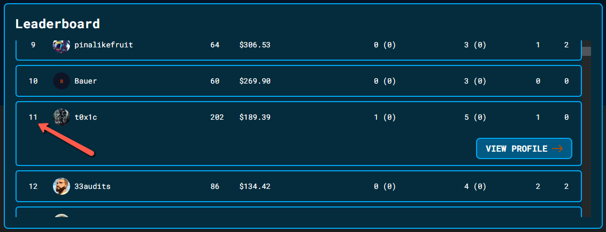
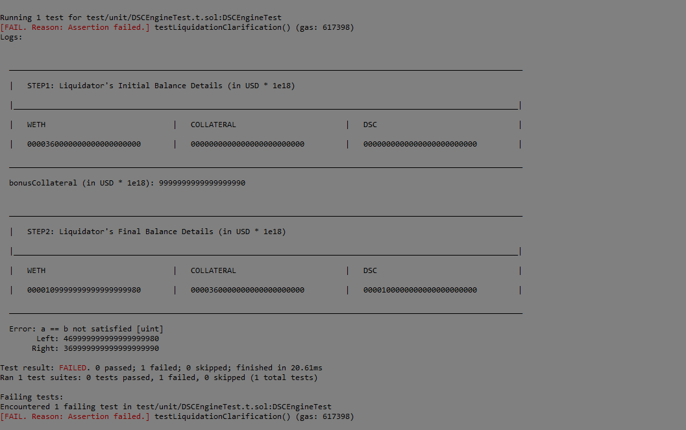

# Leaderboard


# Audited Code Repo
### [CodeHawks + Cyfrin Foundry DeFi Stablecoin Audit Contest](https://github.com/Cyfrin/2023-07-foundry-defi-stablecoin/tree/d1c5501aa79320ca0aeaa73f47f0dbc88c7b77e2)

<br>

# Bugs Filed & Their Status

| # | Bug ID | Name | URL | Adjudged Status |
|--------|--------|------|:------:|-----------------:|
| 1 | [H-01](#h-01)    | Incomplete check for stale data from Chainlink Aggregator inside staleCheckLatestRoundData()                                                               | [75](https://github.com/Cyfrin/2023-07-foundry-defi-stablecoin/issues/75) | Accepted as Medium |
| 2 | [H-02](#h-02)    | `depositCollateral()`, `redeemCollateral()` do not work with fee-on-transfer tokens                                                                        | [609](https://github.com/Cyfrin/2023-07-foundry-defi-stablecoin/issues/609) | Accepted |
| 3 | [H-03](#h-03)    | Hard-coded `TIMEOUT` not suitable for all Chainlink TOKEN/USD price feeds                                                                                  | [622](https://github.com/Cyfrin/2023-07-foundry-defi-stablecoin/issues/622) | Accepted |
| 4 | [H-04](#h-04)    | Value returned from `getUsdValue()` & `getTokenAmountFromUsd()` does not have consistent precision (decimals) for different tokens                         | [653](https://github.com/Cyfrin/2023-07-foundry-defi-stablecoin/issues/653) | Accepted |
| 5 | [H-05](#h-05)    | Protocol breaks for tokens which do not return a `bool` on `transfer()` but do so on `transferFrom()`                                                      | [779](https://github.com/Cyfrin/2023-07-foundry-defi-stablecoin/issues/779) | `Rejected` as a known issue |
| 6 | [H-06](#h-06)    | Protocol can break for a token with a proxy and implementation contract (like `TUSD`)                                                                      | [780](https://github.com/Cyfrin/2023-07-foundry-defi-stablecoin/issues/780) | Accepted as Medium; `Bug Report Selected` |
| 7 | [H-07](#h-07)    | Liquidator is awarded more reward than expected, and values of minted DSC & collateral are not reduced                                                     |  [913](https://github.com/Cyfrin/2023-07-foundry-defi-stablecoin/issues/913) | `Rejected` |
| 8 | [M-01](#m-01)    | `mintDsc()`, `burnDSC()` always reverts for whale accounts as `getUsdValue()` overflows                                                                    | [313](https://github.com/Cyfrin/2023-07-foundry-defi-stablecoin/issues/313) | `Rejected` |
| 9 | [M-02](#m-02)    | No safeguard against sudden price fluctuation                                                                                                              | [593](https://github.com/Cyfrin/2023-07-foundry-defi-stablecoin/issues/593) | Accepted |
| 10| [M-03](#m-03)    | Partial liquidation not allowed via `liquidate()` function when `debtToCover` is a small value                                                             | [682](https://github.com/Cyfrin/2023-07-foundry-defi-stablecoin/issues/682) | `Rejected` |
| 11| [M-04](#m-04)    | Potential DOS attack vector for public view functions like `getAccountCollateralValue()` & `getHealthFactor()` which fetch live price feed from Chainlink  | [812](https://github.com/Cyfrin/2023-07-foundry-defi-stablecoin/issues/812) | `Rejected` |
| 12| [M-05](#m-05)    | No way to update price feed address can cause user funds to be locked & lost                                                                               | [841](https://github.com/Cyfrin/2023-07-foundry-defi-stablecoin/issues/841) | Accepted |
| 13| [M-06](#m-06)    | In `_calculateHealthFactor()`, division before multiplication can cause precision loss                                                                     |[917](https://github.com/Cyfrin/2023-07-foundry-defi-stablecoin/issues/917) | `Rejected` |
| 14| [L-01](#l-01)    | Use a/b/c instead of a/(b*c) to decrease arithmetic overflow probability                                                                                   |[767](https://github.com/Cyfrin/2023-07-foundry-defi-stablecoin/issues/767)| Accepted |


<br>

## **HIGH-SEVERITY BUGS**
---

### <a id="h-01"></a>[H-01]
## **Incomplete check for stale data from Chainlink Aggregator inside staleCheckLatestRoundData()**
#### https://github.com/Cyfrin/2023-07-foundry-defi-stablecoin/blob/main/src/libraries/OracleLib.sol#L21-L33
<br>

## Summary
The `OracleLib` calls out to a chainlink aggregator receiving the `latestRoundData()`. It then checks freshness by verifying that it is not more than 3 hours old (`TIMEOUT`). This check is insufficient.

## Vulnerability Details
If there is a problem with chainlink starting a new round and finding consensus on the new value for the oracle (e.g. chainlink nodes abandon the oracle, chain congestion, vulnerability/attacks on the chainlink system) consumers of this contract may continue using outdated stale data (if oracles are unable to submit no new round is started).
Reference: https://consensys.io/diligence/audits/2021/09/fei-protocol-v2-phase-1/#chainlinkoraclewrapper---latestrounddata-might-return-stale-results

## Impact
By design, if a price is stale, the function ought to revert, and render the DSCEngine unusable (https://github.com/Cyfrin/2023-07-foundry-defi-stablecoin/blob/main/src/libraries/OracleLib.sol#L11).
This is not achieved in completeness and hence putting the protocol & funds at risk.

## Tools Used
Manual verification.

## Recommendations
Recommend adding the following checks:

```
(uint80 roundId, int256 answer, uint256 startedAt, uint256 updatedAt, uint80 answeredInRound) =
            priceFeed.latestRoundData();
//@audit add these 3 lines of code
require(answer > 0, "Chainlink price <= 0");
require(updatedAt != 0, "Incomplete round");
require(answeredInRound >= roundId, "Stale price");
```
---

### <span id="h-02"></span>[H-02]
## **`depositCollateral()`, `redeemCollateral()` do not work with fee-on-transfer tokens**
#### https://github.com/Cyfrin/2023-07-foundry-defi-stablecoin/blob/main/src/DSCEngine.sol#L149
<br>

## Summary
There are ERC20 tokens that may make certain customizations to their ERC20 contracts. One type of these tokens charge a certain fee for every `transfer()` or `transferFrom()`. Example: `XRP` token.

## Vulnerability Details
The `depositCollateral()` and `_redeemCollateral()` functions transfer `amountCollateral` using something like `IERC20(tokenCollateralAddress).transferFrom(msg.sender, address(this), amountCollateral);`. <br>
This could have a fee, and less than `amountCollateral` ends up in the contract. The `getAccountCollateralValue()` then calculates a USD value greater than the actual collateral value inside the contract due to `uint256 amount = s_collateralDeposited[user][token];`.<br>
This also causes loss to the protocol while redemption by the user. <br><br>
NOTE: Other tokens, apart from WETH and WBTC are being considered here in line with Patrick's comment on Discord: "Let's do any token that has a chainlink price feed".

## Impact
Since XRP/USD is available in Chainlink price feed and hence supported by the protocol, this token (and any other similar ones) would brick the protocol.

## Tools Used
Manual review

## Recommendations
1. One possible mitigation is to measure the asset change right before and after the asset-transferring routines. 
2. You can also limit the list to whitelisted tokens only and exclude such "exotic" tokens.
---

### <span id="h-03"></span>[H-03]
## **Hard-coded `TIMEOUT` not suitable for all Chainlink TOKEN/USD price feeds**
#### https://github.com/Cyfrin/2023-07-foundry-defi-stablecoin/blob/main/src/libraries/OracleLib.sol#L19
<br>

## Summary
Each TOKEN/USD's "heartbeat" ought to be the value for that pair's `TIMEOUT`.

## Vulnerability Details
ETH/USD has a heartbeat of 3600 seconds and any data older than that should be considered stale. This heartbeat value varies for different pairs and should be fetched depending on the type of the token being used. The current hard-coded value of 3 hours is not suitable.

## Impact
Stale price feed would result in protocol not able to recognize bad loans and hence major loss of funds. 

## Tools Used
Manual review

## Recommendations
Fetch heartbeat of each token pair depending on the price feed address. The `getTimeout()` function already present there ought to be corrected.

---

### <span id="h-04"></span>[H-04]
## **Value returned from `getUsdValue()` & `getTokenAmountFromUsd()` does not have consistent precision (decimals) for different tokens**
#### https://github.com/Cyfrin/2023-07-foundry-defi-stablecoin/blob/main/src/DSCEngine.sol#L361-L367
<br>

## Summary
`getUsdValue()` returns the USD value using the precision of the token itself, and hance varies based on the token's decimal places. This leads to inconsistent decimal places and causes loss of funds, for example ***when multiple tokens with different decimal places have been deposited as collateral***.

## Vulnerability Details
The Chainlink price feed returns price in USD for 1 ETH (or 1 BTC or any other 1 TOKEN) expressed with 8 decimal places for TOKEN/USD pairs. It's seen that currently inside `getUsdValue()`, the returned USD value is expressed as `USD * token decimal places`.<br>
Examples -
1. Considering $2000/ETH, `getUsdValue(weth, 15e18)` returns `30000e18` - considered to be USD value of 15 wETH.
2. Considering $1000/BTC, `getUsdValue(wbtc, 15e8)` returns `15000e8` - considered to be USD value of 15 wBTC. This means a user with wBTC as collateral will be able to mint way less DSC tokens than they are ideally supposed to.

## Impact
When multiple tokens are deposited as collateral by a user, their collateral value is calculated incorrectly, hence impacting the health factor and hence affecting the number of DSC tokens that can be minted. Also results in incorrect liquidation and loss of funds, bricking the protocol.<br>
Below is a test to check this:
```
    function testMultipleCollateralTokenTypes() public {
        address borrower = makeAddr("borrower");
        deal(weth, borrower, 100 ether); // give user 100 wETH
        deal(wbtc, borrower, 100e8); // give user 100 wBTC
        vm.startPrank(borrower);
        ERC20Mock(weth).approve(address(dsce), 10 ether);
        ERC20Mock(wbtc).approve(address(dsce), 10e8);
        dsce.depositCollateral(weth, 10 ether);
        dsce.depositCollateral(wbtc, 10e8);
        vm.stopPrank();

        // expectedUsdValue = (10 * $2000/ETH + 10 * $1000/BTC) expressed with 18 decimal precision = 30000e18
        uint256 expectedUsdValue = (10 * 2000 + 10 * 1000) * 1e8;

        // style 1: calculate via getUsdValue() function
        uint256 actualUsdValueDirect = dsce.getUsdValue(weth, 10 ether) + dsce.getUsdValue(wbtc, 10e8);
        assertEq(actualUsdValueDirect, expectedUsdValue);

        // comment the above assertion to run below code
        // style 2: calculate via getAccountCollateralValue() function
        uint256 actualUsdValueCollateral = dsce.getAccountCollateralValue(borrower);
        assertEq(actualUsdValueCollateral, expectedUsdValue);

        /**
         * Above assertions fail with message:
         *
         * Error: a == b not satisfied [uint]
         *   Left: 20000000001000000000000
         *  Right: 30000000000000000000000
         */
    }
```
Run this via `forge test --mt testMultipleCollateralTokenTypes -vv`.

## Tools Used
Manual review, forge test.

## Recommendations
Introduce provision in `getUsdValue()` to maintain same price-feed precision for all tokens. This could be one solution:

```
// Assumption: Price Feed returned from Chainlink ("price" variable) will always have precision of 8 decimal places in case of USD pairs

// remove this
-   return ((uint256(price) * ADDITIONAL_FEED_PRECISION) * amount) / PRECISION;

// add this
+   return ((uint256(price) * ADDITIONAL_FEED_PRECISION) * amount) / ERC20(token).decimals();
```

<br><br>
Same correction can be done in `getTokenAmountFromUsd()`, I suppose:

```
// remove this
-    return (usdAmountInWei * PRECISION) / (uint256(price) * ADDITIONAL_FEED_PRECISION);

// add this
+    return (usdAmountInWei * ERC20(token).decimals()) / (uint256(price) * ADDITIONAL_FEED_PRECISION);
```

---

### <span id="h-05"></span>[H-05]
## **Protocol breaks for tokens which do not return a `bool` on `transfer()` but do so on `transferFrom()`**
#### https://github.com/Cyfrin/2023-07-foundry-defi-stablecoin/blob/main/src/DSCEngine.sol#L287
<br>

## Summary
Some tokens like `BNB` do not return a bool on `transfer()`. This causes `_redeemCollateral()` to always revert with `DSCEngine__TransferFailed`.

## Vulnerability Details
`_redeemCollateral()` has the following lines:
```
        bool success = IERC20(tokenCollateralAddress).transfer(to, amountCollateral);
        if (!success) {
            revert DSCEngine__TransferFailed();
        }
```
Since a token like `BNB` (which is supported by Chainlink BNB/USD price feed) does not return anything on calling `transfer()`, the value of `success` will always be false and hence this will revert. <br>
Note that `depositCollateral()` or `depositCollateralAndMintDsc()` will still work for `BNB` as it returns `true` for a successful `transferFrom()`, thus allowing the users to deposit, but blocking them from redeeming it. <br>
`_redeemCollateral()` is called by `liquidate()` too, hence breaking the functionality.

## Impact
Liquidation of bad loans with BNB as collateral becomes impossible. Also, redeeming the collateral is blocked.

## Tools Used
Manual review

## Recommendations
- Use a list of whitelisted tokens.
- OR use low-level calls.

---

### <span id="h-06"></span>[H-06]
## **Protocol can break for a token with a proxy and implementation contract (like `TUSD`)**
#### https://github.com/Cyfrin/2023-07-foundry-defi-stablecoin/blob/main/src/DSCEngine.sol#L112
<br>

## Summary
Tokens whose code and logic can be changed in future can break the protocol and lock user funds.

## Vulnerability Details
For a token like `TUSD` (supported by Chainlink TUSD/USD price feed), which has a proxy and implementation contract, if the implementation behind the proxy is changed, it can introduce features which break the protocol, like choosing to not return a bool on transfer(), or changing the balance over time like a rebasing token.

## Impact
Protocol may break in future for this collateral and block user funds deposited as collateral. Also can cause bad loans to be present with no way to liquidate them.

## Tools Used
Manual review

## Recommendations
- Developers integrating with upgradable tokens should consider introducing logic that will freeze interactions with the token in question if an upgrade is detected. (e.g. the [TUSD adapter](https://github.com/makerdao/dss-deploy/blob/7394f6555daf5747686a1b29b2f46c6b2c64b061/src/join.sol#L322) used by MakerDAO).
- OR have a token whitelist which does not allow such tokens.

---

### <span id="h-07"></span>[H-07]
## **Liquidator is awarded more reward than expected, and values of minted DSC & collateral are not reduced**
#### https://github.com/Cyfrin/2023-07-foundry-defi-stablecoin/blob/main/src/DSCEngine.sol#L253
#### https://github.com/Cyfrin/2023-07-foundry-defi-stablecoin/blob/main/src/DSCEngine.sol#L274
<br>

## Summary
When a liquidator liquidates a user with bad debt, values for liquidator's `s_collateralDeposited` and `s_DSCMinted` are not reduced. Liquidator gains more than expected collateral and also continues holding on to the minted DSC if one looks at the protocol's accounting variable.

## Vulnerability Details
Add the following test to DSCEngine.t.sol and run via `forge test --mt testLiquidationAccounting -vv`:

```
    function testLiquidationAccounting() public {
        // some setup
        int256 startPrice = 2e8;
        MockV3Aggregator(ethUsdPriceFeed).updateAnswer(startPrice); // let's start with 1 ETH = $2
        address borrower = makeAddr("borrower");
        address _liquidator = makeAddr("_liquidator");
        // give some WETH to actors
        ERC20Mock(weth).mint(_liquidator, 5000 ether);
        ERC20Mock(weth).mint(borrower, 3000 ether);

        // start testing
        vm.startPrank(borrower);
        ERC20Mock(weth).approve(address(dsce), type(uint256).max);
        dsc.approve(address(dsce), type(uint256).max);
        dsce.depositCollateralAndMintDsc(weth, 3000 ether, 3000e18);
        vm.stopPrank();
        dsce.getHealthFactor(borrower);

        int256 dippedPrice = 12e7; // price drops to 1 ETH = $1.2
        MockV3Aggregator(ethUsdPriceFeed).updateAnswer(dippedPrice);
        dsce.getHealthFactor(borrower);

        console.log(
            "START: total USD value of _liquidator",
            ((ERC20Mock(weth).balanceOf(_liquidator) * uint256(dippedPrice)) / 1e8)
                + dsce.getAccountCollateralValue(_liquidator)
        );

        vm.startPrank(_liquidator);
        ERC20Mock(weth).approve(address(dsce), type(uint256).max);
        dsc.approve(address(dsce), type(uint256).max);
        dsce.depositCollateralAndMintDsc(weth, 5000 ether, 3000e18);
        dsce.getHealthFactor(_liquidator);
        dsce.liquidate(weth, borrower, 3000e18);
        vm.stopPrank();

        console.log(
            "END: total USD value of _liquidator",
            ((ERC20Mock(weth).balanceOf(_liquidator) * uint256(dippedPrice)) / 1e8)
                + dsce.getAccountCollateralValue(_liquidator)
        );
    }
```
The liquidator starts with USD 6000 (5000 wETH at USD 1.2/wETH) and liquidates borrower's 3000 DSC tokens of bad debt. For this, he should receive USD 300 (10% of USD 3000) as bonus and hence his final balance (account wETH balance + collateral value) should be USD 6300. Also, he should not be holding the minted DSCs after liquidation as they are burned by the protocol after transferring from the liquidator to the protocol [here](https://github.com/Cyfrin/2023-07-foundry-defi-stablecoin/blob/main/src/DSCEngine.sol#L274). <br>
However, you get an incorrect value in the above test. Recommended fix is mentioned below.

## Impact
More rewards are given to the liquidator; basically free money which can be used for future minting and liquidations. Breaks the system.

## Tools Used
- Manual review
- Forge test

## Recommendations
There are 2 functions which need to be fixed- <br><br>
In `_burnDsc()`, add the lines marked below (L274-275):

```
272           function _burnDsc(uint256 amountDscToBurn, address onBehalfOf, address dscFrom) private {
273               s_DSCMinted[onBehalfOf] -= amountDscToBurn;
274 @>            //@audit-issue : add below line to account for burnt DSC
275 @>            s_DSCMinted[dscFrom] -= amountDscToBurn;
276               bool success = i_dsc.transferFrom(dscFrom, address(this), amountDscToBurn);
277               // This conditional is hypothetically unreachable
278               if (!success) {
279                   revert DSCEngine__TransferFailed();
280               }
281               i_dsc.burn(amountDscToBurn);
282           }
```

<br><br>

In `liquidate()`, add the lines marked below (L256-257):

```
229           function liquidate(address collateral, address user, uint256 debtToCover)
230               external
231               moreThanZero(debtToCover)
232               nonReentrant
233           {
234               // need to check health factor of the user
235               uint256 startingUserHealthFactor = _healthFactor(user);
236               if (startingUserHealthFactor >= MIN_HEALTH_FACTOR) {
237                   revert DSCEngine__HealthFactorOk();
238               }
239               // We want to burn their DSC "debt"
240               // And take their collateral
241               // Bad User: $140 ETH, $100 DSC
242               // debtToCover = $100
243               // $100 of DSC == ??? ETH?
244               // 0.05 ETH
245               uint256 tokenAmountFromDebtCovered = getTokenAmountFromUsd(collateral, debtToCover);
246               // And give them a 10% bonus
247               // So we are giving the liquidator $110 of WETH for 100 DSC
248               // We should implement a feature to liquidate in the event the protocol is insolvent
249               // And sweep extra amounts into a treasury
250               // 0.05 * 0.1 = 0.005. Getting 0.055
251               uint256 bonusCollateral = (tokenAmountFromDebtCovered * LIQUIDATION_BONUS) / LIQUIDATION_PRECISION;
252               uint256 totalCollateralToRedeem = tokenAmountFromDebtCovered + bonusCollateral;
253               _redeemCollateral(user, msg.sender, collateral, totalCollateralToRedeem);
254               // We need to burn the DSC
255               _burnDsc(debtToCover, user, msg.sender);
256 @>            //@audit : add below line to reduce collateral
257 @>            s_collateralDeposited[msg.sender][collateral] -= tokenAmountFromDebtCovered;
258
259               uint256 endingUserHealthFactor = _healthFactor(user);
260               if (endingUserHealthFactor <= startingUserHealthFactor) {
261                   revert DSCEngine__HealthFactorNotImproved();
262               }
263               _revertIfHealthFactorIsBroken(msg.sender);
264           }
```

========

### **ESCALATION** (Follow-up after rejection of bug by the judge):
Thank you for the review & the comments. I believe I could have been clearer as I feel the rejection reason is not quite related to what the bug is about.<br>
The vulnerability exists for **every** liquidation scenario and the liquidators are potentially being paid more than they should be.<br>
To make things clearer, here's another PoC, more in style of your existing ones, where I have used existing actors & established figures instead of creating new ones, like I did in my previous PoC. Please note the comments inside the test which outline the steps & scenario in detail. There also are few utlity functions below the test so that we can have the same consistent output styling on the console. To be run via `forge test --mt testLiquidationClarification -vv`.

```
    function testLiquidationClarification() public {
        // do some setup
        vm.startPrank(user);
        ERC20Mock(weth).approve(address(dsce), amountCollateral);
        dsce.depositCollateralAndMintDsc(weth, amountCollateral, amountToMint);
        vm.stopPrank();

        int256 ethUsdUpdatedPrice = 18e8; // 1 ETH = $18
        MockV3Aggregator(ethUsdPriceFeed).updateAnswer(ethUsdUpdatedPrice);
        ERC20Mock(weth).mint(liquidator, collateralToCover);
        printBalanceDetails("STEP1: Liquidator's Initial", liquidator, ethUsdUpdatedPrice); // liquidator initial balance : 20 WETH = 360 USD
        /* Console Output:
        _________________________________________________________________________________________________________________

        |   STEP1: Liquidator's Initial Balance Details (in USD * 1e18)

        |_______________________________________________________________________________________________________________|

        |   WETH                            |   COLLATERAL                        |   DSC                               |

        |   0000360000000000000000000       |   0000000000000000000000000         |   0000000000000000000000000         |

        _________________________________________________________________________________________________________________
        
        */
        // setup complete

        // test steps -  liquidate the user completely
        vm.startPrank(liquidator);
        ERC20Mock(weth).approve(address(dsce), collateralToCover);
        dsce.depositCollateralAndMintDsc(weth, collateralToCover, amountToMint);
        dsc.approve(address(dsce), type(uint256).max);
        dsce.liquidate(weth, user, amountToMint); // We are covering their whole debt
        vm.stopPrank();

        // expected bonus/reward for the liquidator (10% bonus):
        uint256 tokenAmountFromDebtCovered = dsce.getTokenAmountFromUsd(weth, amountToMint);
        uint256 bonusCollateral = (tokenAmountFromDebtCovered * 10) / 100;
        uint256 bonusCollateralInUSD = dsce.getUsdValue(weth, bonusCollateral);
        console.log("bonusCollateral (in USD * 1e18): %s", bonusCollateralInUSD);
        /* Console Output:
            
        bonusCollateral (in USD * 1e18): 9999999999999999990

        */

        printBalanceDetails("STEP2: Liquidator's Final", liquidator, ethUsdUpdatedPrice);
        /* Console Output:
        _________________________________________________________________________________________________________________

        |   STEP2: Liquidator's Final Balance Details (in USD * 1e18)

        |_______________________________________________________________________________________________________________|

        |   WETH                            |   COLLATERAL                        |   DSC                               |

        |   0000109999999999999999980       |   0000360000000000000000000         |   0000100000000000000000000         |

        _________________________________________________________________________________________________________________

        */

        // since `redeemCollateralForDsc` is broken due to another internal auditing bug, calculate manually:
        uint256 liquidatorCollateralDisplayedOnConsole = 360000000000000000000; // in USD * 1e18
        uint256 liquidatorDSCDisplayedOnConsole = 100000000000000000000;
        // since the above has still an acceptable healthFactor, system should allow us to redeem the whole collateral. So assumed manual calc & redemption here:
        uint256 redeemedCollateralValueInUSD = liquidatorCollateralDisplayedOnConsole;

        uint256 liquidatorFinalBalance = 109999999999999999980 + redeemedCollateralValueInUSD;

        // assertEq(actual, expected)
        assertEq(liquidatorFinalBalance, 360000000000000000000 + 9999999999999999990); // assert: liquidatorFinalBalance == initialBalance + Bonus
            // FAILS: actual > expected; Liquidator profits incorrectly.
    }

    function printBalanceDetails(string memory _actorName, address _actor, int256 _ethUsdPrice) public view {
        console.log("\n");
        console.log(
            "_________________________________________________________________________________________________________________\n"
        );
        console.log("|   %s Balance Details (in USD * 1e18)\n", _actorName);
        console.log(
            "|_______________________________________________________________________________________________________________|\n"
        );

        uint256 wethBal = (ERC20Mock(weth).balanceOf(_actor) * uint256(_ethUsdPrice)) / 1e8;
        (uint256 dscBal, uint256 collateralBal) = dsce.getAccountInformation(_actor);

        console.log(
            "|   WETH                            |   COLLATERAL                        |   DSC                               |\n"
        );
        console.log(
            "|   %s       |   %s         |   %s         |\n",
            uint256ToFixedWidthString(wethBal),
            uint256ToFixedWidthString(collateralBal),
            uint256ToFixedWidthString(dscBal)
        );
        console.log(
            "_________________________________________________________________________________________________________________\n"
        );
    }

    function uint256ToFixedWidthString(uint256 value) internal pure returns (string memory) {
        // Convert uint256 to string
        string memory strValue = _uint256ToString(value);

        // Construct the padded string
        string memory paddedValue = _addLeadingZeroes(strValue);

        return paddedValue;
    }

    function _uint256ToString(uint256 value) internal pure returns (string memory) {
        if (value == 0) {
            return "0";
        }

        uint256 temp = value;
        uint256 digits;

        while (temp != 0) {
            digits++;
            temp /= 10;
        }

        bytes memory buffer = new bytes(digits);

        while (value != 0) {
            digits--;
            buffer[digits] = bytes1(uint8(48 + uint256(value % 10)));
            value /= 10;
        }

        return string(buffer);
    }

    function _addLeadingZeroes(string memory str) internal pure returns (string memory) {
        string memory zeroes = "0000000000000000000000000"; // 25 zeroes
        string memory paddedStr = string(abi.encodePacked(zeroes, str));
        string memory substr = _substring(paddedStr, bytes(paddedStr).length - 25, 25);
        return substr;
    }

    function _substring(string memory str, uint256 startIndex, uint256 length) internal pure returns (string memory) {
        bytes memory strBytes = bytes(str);
        bytes memory result = new bytes(length);

        for (uint256 i = 0; i < length; i++) {
            result[i] = strBytes[startIndex + i];
        }

        return string(result);
    }
```

#### Console Output:


*Note*: I believe my previous recommendations on code fixes may be incomplete and it may require some more deep-dive from the developers' end, but from the PoC, it looks like the problem area is somewhere around the mapping which updates the DSC minted or the collateral deposited.

<br><br>

## **MEDIUM-SEVERITY BUGS**
---

### <span id="m-01"></span>[M-01]
## **`mintDsc()`, `burnDSC()` always reverts for whale accounts as `getUsdValue()` overflows**
#### https://github.com/Cyfrin/2023-07-foundry-defi-stablecoin/blob/main/src/DSCEngine.sol#L366
<br>

## Summary
The function `getUsdValue()` overflows if `amount` param is too high. 

## Vulnerability Details
Assuming ETH/USD = $2000, and `amount`=981e53, the return statement which is:<br>
`return ((uint256(price) * ADDITIONAL_FEED_PRECISION) * amount) / PRECISION;`, overflows the uint256 limit because the `(uint256(price) * ADDITIONAL_FEED_PRECISION) * amount` part is above the limit.

## Impact
`getUsdValue()` is used by `_revertIfHealthFactorIsBroken()` which is in turn used by `mintDsc()`, `burnDsc()` and `liquidate()`. These functions will always revert hence blocking the functionality for the specific user/whale.
<br>
Since the `amount` required is very high, I am setting the severity to medium as it would not occur often.
<br>
The same overflow condition can arise in `getTokenAmountFromUsd()`. 

## Tools Used
Manual verification, forge test.

To test the above, inside `DSCEngine.t.sol` go to `testGetUsdValue()` and change <br>
`-  uint256 ethAmount = 15e18;`<br>
to<br>
`+  uint256 ethAmount = 981e53;`
<br>
and run through `forge test --match-path test/unit/DSCEngineTest.t.sol --match-test testGetUsdValue -vv`.
You will get the following:

```
Failing tests:
Encountered 1 failing test in test/unit/DSCEngineTest.t.sol:DSCEngineTest
[FAIL. Reason: Arithmetic over/underflow] testGetUsdValue() (gas: 29469)
```

## Recommendations
Keeping the precision of price feed to 8 decimals itself instead of trying to match 18 decimal places could be an approach. <br>
Another way could be to divide first and then multiply. This may result in precision loss though and additional code would be required to check such conditions.

---

### <span id="m-02"></span>[M-02]
## **No safeguard against sudden price fluctuation**
#### https://github.com/Cyfrin/2023-07-foundry-defi-stablecoin/blob/main/src/DSCEngine.sol#L361
<br>

## Summary
If price fluctuation (TOKEN/USD) is too fast (within a block), and hence the collateral USD value dips too low, then the protocol becomes insolvent. 

## Vulnerability Details
Imagine the following steps:
1. ETH/USD price from chainlink is $2000.
2. User calls `depositCollateralAndMintDsc()` using WETH with 1e17 (0.1 ETH) as collateral and mints 80 DSC. Collateral value is $200 and `healthFactor` is acceptable at 125e16 (1.25 * 1e18) right now.
3. ETH/USD experiences sudden price fluctuation within a single block and dips to $640.
4. Collateral value becomes $64 and `healthFactor` is at 4e17 (0.4 * 1e18) that is, `value of loaned DSC > collateral ETH price`.<br>
Since there is no incentive now for a liquidator, this becomes a 'bad loan'.

## Impact
Loss of value due to 'bad loans'; protocol insolvency.

## Tools Used
Manual review.

## Recommendations
1. Price Oracles with Safeguards: Use multiple price oracles from different reputable sources to avoid reliance on a single data point. Additionally, consider implementing safeguards that reject or delay liquidations based on extreme price fluctuations or abnormal behavior, which could indicate potential market manipulation.

2. Dynamic Liquidation Thresholds: Instead of a fixed 200% collateralization requirement, you can implement dynamic liquidation thresholds that adjust based on market conditions. For example, if the price of the collateral token drops rapidly, the required collateralization ratio could temporarily increase to protect the protocol from insolvency. This adjustment could be triggered by a predefined price deviation or by monitoring the price trend over a certain period.

---

### <span id="m-03"></span>[M-03]
## **Partial liquidation not allowed via `liquidate()` function when `debtToCover` is a small value**
#### https://github.com/Cyfrin/2023-07-foundry-defi-stablecoin/blob/main/src/DSCEngine.sol#L229
<br>

## Summary
As per design, `liquidate()` function allows partial liquidation of bad loans. Liquidator can specify the amount of debt to liquidate via the parameter in `debtToCover` inside `function liquidate(address collateral, address user, uint256 debtToCover)`, and get a 10% liquidation bonus.<br>
However, the function always reverts with `DSCEngine__HealthFactorNotImproved` if `debtToCover` is less than `(price feed retuned by Chainlink)/1e8`, robbing liquidator the opportunity to earn a bonus.

## Vulnerability Details
Add the following test to DSCEngine.t.sol and run via `forge test --mt testLiquidateSmallDebt -vv`. The liquidator should have received 1 wei by partially liquidating 17 wETH, but is not allowed to do so.
```
    function testLiquidateSmallDebt() public {
        vm.startPrank(user);
        ERC20Mock(weth).approve(address(dsce), amountCollateral);
        dsce.depositCollateralAndMintDsc(weth, amountCollateral, amountToMint);
        vm.stopPrank();

        int256 ethUsdUpdatedPrice = 18e8; // 1 ETH = $18
        MockV3Aggregator(ethUsdPriceFeed).updateAnswer(ethUsdUpdatedPrice);

        ERC20Mock(weth).mint(liquidator, collateralToCover);

        vm.startPrank(liquidator);
        ERC20Mock(weth).approve(address(dsce), collateralToCover);
        dsce.depositCollateralAndMintDsc(weth, collateralToCover, amountToMint);
        dsc.approve(address(dsce), amountToMint);

        // @audit-info : reverts with `DSCEngine__HealthFactorNotImproved`
        dsce.liquidate(weth, user, 17); // attempt a small `debtToCover`

        vm.stopPrank();

        uint256 liquidatorWethBalanceAfter = ERC20Mock(weth).balanceOf(liquidator);
        assertEq(liquidatorWethBalanceAfter, 1);
    }
```

## Impact
Bad loans can not be partially liquidated if debtToCover is small. Robs liquidators the chance to earn a bonus. Impacts overall liquidity of the protocol.

## Tools Used
Manual review, forge test.

## Recommendations
1. Either implement a minimum amount of debt required to be covered, so that liquidators know this upfront, 
2. Or fix the health factor calculation.

---

### <span id="m-04"></span>[M-04]
## **Potential DOS attack vector for public view functions like `getAccountCollateralValue()` & `getHealthFactor()` which fetch live price feed from Chainlink**
#### https://github.com/Cyfrin/2023-07-foundry-defi-stablecoin/blob/main/src/DSCEngine.sol#L350-L359
#### https://github.com/Cyfrin/2023-07-foundry-defi-stablecoin/blob/main/src/DSCEngine.sol#L393
<br>

## Summary
Denial of Service attack vector possible in view functions due to unbounded for loops & external calls to Chainlink price feed.

## Vulnerability Details
The `getHealthFactor()` function which in turn calls `getAccountCollateralValue()`, as provided in the code, can potentially be cause for a Denial of Service (DoS) attack. In the for loop, for each token, the function performs the `getUsdValue()` calculation, which involves external calls to Chainlink.<br>
The attacker could create a malicious smart contract or send multiple transactions calling the `getAccountCollateralValue()` function with different addresses as the input. The function is a view function and can be called without incurring any gas cost for the attacker. <br><br>
Even in case of genuine liquidators, who wish to monitor multiple users and their health factor, this will overload the system.

## Impact
- An attacker could use this to consume a large amount of computational resources and cause the function to run out of gas, making it difficult for legitimate users to execute transactions.<br>
- High number of liquidators monitoring large number of users' health factor will brick the system.

## Tools Used
Manual review

## Recommendations
In scenarios where external data or complex computations are involved, it's better to offload those calculations to an off-chain service or update the contract design to minimize the computational load during the loop.<br><br>
Additionally, consider using a pre-computed and cached value for the total collateral value if it doesn't change frequently.

---

### <span id="m-05"></span>[M-05]
## **No way to update price feed address can cause user funds to be locked & lost**
#### https://github.com/Cyfrin/2023-07-foundry-defi-stablecoin/blob/main/src/DSCEngine.sol#L112
<br>

## Summary
Protocol has no way of updating [priceFeedAddresses](https://github.com/Cyfrin/2023-07-foundry-defi-stablecoin/blob/main/src/DSCEngine.sol#L120) for given tokens, once assigned in the constructor.

## Vulnerability Details
If the Chainlink address for a particular TOKEN/USD price feed changes tomorrow, the protocol has no way of updating this address. Something like the below should exist: 
```
function updatePriceFeedAddressForToken(address token, address chainlinkPriceFeed) 
external 
isAllowedToken(token)
onlyOwner {
//.....
}
```
It should also have a time-lock (or delay) feature so that other users receive a heads-up that a priceFeedAddress update is going to happen in next few days. This avoids malicious use of the function by the owner. <br>
In cases where the current price feed has not gone non-functional, and the above update is being done by the owner only to move to a better oracle, users can choose to redeem collateral during this 'delay' period.

## Impact
If price feed address for any token in the protocol is changed by Chainlink, user funds are forever locked and lost.

## Tools Used
Manual review

## Recommendations
Add an `updatePriceFeedAddressForToken` function.

---

### <span id="m-06"></span>[M-06]
## **In `_calculateHealthFactor()`, division before multiplication can cause precision loss**
#### https://github.com/Cyfrin/2023-07-foundry-defi-stablecoin/blob/main/src/DSCEngine.sol#L330-L331
<br>

## Summary
In `_calculateHealthFactor()`, division before multiplication is done. To avoid precision loss, division in solidity should always be done at the end.

## Vulnerability Details
The current code looks like this:
```
        uint256 collateralAdjustedForThreshold = (collateralValueInUsd * LIQUIDATION_THRESHOLD) / LIQUIDATION_PRECISION;
        return (collateralAdjustedForThreshold * 1e18) / totalDscMinted;
```
This effectively results in return of the value `(((collateralValueInUsd * LIQUIDATION_THRESHOLD) / LIQUIDATION_PRECISION) * 1e18) / totalDscMinted`.<br>
The multiplication with 1e18 should be done first.

## Impact
Loss of precision and incorrect health factor calculation.

## Tools Used
Manual review

## Recommendations
Perform the calculation in one step and return `((collateralValueInUsd * LIQUIDATION_THRESHOLD) * 1e18) / totalDscMinted / LIQUIDATION_PRECISION;`.

<br><br>

## **LOW-SEVERITY BUGS**
---

### <span id="l-01"></span>[L-01]
## **Use `a/b/c` instead of `a/(b*c)` to decrease arithmetic overflow probability.**
#### https://github.com/Cyfrin/2023-07-foundry-defi-stablecoin/blob/main/src/DSCEngine.sol#L347
<br>

## Summary
`getTokenAmountFromUsd()` returns `(usdAmountInWei * PRECISION) / (uint256(price) * ADDITIONAL_FEED_PRECISION);`. This will revert if the denominator `(uint256(price) * ADDITIONAL_FEED_PRECISION)` exceeds `type(uint256).max`.

## Vulnerability Details
Considering Chainlink TOKEN/USD price feed to have precision of 8 decimals, `(uint256(price) * ADDITIONAL_FEED_PRECISION)` will exceed `type(uint256).max` if dollar price of TOKEN is more than `115792089237316195423570985008687907853269984665640564039457` and revert.<br>
To reduce such an occurrence, one can return this instead: `(usdAmountInWei * PRECISION) / uint256(price) / ADDITIONAL_FEED_PRECISION;`. 

## Impact
Current syntax causes overflow for very large USD price of a token and always reverts, blocking all liquidation attempts.

## Tools Used
Manual review

## Recommendations
- Use syntax: `(usdAmountInWei * PRECISION) / uint256(price) / ADDITIONAL_FEED_PRECISION;`.
- OR, `return 0;` when `price` exceeds the threshold.