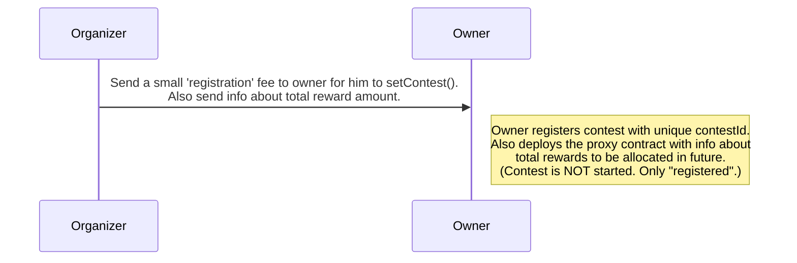
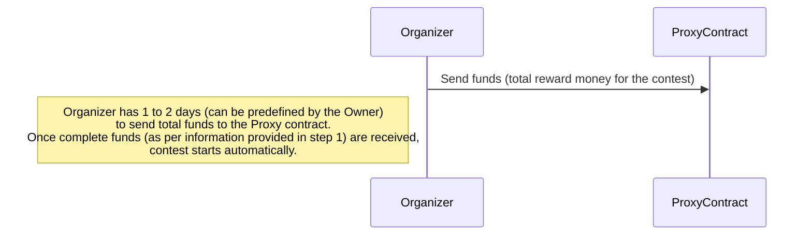
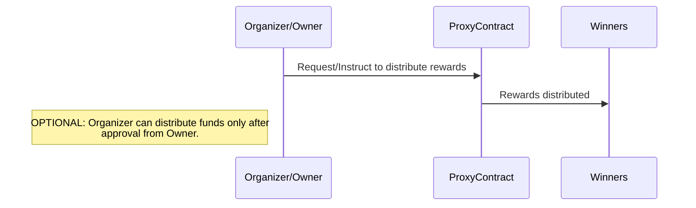

# Leaderboard


# Audited Code Repo
### [Sherlock: Ajna#2](https://github.com/sherlock-audit/2023-09-ajna/tree/6b0382ea4fcb7599e4162859591d48c712c829aa)

<br>

# Bugs Filed & Their Status

| # | Bug ID | Name | URL | Adjudged Status |
|--------|--------|------|:------:|-----------------:|
| ? | [H-01](#h-01)    | Owner can incorrectly pull funds from contests not yet expired         | [228](https://github.com/Cyfrin/2023-08-sparkn/issues/228) | Accepted as low; `Selected Report` |
| ? | [H-02](#h-02)    | Organizer can deploy Proxy pointing to custom implementation          | [229](https://github.com/Cyfrin/2023-08-sparkn/issues/229) | Rejected |
| 1 | [M-01](#m-01)    | `_lenderInterestMargin()` is calculated using the `pow()` function of `PRBMath`, which exhibits inconsistent return values  | [temp-1](https://github.com/sherlock-audit/2023-09-ajna-t0x1cC0de/issues/1) |  |
| ? | [M-02](#m-02)    | No check on COMMISSION_FEE being less than BASIS_POINTS   | [232](https://github.com/Cyfrin/2023-08-sparkn/issues/232) | Accepted as informational  |
| ? | [M-03](#m-03)    | Winner's address should not be allowed to be equal to that of organizer or sponsor   | [233](https://github.com/Cyfrin/2023-08-sparkn/issues/233) | Accepted |
| ? | [L-01](#l-01)    | Protocol reverts if reward is too high  | [231](https://github.com/Cyfrin/2023-08-sparkn/issues/231) | Rejected |


<br>

## **HIGH-SEVERITY BUGS**
---

### <a id="h-01"></a>[H-01]
## **Owner can incorrectly pull funds from contests not yet expired**
#### https://github.com/Cyfrin/2023-08-sparkn/blob/main/src/ProxyFactory.sol#L195-L218
<br>

## Summary
Owner can incorrectly pull funds from a closed contest which has not yet expired using `distributeByOwner()`.

## Vulnerability Details
The `distributeByOwner()` function has 5 parameters: `proxy, organizer, contestId, implementation, data`. However, there is no 'linkage' between `proxy` and the remaining params. <br>
In order to check if the contest has expired, it uses `bytes32 salt = _calculateSalt(organizer, contestId, implementation);`. There is no check if this is indeed the salt of the `proxy` address. Hence, the owner can by mistake call `distributeByOwner()` with an incorrect `proxy` address of a contest which is closed, but not yet expired and drain its funds incorrectly.<br>
**PoC:** (run via `forge test --mt test_OwnerCanIncorrectlyPullFundsFromContestsNotYetExpired -vv`)
```js
    function test_OwnerCanIncorrectlyPullFundsFromContestsNotYetExpired() public {
        // Imagine that 2 contests are started by the same organizer & sponsor. This is just for
        // simplicity; the organizers/sponsors can be considered as different too for the contests in question.

        vm.startPrank(factoryAdmin);
        bytes32 randomId_1 = keccak256(abi.encode("Jason", "015")); // contest_1
        bytes32 randomId_2 = keccak256(abi.encode("Watson", "016")); // contest_2
        proxyFactory.setContest(organizer, randomId_1, block.timestamp + 8 days, address(distributor));
        proxyFactory.setContest(organizer, randomId_2, block.timestamp + 10 days, address(distributor));
        vm.stopPrank();

        bytes32 salt_1 = keccak256(abi.encode(organizer, randomId_1, address(distributor)));
        address proxyAddress_1 = proxyFactory.getProxyAddress(salt_1, address(distributor));
        bytes32 salt_2 = keccak256(abi.encode(organizer, randomId_2, address(distributor)));
        address proxyAddress_2 = proxyFactory.getProxyAddress(salt_2, address(distributor));

        vm.startPrank(sponsor);
        // sponsor funds both his contests
        MockERC20(jpycv2Address).transfer(proxyAddress_1, 10000 ether);
        MockERC20(jpycv2Address).transfer(proxyAddress_2, 500 ether);
        vm.stopPrank();

        // before
        assertEq(MockERC20(jpycv2Address).balanceOf(user1), 0 ether, "user1 balance not zero");
        assertEq(MockERC20(jpycv2Address).balanceOf(stadiumAddress), 0 ether, "STADIUM balance not zero");
        assertEq(MockERC20(jpycv2Address).balanceOf(proxyAddress_1), 10000 ether, "proxy1 balance not 10000e18");
        assertEq(MockERC20(jpycv2Address).balanceOf(proxyAddress_2), 500 ether, "proxy2 balance not 500e18");

        bytes memory data = createData();

        // 9 days later, organizer deploy and distribute -- for contest_1
        vm.warp(9 days);
        vm.prank(organizer);
        proxyFactory.deployProxyAndDistribute(randomId_1, address(distributor), data);
        // sponsor send token to proxy by mistake
        vm.prank(sponsor);
        MockERC20(jpycv2Address).transfer(proxyAddress_1, 11000 ether);

        // 11 days later, organizer deploy and distribute -- for contest_2
        vm.warp(11 days);
        vm.prank(organizer);
        proxyFactory.deployProxyAndDistribute(randomId_2, address(distributor), data);
        // sponsor send token to proxy by mistake
        vm.prank(sponsor);
        MockERC20(jpycv2Address).transfer(proxyAddress_2, 600 ether);

        // create data to send the token to admin
        bytes memory dataToSendToAdmin = createDataToSendToAdmin();

        // 16 days later from the start date, contest_1 has EXPIRED,
        // but contest_2 is only CLOSED, not "EXPIRED".
        // Hence, Owner should NOT be able to distribute rewards from funds reserved for contest_2.
        vm.warp(16 days);
        vm.prank(factoryAdmin);
        // Owner provides `proxyAddress_2` by mistake, but remaining params are for `contest_1`
        proxyFactory.distributeByOwner(proxyAddress_2, organizer, randomId_1, address(distributor), dataToSendToAdmin);
        // above call should have reverted with "ProxyFactory__ContestIsNotExpired()"

        // after
        // STADIUM balance has now become (5% of 10000) + (5% of 500) + 600
        assertEq(MockERC20(jpycv2Address).balanceOf(stadiumAddress), 1125 ether, "STADIUM balance not 1125e18");
        assertEq(MockERC20(jpycv2Address).balanceOf(proxyAddress_1), 11000 ether, "proxy1 balance not 11000e18");
        // contest_2 is fully drained
        assertEq(MockERC20(jpycv2Address).balanceOf(proxyAddress_2), 0, "proxy2 balance not zero");
    }
```
The above is even more serious if Owner is *trying to return the funds to `sponsor1` using `distributeByOwner()`*. Sponsor1 will get Sponsor2's funds (95% of funds, at the most).<br>
**OR**<br>
If the owner, upon a request from the sponsor, is trying to distribute `contest_1's` extra funds deposited by the sponsor as rewards to its winners. These winners would be completely different from the winners of `contest_2`, but funds from `contest_2` will be redirected to "winner_1s".<br>
<br>
Noteworthy is the fact that once any sponsor deposits extra funds by mistake later on *(after proxy has been deployed via `deployProxyAndDistribute()` or similar functions & the rewards have been distributed once)* he can only take the help of the owner to send the funds to any specific address(es).


## Impact
- **Loss of funds** as it can be drained by the owner by mistake from a not-yet-expired contest.
- **Funds/Rewards could be sent to incorrect sponsor/winners**
- **Bypasses intended functionality**.

## Tools Used
Manual review, forge.

## Recommendations
Add the following line inside `distributeByOwner()`:
```
require(getProxyAddress(salt, implementation) == proxy);
```
---

### <a id="h-02"></a>[H-02]
## **Organizer can deploy Proxy pointing to custom implementation**
#### https://github.com/Cyfrin/2023-08-sparkn/blob/main/src/ProxyFactory.sol
<br>

## Summary
Organizer can deploy Proxy pointing to custom implementation.<br><br>
**NOTE:** It is understood & acknowledged that the SPARKN team plans to implement off-chain KYC, reputation rating system etc for the organizers to avoid malicious behaviour. While that is a good step, multiple steps can be taken to avoid organizers' malicious behaviour on-chain. <br>These steps are detailed in the last section under `Recommendations`.

## Vulnerability Details
Once the owner starts a contest via `setContest()`, there is nothing to stop a malicious organizer deploying a proxy pointing to his custom implementation instead of `Distributor.sol`. This *FakeDistributor* (custom implementation contract) can be used to steal funds or behave not as intended by the protocol.<br>
Please note that it is not clear how the unique `contestId` generated off-chain (and hence the contest started via `setContest()` by the owner) links to the proxy contract being deployed by the organizer and if there is any constraint applied on the organizer to prevent such behaviour.<br>
The following PoC can be run via `forge test --mt test_OrganizerCanDeployProxyPointingToCustomImplementation -vv`:
```js
function test_OrganizerCanDeployProxyPointingToCustomImplementation() public {
        // setup
        bytes32 randomId = keccak256(abi.encode("Jason", "001"));
        vm.prank(factoryAdmin);
        proxyFactory.setContest(organizer, randomId, block.timestamp + 8 days, address(distributor));
        bytes32 salt = keccak256(abi.encode(organizer, randomId, address(distributor)));

        // deploy proxy pointing to custom implementation
        vm.prank(organizer); 
        Proxy fakeProxy = new Proxy{salt: salt}(makeAddr("FakeDistributor"));

        // sponsor funds the contest
        vm.prank(sponsor);
        MockERC20(jpycv2Address).transfer(address(fakeProxy), 10000 ether);

        // Implementation contract deployed at "FakeDistributor" address can steal the funds or 
        // behave as it wants.
    }
```

## Impact
- Custom behaviour/loss of sponsor's funds due to malicious contract deployment by the organizer.
- Bypasses protocol's intended behaviour.

## Tools Used
Manual review, forge test.

## Recommendations
While the SPARKN team will have more visibility of the on-ground business case challenges, the following flow seems strong enough to deter a malicious organizer. This is inspired in part by SPARKN's approach towards `distributeByOwner()` functionality, where they charge 5% fee to deter any casual requests. Imposing a financial cost to an attack works well :
- Making them pay upfront (a registration fee of sorts), before the contest starts.
- Control for proxy deployment stays with the owner.
- Contest is only 'registered' via `setContest()`, NOT started.
- Contest is started only after proxy deployment by owner which is after organizer/sponsor transfers total funds to the proxy address.
- Distribution of rewards needs owner's approval.
<br><br>Below is a recommendation of one such workflow -<br>


### Step1


### Step2


### Step3 (Contest Closes/Expires)


<br><br>

## **MEDIUM-SEVERITY BUGS**
---

### <a id="m-01"></a>[M-01]
## **`_lenderInterestMargin()` is calculated using the `pow()` function of `PRBMath`, which exhibits inconsistent return values**
<br>

## Summary
Versions of PRBMath older than `v4` can return inconsistent values when `pow()` function is called.

## Vulnerability Detail
The [_lenderInterestMargin() function](https://github.com/sherlock-audit/2023-09-ajna/blob/main/ajna-core/src/libraries/external/PoolCommons.sol#L340) uses a version of PRBMath that contains a critical vulnerability in the pow() function, which can return inconsistent values. The creators of the PRBMath have acknowledged this situation. Here is the corresponding [link](https://github.com/sablier-labs/v2-core/pull/432). `v4` is supported only by solidity versions `0.8.19` or higher. <br>
Similar bug was raised a few months ago in the _PoolTogether_ audit [here](https://github.com/code-423n4/2023-07-pooltogether-findings/issues/423).

## Impact
This can lead to incorrect calculations in multiple important functions across the pool like [accrueInterest()](https://github.com/sherlock-audit/2023-09-ajna/blob/main/ajna-core/src/libraries/external/PoolCommons.sol#L220), [poolRatesAndFees()](https://github.com/sherlock-audit/2023-09-ajna/blob/main/ajna-core/src/PoolInfoUtilsMulticall.sol#L108) to name a few.

## Code Snippet
Line 340 of the [_lenderInterestMargin() function](https://github.com/sherlock-audit/2023-09-ajna/blob/main/ajna-core/src/libraries/external/PoolCommons.sol#L340):
```js
  File: src/libraries/external/PoolCommons.sol

  323           function _lenderInterestMargin(
  324               uint256 mau_
  325           ) internal pure returns (uint256) {
  326               // Net Interest Margin = ((1 - MAU1)^(1/3) * 0.15)
  327               // Where MAU1 is MAU capped at 100% (min(MAU,1))
  328               // Lender Interest Margin = 1 - Net Interest Margin
  329
  330               // PRBMath library forbids raising a number < 1e18 to a power.  Using the product and quotient rules of
  331               // exponents, rewrite the equation with a coefficient s which provides sufficient precision:
  332               // Net Interest Margin = ((1 - MAU1) * s)^(1/3) / s^(1/3) * 0.15
  333
  334               uint256 base = 1_000_000 * 1e18 - Maths.min(mau_, 1e18) * 1_000_000;
  335               // If unutilized deposit is infinitessimal, lenders get 100% of interest.
  336               if (base < 1e18) {
  337                   return 1e18;
  338               } else {
  339                   // cubic root of the percentage of meaningful unutilized deposit
  340 @>                uint256 crpud = PRBMathUD60x18.pow(base, ONE_THIRD);
  341                   // finish calculating Net Interest Margin, and then convert to Lender Interest Margin
  342                   return 1e18 - Maths.wdiv(Maths.wmul(crpud, 0.15 * 1e18), CUBIC_ROOT_1000000);
  343               }
  344           }
```

## Tool used

Manual Review

## Recommendation
Update the contracts to solidity version `0.8.19` and upgrade `PRBMath` to version `v4`.

---

### <a id="m-02"></a>[M-02]
## **No check on COMMISSION_FEE being less than BASIS_POINTS**
#### https://github.com/Cyfrin/2023-08-sparkn/blob/main/src/Distributor.sol#L59
#### https://github.com/Cyfrin/2023-08-sparkn/blob/main/src/Distributor.sol#L135
#### https://github.com/Cyfrin/2023-08-sparkn/blob/main/src/Distributor.sol#L70-L80
<br>

## Summary
COMMISSION_FEE can be set greater than BASIS_POINTS, causing protocol to always revert when organizer or owner tries to distribute rewards.

## Vulnerability Details
In future when the SPARKN team deploys a new version of `Deployer.sol`, the `COMMISSION_FEE` could erroneously be set greater than or equal to `BASIS_POINTS` causing distribution of reward by every organizer/owner to revert [here](https://github.com/Cyfrin/2023-08-sparkn/blob/main/src/Distributor.sol#L135).<br>
This will not only cause waste of gas in the deployment but also disrupt the protocol's availability, and the only remedy would be to correct the code and redeploy again.

## Impact
- Bad user experience
- Protocol will be not be usable 
- Gas wastage due to erroneous deployment

## Tools Used
Manual audit

## Recommendations
In the [constructor](https://github.com/Cyfrin/2023-08-sparkn/blob/main/src/Distributor.sol#L70-L80) of `Distributor.sol`, just like there is a check for `factoryAddress != address(0)` & `stadiumAddress != address(0)`, add a check:
```js
require(COMMISSION_FEE < BASIS_POINTS);
```

Also, better to change this line of [code](https://github.com/Cyfrin/2023-08-sparkn/blob/main/src/Distributor.sol#L135):
```js
// remove this
-    if (totalPercentage != (10000 - COMMISSION_FEE)) {

// add this
+    if (totalPercentage != (BASIS_POINTS - COMMISSION_FEE)) {
```
---

### <a id="m-03"></a>[M-03]
## **Winner's address should not be allowed to be equal to that of organizer or sponsor**
#### https://github.com/Cyfrin/2023-08-sparkn/blob/main/src/Distributor.sol#L145-L151
<br>

## Summary
The SPARKN documentation says: **"Winners are selected from the supporters"**, but there is no check to stop this inside `_distribute()` function [here](https://github.com/Cyfrin/2023-08-sparkn/blob/main/src/Distributor.sol#L145-L151).

## Vulnerability Details
It is natural to expect that the organizer or sponsor themselves won't be a having a supporter role, and hence can not be a winner. However, there is no such constraint applied in the code. An organizer can pass his address in the `winners[]` array (via `data`) and claim rewards, as per current [code](https://github.com/Cyfrin/2023-08-sparkn/blob/main/src/ProxyFactory.sol#L127).

## Impact
Reward can be distributed to `organizer` instead of someone from the pool of `supporters`.

## Tools Used
Manual inspection

## Recommendations
Add a check in [distribute()](https://github.com/Cyfrin/2023-08-sparkn/blob/main/src/Distributor.sol#L145-L151) function:
```
        uint256 winnersLength = winners.length; // cache length
        for (uint256 i; i < winnersLength;) {

            // add this line
+           require(winners[i] != organizer_ || winners[i] != sponsor_ );

            uint256 amount = totalAmount * percentages[i] / BASIS_POINTS;
            erc20.safeTransfer(winners[i], amount);
            unchecked {
                ++i;
            }
        }

```
Note that we will have to make some more modifications so that the value of `organizer_` and `sponsor_` are stored in the contract, for the above to work.

<br><br>

## **LOW-SEVERITY BUGS**
---

### <a id="l-01"></a>[L-01]
## **Protocol reverts if reward is too high**
#### https://github.com/Cyfrin/2023-08-sparkn/blob/main/src/Distributor.sol#L146
<br>

## Summary
If a high sum of reward is set by the sponsor/organizer, e.g. `12188640972349073202481156316703990300344208912172690951521850948201382068` which they need to give to a single winner, then the `_distribute()` function in `Distributor.sol` overflows and reverts.

## Vulnerability Details
Audience who have very little technical experience on the web3 side are expected to be the users of the protocol. As such, they would expect that if they set a reward amount less than `type(uint256).max`, then they should be able to give away 95% of this amount to a single winner by using the `deployProxyAndDistribute()` or `deployProxyAndDistributeBySignature()` function. (They would assume the code must be calculating 0.95 of this reward amount, hence designing the `data` like below)<br>
```
        address[] memory winners = new address[](1);
        winners[0] = user1;
        uint256[] memory percentages = new uint256[](1);
        percentages[0] = 9500;
```
However, since we are using basis-point convention, the actual amount the [code](https://github.com/Cyfrin/2023-08-sparkn/blob/main/src/Distributor.sol#L146) allows is `type(uint256).max / 9500`.<br>
Organizers and sponsors should be stopped in advance from planning such a contest, or a constraint should be applied somewhere in code.<br>

## Impact
Organizer not able to distribute reward to the winner.

## Tools Used
Manual inspection

## Recommendations
- Organizers and sponsors should be stopped in advance from planning such a contest, or a constraint should be applied somewhere in code.<br>
- Another way is to "split" the winnings by having winner & percentage arrays like this, so that the same winner gets the amount split across two transactions. But this will have to be told to the organizer off-chain, or will have to be implemented somehow in the code:
```
        address[] memory winners = new address[](2);
        winners[0] = user1;
        winners[1] = user1;
        uint256[] memory percentages = new uint256[](2);
        percentages[0] = 9000;
        percentages[1] = 500;
```
---

