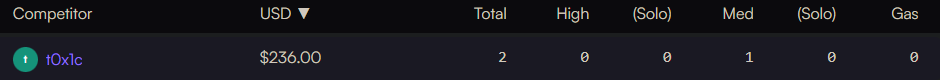

# Leaderboard
[Wildcat Contest](https://code4rena.com/contests/2023-10-the-wildcat-protocol#top) 
<br>



`Rank 32 / 131`

# Audited Code Repo
### [Code4rena: Wildcat](https://github.com/code-423n4/2023-10-wildcat/commit/18bda5daf6a668cfe5dd6c0749a908e193e7b90c)

<br>

# Bugs Filed & Their Status

| # | Bug ID | Name | URL | Adjudged Status |
|--------|--------|------|:------:|-----------------:|
| 1 | [H-01](#h-01)    | Lender is paid additional interest due to incorrect calculation of `scaleFactor` | [141](https://github.com/code-423n4/2023-10-wildcat-findings/issues/141) | Invalidated |
| 2 | [H-02](#h-02)    | During pro-rata claim calculations, lenders are credited with interest in incorrect proportions | [198](https://github.com/code-423n4/2023-10-wildcat-findings/issues/198) | Invalidated |
| 3 | [H-03](#h-03)    | Incorrect `market.borrowableAssets()` calculation | [279](https://github.com/code-423n4/2023-10-wildcat-findings/issues/279) | QA |
| 4 | [H-04](#h-04)    | Borrower pays higher than expected penalty in case of overlapping delinquency events | [357](https://github.com/code-423n4/2023-10-wildcat-findings/issues/357) | Invalidated |
| 5 | [H-05](#h-05)    | Parameter change as well as interest accrual is possible in a closed market | [463](https://github.com/code-423n4/2023-10-wildcat-findings/issues/463) | Invalidated |
| 6 | [H-06](#h-06)    | Borrower escapes delinquency penalty if no intermittent action happens | [706](https://github.com/code-423n4/2023-10-wildcat-findings/issues/706) | Invalidated |
| 7 | [M-01](#m-01)    | If borrower gets sanctioned, pro-rata approach harms lenders with already queued withdrawals  | [418](https://github.com/sherlock-audit/2023-09-ajna-t0x1cC0de/issues/418) | Invalidated |
| 8 | [M-02](#m-02)    | Due to incomplete checks, controller can unfavourably lower `reserveRatioBips` during `setAnnualInterestBips()` | [572](https://github.com/sherlock-audit/2023-09-ajna-t0x1cC0de/issues/572) | Accepted as Medium |
| 9 | [M-03](#m-03)    | Sanction-override should be automatically removed inside `releaseEscrow()` else lender can bypass checks if he is re-flagged as sanctioned by Chainanalysis oracle  | [643](https://github.com/code-423n4/2023-10-wildcat-findings/issues/643) | Invalidated |


<br>

## **HIGH-SEVERITY BUGS**
---

### <a id="h-01"></a>[H-01]
## **Lender is paid additional interest due to incorrect calculation of `scaleFactor`**
#### https://github.com/code-423n4/2023-10-wildcat/blob/main/src/libraries/FeeMath.sol#L142
<br>

## Impact
Imagine following flow of events:
1. Alice deposits some assets.
2. Borrower borrows some amount.
3. Alice puts in a withdrawal request via `queueWithdrawal()`. 
4. Mid-way through the withdrawal period, she calls `market.updateState()` ( _OR alternatively, any other function is called which updates the state. For example Bob who had also made a deposit earlier, may want to put in a `queueWithdrawal()` request at this point of time_ ).
5. The remaining half of the withdrawal period passes now and post an `updateState()`, Alice attempts to claim her amount via `executeWithdrawal()`. 
6. **Result:** Due to the _mid-way state update_ done in Step 4 (either maliciously or just as part of the normal flow of events), the `scaleFactor` is compounded incorrectly and an interest of `10.25%` per-annum is applied instead of the expected `10%`. Thus, borrower will have to pay more interest than expected, which is transferred to Alice. 
Note that instead of calling `updateState()` just once mid-way through the withdrawal period, it can be called multiple times to inflate the `scaleFactor` even higher, for example by calling it every minute or every hour.

***Impact:*** Unfair loss of funds for borrower. Unfair gain for lender. 

## Proof of Concept
To simplify calculations of the PoC and so that the numbers match at your end, we will keep `delinquencyFeeBips` to zero. To stop the tests from throwing an error, first change [this line of code to](https://github.com/code-423n4/2023-10-wildcat/blob/main/test/shared/TestConstants.sol#L23) `MinimumDelinquencyFeeBips = 0`. Note that this is not necessary, just that you will get numbers a bit different from mine if you don't.

Create a file inside `test/market/` named `t0x1cScale.t.sol` and paste the following code inside it:

```js
// SPDX-License-Identifier: MIT
pragma solidity >=0.8.20;

import {MockERC20} from "solmate/test/utils/mocks/MockERC20.sol";

import "src/market/WildcatMarket.sol";
import "../shared/TestConstants.sol";
import "../helpers/Assertions.sol";
import "../shared/Test.sol";
import "../helpers/VmUtils.sol";
import "../helpers/MockController.sol";

contract t0x1cScale is Test {
    using stdStorage for StdStorage;
    using FeeMath for MarketState;
    using SafeCastLib for uint256;
    using MathUtils for uint256;
    using FeeMath for uint256;

    MarketParameters internal t0x1cParameters;
    MockERC20 internal asset;

    function setUp() public {
        t0x1cParameters = MarketParameters({
            asset: address(0),
            namePrefix: "Wildcat ",
            symbolPrefix: "WC",
            borrower: borrower,
            controller: address(0),
            feeRecipient: feeRecipient,
            sentinel: address(sanctionsSentinel),
            maxTotalSupply: uint128(500_000e18), // 500K
            protocolFeeBips: 0,
            annualInterestBips: 1000, // 10%
            delinquencyFeeBips: 0,
            withdrawalBatchDuration: 365 days, // 1 year
            reserveRatioBips: 2000, // 20%
            delinquencyGracePeriod: MaximumDelinquencyGracePeriod
        });

        if (address(controller) == address(0)) {
            deployController(t0x1cParameters.borrower, false, false);
        }
        t0x1cParameters.controller = address(controller);
        t0x1cParameters.asset = address(asset = new MockERC20('Token', 'TKN', 18));
        deployMarket(t0x1cParameters);
        _authorizeLender(alice);
        _authorizeLender(bob);

        asset.mint(alice, 150_000e18);
        asset.mint(bob, 50_000e18);

        vm.prank(alice);
        asset.approve(address(market), type(uint256).max);
        vm.prank(bob);
        asset.approve(address(market), type(uint256).max);
    }

    function _authorizeLender(address account) internal asAccount(t0x1cParameters.borrower) {
        address[] memory lenders = new address[](1);
        lenders[0] = account;
        controller.authorizeLenders(lenders);
    }

    function test_t0x1c_scale_case1_yearlyUpdate() external {
        vm.prank(alice);
        market.depositUpTo(150_000e18);

        vm.prank(borrower);
        market.borrow(120_000e18); // leaving 30K in reserves

        // Alice requests a withdrawal
        vm.prank(alice);
        market.queueWithdrawal(50_000e18);

        fastForward(365 days); // @audit-info : // a total of 1 year has passed; new expiry cycle begins
        uint32 expiry = uint32(block.timestamp);
        market.updateState();

        // borrower returns some debt
        vm.prank(borrower);
        asset.transfer(address(market), 99_000e18);

        market.processUnpaidWithdrawalBatch();

        market.executeWithdrawal(alice, expiry);
        // asset balance should be 52K ( 30k + (100 *1.1)% * 20k) )
        assertEq(asset.balanceOf(alice), 52_000e18);
        assertEq(market.scaleFactor(), 1.1e27);
    }

    function test_t0x1c_scale_case2_halfYearlyUpdate() external {
        // Reserve ratio to be maintained: 20%
        vm.prank(alice);
        market.depositUpTo(150_000e18);

        vm.prank(borrower);
        market.borrow(120_000e18); // leaving 30K in reserves

        // Alice requests a withdrawal
        vm.prank(alice);
        market.queueWithdrawal(50_000e18);

        // 1st jump
        fastForward(182.5 days); // @audit-info : a 6-month jump
        market.updateState();

        // 2nd jump
        fastForward(182.5 days); // @audit-info : // a total of 1 year has passed; new expiry cycle begins
        uint32 expiry = uint32(block.timestamp);
        market.updateState();

        // borrower returns some debt
        vm.prank(borrower);
        asset.transfer(address(market), 99_000e18);

        market.processUnpaidWithdrawalBatch();

        market.executeWithdrawal(alice, expiry);
        // asset balance incorrectly is 52.05K ( 30k + ((100 *1.05) * 1.05)% * 20k) ) = ( 30K + (110.25% * 20K) ) = 30K + 22.05K
        assertEq(asset.balanceOf(alice), 52_050e18);
        assertEq(market.scaleFactor(), 1.1e27); // scaleFactor incorrectly exceeds 110% ( it's 110.25% ). Test will fail.
    }
}

```

- First, we can see the "normal" expected values by running `forge test --mt test_t0x1c_scale_case1_yearlyUpdate -vv`. The expected, correct balance at the end is `52_000e18` with scale factor of `1.1e27`.
- Next, run `forge test --mt test_t0x1c_scale_case2_halfYearlyUpdate -vv` to see incorrect calculations made due to Alice's call to `market.updateState()` after 6 months. The balance is inflated to `52_050e18` and scale factor to `1.1025e27`, making the test fail.

## Tools Used
Manual inspection, foundry.

## Recommended Mitigation Steps
Revisit the logic of compounding the `scaleFactor`, while not assuming that all state-updates will happen together in a bunch.
Upon initial inspection, I believe [these variables](https://github.com/code-423n4/2023-10-wildcat/blob/main/src/libraries/FeeMath.sol#L167-L172) should not be updated if the `state.lastInterestAccruedTimestamp` belongs to the same expiry batch as the current timestamp. But further tests need to be done after applying the fix.
Something like the following:
```diff
    function updateScaleFactorAndFees(
        MarketState memory state,
        uint256 protocolFeeBips,
        uint256 delinquencyFeeBips,
        uint256 delinquencyGracePeriod,
        uint256 timestamp
    ) internal pure returns (uint256 baseInterestRay, uint256 delinquencyFeeRay, uint256 protocolFee) {
        baseInterestRay = state.calculateBaseInterest(timestamp);

        if (protocolFeeBips > 0) {
            protocolFee = state.applyProtocolFee(baseInterestRay, protocolFeeBips);
        }

        if (delinquencyFeeBips > 0) {
            delinquencyFeeRay = state.updateDelinquency(timestamp, delinquencyFeeBips, delinquencyGracePeriod);
        }

+        if (!state.last_InterestAccruedTimestamp_InSameExpiryWindow) {
            // Calculate new scaleFactor
            uint256 prevScaleFactor = state.scaleFactor;
            // @audit-info : hacky code to bypass current `scaleFactor` bug, so that we can test further
            uint256 scaleFactorDelta = prevScaleFactor.rayMul(baseInterestRay + delinquencyFeeRay);

            state.scaleFactor = (prevScaleFactor + scaleFactorDelta).toUint112();
            state.lastInterestAccruedTimestamp = uint32(timestamp);
+        }
    }
```

---

### <a id="h-02"></a>[H-02]
## **During pro-rata claim calculations, lenders are credited with interest in incorrect proportions**
#### https://github.com/code-423n4/2023-10-wildcat/blob/main/src/market/WildcatMarketBase.sol#L498
<br>

## Impact
During pro-rata claims disbursal, imagine the following scenario:
1. Withdrawal batch duration is 365 days (1 year). The `annualInterestBips` is 10% with no `protocolFeeBips` and no `delinquencyFeeBips`. `reserveRatioBips` is 10%. These values are just for ease of calculation, they could be set to any valid values.
2. Alice deposits 50. Bob deposits 100. Minimum liquidity required to be maintained = 10% * (50 + 100) = 15.
3. Borrower borrows 135, leaving 15 in reserves.
4. Alice queues her withdrawal for 50.
5. ***6 months later,*** ( _this could be any amount of time > 0_ ) Bob queues his withdrawal for 100. Both lenders then wait for the year to end, so that they can call `executeWithdrawal()`.
6. Pro-rata calculations come into play. Liquidity of 15 will be split between Alice & Bob in the ratio 50:100 = 1:2 so that Alice should receive 5 and Bob 10.
7. Now for the first 6 months, Alice should not have received interest on 15 but only on the remaining amount of 35 ( _Let's say this to be **Interest_A_0** = 0.5 * 10% of 35 = 1.75_ ). For these first 6 months, Bob should have continued to receive interest on his full 100 ( _Let's say this to be **Interest_B_0** = 0.5 * 10% of 100 = 5_ ). 
8. For the last 6 months, due to pro-rata being applicable, Alice should not have received interest on 5, but only on the remaining amount ( _Let's say this to be **Interest_A_1** = 0.5 * 10% of 45 = 2.25_ ). For these last 6 months, Bob should have received interest only on (100 - 10) = 90 ( _Let's say this to be **Interest_B_1** = 0.5 * 10% of 90 = 4.5_ ).
9. Total withdrawals the lenders should be able to make: Alice = 50 + Interest_A_0 + Interest_A_1 = `54`. Bob = 100 + Interest_B_0 + Interest_B_1 = `109.5`.

However, the protocol calculation never considers these intermittent steps. It incorrectly credits Bob with interest on 90 (10% of 90 = 9) for the full 1 year, thus causing a **loss of interest** ( _loss of 0.5_ ) for him and a **gain** for Alice ( _gain of 0.5_ ). 
Note that from the borrower's perspective, it's all the same. He has to pay the same amount of interest on the overall debt of 135 (4 + 9.5 = 13.5 = 10% of 135)  no matter what, not concerning himself with its correct proportionate distribution between the lenders.

***Impact:*** Loss of rightful interest amount for any lender putting in a withdrawal request at some timestamp after the first request has been put in, which kicked in pro-rata calculations.

## Proof of Concept
**IMPORTANT Note before the PoC:** There's a previous bug raised by me titled "**Lender is paid additional interest due to incorrect calculation of `scaleFactor`**", Let's call that bug as `scaleFactor-Bug`. These are **two mutually distinct issues** but the `scaleFactor-Bug` actually "masks" (or hides) this particular `pro-rata interest bug`, thus making the creation of a straight-forward PoC a difficult task. 
In the tests, the moment you try to `fastForward()` by 6 months within the same expiry/withdrawal window, the `scaleFactor` is calculated incorrectly due to `scaleFactor-Bug` & messes up the results, thus hiding the fact that even if that issue was non-existent, the correct retrospective readjustment for pro-rata interest never happens in the code.<br>
To make the technical PoC possible, here's a [git patch](https://gist.github.com/t0x1cC0de/ce920e9b94b210408f6069f148d12712) which makes several "QA-style hacky patches" to get around the `scaleFactor-Bug`. Basically, it allows you to tell the protocol that while doing a `state` update, we are still in the same withdrawal window as the `state.lastInterestAccruedTimestamp` and that the protocol should not update the `scaleFactor` in such a case. Create a file named 'scaleFactor_hacky_patch.diff' inside the `2023-10-wildcat/` folder, paste the git-diff patch code and then run `git apply scaleFactor_hacky_patch.diff`. (PoC test for this `pro-rata interest bug` is also included in this git patch)<br>
We can now run `forge test --mt test_t0x1c_proRata_Interest -vv` to confirm that Alice & Bob's final asset balances are not as outlined in the above calculations.
<br><br>
In case you do not wish to apply the patch to circumvent the `scaleFactor-Bug`, then you can use the following process:<br>
Here's the test code provided separately. Save this in a new file inside the `test/market/` folder. Simply run the `test_t0x1c_proRata_Interest()` after commenting out the two calls to `market.set_last_InterestAccruedTimestamp_InSameExpiryWindow()` inside it (like shown below). Note that you will first need to manually change [this line of code to](https://github.com/code-423n4/2023-10-wildcat/blob/main/test/shared/TestConstants.sol#L23) `MinimumDelinquencyFeeBips = 0`, so that errors are not thrown when we set `delinquencyFeeBips` to zero. <br>
You will still see Alice's balance incorrectly inflated to approximately `54.5`, while Bob's will be drastically reduced to around `104`. This is because of the combined errors caused due to `scaleFactor-Bug + pro-rata interest bug`. We can run this via `forge test --mt test_t0x1c_proRata_Interest -vv` :

```js
// SPDX-License-Identifier: MIT
pragma solidity >=0.8.20;

import {MockERC20} from "solmate/test/utils/mocks/MockERC20.sol";

import "src/market/WildcatMarket.sol";
import "../shared/TestConstants.sol";
import "../helpers/Assertions.sol";
import "../shared/Test.sol";
import "../helpers/VmUtils.sol";
import "../helpers/MockController.sol";

contract t0x1cScale is Test {
    using stdStorage for StdStorage;
    using FeeMath for MarketState;
    using SafeCastLib for uint256;
    using MathUtils for uint256;
    using FeeMath for uint256;

    MarketParameters internal t0x1cParameters;
    MockERC20 internal asset;

    function setUp() public {
        t0x1cParameters = MarketParameters({
            asset: address(0),
            namePrefix: "Wildcat ",
            symbolPrefix: "WC",
            borrower: borrower,
            controller: address(0),
            feeRecipient: feeRecipient,
            sentinel: address(sanctionsSentinel),
            maxTotalSupply: uint128(500_000e18), // 500K
            protocolFeeBips: 0,
            annualInterestBips: 1000, // 10%
            delinquencyFeeBips: 0,
            withdrawalBatchDuration: 365 days, // 1 year
            reserveRatioBips: 1000, // 10%
            delinquencyGracePeriod: MaximumDelinquencyGracePeriod
        });

        if (address(controller) == address(0)) {
            deployController(t0x1cParameters.borrower, false, false);
        }
        t0x1cParameters.controller = address(controller);
        t0x1cParameters.asset = address(asset = new MockERC20('Token', 'TKN', 18));
        deployMarket(t0x1cParameters);
        _authorizeLender(alice);
        _authorizeLender(bob);

        asset.mint(alice, 50e18);
        asset.mint(bob, 100e18);

        vm.prank(alice);
        asset.approve(address(market), type(uint256).max);
        vm.prank(bob);
        asset.approve(address(market), type(uint256).max);
    }

    function _authorizeLender(address account) internal asAccount(t0x1cParameters.borrower) {
        address[] memory lenders = new address[](1);
        lenders[0] = account;
        controller.authorizeLenders(lenders);
    }

    function test_t0x1c_proRata_Interest() external {
        vm.prank(alice);
        market.depositUpTo(50e18);
        vm.prank(bob);
        market.depositUpTo(100e18);

        vm.prank(borrower);
        market.borrow(135e18);

        // Alice requests a withdrawal
        vm.prank(alice);
        market.queueWithdrawal(50e18);

        // 1st jump
        fastForward(182.5 days); // @audit-info : a 6-month jump

        // market.set_last_InterestAccruedTimestamp_InSameExpiryWindow(market.previousState(), true); // @audit-info : QA-style hack to bypass the `scaleFactor-Bug`
        // Bob requests a withdrawal
        vm.prank(bob);
        market.queueWithdrawal(100e18);
        // market.set_last_InterestAccruedTimestamp_InSameExpiryWindow(market.previousState(), false); // set it back to normal value

        // 2nd jump
        fastForward(182.5 days); // @audit-info : // a total of 1 year has passed
        uint32 expiry = uint32(block.timestamp);
        market.updateState();

        asset.mint(borrower, 135e17); // @audit-info : we will mint some extra assets (13.5) for borrower so that we can make him return the complete debt + interest

        // borrower returns some debt
        vm.prank(borrower);
        asset.transfer(address(market), 1485e17); // borrower returns 148.5

        market.processUnpaidWithdrawalBatch();

        market.executeWithdrawal(alice, expiry);
        market.executeWithdrawal(bob, expiry);
        // Bob's balance should be 54, but is calculated incorrrectly by the protocol as ~54.5 . Test will fail
        assertEq(asset.balanceOf(alice), 54e18, "Alice's balance mismatch");
        // Bob's balance should be 109.5, but is calculated incorrrectly by the protocol as ~104 . Test will fail
        assertEq(asset.balanceOf(bob), 1095e17, "Bob's balance mismatch");
    }
}
```
<br>

## Tools Used
Manual inspection, foundry.

## Recommended Mitigation Steps
Incorporate new logic to keep track of the timestamp when a lender calls `queueWithdrawal()` so that correct interest calculations can be applied before & after that.

---

### <a id="h-03"></a>[H-03]
## **Incorrect `market.borrowableAssets()` calculation**
#### https://github.com/code-423n4/2023-10-wildcat/blob/main/src/libraries/MarketState.sol#L87-L98
<br>

## Impact
Borrower can't borrow the maximum amount, as explained in the [docs](https://github.com/wildcat-finance/wildcat-whitepaper/blob/main/whitepaper_v0.2.pdf):
> In the ‘boring’ case where everyone co-operates and no parameters are changed, a maximum of 1,200 WETH is deposited immediately and the outstanding supply inflates at a rate of 6% APR to 1,272 WETH after a year.
>
> “Wait, that APR is wrong too, you said it was 5%!”. Yes and no - the protocol fee of the vault was set at 20%: this is the extra proportion of the vault APR that routes to the Wildcat protocol - we have to make revenue somehow. In the front-end, the APR a lender earns is presented net of this fee (they’ll see 5%): the protocol fee is for the borrower to concern themselves with.
>
> One final point to add here is that the reserve ratio applies to the vault supply: if no lender withdraws any of their position during the year, the borrower can then withdraw a maximum of 1,144.8 WETH (an extension of 90% of the 72 WETH interest accrued). 

So, as per the last paragraph, a borrower should be able to borrow 1144.8 WETH. But he is actually limited to 1134 WETH by the protocol.

## Proof of Concept
Save this in a new file inside the `test/market/` folder and run `forge test --mt test_t0x1c_WdlLimitIncreaseWithInterest -vv`:

```js
// SPDX-License-Identifier: MIT
pragma solidity >=0.8.20;

import {MockERC20} from "solmate/test/utils/mocks/MockERC20.sol";

import "src/market/WildcatMarket.sol";
import "../shared/TestConstants.sol";
import "../helpers/Assertions.sol";
import "../shared/Test.sol";
import "../helpers/VmUtils.sol";
import "../helpers/MockController.sol";

contract t0x1cBorrowableAmount is Test {
    using stdStorage for StdStorage;
    using FeeMath for MarketState;
    using SafeCastLib for uint256;
    using MathUtils for uint256;
    using FeeMath for uint256;

    MarketParameters internal t0x1cParameters;
    MockERC20 internal asset;
    address constant anyone = address(0xabc); // could be borrower's alternate account

    function setUp() public {
        t0x1cParameters = MarketParameters({
            asset: address(0),
            namePrefix: "Wildcat ",
            symbolPrefix: "WC",
            borrower: borrower,
            controller: address(0),
            feeRecipient: feeRecipient,
            sentinel: address(sanctionsSentinel),
            maxTotalSupply: uint128(1200e18),
            protocolFeeBips: 2000,
            annualInterestBips: 500,
            delinquencyFeeBips: DefaultDelinquencyFee,
            withdrawalBatchDuration: DefaultWithdrawalBatchDuration,
            reserveRatioBips: 1000,
            delinquencyGracePeriod: DefaultGracePeriod
        });

        if (address(controller) == address(0)) {
            deployController(t0x1cParameters.borrower, false, false);
        }
        t0x1cParameters.controller = address(controller);
        t0x1cParameters.asset = address(asset = new MockERC20('Token', 'TKN', 18));
        deployMarket(t0x1cParameters);
        _authorizeLender(alice);

        asset.mint(alice, 1200e18);
        asset.mint(anyone, 99e18);

        vm.prank(alice);
        asset.approve(address(market), type(uint256).max);
    }

    function _authorizeLender(address account) internal asAccount(t0x1cParameters.borrower) {
        address[] memory lenders = new address[](1);
        lenders[0] = account;
        controller.authorizeLenders(lenders);
    }

    function test_t0x1c_WdlLimitIncreaseWithInterest() external {
        vm.prank(alice);
        market.depositUpTo(1200e18);
        assertEq(market.borrowableAssets(), 1080e18, "borrowable should be 1080");

        fastForward(365 days);
        // interest + protocolFees is transferred into the market
        vm.prank(anyone);
        asset.transfer(address(market), 72e18);
        market.updateState();

        // will fail assertion
        assertEq(market.borrowableAssets(), 11448e17, "borrowable should be 1144.8");

        vm.prank(borrower);
        // will revert with error `BorrowAmountTooHigh()`
        market.borrow(11448e17);
    }
}
```
<br>

## Tools Used
Manual inspection, foundry.

## Recommended Mitigation Steps
Fix the `liquidityRequired` calculation as per docs. Currently the protocol fees is deducted from supply before calculating required reserves.

---

### <a id="h-04"></a>[H-04]
## **Borrower pays higher than expected penalty in case of overlapping delinquency events**
#### https://github.com/code-423n4/2023-10-wildcat/blob/main/src/libraries/FeeMath.sol#L89
<br>

## Impact
Imagine the following flow of events:
1. Market goes into delinquent state because Bob requested a withdrawal greater than the available liquidity. 
2. `DelinquencyGracePeriod` comes into effect and borrower is given this time before penalty is applied.
3. Borrower can't supply the funds within `DelinquencyGracePeriod`, so the penalty `grace tracker` starts say, at 2 PM.
4. Borrower pays back and makes the market non-delinquent after 1 hour at 3 PM.
5. The grace tracker will now wind down for the next 1 hour and hence the borrower will pay the penalty for hours 2 PM to 4 PM.
6. However, at 3.30 PM, when the market was non-delinquent but penalty still active, another withdrawal request was made by Bob causing the market to go into a delinquent state once again.<br>
This messes up the calculations, as can be seen in the PoC. There are 2 primary concerns:
- No fresh grace period is given to the borrower, after the second delinquency event. (This may be as per business use case, but is not mentioned anywhere in the documentation and seems unfair since the borrower had successfully pulled the market out of delinquency before being hit by the second wave).
- The duration for which penalty is applied post the second delinquency event does not make sense using any permutation of grace period & tracker.

## Proof of Concept
The easiest way to track if a penalty has been accrued due to delinquency or not, is to set `annualInterestBips` and `protocolFeeBips` to zero. This way, the only contribution to any increase in `state.totalDebts()` will be solely due to `delinquencyFeeBips`.<br>
Save the following code in a new file inside the `test/market/` folder and run via `forge test --mt test_t0x1c_delinquentPenalty -vv`:

```js
// SPDX-License-Identifier: MIT
pragma solidity >=0.8.20;

import {MockERC20} from "solmate/test/utils/mocks/MockERC20.sol";

import "src/market/WildcatMarket.sol";
import "../shared/TestConstants.sol";
import "../helpers/Assertions.sol";
import "../shared/Test.sol";
import "../helpers/VmUtils.sol";
import "../helpers/MockController.sol";

contract t0x1cDelinquentPenalty is Test {
    using stdStorage for StdStorage;
    using FeeMath for MarketState;
    using SafeCastLib for uint256;
    using MathUtils for uint256;
    using FeeMath for uint256;

    MarketParameters internal t0x1cParameters;
    MockERC20 internal asset;

    uint256 borrowersExternalAssetsViaProfits;
    address constant anyone = address(0xabc); // borrower's alter ego

    function setUp() public {
        t0x1cParameters = MarketParameters({
            asset: address(0),
            namePrefix: "Wildcat ",
            symbolPrefix: "WC",
            borrower: borrower,
            controller: address(0),
            feeRecipient: feeRecipient,
            sentinel: address(sanctionsSentinel),
            maxTotalSupply: uint128(10_000e18),
            protocolFeeBips: 0,
            annualInterestBips: 0,
            delinquencyFeeBips: 1000, // 10%
            withdrawalBatchDuration: 0,
            reserveRatioBips: 1000, // 10%
            delinquencyGracePeriod: 1 hours
        });

        if (address(controller) == address(0)) {
            deployController(t0x1cParameters.borrower, false, false);
        }
        t0x1cParameters.controller = address(controller);
        t0x1cParameters.asset = address(asset = new MockERC20('Token', 'TKN', 18));
        deployMarket(t0x1cParameters);
        _authorizeLender(bob);

        borrowersExternalAssetsViaProfits = 119_000e18; // any arbitrary value
        asset.mint(bob, 100e18);
        // will be used later in tests, and will be considered borrower's profit from external activities
        asset.mint(anyone, borrowersExternalAssetsViaProfits);

        vm.prank(bob);
        asset.approve(address(market), type(uint256).max);
    }

    function _authorizeLender(address account) internal asAccount(t0x1cParameters.borrower) {
        address[] memory lenders = new address[](1);
        lenders[0] = account;
        controller.authorizeLenders(lenders);
    }

    function test_t0x1c_delinquentPenalty() external {
        uint256 timeElapsed = 0;

        vm.prank(bob);
        market.depositUpTo(100e18);

        vm.prank(borrower);
        market.borrow(90e18);
        uint256 prevTotalDebt = market.previousState().totalDebts();

        vm.prank(bob);
        market.queueWithdrawal(20e18);
        assertEq(prevTotalDebt, market.previousState().totalDebts());

        fastForward(2 hours);
        market.updateState();
        timeElapsed += 120;
        assertLt(prevTotalDebt, market.previousState().totalDebts());
        prevTotalDebt = market.previousState().totalDebts();
        assertEq(market.previousState().isDelinquent, true);

        // pay back some debt so that the market is not delinquent anymore
        vm.prank(anyone);
        asset.transfer(address(market), 50e18);
        market.updateState();
        // market shouldn't be delinquent anymore
        assertEq(market.previousState().isDelinquent, false);
        assertEq(prevTotalDebt, market.previousState().totalDebts());

        // note:
        // between the 2 and 2.5 hour mark, market is NOT delinquent. The
        // borrower still has to pay the delinquency fee though, which is
        // as expected, since the `grace tracker` is still winding down below
        // the specified grace period.

        // still paying penalty, and meanwhile Bob requests another withdrawal due
        // to which the market goes delinquent once again
        fastForward(0.5 hours);
        market.updateState();
        timeElapsed += 30;
        vm.prank(bob);
        market.queueWithdrawal(55e18);
        assertLt(prevTotalDebt, market.previousState().totalDebts());
        prevTotalDebt = market.previousState().totalDebts();
        assertEq(market.previousState().isDelinquent, true);

        fastForward(0.5 hours);
        market.updateState();
        timeElapsed += 30;
        // continues to pay delinq fees, as expected
        assertLt(prevTotalDebt, market.previousState().totalDebts());
        prevTotalDebt = market.previousState().totalDebts();

        fastForward(0.5 hours);
        market.updateState();
        timeElapsed += 30;
        assertLt(prevTotalDebt, market.previousState().totalDebts());
        prevTotalDebt = market.previousState().totalDebts();

        fastForward(0.5 hours);
        market.updateState();
        timeElapsed += 30;
        assertLt(prevTotalDebt, market.previousState().totalDebts());
        prevTotalDebt = market.previousState().totalDebts();
        // market is delinquent right now
        assertEq(market.previousState().isDelinquent, true);

        // pay back once again now & make market non-delinquent
        vm.prank(anyone);
        asset.transfer(address(market), 101e18);
        market.updateState();
        assertEq(market.previousState().isDelinquent, false);
        assertEq(prevTotalDebt, market.previousState().totalDebts());

        // keep checking in steps of half an hour, to see for how long the
        // borrower has to pay the penalty
        fastForward(0.5 hours);
        market.updateState();
        timeElapsed += 30;
        assertLt(prevTotalDebt, market.previousState().totalDebts());
        prevTotalDebt = market.previousState().totalDebts();

        fastForward(0.5 hours);
        market.updateState();
        timeElapsed += 30;
        assertLt(prevTotalDebt, market.previousState().totalDebts());
        prevTotalDebt = market.previousState().totalDebts();

        fastForward(0.5 hours);
        market.updateState();
        timeElapsed += 30;
        assertLt(prevTotalDebt, market.previousState().totalDebts());
        prevTotalDebt = market.previousState().totalDebts();

        // still paying the penalty..........
        fastForward(0.5 hours);
        market.updateState();
        timeElapsed += 30;
        assertLt(prevTotalDebt, market.previousState().totalDebts());
        prevTotalDebt = market.previousState().totalDebts();

        // penalty finally stopped now, 6 hours after the 1st delinquency event and
        // 3.5 hours after the second delinquency event. Way more than expected!
        fastForward(0.5 hours);
        market.updateState();
        assertEq(prevTotalDebt, market.previousState().totalDebts());
        assertEq(timeElapsed, 360, "timeElapsed != 6 hours");
    }
}
```
<br>

## Tools Used
Manual inspection, foundry.

## Recommended Mitigation Steps
Fix the `updateTimeDelinquentAndGetPenaltyTime()` function to consider such overlapping situations.

---

### <a id="h-05"></a>[H-05]
## **Parameter change as well as interest accrual is possible in a closed market**
#### https://github.com/code-423n4/2023-10-wildcat/blob/main/src/market/WildcatMarket.sol#L142
<br>

## Impact
[Docs](https://wildcat-protocol.gitbook.io/wildcat/using-wildcat/day-to-day-usage/borrowers#closing-a-market) mention:
> This is a special case of reducing the APR (with the associated increased reserve rate that accompanies it). When a market is closed, sufficient assets must be repaid to increase the reserve ratio to 100%, after which interest ceases to accrue and _no further parameter adjustment or borrowing is possible_. The only thing possible to do in a closed market is for the lenders to file withdrawal requests and exit.

This is violated. Borrower can readily change the APR, and interest keeps on accruing which can be claimed by the lender.

## Proof of Concept
Save the following code in a new file inside the `test/market/` folder and run via `forge test --mt test_t0x1c_changeInterestRateAfterMarketClose -vv`:

```js
// SPDX-License-Identifier: MIT
pragma solidity >=0.8.20;

import {MockERC20} from "solmate/test/utils/mocks/MockERC20.sol";

import "src/market/WildcatMarket.sol";
import "../shared/TestConstants.sol";
import "../helpers/Assertions.sol";
import "../shared/Test.sol";
import "../helpers/VmUtils.sol";
import "../helpers/MockController.sol";

contract t0x1cClosedMarket is Test {
    using stdStorage for StdStorage;
    using FeeMath for MarketState;
    using SafeCastLib for uint256;
    using MathUtils for uint256;
    using FeeMath for uint256;

    MarketParameters internal t0x1cParameters;
    MockERC20 internal asset;

    function setUp() public {
        t0x1cParameters = MarketParameters({
            asset: address(0),
            namePrefix: "Wildcat ",
            symbolPrefix: "WC",
            borrower: borrower,
            controller: address(0),
            feeRecipient: feeRecipient,
            sentinel: address(sanctionsSentinel),
            maxTotalSupply: uint128(10_000e18),
            protocolFeeBips: 0,
            annualInterestBips: 1000,
            delinquencyFeeBips: 4000,
            withdrawalBatchDuration: 0,
            reserveRatioBips: 1000,
            delinquencyGracePeriod: 2 minutes
        });

        if (address(controller) == address(0)) {
            deployController(t0x1cParameters.borrower, false, false);
        }
        t0x1cParameters.controller = address(controller);
        t0x1cParameters.asset = address(asset = new MockERC20('Token', 'TKN', 18));
        deployMarket(t0x1cParameters);
        _authorizeLender(alice);
        _authorizeLender(bob);

        asset.mint(alice, 100e18);
        asset.mint(bob, 100e18);

        vm.prank(alice);
        asset.approve(address(market), type(uint256).max);
        vm.prank(bob);
        asset.approve(address(market), type(uint256).max);
    }

    function _authorizeLender(address account) internal asAccount(t0x1cParameters.borrower) {
        address[] memory lenders = new address[](1);
        lenders[0] = account;
        controller.authorizeLenders(lenders);
    }

    function test_t0x1c_changeInterestRateAfterMarketClose() external {
        vm.prank(alice);
        market.depositUpTo(100e18);
        vm.prank(bob);
        market.depositUpTo(100e18);

        assertEq(market.previousState().normalizeAmount(market.scaledBalanceOf(alice)), 100e18);

        vm.prank(t0x1cParameters.controller);
        market.closeMarket();
        assertEq(market.previousState().isClosed, true);

        vm.prank(borrower);
        controller.setAnnualInterestBips(address(market), 500);

        fastForward(365 days);
        market.updateState();
        assertEq(market.previousState().normalizeAmount(market.scaledBalanceOf(alice)), 105e18, "no interest accrued");

        vm.prank(alice);
        market.queueWithdrawal(105e18);
        market.executeWithdrawal(alice, uint32(block.timestamp));
        assertEq(asset.balanceOf(alice), 105e18);
    }
}

```

## Tools Used
Manual inspection, foundry.

## Recommended Mitigation Steps
`.isClosed = true` checks need to be present in the other required functions too.

---

### <a id="h-06"></a>[H-06]
## **Borrower escapes delinquency penalty if no intermittent action happens**
#### https://github.com/code-423n4/2023-10-wildcat/blob/main/src/market/WildcatMarket.sol#L26
<br>

## Impact
Once the market goes below required reserves, it is marked as delinquent only if an `updateState()` action happens. Actions like `market.updateState()`, `executeWithdrawal()`, `deposit()`, etc. have to happen else the protocol remains unaware of the market's delinquency and no penalty fees is applied on the borrower. 
The borrower can repay before any state updates happen and escape a penalty altogether.

## Proof of Concept
Save the following code in a new file inside the `test/market/` folder. 
- We'll first run `forge test --mt test_t0x1c_SomeAction_TimeLapse -vv` to confirm that the market goes into delinquency within 1 second due to interest accrual & protocol fee. The test should pass.
- Then run `forge test --mt test_t0x1c_NoAction_TimeLapse -vv` to see that in the absence of any explicit state updates, market is never delinquent. Then the borrower himself calls `market.stateUpdate()` after repayment and escapes his 2 hours of penalty.

```js
// SPDX-License-Identifier: MIT
pragma solidity >=0.8.20;

import {MockERC20} from "solmate/test/utils/mocks/MockERC20.sol";

import "src/market/WildcatMarket.sol";
import "../shared/TestConstants.sol";
import "../helpers/Assertions.sol";
import "../shared/Test.sol";
import "../helpers/VmUtils.sol";
import "../helpers/MockController.sol";

contract t0x1cEscapePenalty is Test {
    using stdStorage for StdStorage;
    using FeeMath for MarketState;
    using SafeCastLib for uint256;
    using MathUtils for uint256;
    using FeeMath for uint256;

    MarketParameters internal t0x1cParameters;
    MockERC20 internal asset;

    function setUp() public {
        t0x1cParameters = MarketParameters({
            asset: address(0),
            namePrefix: "Wildcat ",
            symbolPrefix: "WC",
            borrower: borrower,
            controller: address(0),
            feeRecipient: feeRecipient,
            sentinel: address(sanctionsSentinel),
            maxTotalSupply: uint128(10_000e18),
            protocolFeeBips: 5000,
            annualInterestBips: 2000,
            delinquencyFeeBips: 5000,
            withdrawalBatchDuration: 0,
            reserveRatioBips: 1000,
            delinquencyGracePeriod: 0
        });

        if (address(controller) == address(0)) {
            deployController(t0x1cParameters.borrower, false, false);
        }
        t0x1cParameters.controller = address(controller);
        t0x1cParameters.asset = address(asset = new MockERC20('Token', 'TKN', 18));
        deployMarket(t0x1cParameters);
        _authorizeLender(alice);

        asset.mint(alice, 100e18);

        _approve(alice, address(market), type(uint256).max);
    }

    function _authorizeLender(address account) internal asAccount(t0x1cParameters.borrower) {
        address[] memory lenders = new address[](1);
        lenders[0] = account;
        controller.authorizeLenders(lenders);
    }

    function _approve(address from, address to, uint256 amount) internal asAccount(from) {
        asset.approve(to, amount);
    }

    function test_t0x1c_SomeAction_TimeLapse() external {
        vm.prank(alice);
        market.depositUpTo(100e18);

        vm.prank(borrower);
        market.borrow(90e18);
        assertEq(market.previousState().isDelinquent, false);

        fastForward(1 seconds);
        market.updateState();
        assertEq(market.previousState().isDelinquent, true);
    }

    function test_t0x1c_NoAction_TimeLapse() external {
        vm.prank(alice);
        market.depositUpTo(100e18);

        vm.prank(borrower);
        market.borrow(90e18);
        assertEq(market.previousState().isDelinquent, false);

        fastForward(1 seconds);
        assertEq(market.previousState().isDelinquent, false); // @audit : state remains non-delinq

        fastForward(1 hours);
        assertEq(market.previousState().isDelinquent, false); // @audit : state still remains non-delinq
        // let's mint some for borrower so that we can make him return a small amount (for testing)
        asset.mint(borrower, 0.01e18);
        // borrower sends this amount to market, before anyone updates the state
        vm.prank(borrower);
        asset.transfer(address(market), 0.01e18);
        assertEq(market.previousState().isDelinquent, false); // @audit : state is still non-delinq
        
        vm.prank(borrower);
        market.updateState(); 
        assertEq(market.previousState().isDelinquent, false); // @audit : state is non-delinq, borrower escapes penalty altogether
    }
}
```

## Tools Used
Manual inspection, foundry.

## Recommended Mitigation Steps
Such issues are normally overcome by protocols incentivizing participants to flag any such undercollateralization events, so that state updates can happen and protocols do not face a loss of fees. 
This way, a user would be inclined to hit `market.updateState()` and monitor any delinquent positions which can be flagged to receive an award from the protocol.

<br><br>

## **MEDIUM-SEVERITY BUGS**
---

### <a id="m-01"></a>[M-01]
## **If borrower gets sanctioned, pro-rata approach harms lenders with already queued withdrawals**
#### https://github.com/code-423n4/2023-10-wildcat/blob/main/src/market/WildcatMarketBase.sol#L498-L526
<br>

## Impact
[Docs](https://wildcat-protocol.gitbook.io/wildcat/using-wildcat/day-to-day-usage/the-sentinel#borrower-gets-sanctioned) mention:
> In the event that the borrower of a market is added to the Chainalysis oracle, any markets that they have deployed are immediately considered irreparably poisoned: all lenders will be affected by strict liability if they withdraw assets after the borrower deposits any back to the market after this point.

When such a sanction happens, there's the possibility of lenders with existing withdrawal requests waiting for their expiry to get a reduced amount and hence have funds stuck due to protocol's pro-rata mechanism.

## Proof of Concept
Imagine the following flow of events:
1. Alice calls `queueWithdrawal()` and is now waiting for the expiry say, 1 day. She intends to call `executeWithdrawal()` once 1 day passes. There are no other withdrawal requests at this point of time from other lenders.
2. Borrower gets sanctioned. Since no new quantity of asset has been deposited by the borrower, lenders can still take new withdrawal actions by calling `queueWithdrawal()`. No one has made a new request yet though.
3. Borrower is unaware of this sanction immediately and thus makes a transaction to deposit some assets, **OR** maybe an alternate account of his (operated by his partner) makes a transfer, **OR** one of the lenders simply does a direct transfer to the market so that all lenders are stuck now resulting in a higher motivation for everyone to go the legal route against the borrower. (Note once again: "all lenders will be affected by strict liability if they withdraw assets **AFTER** the borrower deposits any back to the market")
4. Alice, who had made a request much earlier than all of this, can still safely `executeWithdrawal()` but every other lender just puts in their `queueWithdrawal()` request to brick everyone else even though they won't be insane enough to actually call `executeWithdrawal()` later. (Once again, the thinking goes - the more everyone is effected, higher the chances of a unified consensus & motivation amongst multiple lenders to act together for legal recourse. This is malicious behaviour at best). 
5. Pro-rata calculations cause Alice's share of withdrawal to drop drastically.

## Tools Used
Manual inspection, foundry.

## Recommended Mitigation Steps
If a borrower is sanctioned, it's better for the protocol to stop any fresh deposits/transfers into the market. This will ensure only existing funds are distributed amongst existing lenders fairly and pro-rata mechanism does what it was intended to do, in the words of _functi0nZer0_ : 
_"The reason the withdrawal cycle exists and the pro-rata logic is written in this way is so that if there's a complete stampede out the door for whatever reason, lenders who hit the same cycle are going to get something"_. 
<br>
In the above scenario, lenders are hitting `execWithdrawal()` in spite of no intention of getting something monetarily.

---

### <a id="m-02"></a>[M-02]
## **Due to incomplete checks, controller can unfavourably lower `reserveRatioBips` during `setAnnualInterestBips()`**
#### https://github.com/code-423n4/2023-10-wildcat/blob/main/src/WildcatMarketController.sol#L481
<br>

## Impact
Protocol assumes that by setting the `reserveRatioBips` to 90% for 2 weeks when the borrower calls `setAnnualInterestBips` to reduce the interest rate, it gives lenders 2-weeks of a "better" deal to make up their mind about the new market interest rate and exit should they wish to. This is not necessarily true. They can be duped into a worse reserve ratio due to incomplete check inside the `setAnnualInterestBips()` function.<br>
<br>

In fact, [docs](https://wildcat-protocol.gitbook.io/wildcat/using-wildcat/day-to-day-usage/borrowers#reducing-apr) mention this, but is not implemented in code:
> The exact amount of this reserve ratio increase is controller-dependent: it could be a flat requirement of a 90% reserve ratio, it could be the larger of the current ratio or the relative difference between the old and new rates, or a third, more complex thing.

## Proof of Concept
Suppose:
1. Existing `reserveRatioBips` of the market is > 90% say, 95%.
2. Borrower wants to get around this. He calls `setAnnualInterestBips()`, reducing his `annualInterestBips` by 1 bip.
3. Protocol sets the `reserveRatioBips` to 90%, a value lower than before and maintains it for 2 weeks.
4. Just before the end of 2 weeks, borrower lowers his `annualInterestBips` by 1 again. This extends the `tmp.expiry` by another 2 weeks. So on & so forth..

## Tools Used
Manual inspection.

## Recommended Mitigation Steps
An additional check is required inside the function `setAnnualInterestBips()`.

```diff
  function setAnnualInterestBips(
    address market,
    uint16 annualInterestBips
  ) external virtual onlyBorrower onlyControlledMarket(market) {
    // If borrower is reducing the interest rate, increase the reserve
    // ratio for the next two weeks.
    if (annualInterestBips < WildcatMarket(market).annualInterestBips()) {
      TemporaryReserveRatio storage tmp = temporaryExcessReserveRatio[market];

      if (tmp.expiry == 0) {
        tmp.reserveRatioBips = uint128(WildcatMarket(market).reserveRatioBips());
+       if (tmp.reserveRatioBips > 9000) {
+           WildcatMarket(market).setReserveRatioBips(10000); // either set it to 100%, or leave as is. Up to the business to decide.     
+       }
+       else {
            // Require 90% liquidity coverage for the next 2 weeks
            WildcatMarket(market).setReserveRatioBips(9000);
+       }
      }

      tmp.expiry = uint128(block.timestamp + 2 weeks);
    }

    WildcatMarket(market).setAnnualInterestBips(annualInterestBips);
  }
```

---

### <a id="m-03"></a>[M-03]
## **Sanction-override should be automatically removed inside `releaseEscrow()` else lender can bypass checks if he is re-flagged as sanctioned by Chainanalysis oracle**
#### https://github.com/code-423n4/2023-10-wildcat/blob/main/src/WildcatSanctionsEscrow.sol#L33
<br>

## Impact
A lender who was once flagged as sanctioned by Chainanalysis oracle but his sanction overridden by the borrower, can continue to enjoy unintended override for future sanctions too.

## Proof of Concept
Imagine the following events:
1. Bob is flagged as sanctioned by Chainanalysis oracle.
2. Borrower decides to `overrideSanction()` since this is the first time this has happened to Bob and the borrower would want to give Bob this benefit. He makes it clear that in case this happens again in the future, he won't be helped.
3. Bob can now `releaseEscrow()` and also can have a `stunningReversal()`.
4. After a few days, Chainanalysis removes the flag against Bob's account. Bob is officially "clean" for now.
5. Few days later, Chainanalysis re-flags Bob as sanctioned.
6. Someone notices this and decides to `nukeFromOrbit()`. However they can't since `isSanctioned()` still returns false because `removeSanctionOverride()` was never explicitly called by the borrower. 
7. Bob can continue to perform actions as usual, including `executeWithdrawal()`.

## Tools Used
Manual inspection.

## Recommended Mitigation Steps
Inside `releaseEscrow()`, set `sanctionOverrides[borrower][account] = false` so that borrower does not have to do it explicitly.


