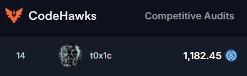

# Leaderboard
[Rank 14 / 419](https://codehawks.cyfrin.io/c/2025-02-raac/results?lt=contest&page=1&sc=reward&sj=reward&t=leaderboard) <br>



# Audited Code Repo
### [CodeHawks: RAAC](https://codehawks.cyfrin.io/c/2025-02-raac)
### [Github: RAAC](https://github.com/Cyfrin/2025-02-raac)

<br>

# <a id="summaryTable"></a>Bugs Filed & Their Status

| #      | Bug ID          | Name | URL    | Adjudged Status & Dups  |
|--------|-----------------|------|:------:|-----------------:|
| 1      | [H-01](#h-01)   | withdrawNFT() allows borrower to withdraw more than allowed collateral | [61](https://codehawks.cyfrin.io/c/2025-02-raac/s/61) | High; 122 |
| 2      | [H-02](#h-02)   | Lack of staleness check in getNFTPrice() can lead to protocol loss | [65](https://codehawks.cyfrin.io/c/2025-02-raac/s/65) | Med; 122 |
| 3      | [H-03](#h-03)   | borrow() allowed even when there isn't enough collateral | [68](https://codehawks.cyfrin.io/c/2025-02-raac/s/68) | High; 122 |
| 4      | [H-04](#h-04)   | Incorrect implementation of transfer() and transferFrom() in RToken.sol | [93](https://codehawks.cyfrin.io/c/2025-02-raac/s/93) | High; 75 |
| 5      | [H-05](#h-05)   | RToken::rescueToken() can never be called | [102](https://codehawks.cyfrin.io/c/2025-02-raac/s/102) | Low |
| 6      | [H-06](#h-06)   | DebtToken::totalSupply() returns incorrect value | [134](https://codehawks.cyfrin.io/c/2025-02-raac/s/134) | Med; 65 |
| 7      | [H-07](#h-07)   | Faulty mint() calculation inside DebtToken.sol | [149](https://codehawks.cyfrin.io/c/2025-02-raac/s/149) | High; 105 |
| 8      | [H-08](#h-08)   | DebtToken::updateUsageIndex() can never be called | [169](https://codehawks.cyfrin.io/c/2025-02-raac/s/169) | Rejected |
| 9      | [H-09](#h-09)   | RToken::updateLiquidityIndex() can never be called | [181](https://codehawks.cyfrin.io/c/2025-02-raac/s/181) | Med; 33 |
| 10     | [H-10](#h-10)   | finalizeLiquidation() never checks if debt is still unhealthy | [186](https://codehawks.cyfrin.io/c/2025-02-raac/s/186) | Med; 63 |
| 11     | [H-11](#h-11)   | Once initiateLiquidation() has been called, borrower can't closeLiquidation() post a partial repayment | [187](https://codehawks.cyfrin.io/c/2025-02-raac/s/187) | Med; 63 |
| 12     | [H-12](#h-12)   | Attacker can drain all RaacRewards from StabilityPool | [214](https://codehawks.cyfrin.io/c/2025-02-raac/s/214) | High; 24 |
| 13     | [H-13](#h-13)   | liquidateBorrower() reverts with InsufficientBalance() even when it has sufficient crvUSDBalance | [220](https://codehawks.cyfrin.io/c/2025-02-raac/s/220) | High; 85 |
| 14     | [H-14](#h-14)   | liquidateBorrower() fetches data without a call to updateState() first and hence can revert | [221](https://codehawks.cyfrin.io/c/2025-02-raac/s/221) | Med; 36 |
| 15     | [H-15](#h-15)   | finalizeLiquidation() will revert as it tries to pull crvUSD from StabililtyPool | [224](https://codehawks.cyfrin.io/c/2025-02-raac/s/224) | High; 24 |
| 16     | [H-16](#h-16)   | Incorrect burn tax collection on each RAACToken burn() | [264](https://codehawks.cyfrin.io/c/2025-02-raac/s/264) | Rejected |
| 17     | [H-17](#h-17)   | Missing equality check in calculateNewEmissionRate() can cause incorrect emissionRate | [311](https://codehawks.cyfrin.io/c/2025-02-raac/s/311) | Med; 2 |
| 18     | [H-18](#h-18)   | Incorrect RAAC reward calculation due to faulty getUtilizationRate() implementation | [353](https://codehawks.cyfrin.io/c/2025-02-raac/s/353) | Med; 63 |
| 19     | [H-19](#h-19)   | Previous lockState is overwritten and tokens lost permanently when user calls lock() again | [398](https://codehawks.cyfrin.io/c/2025-02-raac/s/398) | High; 72 |
| 20     | [H-20](#h-20)   | Attacker can gain more than expected voting power by calling increase() | [408](https://codehawks.cyfrin.io/c/2025-02-raac/s/408) | High; 48 |
| 21     | [H-21](#h-21)   | emergencyWithdraw() waits for 6 days instead of 3 | [438](https://codehawks.cyfrin.io/c/2025-02-raac/s/438) | Low |
| 22     | [H-22](#h-22)   | Governance checkpoint vulnerability in emergency withdrawals | [439](https://codehawks.cyfrin.io/c/2025-02-raac/s/439) | Low |
| 23     | [H-23](#h-23)   | Anyone can vote on someone else's behalf and steal their voting power | [441](https://codehawks.cyfrin.io/c/2025-02-raac/s/441) | Low |
| 24     | [H-24](#h-24)   | recordVote() uses current voting power instead of past snapshot | [442](https://codehawks.cyfrin.io/c/2025-02-raac/s/442) | Rejected |
| 25     | [H-25](#h-25)   | castVote() uses current voting power instead of past snapshot | [450](https://codehawks.cyfrin.io/c/2025-02-raac/s/450) | High; 29 |
| 26     | [H-26](#h-26)   | Governance quorum() can be manipulated to impact proposal result | [472](https://codehawks.cyfrin.io/c/2025-02-raac/s/472) | Med; 27 |
| 27     | [H-27](#h-27)   | Off-by-one error in state() leads to incorrect proposal outcome | [493](https://codehawks.cyfrin.io/c/2025-02-raac/s/493) | Rejected |
| 28     | [H-28](#h-28)   | Attacker can bypass mandatory timelock delay for queued proposal and DoS other proposal due to non-unique id generation in state() | [556](https://codehawks.cyfrin.io/c/2025-02-raac/s/556) | Med; 17 |
| 29     | [H-29](#h-29)   | TimelockController's executeEmergencyAction() bypasses EMERGENCY_DELAY | [600](https://codehawks.cyfrin.io/c/2025-02-raac/s/600) | Low |
| 30     | [H-30](#h-30)   | updateUserBoost() sets workingSupply to diminished value, effecting all boost rewards | [623](https://codehawks.cyfrin.io/c/2025-02-raac/s/623) | Med; 45 |
| 31     | [H-31](#h-31)   | Faulty delegateBoost() and removeBoostDelegation() mechanics leads to diminished rewards | [658](https://codehawks.cyfrin.io/c/2025-02-raac/s/658) | Med; 31 |
| 32     | [H-32](#h-32)   | Incorrect veRAACToken getTotalVotingPower() used throughout the protocol across multiple contracts | [726](https://codehawks.cyfrin.io/c/2025-02-raac/s/726) | High; 13 |
| 33     | [H-33](#h-33)   | Incorrect accounting in claimRewards() of FeeCollector contract blocks user from claiming reward | [813](https://codehawks.cyfrin.io/c/2025-02-raac/s/813) | High; 100 |
| 34     | [H-34](#h-34)   | Time-weighted reward not actually functional in FeeCollector.sol | [823](https://codehawks.cyfrin.io/c/2025-02-raac/s/823) | High; 61 |
| 35     | [H-35](#h-35)   | GaugeController vote() multiplies current voting power to weight while subtracting instead of using the power used at vote time | [1162](https://codehawks.cyfrin.io/c/2025-02-raac/s/1162) | High; 38 |
| 36     | [H-36](#h-36)   | Incorrect gauge share & reward calculated inside GaugeController | [1220](https://codehawks.cyfrin.io/c/2025-02-raac/s/1220) | High; 9 |
| 37     | [H-37](#h-37)   | calculateRWAEmission() and calculateRAACEmission() in GaugeController are not marked virtual so distributeRewards() can not be correctly customized by inheriting contracts | [1244](https://codehawks.cyfrin.io/c/2025-02-raac/s/1244) | Low |
| 38     | [H-38](#h-38)   | Incorrect periodFinish() leads to faulty rewards calculation | [1323](https://codehawks.cyfrin.io/c/2025-02-raac/s/1323) | Med; 17 |
| 39     | [H-39](#h-39)   | updatePeriod() inside BaseGauge.sol can never be called since GaugeController makes no call to it | [1336](https://codehawks.cyfrin.io/c/2025-02-raac/s/1336) | High; 16 |
| 40     | [H-40](#h-40)   | setEmission() inside BaseGauge.sol can never be called since GaugeController makes no call to it | [1338](https://codehawks.cyfrin.io/c/2025-02-raac/s/1338) | Low |
| 41     | [H-41](#h-41)   | setInitialWeight() inside BaseGauge.sol can never be called since GaugeController makes no call to it | [1339](https://codehawks.cyfrin.io/c/2025-02-raac/s/1339) | Low |
| 42     | [H-42](#h-42)   | setBoostParameters() inside BaseGauge.sol can never be called since GaugeController makes no call to it | [1340](https://codehawks.cyfrin.io/c/2025-02-raac/s/1340) | Low |
| 43     | [H-43](#h-43)   | Gaps between periods will result in faulty reward calculations | [1419](https://codehawks.cyfrin.io/c/2025-02-raac/s/1419) | Med; 15 |
| 44     | [H-44](#h-44)   | Creation and update of period inside updateWeights() is faulty | [1426](https://codehawks.cyfrin.io/c/2025-02-raac/s/1426) | Rejected |
| 45     | [H-45](#h-45)   | None of the gauge functions call updateWeights() leading to incorrect updates and rewards | [1427](https://codehawks.cyfrin.io/c/2025-02-raac/s/1427) | Med; 4 |
| 46     | [H-46](#h-46)   | LendingPool withdraw(), borrow(), deposit() will revert if Curve Vault has any fees configured | [1454](https://codehawks.cyfrin.io/c/2025-02-raac/s/1454) | Low |
| 47     | [M-01](#m-01)   | Incorrect calculation in calculateDustAmount() leads to inability to transfer accrued dust | [107](https://codehawks.cyfrin.io/c/2025-02-raac/s/107) | Med; 59 |
| 48     | [M-02](#m-02)   | Small loans against low-priced NFT collateral can never be liquidated | [184](https://codehawks.cyfrin.io/c/2025-02-raac/s/184) | Rejected |
| 49     | [M-03](#m-03)   | Incorrect scalingFactor formula inside calculateRcrvUDSAmount() | [207](https://codehawks.cyfrin.io/c/2025-02-raac/s/207) | Rejected |
| 50     | [M-04](#m-04)   | Missing 'batch minting' functionality in RAACNFT.sol | [261](https://codehawks.cyfrin.io/c/2025-02-raac/s/261) | Rejected |
| 51     | [M-05](#m-05)   | Entire amount is not burned in RAACToken.sol if feeCollector is address(0) and burn() is called | [263](https://codehawks.cyfrin.io/c/2025-02-raac/s/263) | Med; 33 |
| 52     | [M-06](#m-06)   | mintRewards() in RAACMinter.sol can never be called | [300](https://codehawks.cyfrin.io/c/2025-02-raac/s/300) | Low |
| 53     | [M-07](#m-07)   | getBoostMultiplier() always returns MAX_BOOST instead of actual figure | [661](https://codehawks.cyfrin.io/c/2025-02-raac/s/661) | Med; 41 |
| 54     | [M-08](#m-08)   | setBoostParameters() allows maxBoost to be set higher than MAX_BOOST | [664](https://codehawks.cyfrin.io/c/2025-02-raac/s/664) | Rejected |
| 55     | [M-09](#m-09)   | emergencyRevoke() does not deduct unreleasedAmount from categoryUsed mapping | [698](https://codehawks.cyfrin.io/c/2025-02-raac/s/698) | Med; 22 |
| 56     | [M-10](#m-10)   | emergencyRevoke() in RAACReleaseOrchestrator ignores GRACE_PERIOD implementation | [702](https://codehawks.cyfrin.io/c/2025-02-raac/s/702) | Rejected |
| 57     | [M-11](#m-11)   | Protocol mechanics incorrectly assume 1 crvUSD will always be worth 1 USD | [884](https://codehawks.cyfrin.io/c/2025-02-raac/s/884) | Med; 7 |
| 58     | [M-12](#m-12)   | 12-second block time assumed by protocol not true for all EVM-compatible chains | [890](https://codehawks.cyfrin.io/c/2025-02-raac/s/890) | Rejected |
| 59     | [M-13](#m-13)   | Bank Run Vulnerability in RAAC Protocol | [896](https://codehawks.cyfrin.io/c/2025-02-raac/s/896) | Med; 3 |
| 60     | [M-14](#m-14)   | Unfair interest accrual during protocol pause even when repay is blocked | [988](https://codehawks.cyfrin.io/c/2025-02-raac/s/988) | Med; 9 |
| 61     | [M-15](#m-15)   | Token address missing in allocations mapping of Treasury.sol | [1005](https://codehawks.cyfrin.io/c/2025-02-raac/s/1005) | Med; 31 |
| 62     | [M-16](#m-16)   | distributionCap not respected in BaseGauge.sol | [1103](https://codehawks.cyfrin.io/c/2025-02-raac/s/1103) | Low |
| 63     | [M-17](#m-17)   | periodState.distributed overestimates amount and may exhaust limit sooner than intended | [1105](https://codehawks.cyfrin.io/c/2025-02-raac/s/1105) | Med; 2 |
| 64     | [M-18](#m-18)   | Lack of slippage & deadline protection in borrow() and withdrawNFT() | [1445](https://codehawks.cyfrin.io/c/2025-02-raac/s/1445) | Rejected |
| 65     | [M-19](#m-19)   | Pending fee not cleared and overwritten by updates via updateFeeType() | [2215](https://codehawks.cyfrin.io/c/2025-02-raac/s/2215) | Med; 5 |
| 66     | [M-20](#m-20)   | Pending rewards not distributed before changing emission rate via setMinEmissionRate() | [2228](https://codehawks.cyfrin.io/c/2025-02-raac/s/2228) | Med; 7 |

<br>
<br>

## **HIGH-SEVERITY BUGS**
---

### <a id="h-01"></a>[H-01]
## **withdrawNFT() allows borrower to withdraw more than allowed collateral**
#### https://github.com/Cyfrin/2025-02-raac/blob/main/contracts/core/pools/LendingPool/LendingPool.sol#L302
<br>

## Description
[withdrawNFT()](https://github.com/Cyfrin/2025-02-raac/blob/main/contracts/core/pools/LendingPool/LendingPool.sol#L302) allows borrower to withdraw more than allowed collateral and should rather be (See `Mitigation` section for a better fix):
```diff
  File: contracts/core/pools/LendingPool/LendingPool.sol

   288:              function withdrawNFT(uint256 tokenId) external nonReentrant whenNotPaused {
   289:                  if (isUnderLiquidation[msg.sender]) revert CannotWithdrawUnderLiquidation();
   290:          
   291:                  UserData storage user = userData[msg.sender];
   292:                  if (!user.depositedNFTs[tokenId]) revert NFTNotDeposited();
   293:          
   294:                  // update state
   295:                  ReserveLibrary.updateReserveState(reserve, rateData);
   296:          
   297:                  // Check if withdrawal would leave user undercollateralized
   298:                  uint256 userDebt = user.scaledDebtBalance.rayMul(reserve.usageIndex);
   299:                  uint256 collateralValue = getUserCollateralValue(msg.sender);
   300:                  uint256 nftValue = getNFTPrice(tokenId);
   301:          
-  302:                  if (collateralValue - nftValue < userDebt.percentMul(liquidationThreshold)) {
+  302:                  if ((collateralValue - nftValue).percentMul(liquidationThreshold) < userDebt) {
   303:                      revert WithdrawalWouldLeaveUserUnderCollateralized();
   304:                  }
   305:          
   306:                  // Remove NFT from user's deposited NFTs
   307:                  for (uint256 i = 0; i < user.nftTokenIds.length; i++) {
   308:                      if (user.nftTokenIds[i] == tokenId) {
   309:                          user.nftTokenIds[i] = user.nftTokenIds[user.nftTokenIds.length - 1];
   310:                          user.nftTokenIds.pop();
   311:                          break;
   312:                      }
   313:                  }
   314:                  user.depositedNFTs[tokenId] = false;
   315:          
   316:                  raacNFT.safeTransferFrom(address(this), msg.sender, tokenId);
   317:          
   318:                  emit NFTWithdrawn(msg.sender, tokenId);
   319:              }
```

Attack Path:
- Deposit NFT1 worth 100
- Deposit NFT2 worth 100
- Thus total collateral = 200
- Borrow an amount of 124
- Withdraw NFT1. Total collateral now = 100.
- Protocol thinks due to faulty logic that `200 - 100 < 124 * 80%` or `100 < 99` is `false` so things are okay and does not revert.
- Attacker now has `100 + 124 = 224`. Their profit is `24`.

## Impact
User can leave the protocol underwater and extract profit.

## Proof of Concept
Modify this [existing test](https://github.com/Cyfrin/2025-02-raac/blob/main/test/unit/core/pools/LendingPool/LendingPool.test.js#L255) and run to see it pass, even though it should have failed with error `WithdrawalWouldLeaveUserUnderCollateralized`:
```diff
    it("should allow user to borrow crvUSD using NFT collateral", async function () {
+       const tokenId2 = 2;
+       const amountToPay2 = ethers.parseEther("100");
+       await raacHousePrices.setOracle(owner.address);
+       await raacHousePrices.setHousePrice(tokenId2, amountToPay2);
+       await token.mint(user1.address, amountToPay2);
+       await token.connect(user1).approve(raacNFT.target, amountToPay2);
+       await raacNFT.connect(user1).mint(tokenId2, amountToPay2);
+
+       await raacNFT.connect(user1).approve(lendingPool.target, tokenId2);
+       await lendingPool.connect(user1).depositNFT(tokenId2);
+        
-       const borrowAmount = ethers.parseEther("50");
+       const borrowAmount = ethers.parseEther("124");

        await lendingPool.connect(user1).borrow(borrowAmount);
    
        const crvUSDBalance = await crvusd.balanceOf(user1.address);
-       expect(crvUSDBalance).to.equal(ethers.parseEther("1050"));
+       expect(crvUSDBalance).to.equal(ethers.parseEther("1124"));
    
        const debtBalance = await debtToken.balanceOf(user1.address);

        expect(debtBalance).to.gte(borrowAmount);
+
+       console.log("liquidationThreshold in bips =", await lendingPool.liquidationThreshold(), "\n");
+       console.log("debtBalance           =", debtBalance);
+       console.log("collateralValue befor =", await lendingPool.getUserCollateralValue(user1.address));
+       await lendingPool.connect(user1).withdrawNFT(1); // @audit-issue : should have reverted, but does not!
+       console.log("collateralValue after =", await lendingPool.getUserCollateralValue(user1.address));
    });
```
<br>

Output:
```js
  LendingPool
    Borrow and Repay
liquidationThreshold in bips = 8000n 

debtBalance           = 124000000000000000000n      <----- 1️⃣
collateralValue befor = 200000000000000000000n
collateralValue after = 100000000000000000000n   ❌ <----- has become greater than 1️⃣
      ✔ should allow user to borrow crvUSD using NFT collateral (115ms)


  1 passing (5s)
```

## Mitigation
While the fix outlined in the `Description` section works, a better fix would be to also account for the health factor:
```diff
  File: contracts/core/pools/LendingPool/LendingPool.sol

   288:              function withdrawNFT(uint256 tokenId) external nonReentrant whenNotPaused {
   289:                  if (isUnderLiquidation[msg.sender]) revert CannotWithdrawUnderLiquidation();
   290:          
   291:                  UserData storage user = userData[msg.sender];
   292:                  if (!user.depositedNFTs[tokenId]) revert NFTNotDeposited();
   293:          
   294:                  // update state
   295:                  ReserveLibrary.updateReserveState(reserve, rateData);
   296:          
   297:                  // Check if withdrawal would leave user undercollateralized
   298:                  uint256 userDebt = user.scaledDebtBalance.rayMul(reserve.usageIndex);
   299:                  uint256 collateralValue = getUserCollateralValue(msg.sender);
   300:                  uint256 nftValue = getNFTPrice(tokenId);
   301:          
-  302:                  if (collateralValue - nftValue < userDebt.percentMul(liquidationThreshold)) {
+  302:                  if (userDebt > 0 && (collateralValue - nftValue).percentMul(liquidationThreshold) * 1e18 / userDebt < healthFactorLiquidationThreshold) {
   303:                      revert WithdrawalWouldLeaveUserUnderCollateralized();
   304:                  }
   305:          
   306:                  // Remove NFT from user's deposited NFTs
   307:                  for (uint256 i = 0; i < user.nftTokenIds.length; i++) {
   308:                      if (user.nftTokenIds[i] == tokenId) {
   309:                          user.nftTokenIds[i] = user.nftTokenIds[user.nftTokenIds.length - 1];
   310:                          user.nftTokenIds.pop();
   311:                          break;
   312:                      }
   313:                  }
   314:                  user.depositedNFTs[tokenId] = false;
   315:          
   316:                  raacNFT.safeTransferFrom(address(this), msg.sender, tokenId);
   317:          
   318:                  emit NFTWithdrawn(msg.sender, tokenId);
   319:              }
```

[Back to Top](#summaryTable)
---

### <a id="h-02"></a>[H-02]
## **Lack of staleness check in getNFTPrice() can lead to protocol loss**
#### https://github.com/Cyfrin/2025-02-raac/blob/main/contracts/core/pools/LendingPool/LendingPool.sol#L589-L595
<br>

## Summary
[getNFTPrice()](https://github.com/Cyfrin/2025-02-raac/blob/main/contracts/core/pools/LendingPool/LendingPool.sol#L589-L595) does not check for price staleness even though it claims so:
```js
  File: contracts/core/pools/LendingPool/LendingPool.sol

   584:              /**
   585:               * @notice Gets the current price of an NFT from the oracle
   586:               * @param tokenId The token ID of the NFT
   587:               * @return The price of the NFT
   588:               *
   589:@--->          * Checks if the price is stale
   590:               */
   591:              function getNFTPrice(uint256 tokenId) public view returns (uint256) {
   592:@--->             (uint256 price, uint256 lastUpdateTimestamp) = priceOracle.getLatestPrice(tokenId);
   593:                  if (price == 0) revert InvalidNFTPrice();
   594:                  return price;
   595:              }
```

The flow of fetching price is:
1. Chainlink Oracle -> RAACHousePriceOracle
2. RAACHousePriceOracle -> RAACHousePrices
3. RAACHousePrices -> LendingPool::getNFTPrice()

## Description & Impact
Since `getNFTPrice()` is internally called by critical functions `withdrawNFT()` and `getUserCollateralValue()` (which is internally called by `borrow()` etc.) an outdated price can result in the user borrowing more than allowed, thus profiting and putting the protocol underwater.

Attack Path:
- Monitor old price: 100 ETH --> Wait for market drop --> Real value now 60 ETH (suppose that price drop happened over 24 hours)
- Buy NFT for 60 ETH from the open market
- Deposit NFT in LendingPool
- Borrow 80 ETH against NFT, since price reported by `getNFTPrice()` is still 100 ETH
- Default on loan
- Keep 20 ETH profit

## Mitigation 
Add a check which verifies the age. Something along these lines:
```diff
    function getNFTPrice(uint256 tokenId) public view returns (uint256) {
        (uint256 price, uint256 lastUpdateTimestamp) = priceOracle.getLatestPrice(tokenId);
        if (price == 0) revert InvalidNFTPrice();
+       uint256 MAX_PRICE_AGE = 24 hours;  // Or other appropriate duration which could be based on the type of NFT and derived from a mapping
+       if (block.timestamp - lastUpdateTimestamp > MAX_PRICE_AGE) {
+           revert StalePrice();
+       }
        return price;
    }
```

[Back to Top](#summaryTable)


### <a id="h-03"></a>[H-03]
## **borrow() allowed even when there isn't enough collateral**
#### https://github.com/Cyfrin/2025-02-raac/blob/main/contracts/core/pools/LendingPool/LendingPool.sol#L343-L346
<br>

## Description
[borrow()](https://github.com/Cyfrin/2025-02-raac/blob/main/contracts/core/pools/LendingPool/LendingPool.sol#L343-L346) allows borrower to have a debt greater than their collateral allows due to incorrect calculation. It should be something like (See `Mitigation` section for a better fix):
```diff
  File: contracts/core/pools/LendingPool/LendingPool.sol

   325:              function borrow(uint256 amount) external nonReentrant whenNotPaused onlyValidAmount(amount) {
   326:                  if (isUnderLiquidation[msg.sender]) revert CannotBorrowUnderLiquidation();
   327:          
   328:                  UserData storage user = userData[msg.sender];
   329:          
   330:                  uint256 collateralValue = getUserCollateralValue(msg.sender);
   331:          
   332:                  if (collateralValue == 0) revert NoCollateral();
   333:          
   334:                  // Update reserve state before borrowing
   335:                  ReserveLibrary.updateReserveState(reserve, rateData);
   336:          
   337:                  // Ensure sufficient liquidity is available
   338:                  _ensureLiquidity(amount);
   339:          
   340:                  // Fetch user's total debt after borrowing
   341:                  uint256 userTotalDebt = user.scaledDebtBalance.rayMul(reserve.usageIndex) + amount;
   342:          
   343:                  // Ensure the user has enough collateral to cover the new debt
-  344:                  if (collateralValue < userTotalDebt.percentMul(liquidationThreshold)) {
+  344:                  if (collateralValue.percentMul(liquidationThreshold) < userTotalDebt) {
   345:                      revert NotEnoughCollateralToBorrow();
   346:                  }
   347:          
```

Attack Path:
- Deposit NFT worth 100
- Borrow an amount of 120
- Protocol thinks due to faulty logic that `100 < 120 * 80%` or `100 < 96` is `false` so things are okay and does not revert.
- Attacker now has profit of `20` even after defaulting on the loan.

## Impact
User can leave the protocol underwater and extract profit.

## Proof of Concept
Modify this [existing test](https://github.com/Cyfrin/2025-02-raac/blob/main/test/unit/core/pools/LendingPool/LendingPool.test.js#L255) and run to see it pass, even though it should have failed with error `NotEnoughCollateralToBorrow`:
```diff
    it("should allow user to borrow crvUSD using NFT collateral", async function () {
-       const borrowAmount = ethers.parseEther("50");
+       const borrowAmount = ethers.parseEther("120");

        await lendingPool.connect(user1).borrow(borrowAmount);
    
        const crvUSDBalance = await crvusd.balanceOf(user1.address);
-       expect(crvUSDBalance).to.equal(ethers.parseEther("1050"));
+       expect(crvUSDBalance).to.equal(ethers.parseEther("1120"));
    
        const debtBalance = await debtToken.balanceOf(user1.address);

        expect(debtBalance).to.gte(borrowAmount);
+
+       console.log("liquidationThreshold in bips =", await lendingPool.liquidationThreshold(), "\n");
+       console.log("debtBalance           =", debtBalance);
+       console.log("collateralValue       =", await lendingPool.getUserCollateralValue(user1.address));
    });
```
<br>

Output:
```js
  LendingPool
    Borrow and Repay
liquidationThreshold in bips = 8000n 

debtBalance           = 120000000000000000000n
collateralValue       = 100000000000000000000n
      ✔ should allow user to borrow crvUSD using NFT collateral


  1 passing (8s)
```

## Mitigation
While the fix shown in the `Description` section works, the protocol should really take into account the health factor while checking borrow eligibility and hence make the following change:
```diff
  File: contracts/core/pools/LendingPool/LendingPool.sol

   325:              function borrow(uint256 amount) external nonReentrant whenNotPaused onlyValidAmount(amount) {
   326:                  if (isUnderLiquidation[msg.sender]) revert CannotBorrowUnderLiquidation();
   327:          
   328:                  UserData storage user = userData[msg.sender];
   329:          
   330:                  uint256 collateralValue = getUserCollateralValue(msg.sender);
   331:          
   332:                  if (collateralValue == 0) revert NoCollateral();
   333:          
   334:                  // Update reserve state before borrowing
   335:                  ReserveLibrary.updateReserveState(reserve, rateData);
   336:          
   337:                  // Ensure sufficient liquidity is available
   338:                  _ensureLiquidity(amount);
   339:          
   340:                  // Fetch user's total debt after borrowing
   341:                  uint256 userTotalDebt = user.scaledDebtBalance.rayMul(reserve.usageIndex) + amount;
   342:          
   343:                  // Ensure the user has enough collateral to cover the new debt
-  344:                  if (collateralValue < userTotalDebt.percentMul(liquidationThreshold)) {
+  344:                  if (calculateHealthFactor(msg.sender) < healthFactorLiquidationThreshold) {
   345:                      revert NotEnoughCollateralToBorrow();
   346:                  }
   347:          
```

[Back to Top](#summaryTable)
---

### <a id="h-04"></a>[H-04]
## **Incorrect implementation of transfer() and transferFrom() in RToken.sol**
#### https://github.com/Cyfrin/2025-02-raac/blob/main/contracts/core/tokens/RToken.sol#L213
<br>

## Summary
The `amount` param which is in underlying asset units (i.e. crvUSD) gets scaled down **twice** when a user calls [transfer() or transferFrom()](https://github.com/Cyfrin/2025-02-raac/blob/main/contracts/core/tokens/RToken.sol#L213) --> once inside `transfer()/transferFrom()` and again inside the overriden [_update()](https://github.com/Cyfrin/2025-02-raac/blob/main/contracts/core/tokens/RToken.sol#L309):
```js
  File: contracts/core/tokens/RToken.sol

   207:              /**
   208:               * @dev Overrides the ERC20 transfer function to use scaled amounts
   209:               * @param recipient The recipient address
   210:               * @param amount The amount to transfer (in underlying asset units)
   211:               */
   212:              function transfer(address recipient, uint256 amount) public override(ERC20, IERC20) returns (bool) {
   213:@--->             uint256 scaledAmount = amount.rayDiv(ILendingPool(_reservePool).getNormalizedIncome());
   214:                  return super.transfer(recipient, scaledAmount);
   215:              }
   216:          
   217:              /**
   218:               * @dev Overrides the ERC20 transferFrom function to use scaled amounts
   219:               * @param sender The sender address
   220:               * @param recipient The recipient address
   221:               * @param amount The amount to transfer (in underlying asset units)
   222:               */
   223:              function transferFrom(address sender, address recipient, uint256 amount) public override(ERC20, IERC20) returns (bool) {
   224:@--->             uint256 scaledAmount = amount.rayDiv(_liquidityIndex);
   225:                  return super.transferFrom(sender, recipient, scaledAmount);
   226:              }
```

and

```js
  File: contracts/core/tokens/RToken.sol

   301:              /**
   302:               * @dev Internal function to handle token transfers, mints, and burns
   303:               * @param from The sender address
   304:               * @param to The recipient address
   305:               * @param amount The amount of tokens
   306:               */
   307:              function _update(address from, address to, uint256 amount) internal override {
   308:                  // Scale amount by normalized income for all operations (mint, burn, transfer)
   309:@--->             uint256 scaledAmount = amount.rayDiv(ILendingPool(_reservePool).getNormalizedIncome());
   310:                  super._update(from, to, scaledAmount);
   311:              }
```

## Description & Impact
### 1. Impact on both transfer functions : Reduced tokens transferred
- If liquidity index is `1.025`, then a transfer of `amount = 200` would result in only a transfer of `200 / (1.025 * 1.025)` which is `190.362 in scaledBalance terms` or `195.121 in balance terms`. This should have been `195.121 in scaledBalance terms` or `200 in balance terms`.

### 2. Impact on transferFrom() : Funds can be stolen
- If `transferFrom()` is used, then there are additional concerns:
    - First, Alice gives Bob an allowance of 200 as she wants to transfer [these many underlying asset units](https://github.com/Cyfrin/2025-02-raac/blob/main/contracts/core/tokens/RToken.sol#L210) to Charlie
    - Bob calls `transferFrom(sender = alice, recipient = bob, amount = 200)`
    - `transferFrom()` calculates `scaledAmount  = 200 / 1.025 = 195.121` and internally calls `super.transferFrom(sender = alice, recipient = bob, amount = 195.121)`
    - This calls ERC20.sol's `transferFrom()` which is:
    ```js
        function transferFrom(address from, address to, uint256 value) public virtual returns (bool) {
            address spender = _msgSender();
    @--->   _spendAllowance(from, spender, value);
            _transfer(from, to, value);
            return true;
        }
    ```
    - Bob's allowance is decreased by `195.121` via the internal call to `_spendAllowance()` leaving him with an unspent allowance of `200 - 195.121 = 4.9 approx`
    - Additionally, the actual transfer is handled by the overridden `_update()` which scales this down again and transfers `195.121 / 1.025 = 190.362` tokens.

Bob can now use his leftover `4.9` allowance to steal & transfer these tokens to an address owned by him.

- **It's important to note that even if a fix is made** inside `RToken::transferFrom()` and a call is made without scaling like so: `return super.transferFrom(sender, recipient, amount);`, the allowance reduction inside `_spendAllowance()` will reduce it by `200` but only transfer `195.121`. Thus Bob won't be able to steal any tokens but can't retry a transfer now because his allowance is exhausted. Alice will have to provide additional allowance by calculating `underlyingAmountToBeTransferred * liquidityIndex`.

## Proof of Concept
Add this inside `test/unit/core/pools/LendingPool/LendingPool.test.js` and run to see it pass with the following output:
```js
  it("should detect incorrect RToken transfers between users", async function () {
      // log initial values
      const rTokenInitialBalance = await rToken.balanceOf(user2.address);
      const crvUSDInitialBalance = await crvusd.balanceOf(user2.address);
      console.log("initial rToken balance =", ethers.formatEther(rTokenInitialBalance));
      console.log("initial rToken balance (scaled) =", ethers.formatEther(await rToken.scaledBalanceOf(user2.address)));
      expect(rTokenInitialBalance).to.equal(ethers.parseEther("1000"));
      console.log("old liquidity index    =", ethers.formatUnits(await lendingPool.getNormalizedIncome(), 27));
      expect(await lendingPool.getNormalizedIncome()).to.equal(ethers.parseUnits("1", 27));
      
      // Simulate index update to 1.025 (2.5% increase):
      // User1 deposits NFT and borrows to increase liquidity index
      const tokenId2 = 2;
      const amountToPay2 = ethers.parseEther("600");
      await raacHousePrices.setOracle(owner.address);
      await raacHousePrices.setHousePrice(tokenId2, amountToPay2);
      await token.mint(user1.address, amountToPay2);
      await token.connect(user1).approve(raacNFT.target, amountToPay2);
      await raacNFT.connect(user1).mint(tokenId2, amountToPay2);
      await raacNFT.connect(user1).approve(lendingPool.target, tokenId2);
      await lendingPool.connect(user1).depositNFT(tokenId2);
      const borrowAmount = ethers.parseEther("400"); 
      await lendingPool.connect(user1).borrow(borrowAmount);
      
      // skip time
      console.log("\nskipping time after borrow...\n");
      await ethers.provider.send("evm_increaseTime", [365 * 24 * 60 * 60]);
      await ethers.provider.send("evm_mine", []);
      await lendingPool.connect(user2).updateState();
      let newLiquidityIndex = await lendingPool.getNormalizedIncome();
      console.log("new liquidity index    =", ethers.formatUnits(newLiquidityIndex, 27));
      expect(newLiquidityIndex).to.be.closeTo(ethers.parseUnits("1.025", 27), ethers.parseUnits("1", 18));
      console.log("mid rToken balance     =", ethers.formatEther(await rToken.balanceOf(user2.address)));
      console.log("mid rToken balance (scaled) =", ethers.formatEther(await rToken.scaledBalanceOf(user2.address)));
      expect(await crvusd.balanceOf(user2.address)).to.equal(crvUSDInitialBalance);
      expect(await rToken.balanceOf(user2.address)).to.be.closeTo(ethers.parseEther("1025"), ethers.parseEther("1"));

      // do the transfer now
      const rTokenBalance_BeforeTransfer_User1 = await rToken.balanceOf(user1.address);
      const rTokenBalance_BeforeTransfer_User2 = await rToken.balanceOf(user2.address);
      const transferAmount = ethers.parseEther("200");
      await rToken.connect(user2).transfer(user1.address, transferAmount)
      const rTokenBalance_AfterTransfer_User1 = await rToken.balanceOf(user1.address);
      const rTokenBalance_AfterTransfer_User2 = await rToken.balanceOf(user2.address);
      const balanceIncrease = rTokenBalance_AfterTransfer_User1 - rTokenBalance_BeforeTransfer_User1;
      console.log("User1 rToken balance increased by    =", ethers.formatEther(balanceIncrease));
      console.log("User2 rToken balance decreased by    =", ethers.formatEther(rTokenBalance_BeforeTransfer_User2 - rTokenBalance_AfterTransfer_User2));
      expect(balanceIncrease).to.equal(rTokenBalance_BeforeTransfer_User2 - rTokenBalance_AfterTransfer_User2);
      
      // ❌ @audit-issue - shows how `transferAmount` got scaled down once more:
      expect(balanceIncrease).to.be.closeTo((transferAmount * BigInt(RAY)) / newLiquidityIndex, 1);
  });
```

Output:
```js
  LendingPool
initial rToken balance = 1000.0
initial rToken balance (scaled) = 1000.0
old liquidity index    = 1.0

skipping time after borrow...

new liquidity index    = 1.025
mid rToken balance     = 1025.0
mid rToken balance (scaled) = 1000.0
User1 rToken balance increased by    = 195.121951219512195122   ❌ <----- should have been 200
User2 rToken balance decreased by    = 195.121951219512195122   ❌ <----- should have been 200
    ✔ should detect incorrect RToken transfers between users (305ms)


  1 passing (11s)
```

## Mitigation 
While the simple way to mitigate this would be to remove the `scaledAmount` calculation from inside RToken's `transfer()` and `transferFrom()` and pass `amount` while calling ` super.transfer()` and `super.transferFrom()`, this won't solve the allowance issue in `transferFrom()`.
It would either require a redesign of the approach so that it's easier for the owner to understand the allowance they should be giving the spender, or block the `transferFrom()` functionality altogether.

[Back to Top](#summaryTable)
---

### <a id="h-05"></a>[H-05]
## **RToken::rescueToken() can never be called**
#### https://github.com/Cyfrin/2025-02-raac/blob/main/contracts/core/tokens/RToken.sol#L337-L341
<br>

## Description
Inside `RToken.sol`, the emergency function [rescueToken()](https://github.com/Cyfrin/2025-02-raac/blob/main/contracts/core/tokens/RToken.sol#L337-L341) has a `onlyReservePool` modifier which restricts its call to be made only by the LendingPool contract and no one else.
```js
  File: contracts/core/tokens/RToken.sol

   337:@--->         function rescueToken(address tokenAddress, address recipient, uint256 amount) external onlyReservePool {
   338:                  if (recipient == address(0)) revert InvalidAddress();
   339:                  if (tokenAddress == _assetAddress) revert CannotRescueMainAsset();
   340:                  IERC20(tokenAddress).safeTransfer(recipient, amount);
   341:              }
```

However there is no function inside `LendingPool.sol` that calls the aforementioned function. There is one there named [rescueToken()](https://github.com/Cyfrin/2025-02-raac/blob/main/contracts/core/pools/LendingPool/LendingPool.sol#L731) but that rescues funds from the LendingPool contract, not the RToken one.

## Impact
The functionality which `RToken::rescueToken()` aims to provide can never be used. Any stuck funds can never be rescued.

## Mitigation 
Add a function inside `LendingPool.sol` which looks like this:
```js
    function rescueTokenFromRTokenContract(address tokenAddress, address recipient, uint256 amount) external onlyOwner {
        require(amount > 0);
        IRToken(reserve.reserveRTokenAddress).rescueToken(tokenAddress, recipient, amount);
    }
```

[Back to Top](#summaryTable)
---

### <a id="h-06"></a>[H-06]
## **DebtToken::totalSupply() returns incorrect value**
#### https://github.com/Cyfrin/2025-02-raac/blob/main/contracts/core/tokens/DebtToken.sol#L256-L264
<br>

## Description
Inside `DebtToken.sol`, the [totalSupply()](https://github.com/Cyfrin/2025-02-raac/blob/main/contracts/core/tokens/DebtToken.sol#L232-L235) function ought to be:
```diff
  File: contracts/core/tokens/DebtToken.sol

   232:              function totalSupply() public view override(ERC20, IERC20) returns (uint256) {
   233:                  uint256 scaledSupply = super.totalSupply();
-  234:                  return scaledSupply.rayDiv(ILendingPool(_reservePool).getNormalizedDebt());
+  234:                  return scaledSupply.rayMul(ILendingPool(_reservePool).getNormalizedDebt());
   235:              }
```

This is because the overridden [_update()](https://github.com/Cyfrin/2025-02-raac/blob/main/contracts/core/tokens/DebtToken.sol#L256-L264) function stores the values in a scaled manner by using `rayDiv`. Hence we need the inverse operation `rayMul` inside `totalSupply()`:
```js
  File: contracts/core/tokens/DebtToken.sol

   256:              function _update(address from, address to, uint256 amount) internal virtual override {
   257:                  if (from != address(0) && to != address(0)) {
   258:                      revert TransfersNotAllowed(); // Only allow minting and burning
   259:                  }
   260:          
   261:@------->         uint256 scaledAmount = amount.rayDiv(ILendingPool(_reservePool).getNormalizedDebt());
   262:                  super._update(from, to, scaledAmount);
   263:                  emit Transfer(from, to, amount);
   264:              }
```

## Impact
Can lead to potential issues with any external integrations that might rely on `totalSupply()`, which is a critical function.

## Mitigation 
As mentioned in the "Description" section above.

[Back to Top](#summaryTable)
---

### <a id="h-07"></a>[H-07]
## **Faulty mint() calculation inside DebtToken.sol**
#### https://github.com/Cyfrin/2025-02-raac/blob/main/contracts/core/tokens/DebtToken.sol#L136-L168
<br>

## Description
`DebtToken.sol`'s [mint()](https://github.com/Cyfrin/2025-02-raac/blob/main/contracts/core/tokens/DebtToken.sol#L136-L168) function performs double accounting and mints more debtTokens than expected, increasing the borrow liability of the borrower. For example, consider how an ideal situation should look like:
1. Alice borrows 500 crvUSD. At this point, both `balanceOf(alice)` and `scaledBalanceOf(alice) ---> which is equivalent to super.balanceOf(alice)` are 500. 
2. Usage index is `1` right now (i.e. 1 RAY or 100%)
3. During 100 days, interest accrues & usage index increases to `1.02` i.e. a `2%` interest or `2% * 500 = 10`
4. The amount owed can be seen by `balanceOf(alice)` as `500 + 10 = 510` (correctly)
5. The `scaledBalanceOf(alice)` shows `500` (correctly)
6. If she were to settle her loan, she is expected to pay `510`
7. What if she borrows an additional `100` and immediately wants to settle the loan? It should be `510 + 100 = 610` as no interest accrued on the just borrowed `100`. So `balanceOf(alice)` should show `610` while `scaledBalanceOf(alice)` should show `500 + 100/1.02 = ~ 598`.
8. However `mint()` shows these values as approximately `620` and `608` respectively due to incorrect calculations. (Refer the `Mitigation` section of the report to see the incorrect code lines).

## Impact
Inflated amount of debtTokens are minted & wrong figures are reported throughout the protocol. Functions like `_repay()` and `finalizeLiquidation()` in `LendingPool.sol` call DebtToken.sol's `burn()` function which makes use of `balanceOf()` which would now return a higher debt figure and can cause sooner than expected liquidations.
In reality, most borrow related accounting is broken due to this.

## Proof of Concept
Add this inside `LendingPool.test.js` and run to see the following output:
```js
  it("demonstrates DebtToken mint bug", async function () {
      // User1 deposits NFT and borrows to increase usage index
      const tokenId2 = 2;
      const amountToPay2 = ethers.parseEther("1000");
      await raacHousePrices.setOracle(owner.address);
      await raacHousePrices.setHousePrice(tokenId2, amountToPay2);
      await token.mint(user1.address, amountToPay2);
      await token.connect(user1).approve(raacNFT.target, amountToPay2);
      await raacNFT.connect(user1).mint(tokenId2, amountToPay2);
      await raacNFT.connect(user1).approve(lendingPool.target, tokenId2);
      await lendingPool.connect(user1).depositNFT(tokenId2);
      const borrowAmount = ethers.parseEther("500"); 
      await lendingPool.connect(user1).borrow(borrowAmount);
      
      // Log initial state
      const usageIndex1 = await lendingPool.getNormalizedDebt();
      console.log("\nAfter first borrow:");
      console.log("Debt balance         =", ethers.formatEther(await debtToken.balanceOf(user1.address)));
      console.log("Scaled debt balance  =", ethers.formatEther(await debtToken.scaledBalanceOf(user1.address)));
      console.log("Usage index_1        =", ethers.formatUnits(usageIndex1, 27));
      expect(usageIndex1).to.be.closeTo(RAY, ethers.parseUnits("1", 18));
      
      // Skip time to accrue interest
      console.log("\nSkipping time to accrue interest...\n");
      await ethers.provider.send("evm_increaseTime", [101 * 24 * 60 * 60]);
      await ethers.provider.send("evm_mine", []);
      await lendingPool.connect(user1).updateState();
      
      // Log state after interest accrual
      const usageIndex2 = await lendingPool.getNormalizedDebt();
      const intermediateDebt = await debtToken.balanceOf(user1.address);
      console.log("After interest accrual:");
      console.log("Debt balance         =", ethers.formatEther(intermediateDebt));
      console.log("Scaled debt balance  =", ethers.formatEther(await debtToken.scaledBalanceOf(user1.address)));
      console.log("Usage index_2        =", ethers.formatUnits(usageIndex2, 27));
      expect(usageIndex2).to.be.closeTo(ethers.parseUnits("1.02", 27), ethers.parseUnits("0.0001", 27));
      
      // Second borrow - this is where the bug manifests
      const secondBorrowAmount = ethers.parseEther("100");
      await lendingPool.connect(user1).borrow(secondBorrowAmount);
      
      // Log final state
      const usageIndex3 = await lendingPool.getNormalizedDebt();
      const finalDebt = await debtToken.balanceOf(user1.address);
      console.log("\nAfter second borrow:");
      console.log("Debt balance         =", ethers.formatEther(finalDebt)); 
      console.log("Scaled debt balance  =", ethers.formatEther(await debtToken.scaledBalanceOf(user1.address)));
      console.log("Usage index_3        =", ethers.formatUnits(usageIndex3, 27));
      expect(usageIndex3).to.be.closeTo(usageIndex2, ethers.parseUnits("0.00000001", 27));

      // With the bug, the final debt will be higher than it should be
      const expectedDebt = intermediateDebt + secondBorrowAmount; // ~ 510 + 100 = 610
      // This will fail with the bug, showing debt is higher than expected
      expect(finalDebt).to.be.closeTo(expectedDebt, ethers.parseEther("0.1"));
  });
```

Output:
```js
  LendingPool

After first borrow:
Debt balance         = 500.0
Scaled debt balance  = 500.0
Usage index_1        = 1.0

Skipping time to accrue interest...

After interest accrual:
Debt balance         = 510.043899431944528669  ✔️
Scaled debt balance  = 500.0  ✔️
Usage index_2        = 1.020087798863889057338012908  ✔️ <--- ~ 2%

After second borrow:
Debt balance         = 620.289558695487088589  ❌ <--- should have been approximately 510 + 100 = 610
Scaled debt balance  = 608.074676891859095817  ❌ <--- should have been approximately 500 + 100/1.02 = 598
Usage index_3        = 1.020087798863889057338012908  ✔️ <--- remains the same
    1) demonstrates DebtToken mint bug


  0 passing (8s)
  1 failing

  1) LendingPool
       demonstrates DebtToken mint bug:
     AssertionError: expected 620289558695487088589 to be close to 610043899431944528669 +/- 100000000000000000
```

Note that if you `console.log` the [`user.scaledDebtBalance` value in LendingPool::borrow() after L358](https://github.com/Cyfrin/2025-02-raac/blob/main/contracts/core/pools/LendingPool/LendingPool.sol#L358), it shows the figure in line with our expectations, which is approximately `598`. Sadly that internal accounting isn't used as the source of truth everywhere and hence we find broken functionality at multiple places.

## Mitigation
Make the following changes: 
```diff
  File: contracts/core/tokens/DebtToken.sol

   136:              function mint(
   137:                  address user,
   138:                  address onBehalfOf,
   139:                  uint256 amount,
   140:                  uint256 index
   141:              )  external override onlyReservePool returns (bool, uint256, uint256) {
   142:                  if (user == address(0) || onBehalfOf == address(0)) revert InvalidAddress();
   143:                  if (amount == 0) {
   144:                      return (false, 0, totalSupply());
   145:                  }
   146:          
   147:                  uint256 amountScaled = amount.rayDiv(index);
   148:                  if (amountScaled == 0) revert InvalidAmount();
   149:          
-  150:                  uint256 scaledBalance = balanceOf(onBehalfOf);
+  150:                  uint256 scaledBalance = super.balanceOf(onBehalfOf);
   151:                  bool isFirstMint = scaledBalance == 0;
   152:          
-  153:                  uint256 balanceIncrease = 0;
-  154:                  if (_userState[onBehalfOf].index != 0 && _userState[onBehalfOf].index < index) {
-  155:                      balanceIncrease = scaledBalance.rayMul(index) - scaledBalance.rayMul(_userState[onBehalfOf].index);
-  156:                  }
   157:          
   158:                  _userState[onBehalfOf].index = index.toUint128();
   159:          
-  160:                  uint256 amountToMint = amount + balanceIncrease;
+  160:                  uint256 amountToMint = amount;
   161:          
   162:                  _mint(onBehalfOf, amountToMint.toUint128());
   163:          
   164:                  emit Transfer(address(0), onBehalfOf, amountToMint);
-  165:                  emit Mint(user, onBehalfOf, amountToMint, balanceIncrease, index);
+  165:                  emit Mint(user, onBehalfOf, amountToMint, 0, index);
   166:          
   167:                  return (scaledBalance == 0, amountToMint, totalSupply());
   168:              }
```

[Back to Top](#summaryTable)
---

### <a id="h-08"></a>[H-08]
## **DebtToken::updateUsageIndex() can never be called**
#### https://github.com/Cyfrin/2025-02-raac/blob/main/contracts/core/tokens/DebtToken.sol#L119
<br>

## Description
Inside `DebtToken.sol`, the admin function [updateUsageIndex()](https://github.com/Cyfrin/2025-02-raac/blob/main/contracts/core/tokens/DebtToken.sol#L119) has a `onlyReservePool` modifier which restricts its call to be made only by the LendingPool contract and no one else.
```js
  File: contracts/core/tokens/DebtToken.sol

   115:              /**
   116:               * @notice Updates the usage index
   117:               * @param newUsageIndex The new usage index
   118:               */
   119:@--->         function updateUsageIndex(uint256 newUsageIndex) external override onlyReservePool {
   120:                  if (newUsageIndex < _usageIndex) revert InvalidAmount();
   121:                  _usageIndex = newUsageIndex;
   122:                  emit UsageIndexUpdated(newUsageIndex);
   123:              }
```

However there is no function inside `LendingPool.sol` that calls the aforementioned function. 
## Impact
The functionality which `DebtToken::updateUsageIndex()` aims to provide can never be used. Admin would not be able to update the usage index.

## Mitigation 
Add a function inside `LendingPool.sol` which looks like:
```js
    function updateUsageIndex(uint256 newUsageIndex) external onlyOwner {
        IDebtToken(reserve.reserveDebtTokenAddress).updateUsageIndex(newUsageIndex);
    }
```

[Back to Top](#summaryTable)
---

### <a id="h-09"></a>[H-09]
## **RToken::updateLiquidityIndex() can never be called**
#### https://github.com/Cyfrin/2025-02-raac/blob/main/contracts/core/tokens/RToken.sol#L96
<br>

## Description
Inside `RToken.sol`, the admin function [updateLiquidityIndex()](https://github.com/Cyfrin/2025-02-raac/blob/main/contracts/core/tokens/RToken.sol#L96) has a `onlyReservePool` modifier which restricts its call to be made only by the LendingPool contract and no one else.
```js
  File: contracts/core/tokens/RToken.sol

    92:              /**
    93:               * @notice Updates the liquidity index
    94:               * @param newLiquidityIndex The new liquidity index
    95:               */
    96:@--->         function updateLiquidityIndex(uint256 newLiquidityIndex) external override onlyReservePool {
    97:                  if (newLiquidityIndex < _liquidityIndex) revert InvalidAmount();
    98:                  _liquidityIndex = newLiquidityIndex;
    99:                  emit LiquidityIndexUpdated(newLiquidityIndex);
   100:              }
```

However there is no function inside `LendingPool.sol` that calls the aforementioned function. 

## Impact
The functionality which `RToken::updateLiquidityIndex()` aims to provide can never be used. Admin can't update the liquidity index.

## Mitigation 
Add a function inside `LendingPool.sol` which looks like:
```js
    function updateLiquidityIndex(uint256 newLiquidityIndex) external onlyOwner {
        IRToken(reserve.reserveRTokenAddress).updateLiquidityIndex(newLiquidityIndex);
    }
```

[Back to Top](#summaryTable)
---

### <a id="h-10"></a>[H-10]
## **finalizeLiquidation() never checks if debt is still unhealthy**
#### https://github.com/Cyfrin/2025-02-raac/blob/main/contracts/core/pools/LendingPool/LendingPool.sol#L496
<br>

## Description
[finalizeLiquidation()](https://github.com/Cyfrin/2025-02-raac/blob/main/contracts/core/pools/LendingPool/LendingPool.sol#L496) never checks if the debt has become healthy again just before liquidation. The borrower may not have been able to repay their debt and call `closeLiquidation()` but the NFT collateral's price could well have appreciated just before the call to `finalizeLiquidation()` and made the debt healthy again.

## Impact
User's healthy loan is liquidated.

## Mitigation 
Add the following check:
```diff
    function finalizeLiquidation(address userAddress) external nonReentrant onlyStabilityPool {
        if (!isUnderLiquidation[userAddress]) revert NotUnderLiquidation();

        // update state
        ReserveLibrary.updateReserveState(reserve, rateData);

        if (block.timestamp <= liquidationStartTime[userAddress] + liquidationGracePeriod) {
            revert GracePeriodNotExpired();
        }

        UserData storage user = userData[userAddress];

        uint256 userDebt = user.scaledDebtBalance.rayMul(reserve.usageIndex);
        
        isUnderLiquidation[userAddress] = false;
        liquidationStartTime[userAddress] = 0;
+     if (calculateHealthFactor(userAddress) < healthFactorLiquidationThreshold) {
         // Transfer NFTs to Stability Pool
        for (uint256 i = 0; i < user.nftTokenIds.length; i++) {
            uint256 tokenId = user.nftTokenIds[i];
            user.depositedNFTs[tokenId] = false;
            raacNFT.transferFrom(address(this), stabilityPool, tokenId);
        }
        delete user.nftTokenIds;

        // Burn DebtTokens from the user
        (uint256 amountScaled, uint256 newTotalSupply, uint256 amountBurned, uint256 balanceIncrease) = IDebtToken(reserve.reserveDebtTokenAddress).burn(userAddress, userDebt, reserve.usageIndex);

        // Transfer reserve assets from Stability Pool to cover the debt
        IERC20(reserve.reserveAssetAddress).safeTransferFrom(msg.sender, reserve.reserveRTokenAddress, amountScaled);

        // Update user's scaled debt balance
        user.scaledDebtBalance -= amountBurned;
        reserve.totalUsage = newTotalSupply;

        // Update liquidity and interest rates
        ReserveLibrary.updateInterestRatesAndLiquidity(reserve, rateData, amountScaled, 0);


        emit LiquidationFinalized(stabilityPool, userAddress, userDebt, getUserCollateralValue(userAddress));
+     }
    }
```

[Back to Top](#summaryTable)
---

### <a id="h-11"></a>[H-11]
## **Once initiateLiquidation() has been called, borrower can't closeLiquidation() post a partial repayment**
#### https://github.com/Cyfrin/2025-02-raac/blob/main/contracts/core/pools/LendingPool/LendingPool.sol#L468
<br>

## Description & Impact
The only check inside [closeLiquidation()](https://github.com/Cyfrin/2025-02-raac/blob/main/contracts/core/pools/LendingPool/LendingPool.sol#L484) is that the remaining `userDebt` is less than `DUST_THRESHOLD of 1e6`. So if the borrower makes a partial repayment which makes his debt healthy again, he still can't call `closeLiquidation()` and may be liquidated after the grace period:
```js
  File: contracts/core/pools/LendingPool/LendingPool.sol

   465:              /**
   466:               * @notice Allows a user to repay their debt and close the liquidation within the grace period
   467:               */
   468:              function closeLiquidation() external nonReentrant whenNotPaused {
   469:                  address userAddress = msg.sender;
   470:          
   471:                  if (!isUnderLiquidation[userAddress]) revert NotUnderLiquidation();
   472:          
   473:                  // update state
   474:                  ReserveLibrary.updateReserveState(reserve, rateData);
   475:          
   476:                  if (block.timestamp > liquidationStartTime[userAddress] + liquidationGracePeriod) {
   477:                      revert GracePeriodExpired();
   478:                  }
   479:          
   480:                  UserData storage user = userData[userAddress];
   481:          
   482:                  uint256 userDebt = user.scaledDebtBalance.rayMul(reserve.usageIndex);
   483:          
   484:@--->             if (userDebt > DUST_THRESHOLD) revert DebtNotZero();
   485:          
   486:                  isUnderLiquidation[userAddress] = false;
   487:                  liquidationStartTime[userAddress] = 0;
   488:          
   489:                  emit LiquidationClosed(userAddress);
   490:              }
```

Imagine:
1. Borrowed value = 90.
2. NFT collateral value when `initiateLiquidation()` is called by the liquidator on this debt = 100.
3. Borrower repays 50. Outstanding debt = 40 which is healthy.
4. Borrower can't call `closeLiquidation()` since it reverts on L484.
5. StabilityPool calls `finalizeLiquidation()` after grace period and liquidates the borrower.

## Mitigation 
Add a check inside `closeLiquidation()` that the current debt state can be allowed if healthy:
```diff
  File: contracts/core/pools/LendingPool/LendingPool.sol

   465:              /**
   466:               * @notice Allows a user to repay their debt and close the liquidation within the grace period
   467:               */
   468:              function closeLiquidation() external nonReentrant whenNotPaused {
   469:                  address userAddress = msg.sender;
   470:          
   471:                  if (!isUnderLiquidation[userAddress]) revert NotUnderLiquidation();
   472:          
   473:                  // update state
   474:                  ReserveLibrary.updateReserveState(reserve, rateData);
   475:          
   476:                  if (block.timestamp > liquidationStartTime[userAddress] + liquidationGracePeriod) {
   477:                      revert GracePeriodExpired();
   478:                  }
   479:          
   480:                  UserData storage user = userData[userAddress];
   481:          
   482:                  uint256 userDebt = user.scaledDebtBalance.rayMul(reserve.usageIndex);
   483:          
-  484:                  if (userDebt > DUST_THRESHOLD) revert DebtNotZero();
+  484:                  if (userDebt > DUST_THRESHOLD && calculateHealthFactor(userAddress) < healthFactorLiquidationThreshold) revert UnhealthyDebtExists();
   485:                  
   486:                  isUnderLiquidation[userAddress] = false;
   487:                  liquidationStartTime[userAddress] = 0;
   488:          
   489:                  emit LiquidationClosed(userAddress);
   490:              }
```

[Back to Top](#summaryTable)
---

### <a id="h-12"></a>[H-12]
## **Attacker can drain all RaacRewards from StabilityPool**
#### https://github.com/Cyfrin/2025-02-raac/blob/main/contracts/core/pools/StabilityPool/StabilityPool.sol#L224-L259

## Description
Even when a user calls `withdraw(deCRVUSDAmount)` with a paramater `deCRVUSDAmount = 1`, their **entire RAAC reward** is [transferred to them](https://github.com/Cyfrin/2025-02-raac/blob/main/contracts/core/pools/StabilityPool/StabilityPool.sol#L224-L259). This is because `calculateRaacRewards()` calculates the rewards on the user's entire deposit. 
Hence attacker can make the call multiple times and drain all the rewards, effectively stealing the reward of others.
```js
  File: contracts/core/pools/StabilityPool/StabilityPool.sol

   224:              function withdraw(uint256 deCRVUSDAmount) external nonReentrant whenNotPaused validAmount(deCRVUSDAmount) {
   225:                  _update();
   226:                  if (deToken.balanceOf(msg.sender) < deCRVUSDAmount) revert InsufficientBalance();
   227:          
   228:                  uint256 rcrvUSDAmount = calculateRcrvUSDAmount(deCRVUSDAmount);
   229:@--->             uint256 raacRewards = calculateRaacRewards(msg.sender);
   230:                  if (userDeposits[msg.sender] < rcrvUSDAmount) revert InsufficientBalance();
   231:                  userDeposits[msg.sender] -= rcrvUSDAmount;
   232:          
   233:                  if (userDeposits[msg.sender] == 0) {
   234:                      delete userDeposits[msg.sender];
   235:                  }
   236:          
   237:                  deToken.burn(msg.sender, deCRVUSDAmount);
   238:                  rToken.safeTransfer(msg.sender, rcrvUSDAmount);
   239:                  if (raacRewards > 0) {
   240:@--->                 raacToken.safeTransfer(msg.sender, raacRewards);
   241:                  }
   242:          
   243:                  emit Withdraw(msg.sender, rcrvUSDAmount, deCRVUSDAmount, raacRewards);
   244:              }
   245:          
   246:              /**
   247:               * @notice Calculates the pending RAAC rewards for a user.
   248:               * @param user Address of the user.
   249:               * @return Amount of RAAC rewards.
   250:               */
   251:              function calculateRaacRewards(address user) public view returns (uint256) {
   252:@--->             uint256 userDeposit = userDeposits[user];
   253:                  uint256 totalDeposits = deToken.totalSupply();
   254:          
   255:                  uint256 totalRewards = raacToken.balanceOf(address(this));
   256:                  if (totalDeposits < 1e6) return 0;
   257:          
   258:@--->             return (totalRewards * userDeposit) / totalDeposits;
   259:              }
```

Attack Path:
- Alice the honest user has deposited 100 rTokens and received 100 deCRVUSDAmount
- Bob the attacker has deposited 100 rTokens too and received 100 deCRVUSDAmount
- The `raacToken.balanceOf(address(this))` is currently 300
- Bob calls withdraw(1) and receives 1 rToken back. However he also receives his entire rewards of `(300 * 100) / 200 = 150`
- Bob again calls withdraw(1) and receives 1 rToken back. He again receives rewards of `(150 * 99) / 199 = ~ 75`
- Bob repeats the process again and again until `raacToken.balanceOf(address(this)) < 1e6` and `calculateRaacRewards()` returns zero
- Alice has no reward left to claim now, while Bob has profited at her expense.

## Impact
Entire RAAC rewards can be drained.

## Mitigation 
```diff
  File: contracts/core/pools/StabilityPool/StabilityPool.sol

   224:              function withdraw(uint256 deCRVUSDAmount) external nonReentrant whenNotPaused validAmount(deCRVUSDAmount) {
   225:                  _update();
   226:                  if (deToken.balanceOf(msg.sender) < deCRVUSDAmount) revert InsufficientBalance();
   227:          
   228:                  uint256 rcrvUSDAmount = calculateRcrvUSDAmount(deCRVUSDAmount);
-  229:                  uint256 raacRewards = calculateRaacRewards(msg.sender);
+  229:                  uint256 raacRewards = calculateRaacRewards(rcrvUSDAmount);
   230:                  if (userDeposits[msg.sender] < rcrvUSDAmount) revert InsufficientBalance();
   231:                  userDeposits[msg.sender] -= rcrvUSDAmount;
   232:          
   233:                  if (userDeposits[msg.sender] == 0) {
   234:                      delete userDeposits[msg.sender];
   235:                  }
   236:          
   237:                  deToken.burn(msg.sender, deCRVUSDAmount);
   238:                  rToken.safeTransfer(msg.sender, rcrvUSDAmount);
   239:                  if (raacRewards > 0) {
   240:                      raacToken.safeTransfer(msg.sender, raacRewards);
   241:                  }
   242:          
   243:                  emit Withdraw(msg.sender, rcrvUSDAmount, deCRVUSDAmount, raacRewards);
   244:              }
   245:          
   246:              /**
   247:               * @notice Calculates the pending RAAC rewards for a user.
   248:               * @param user Address of the user.
   249:               * @return Amount of RAAC rewards.
   250:               */
-  251:              function calculateRaacRewards(address user) public view returns (uint256) {
-  252:                  uint256 userDeposit = userDeposits[user];
+  251:              function calculateRaacRewards(uint256 forAmount) public view returns (uint256) {
+  252:                  uint256 userDeposit = forAmount;
   253:                  uint256 totalDeposits = deToken.totalSupply();
   254:          
   255:                  uint256 totalRewards = raacToken.balanceOf(address(this));
   256:                  if (totalDeposits < 1e6) return 0;
   257:          
   258:                  return (totalRewards * userDeposit) / totalDeposits;
   259:              }
```

Also, we should change this:
```diff
  File: contracts/core/pools/StabilityPool/StabilityPool.sol

   261:              /**
   262:               * @notice Gets the pending RAAC rewards for a user.
   263:               * @param user Address of the user.
   264:               * @return Amount of pending RAAC rewards.
   265:               */
   266:              function getPendingRewards(address user) external view returns (uint256) {
-  267:                  return calculateRaacRewards(user);
+  267:                  return calculateRaacRewards(userDeposits[user]);
   268:              }
```

[Back to Top](#summaryTable)
---

### <a id="h-13"></a>[H-13]
## **liquidateBorrower() reverts with InsufficientBalance() even when it has sufficient crvUSDBalance**
#### https://github.com/Cyfrin/2025-02-raac/blob/main/contracts/core/pools/StabilityPool/StabilityPool.sol#L449-L470
<br>

## Description
[liquidateBorrower()](https://github.com/Cyfrin/2025-02-raac/blob/main/contracts/core/pools/StabilityPool/StabilityPool.sol#L449-L470) multiplies `userDebt` with `lendingPool.getNormalizedDebt()` to get `scaledUserDebt` even though `userDebt` is already a scaled-up version:
```js
  File: contracts/core/pools/StabilityPool/StabilityPool.sol

   449:              function liquidateBorrower(address userAddress) external onlyManagerOrOwner nonReentrant whenNotPaused {
   450:                  _update();
   451:                  // Get the user's debt from the LendingPool.
   452:                  uint256 userDebt = lendingPool.getUserDebt(userAddress);
   453:@--->             uint256 scaledUserDebt = WadRayMath.rayMul(userDebt, lendingPool.getNormalizedDebt());
   454:          
   455:                  if (userDebt == 0) revert InvalidAmount();
   456:          
   457:                  uint256 crvUSDBalance = crvUSDToken.balanceOf(address(this));
   458:@--->             if (crvUSDBalance < scaledUserDebt) revert InsufficientBalance();
   459:          
   460:                  // Approve the LendingPool to transfer the debt amount
   461:                  bool approveSuccess = crvUSDToken.approve(address(lendingPool), scaledUserDebt);
   462:                  if (!approveSuccess) revert ApprovalFailed();
   463:                  // Update lending pool state before liquidation
   464:                  lendingPool.updateState();
   465:          
   466:                  // Call finalizeLiquidation on LendingPool
   467:                  lendingPool.finalizeLiquidation(userAddress);
   468:          
   469:                  emit BorrowerLiquidated(userAddress, scaledUserDebt);
   470:              }
```

and 

```js
  File: contracts/core/pools/LendingPool/LendingPool.sol

   579:              function getUserDebt(address userAddress) public view returns (uint256) {
   580:                  UserData storage user = userData[userAddress];
   581:@--->             return user.scaledDebtBalance.rayMul(reserve.usageIndex);
   582:              }
```

## Impact
As a result, on L458 even if there's `crvUSDBalance` to handle `userDebt`, it may revert because it's less than the incorrectly inflated figure of `scaledUserDebt`. 

## Mitigation 
```diff
  File: contracts/core/pools/StabilityPool/StabilityPool.sol

   449:              function liquidateBorrower(address userAddress) external onlyManagerOrOwner nonReentrant whenNotPaused {
   450:                  _update();
   451:                  // Get the user's debt from the LendingPool.
   452:                  uint256 userDebt = lendingPool.getUserDebt(userAddress);
-  453:                  uint256 scaledUserDebt = WadRayMath.rayMul(userDebt, lendingPool.getNormalizedDebt());
   454:          
   455:                  if (userDebt == 0) revert InvalidAmount();
   456:          
   457:                  uint256 crvUSDBalance = crvUSDToken.balanceOf(address(this));
-  458:                  if (crvUSDBalance < scaledUserDebt) revert InsufficientBalance();
+  458:                  if (crvUSDBalance < userDebt) revert InsufficientBalance();
   459:          
   460:                  // Approve the LendingPool to transfer the debt amount
-  461:                  bool approveSuccess = crvUSDToken.approve(address(lendingPool), scaledUserDebt);
+  461:                  bool approveSuccess = crvUSDToken.approve(address(lendingPool), userDebt);
   462:                  if (!approveSuccess) revert ApprovalFailed();
   463:                  // Update lending pool state before liquidation
   464:                  lendingPool.updateState();
   465:          
   466:                  // Call finalizeLiquidation on LendingPool
   467:                  lendingPool.finalizeLiquidation(userAddress);
   468:          
-  469:                  emit BorrowerLiquidated(userAddress, scaledUserDebt);
+  469:                  emit BorrowerLiquidated(userAddress, userDebt);
   470:              }
```

[Back to Top](#summaryTable)
---

### <a id="h-14"></a>[H-14]
## **liquidateBorrower() fetches data without a call to updateState() first and hence can revert**
#### https://github.com/Cyfrin/2025-02-raac/blob/main/contracts/core/pools/StabilityPool/StabilityPool.sol#L449-L470
<br>

## Description
[liquidateBorrower()](https://github.com/Cyfrin/2025-02-raac/blob/main/contracts/core/pools/StabilityPool/StabilityPool.sol#L449-L470) calls `lendingPool.getUserDebt(userAddress)` without first calling `lendingPool.updateState()` and hence works on a figure based on an outdated `usageIndex`. The call is made only later on in the function:
```js
  File: contracts/core/pools/StabilityPool/StabilityPool.sol

   449:              function liquidateBorrower(address userAddress) external onlyManagerOrOwner nonReentrant whenNotPaused {
   450:                  _update();
   451:                  // Get the user's debt from the LendingPool.
   452:@--->             uint256 userDebt = lendingPool.getUserDebt(userAddress);
   453:                  uint256 scaledUserDebt = WadRayMath.rayMul(userDebt, lendingPool.getNormalizedDebt());
   454:          
   455:                  if (userDebt == 0) revert InvalidAmount();
   456:          
   457:                  uint256 crvUSDBalance = crvUSDToken.balanceOf(address(this));
   458:                  if (crvUSDBalance < scaledUserDebt) revert InsufficientBalance();
   459:          
   460:                  // Approve the LendingPool to transfer the debt amount
   461:@--->             bool approveSuccess = crvUSDToken.approve(address(lendingPool), scaledUserDebt);
   462:                  if (!approveSuccess) revert ApprovalFailed();
   463:                  // Update lending pool state before liquidation
   464:@--->             lendingPool.updateState();
   465:          
   466:                  // Call finalizeLiquidation on LendingPool
   467:                  lendingPool.finalizeLiquidation(userAddress);
   468:          
   469:                  emit BorrowerLiquidated(userAddress, scaledUserDebt);
   470:              }
```

## Impact
The debt could well have increased since the last state update. As a result, on L461 allowance approval could be granted for an outdated lower debt value. When `updateState()` gets called on L464, the usageIndex is incremented to the actual value and hence call to `finalizeLiquidation()` on L467 fails due to insufficient approval [here](https://github.com/Cyfrin/2025-02-raac/blob/main/contracts/core/pools/LendingPool/LendingPool.sol#L524-L525):
```js
  File: contracts/core/pools/LendingPool/LendingPool.sol

   496:              function finalizeLiquidation(address userAddress) external nonReentrant onlyStabilityPool {
   497:                  if (!isUnderLiquidation[userAddress]) revert NotUnderLiquidation();
   498:          
   499:                  // update state
   500:                  ReserveLibrary.updateReserveState(reserve, rateData);
   501:          
   502:                  if (block.timestamp <= liquidationStartTime[userAddress] + liquidationGracePeriod) {
   503:                      revert GracePeriodNotExpired();
   504:                  }
   505:          
   506:                  UserData storage user = userData[userAddress];
   507:          
   508:                  uint256 userDebt = user.scaledDebtBalance.rayMul(reserve.usageIndex);
   509:          
   510:                  
   511:                  isUnderLiquidation[userAddress] = false;
   512:                  liquidationStartTime[userAddress] = 0;
   513:                   // Transfer NFTs to Stability Pool
   514:                  for (uint256 i = 0; i < user.nftTokenIds.length; i++) {
   515:                      uint256 tokenId = user.nftTokenIds[i];
   516:                      user.depositedNFTs[tokenId] = false;
   517:                      raacNFT.transferFrom(address(this), stabilityPool, tokenId);
   518:                  }
   519:                  delete user.nftTokenIds;
   520:          
   521:                  // Burn DebtTokens from the user
   522:                  (uint256 amountScaled, uint256 newTotalSupply, uint256 amountBurned, uint256 balanceIncrease) = IDebtToken(reserve.reserveDebtTokenAddress).burn(userAddress, userDebt, reserve.usageIndex);
   523:          
   524:                  // Transfer reserve assets from Stability Pool to cover the debt
   525:@--->             IERC20(reserve.reserveAssetAddress).safeTransferFrom(msg.sender, reserve.reserveRTokenAddress, amountScaled);
   526:          
   527:                  // Update user's scaled debt balance
   528:                  user.scaledDebtBalance -= amountBurned;
   529:                  reserve.totalUsage = newTotalSupply;
   530:          
   531:                  // Update liquidity and interest rates
   532:                  ReserveLibrary.updateInterestRatesAndLiquidity(reserve, rateData, amountScaled, 0);
   533:          
   534:          
   535:                  emit LiquidationFinalized(stabilityPool, userAddress, userDebt, getUserCollateralValue(userAddress));
   536:              }
```

## Mitigation 
```diff
  File: contracts/core/pools/StabilityPool/StabilityPool.sol

   449:              function liquidateBorrower(address userAddress) external onlyManagerOrOwner nonReentrant whenNotPaused {
   450:                  _update();
   451:                  // Get the user's debt from the LendingPool.
+  451:                  lendingPool.updateState();
   452:                  uint256 userDebt = lendingPool.getUserDebt(userAddress);
   453:                  uint256 scaledUserDebt = WadRayMath.rayMul(userDebt, lendingPool.getNormalizedDebt());
   454:          
   455:                  if (userDebt == 0) revert InvalidAmount();
   456:          
   457:                  uint256 crvUSDBalance = crvUSDToken.balanceOf(address(this));
   458:                  if (crvUSDBalance < scaledUserDebt) revert InsufficientBalance();
   459:          
   460:                  // Approve the LendingPool to transfer the debt amount
   461:                  bool approveSuccess = crvUSDToken.approve(address(lendingPool), scaledUserDebt);
   462:                  if (!approveSuccess) revert ApprovalFailed();
   463:                  // Update lending pool state before liquidation
-  464:                  lendingPool.updateState();
   465:          
   466:                  // Call finalizeLiquidation on LendingPool
   467:                  lendingPool.finalizeLiquidation(userAddress);
   468:          
   469:                  emit BorrowerLiquidated(userAddress, scaledUserDebt);
   470:              }
```

[Back to Top](#summaryTable)
---

### <a id="h-15"></a>[H-15]
## **finalizeLiquidation() will revert as it tries to pull crvUSD from StabililtyPool**
#### https://github.com/Cyfrin/2025-02-raac/blob/main/contracts/core/pools/LendingPool/LendingPool.sol#L525
<br>

## Description
[L525 inside finalizeLiquidation()](https://github.com/Cyfrin/2025-02-raac/blob/main/contracts/core/pools/LendingPool/LendingPool.sol#L525) tries to transfer crvUSD from stability pool to itself. Also, prior to this [L457-L461 inside liquidateBorrower() of StabilityPool.sol](https://github.com/Cyfrin/2025-02-raac/blob/main/contracts/core/pools/StabilityPool/StabilityPool.sol#L461) checks crvUSD balance & grants allowance to LendingPool.sol:
```js
  File: contracts/core/pools/LendingPool/LendingPool.sol

   496:              function finalizeLiquidation(address userAddress) external nonReentrant onlyStabilityPool {
   497:                  if (!isUnderLiquidation[userAddress]) revert NotUnderLiquidation();
   498:          
   499:                  // update state
   500:                  ReserveLibrary.updateReserveState(reserve, rateData);
   501:          
   502:                  if (block.timestamp <= liquidationStartTime[userAddress] + liquidationGracePeriod) {
   503:                      revert GracePeriodNotExpired();
   504:                  }
   505:          
   506:                  UserData storage user = userData[userAddress];
   507:          
   508:                  uint256 userDebt = user.scaledDebtBalance.rayMul(reserve.usageIndex);
   509:          
   510:                  
   511:                  isUnderLiquidation[userAddress] = false;
   512:                  liquidationStartTime[userAddress] = 0;
   513:                   // Transfer NFTs to Stability Pool
   514:                  for (uint256 i = 0; i < user.nftTokenIds.length; i++) {
   515:                      uint256 tokenId = user.nftTokenIds[i];
   516:                      user.depositedNFTs[tokenId] = false;
   517:                      raacNFT.transferFrom(address(this), stabilityPool, tokenId);
   518:                  }
   519:                  delete user.nftTokenIds;
   520:          
   521:                  // Burn DebtTokens from the user
   522:                  (uint256 amountScaled, uint256 newTotalSupply, uint256 amountBurned, uint256 balanceIncrease) = IDebtToken(reserve.reserveDebtTokenAddress).burn(userAddress, userDebt, reserve.usageIndex);
   523:          
   524:                  // Transfer reserve assets from Stability Pool to cover the debt
   525:@--->             IERC20(reserve.reserveAssetAddress).safeTransferFrom(msg.sender, reserve.reserveRTokenAddress, amountScaled);
   526:          
   527:                  // Update user's scaled debt balance
   528:                  user.scaledDebtBalance -= amountBurned;
   529:                  reserve.totalUsage = newTotalSupply;
   530:          
   531:                  // Update liquidity and interest rates
   532:                  ReserveLibrary.updateInterestRatesAndLiquidity(reserve, rateData, amountScaled, 0);
   533:          
   534:          
   535:                  emit LiquidationFinalized(stabilityPool, userAddress, userDebt, getUserCollateralValue(userAddress));
   536:              }
```

and 

```js
  File: contracts/core/pools/StabilityPool/StabilityPool.sol

   449:              function liquidateBorrower(address userAddress) external onlyManagerOrOwner nonReentrant whenNotPaused {
   450:                  _update();
   451:                  // Get the user's debt from the LendingPool.
   452:                  uint256 userDebt = lendingPool.getUserDebt(userAddress);
   453:                  uint256 scaledUserDebt = WadRayMath.rayMul(userDebt, lendingPool.getNormalizedDebt());
   454:          
   455:                  if (userDebt == 0) revert InvalidAmount();
   456:          
   457:@--->             uint256 crvUSDBalance = crvUSDToken.balanceOf(address(this));
   458:                  if (crvUSDBalance < scaledUserDebt) revert InsufficientBalance();
   459:          
   460:                  // Approve the LendingPool to transfer the debt amount
   461:@--->             bool approveSuccess = crvUSDToken.approve(address(lendingPool), scaledUserDebt);
   462:                  if (!approveSuccess) revert ApprovalFailed();
   463:                  // Update lending pool state before liquidation
   464:                  lendingPool.updateState();
   465:          
   466:                  // Call finalizeLiquidation on LendingPool
   467:                  lendingPool.finalizeLiquidation(userAddress);
   468:          
   469:                  emit BorrowerLiquidated(userAddress, scaledUserDebt);
   470:              }
```

However there is no flow or function which deposits crvUSD into StabilityPool.sol at any point of time. The [deposit](https://github.com/Cyfrin/2025-02-raac/blob/main/contracts/core/pools/StabilityPool/StabilityPool.sol#L171-L174) by a user is of rToken (and RAAC reward tokens also make their way into the contract).
```js
      File: contracts/core/pools/StabilityPool/StabilityPool.sol

      170:              /**
➡️➡️ 171:               * @notice Allows a user to deposit rToken and receive deToken.
      172:               * @param amount Amount of rToken to deposit.
      173:               */
      174:              function deposit(uint256 amount) external nonReentrant whenNotPaused validAmount(amount) {
      175:                  _update();
      176:                  rToken.safeTransferFrom(msg.sender, address(this), amount);
      177:                  uint256 deCRVUSDAmount = calculateDeCRVUSDAmount(amount);
      178:                  deToken.mint(msg.sender, deCRVUSDAmount);
      179:          
      180:                  userDeposits[msg.sender] += amount;
      181:                  _mintRAACRewards();
      182:          
      183:                  emit Deposit(msg.sender, amount, deCRVUSDAmount);
      184:              }
```

So the code will fail at both the aforementioned points:
  - At L458 inside `liquidateBorrower()` with reason `InsufficientBalance`
  - At L525 inside `finalizeLiquidation()`

## Impact
Can't liquidate a bad debt.

## Mitigation 
- Either pull crvUSD into the StabilityPool contract from LendingPool when rTokens are deposited
- OR add a function inside StabilityPool which can sell the collateral NFTs transferred into it to increase its crvUSD balance 
- OR change the mechanics to operate on rToken instead of crvUSD

[Back to Top](#summaryTable)
---

### <a id="h-16"></a>[H-16]
## **Incorrect burn tax collection on each RAACToken burn()**
#### https://github.com/Cyfrin/2025-02-raac/blob/main/contracts/core/tokens/RAACToken.sol#L185-L204
<br>

## Description
Inside `RAACToken.sol`, the overridden [_update()](https://github.com/Cyfrin/2025-02-raac/blob/main/contracts/core/tokens/RAACToken.sol#L185-L204) function is called after each `burn()` and `transfer()` call. While no additional calculation happens in case of `burn()` as `to == address(0)`, additional tax calculation does happen in `transfer()`:
```js
  File: contracts/core/tokens/RAACToken.sol

   185:              function _update(
   186:                  address from,
   187:                  address to,
   188:                  uint256 amount
   189:              ) internal virtual override {
   190:                  uint256 baseTax = swapTaxRate + burnTaxRate;
   191:                  // Skip tax for whitelisted addresses or when fee collector disabled
   192:                  if (baseTax == 0 || from == address(0) || to == address(0) || whitelistAddress[from] || whitelistAddress[to] || feeCollector == address(0)) {
   193:                      super._update(from, to, amount);
   194:                      return;
   195:                  }
   196:          
   197:                  // All other cases where tax is applied
   198:                  uint256 totalTax = amount.percentMul(baseTax);
   199:                  uint256 burnAmount = totalTax * burnTaxRate / baseTax;
   200:                  
   201:                  super._update(from, feeCollector, totalTax - burnAmount);
   202:@--->             super._update(from, address(0), burnAmount);
   203:                  super._update(from, to, amount - totalTax);
   204:              }
```

This causes reduced amount of fee to be collected each time. Let's consider the [burn()](https://github.com/Cyfrin/2025-02-raac/blob/main/contracts/core/tokens/RAACToken.sol#L80) call:
```js
  File: contracts/core/tokens/RAACToken.sol

    80:              function burn(uint256 amount) external {
    81:                  uint256 taxAmount = amount.percentMul(burnTaxRate);
    82:@--->             _burn(msg.sender, amount - taxAmount);
    83:                  if (taxAmount > 0 && feeCollector != address(0)) {
    84:                      _transfer(msg.sender, feeCollector, taxAmount);
    85:                  }
    86:              }
```

Imagine:
1. `amount = 1_000_000` and `burnTaxRate = 0.5%`
2. Thus `taxAmount = 0.5% * 1_000_000 = 5_000`
3. L82 burns `1_000_000 - 5_000 = 995_000`
4. L84 calls ERC20's `_transfer(msg.sender, feeCollector, 5000)` which internally calls `_update()` and control goes to L185, our overridden `_update()` implementation
5. `amount` here is `5000`. Also, `baseTax = swapTaxRate + burnTaxRate = 1% + 0.5% = 1.5%`
6. On L198 `totalTax = 1.5% of 5000 = 75`
7. On L199 `burnAmount = 75 * 0.5% / 1.5% = 25`
8. On L201 `feeCollector` gets `totalTax - burnAmount = 75 - 25 = 50`
9. On L202 `address(0)` gets `burnAmount = 25` i.e. it is burned!
10. On L203 `feeCollector` (same as `to`) gets `amount - totalTax = 5000 - 75 = 4925`

As we can see the `burnTaxRate` was erroneously applied on the initial `1_000_000` twice. Instead of burning  `995_000` RAAC tokens and passing on the rest as fees, the code burns `995_000 + 25 = 995_025` tokens. And the `feeCollector` collects a reduced figure of `4975` as tax instead of `5000`.

Note that to fix this, we **can NOT change** L202 to:
```diff
-   202:             super._update(from, address(0), burnAmount);
+   202:             super._update(from, feeCollector, burnAmount);
```
because changing this will mess up the normal `transfer()` calls and the current mechanics is supposed to burn the `burnAmount` (calculated based on `burnTaxRate`) by sending it to `address(0)`.

## Impact
As a result of this:
- The actual circulating supply will be lower than intended
- This amplifies the deflationary effect intended by the protocol's tokenomics
- The `feeCollector` receives less fee each time.  

Note that `burn()` is often called by the protocol. Inside `FeeCollector.sol`, the execution flow is [distributeCollectedFees() --> _processDistributions()](https://github.com/Cyfrin/2025-02-raac/blob/main/contracts/core/collectors/FeeCollector.sol#L187) and `_processDistributions()` [has](https://github.com/Cyfrin/2025-02-raac/blob/main/contracts/core/collectors/FeeCollector.sol#L421):
```js
  L421: if (shares[1] > 0) raacToken.burn(shares[1]);
```

## Proof of Concept
Add this as a file named `RAACburn.test.js` under `test/unit/core/pools/LendingPool/` and run with `npx hardhat test test/unit/core/pools/LendingPool/RAACburn.test.js`:
```js
import { expect } from "chai";
import hre from "hardhat";
const { ethers } = hre;

describe("RAACToken", function () {
    let raacToken;
    let owner;
    let user1;
    let feeCollector;

    beforeEach(async function () {
        [owner, user1, feeCollector] = await ethers.getSigners();

        const RAACToken = await ethers.getContractFactory("RAACToken");
        // Constructor params: initialOwner, initialSwapTaxRate (100 = 1%), initialBurnTaxRate (50 = 0.5%)
        raacToken = await RAACToken.deploy(owner.address, 100, 50);
        
        // Set fee collector
        await raacToken.setFeeCollector(feeCollector.address);
        
        // Mint some tokens to user1 for testing
        await raacToken.setMinter(owner.address);
        await raacToken.mint(user1.address, ethers.parseEther("1000000")); // 1M tokens
    });

    describe("Burn Tax Calculation", function () {
        it("should demonstrate double burn tax application issue", async function () {
            const initialBalance = await raacToken.balanceOf(user1.address);
            const initialFeeCollectorBalance = await raacToken.balanceOf(feeCollector.address);
            const initialTotalSupply = await raacToken.totalSupply();

            console.log("\nInitial state:");
            console.log("Initial Total Supply:", ethers.formatEther(initialTotalSupply));
            console.log("Initial User Balance:", ethers.formatEther(initialBalance));
            console.log("Initial Fee Collector Balance:", ethers.formatEther(initialFeeCollectorBalance));

            // Amount to burn: 1,000,000 tokens
            const burnAmount = ethers.parseEther("1000000");
            
            await raacToken.connect(user1).burn(burnAmount);

            const finalBalance = await raacToken.balanceOf(user1.address);
            const finalFeeCollectorBalance = await raacToken.balanceOf(feeCollector.address);
            const finalTotalSupply = await raacToken.totalSupply();
            const totalBurned = initialTotalSupply - finalTotalSupply;

            console.log("\nFinal state:");
            console.log("Final Total Supply:", ethers.formatEther(finalTotalSupply));
            console.log("Final User Balance:", ethers.formatEther(finalBalance));
            console.log("Final Fee Collector Balance:", ethers.formatEther(finalFeeCollectorBalance));
            console.log("Total Burned:", ethers.formatEther(totalBurned));

            // User's balance should be 0
            expect(finalBalance).to.equal(0);

            // Total burned would be 995,000 + 25 = 995,025
            const expectedBurn = ethers.parseEther("995025");
            expect(totalBurned).to.equal(expectedBurn);

            // Fee collector would get 5,000 - 25 = 4,975 tokens
            const expectedFeeCollectorBalance = ethers.parseEther("4975");
            expect(finalFeeCollectorBalance).to.equal(expectedFeeCollectorBalance);

        });
    });
});
```

Output:
```js
  RAACToken
    Burn Tax Calculation

Initial state:
Initial Total Supply: 1000000.0
Initial User Balance: 1000000.0
Initial Fee Collector Balance: 0.0

Final state:
Final Total Supply: 4975.0
Final User Balance: 0.0
Final Fee Collector Balance: 4975.0
Total Burned: 995025.0
      ✔ should demonstrate double burn tax application issue (46ms)


  1 passing (6s)
```

## Mitigation 
One way would be to temporarily whitelist the `feeCollector` address inside `burn()` so that the custom calculation inside `_update()` is entirely skipped:
```diff
    function burn(uint256 amount) external {
        uint256 taxAmount = amount.percentMul(burnTaxRate);
        _burn(msg.sender, amount - taxAmount);
        if (taxAmount > 0 && feeCollector != address(0)) {
+           bool isAlreadyWhitelisted = whitelistAddress[feeCollector];
+           if (!isAlreadyWhitelisted)
+               whitelistAddress[feeCollector] = true;
            _transfer(msg.sender, feeCollector, taxAmount);
+           // go back to initial whitelisted state
+           if (!isAlreadyWhitelisted)
+               whitelistAddress[feeCollector] = false;
        }
    }
```

[Back to Top](#summaryTable)
---

### <a id="h-17"></a>[H-17]
## **Missing equality check in calculateNewEmissionRate() can cause incorrect emissionRate**
#### https://github.com/Cyfrin/2025-02-raac/blob/main/contracts/core/minters/RAACMinter/RAACMinter.sol#L220-L235
<br>

## Description
Inside [calculateNewEmissionRate()](https://github.com/Cyfrin/2025-02-raac/blob/main/contracts/core/minters/RAACMinter/RAACMinter.sol#L220-L235) there is no explicit check in either of `if` branches for `utilizationRate == utilizationTarget`. This leads to incorrect `emissionRate` under certain conditions:
```js
  File: contracts/core/minters/RAACMinter/RAACMinter.sol

   220:              function calculateNewEmissionRate() internal view returns (uint256) {
   221:                  uint256 utilizationRate = getUtilizationRate();
   222:                  uint256 adjustment = (emissionRate * adjustmentFactor) / 100;
   223:          
   224:@--->             if (utilizationRate > utilizationTarget) {
   225:                      uint256 increasedRate = emissionRate + adjustment;
   226:                      uint256 maxRate = increasedRate > benchmarkRate ? increasedRate : benchmarkRate;
   227:                      return maxRate < maxEmissionRate ? maxRate : maxEmissionRate;
   228:@--->             } else if (utilizationRate < utilizationTarget) {
   229:                      uint256 decreasedRate = emissionRate > adjustment ? emissionRate - adjustment : 0;
   230:                      uint256 minRate = decreasedRate < benchmarkRate ? decreasedRate : benchmarkRate;
   231:                      return minRate > minEmissionRate ? minRate : minEmissionRate;
   232:                  }
   233:          
   234:                  return emissionRate;
   235:              }
```

Imagine:
- `utilizationTarget = 70%` and `emissionRate = 1000`. Also, `adjustmentFactor = 5%`.
- `utilizationRate` goes above `70%`.
- `increasedRate = 1000 + 5% of 1000 = 1050`. This is the value returned from the function and stored in the global variable `emissionRate` inside `updateEmissionRate()`.
- After some time, `utilizationRate` equals `70%`.
- The function returns the same old `emissionRate = 1050`.  <---- 1️⃣
- After some time, `utilizationRate` goes below `70%`.
- `decreasedRate = 1050 - 5% of 1050 = ~ 998`. This is returned and stored as `emissionRate`.
- After some time, `utilizationRate` equals `70%`.
- The function returns the same old `emissionRate = 998`.  <---- 2️⃣

Even after hitting the `utilizationTarget`, there is no change made in either cases. The equality condition has to be included in either `if` branch or the `else` branch.

## Impact
Incorrect `emissionRate` leads to incorrect rewards being distributed.

## Mitigation 
Include the equality condition in either `if` branch or the `else` branch, for e.g.:
```diff
-        if (utilizationRate > utilizationTarget) {
+        if (utilizationRate >= utilizationTarget) {
```

[Back to Top](#summaryTable)
---

### <a id="h-18"></a>[H-18]
## **Incorrect RAAC reward calculation due to faulty getUtilizationRate() implementation**
#### https://github.com/Cyfrin/2025-02-raac/blob/main/contracts/core/minters/RAACMinter/RAACMinter.sol#L242-L243
<br>

## Description
The execution flow is `tick() --> updateEmissionRate() --> calculateNewEmissionRate() --> getUtilizationRate()` to calculate RAAC rewards. [getUtilizationRate()](https://github.com/Cyfrin/2025-02-raac/blob/main/contracts/core/minters/RAACMinter/RAACMinter.sol#L242-L243) calculates `totalBorrowed` and `totalDeposits` incorrectly:
```js
  File: contracts/core/minters/RAACMinter/RAACMinter.sol

   237:              /**
   238:               * @dev Calculates the current system utilization rate
   239:               * @return The utilization rate as a percentage (0-100)
   240:               */
   241:              function getUtilizationRate() internal view returns (uint256) {
   242:@--->             uint256 totalBorrowed = lendingPool.getNormalizedDebt();
   243:@--->             uint256 totalDeposits = stabilityPool.getTotalDeposits();
   244:                  if (totalDeposits == 0) return 0;
   245:                  return (totalBorrowed * 100) / totalDeposits;
   246:              }
```

On L242 `lendingPool.getNormalizedDebt()` simply [returns the usageIndex](https://github.com/Cyfrin/2025-02-raac/blob/main/contracts/core/pools/LendingPool/LendingPool.sol#L610) (something like 1.05e27) and not the value or amount of debt:
```js
  File: contracts/core/pools/LendingPool/LendingPool.sol

   609:              function getNormalizedDebt() external view returns (uint256) {
   610:@--->             return reserve.usageIndex;
   611:              }
```

Similarly on L243 `stabilityPool.getTotalDeposits()` returns the rTokens deposited in the stability pool, not the total crvUSD deposited into the system.

This is not the correct "current system utilization rate" and the function would return an incorrect value.

## Impact
Users do not get their deserved reward.

## Mitigation 
On L242, consider using ReserveLibrary's [getNormalizedDebt()](https://github.com/Cyfrin/2025-02-raac/blob/main/contracts/libraries/pools/ReserveLibrary.sol#L467) function. Re-think the logic on L243 whether we need just rToken balance of stability pool or the system's `crvUSD balance + borrowed crvUSD`.

[Back to Top](#summaryTable)
---

### <a id="h-19"></a>[H-19]
## **Previous lockState is overwritten and tokens lost permanently when user calls lock() again**
#### https://github.com/Cyfrin/2025-02-raac/blob/main/contracts/core/tokens/veRAACToken.sol#L212-L244
<br>

## Description
When [lock()](https://github.com/Cyfrin/2025-02-raac/blob/main/contracts/core/tokens/veRAACToken.sol#L212-L244) is called by a user, it internally calls `createLock()`:
```js
  File: contracts/core/tokens/veRAACToken.sol

   212:              function lock(uint256 amount, uint256 duration) external nonReentrant whenNotPaused {
   213:                  if (amount == 0) revert InvalidAmount();
   214:                  if (amount > MAX_LOCK_AMOUNT) revert AmountExceedsLimit();
   215:                  if (totalSupply() + amount > MAX_TOTAL_SUPPLY) revert TotalSupplyLimitExceeded();
   216:                  if (duration < MIN_LOCK_DURATION || duration > MAX_LOCK_DURATION) 
   217:                      revert InvalidLockDuration();
   218:          
   219:                  // Do the transfer first - this will revert with ERC20InsufficientBalance if user doesn't have enough tokens
   220:                  raacToken.safeTransferFrom(msg.sender, address(this), amount);
   221:                  
   222:                  // Calculate unlock time
   223:                  uint256 unlockTime = block.timestamp + duration;
   224:                  
   225:                  // Create lock position
   226:@--->             _lockState.createLock(msg.sender, amount, duration);
   227:                  _updateBoostState(msg.sender, amount);
   228:          
   229:                  // Calculate initial voting power
   230:                  (int128 bias, int128 slope) = _votingState.calculateAndUpdatePower(
   231:                      msg.sender,
   232:                      amount,
   233:                      unlockTime
   234:                  );
   235:          
   236:                  // Update checkpoints
   237:                  uint256 newPower = uint256(uint128(bias));
   238:                  _checkpointState.writeCheckpoint(msg.sender, newPower);
   239:          
   240:                  // Mint veTokens
   241:                  _mint(msg.sender, newPower);
   242:          
   243:                  emit LockCreated(msg.sender, amount, unlockTime);
   244:              }
```

If a user calls `lock()` again, this will overwrite the previous `_lockState` since there is no check if a lock already exists for the user.

## Impact
User permanently loses previously locked tokens and can't withdraw them.

## Proof of Concept
Add this inside the `describe("Lock Mechanism"` section of `test/unit/core/tokens/veRAACToken.test.js` and run to see it pass:
```js
        it("should not allow creating multiple locks for the same user", async function () {
            const amount = ethers.parseEther("1000");
            const duration = 365 * 24 * 3600; // 1 year
            
            // First lock should succeed
            await veRAACToken.connect(users[1]).lock(amount, duration);
            
            // Second lock should succeed too
            await veRAACToken.connect(users[1]).lock(amount, duration);
                
            // Verify the lock position has only `amount` instead of `2 * amount`
            const position = await veRAACToken.getLockPosition(users[1].address);
            expect(position.amount).to.equal(amount); // @audit-issue : passes
        });
```

## Mitigation 
Add the following check in `lock()`:
```js
    require(!_lockState.locks[msg.sender].exists, "lock already exists");
```

[Back to Top](#summaryTable)
---

### <a id="h-20"></a>[H-20]
## **Attacker can gain more than expected voting power by calling increase()**
#### https://github.com/Cyfrin/2025-02-raac/blob/main/contracts/core/tokens/veRAACToken.sol#L251-L273
<br>

## Description
Inside `veRAACToken.sol` the correct implementation of [increase()](https://github.com/Cyfrin/2025-02-raac/blob/main/contracts/core/tokens/veRAACToken.sol#L251-L273) ought to be:
```diff
  File: contracts/core/tokens/veRAACToken.sol

   251:              function increase(uint256 amount) external nonReentrant whenNotPaused {
   252:                  // Increase lock using LockManager
   253:                  _lockState.increaseLock(msg.sender, amount);
   254:                  _updateBoostState(msg.sender, locks[msg.sender].amount);
   255:          
   256:                  // Update voting power
   257:                  LockManager.Lock memory userLock = _lockState.locks[msg.sender];
   258:                  (int128 newBias, int128 newSlope) = _votingState.calculateAndUpdatePower(
   259:                      msg.sender,
-  260:                      userLock.amount + amount,
+  260:                      userLock.amount,
   261:                      userLock.end
   262:                  );
   263:          
   264:                  // Update checkpoints
   265:                  uint256 newPower = uint256(uint128(newBias));
   266:                  _checkpointState.writeCheckpoint(msg.sender, newPower);
   267:          
   268:                  // Transfer additional tokens and mint veTokens
   269:                  raacToken.safeTransferFrom(msg.sender, address(this), amount);
   270:                  _mint(msg.sender, newPower - balanceOf(msg.sender));
   271:          
   272:                  emit LockIncreased(msg.sender, amount);
   273:              }
```

This is because on L252 the call to `_lockState.increaseLock(msg.sender, amount)` already increases the `userLock.amount` by `amount`.

## Impact
User gets a much higher voting power than expected. 

## Proof of Concept
Add this inside `test/unit/core/tokens/veRAACToken.test.js` and run to see it fail with the following output:
```js
    describe("Voting Power Calculations with Lock and Increase", () => {
        it("should calculate correct voting power after lock and increase", async () => {
            // Initial setup
            const initialAmount = ethers.parseEther("1000");
            const duration = 4 * 365 * 24 * 3600; // 4 years
            
            // 1. Create initial lock
            await veRAACToken.connect(users[0]).lock(initialAmount, duration);
            
            // 2. Get initial voting power
            const initialVotingPower = await veRAACToken.getVotingPower(users[0].address);
            console.log("Initial voting power:", ethers.formatEther(initialVotingPower));
            
            // Get initial lock position
            const initialPosition = await veRAACToken.getLockPosition(users[0].address);
            console.log("Initial lock position:", {
                amount: ethers.formatEther(initialPosition.amount),
                end: initialPosition.end.toString(),
                power: ethers.formatEther(initialPosition.power)
            });
    
            // 3. Increase by same amount
            await veRAACToken.connect(users[0]).increase(initialAmount);
            
            // 4. Get new voting power
            const newVotingPower = await veRAACToken.getVotingPower(users[0].address);
            console.log("New voting power:", ethers.formatEther(newVotingPower));
            
            // Get new lock position
            const newPosition = await veRAACToken.getLockPosition(users[0].address);
            console.log("New lock position:", {
                amount: ethers.formatEther(newPosition.amount),
                end: newPosition.end.toString(),
                power: ethers.formatEther(newPosition.power)
            });
    
            // Verify the bug: 
            // If the calculation is correct, the new voting power should be roughly double
            // the initial power since we doubled the amount with the same end time
            const expectedRatio = 2; // We expect roughly 2x voting power
            const actualRatio = Number(newVotingPower) / Number(initialVotingPower);
            console.log("Actual power ratio:", actualRatio);
    
            // Should be close to 2 with some small deviation for time passage
            expect(actualRatio).to.be.closeTo(expectedRatio, 0.1);
        });
    });
```

Output:
```js
  veRAACToken
    Voting Power Calculations with Lock and Increase
Initial voting power: 1000.0
Initial lock position: { amount: '1000.0', end: '1865269225', power: '1000.0' }
New voting power: 3000.0  ❌
New lock position: { amount: '2000.0', end: '1865269225', power: '3000.0' }  ❌  <--- power should have doubled to '2000.0' since amount had doubled
Actual power ratio: 3
      1) should calculate correct voting power after lock and increase


  0 passing (12s)
  1 failing

  1) veRAACToken
       Voting Power Calculations with Lock and Increase
         should calculate correct voting power after lock and increase:
     AssertionError: expected 3 to be close to 2 +/- 0.1
```

[Back to Top](#summaryTable)
---

### <a id="h-21"></a>[H-21]
## **emergencyWithdraw() waits for 6 days instead of 3**
#### https://github.com/Cyfrin/2025-02-raac/blob/main/contracts/core/tokens/veRAACToken.sol#L358
<br>

## Description
The emergency withdrawal system in veRAACToken consists of three main steps:

1. **Schedule Emergency Action** (Owner only)  [link to code](https://github.com/Cyfrin/2025-02-raac/blob/main/contracts/core/tokens/veRAACToken.sol#L339)
```solidity
function scheduleEmergencyAction(bytes32 actionId) external onlyOwner {
    _emergencyTimelock[actionId] = block.timestamp;
    emit EmergencyActionScheduled(actionId, block.timestamp + EMERGENCY_DELAY);  // @audit-info : EMERGENCY_DELAY = 3 days
}
```

2. **Enable Emergency Withdrawal** (Owner only, after delay of 3 days)  [link to code](https://github.com/Cyfrin/2025-02-raac/blob/main/contracts/core/tokens/veRAACToken.sol#L358)
```solidity
function enableEmergencyWithdraw() external onlyOwner withEmergencyDelay(EMERGENCY_WITHDRAW_ACTION) {
    emergencyWithdrawDelay = block.timestamp + EMERGENCY_DELAY;
    emit EmergencyWithdrawEnabled(emergencyWithdrawDelay);
}
```

3. **Execute Emergency Withdrawal** (Users, after both delays)  [link to code](https://github.com/Cyfrin/2025-02-raac/blob/main/contracts/core/tokens/veRAACToken.sol#L367)
```solidity
function emergencyWithdraw() external nonReentrant {
    if (emergencyWithdrawDelay == 0 || block.timestamp < emergencyWithdrawDelay) 
        revert EmergencyWithdrawNotEnabled();
    // ... withdrawal logic
}
```

The current implementation creates an unintended double delay:
1. Initial 3-day timelock delay through `EMERGENCY_DELAY`
2. Additional 3-day delay added in `enableEmergencyWithdraw()`

## Impact
This results in a total 6-day waiting period when only 3 days may have been intended. 
**Since this is an emergency function**, an additional 3 days are critical.

## Mitigation 
Modify the `enableEmergencyWithdraw()` function to remove the additional delay:
```diff
function enableEmergencyWithdraw() external onlyOwner withEmergencyDelay(EMERGENCY_WITHDRAW_ACTION) {
-    emergencyWithdrawDelay = block.timestamp + EMERGENCY_DELAY;
+    emergencyWithdrawDelay = block.timestamp;  // Remove additional delay
     emit EmergencyWithdrawEnabled(emergencyWithdrawDelay);
}
```

[Back to Top](#summaryTable)
---

### <a id="h-22"></a>[H-22]
## **Governance checkpoint vulnerability in emergency withdrawals**
#### https://github.com/Cyfrin/2025-02-raac/blob/main/contracts/core/tokens/veRAACToken.sol#L367
<br>

## Description
The [emergencyWithdraw()](https://github.com/Cyfrin/2025-02-raac/blob/main/contracts/core/tokens/veRAACToken.sol#L367) function fails to record a checkpoint when users withdraw their tokens, unlike the regular [withdraw()](https://github.com/Cyfrin/2025-02-raac/blob/main/contracts/core/tokens/veRAACToken.sol#L311) function.

Current implementation of regular withdrawal:
```solidity
    function withdraw() external nonReentrant {
        LockManager.Lock memory userLock = _lockState.locks[msg.sender];
        
        if (userLock.amount == 0) revert LockNotFound();
        if (block.timestamp < userLock.end) revert LockNotExpired();

        uint256 amount = userLock.amount;
        uint256 currentPower = balanceOf(msg.sender);

        // Clear lock data
        delete _lockState.locks[msg.sender];
        delete _votingState.points[msg.sender];

        // Update checkpoints
@--->   _checkpointState.writeCheckpoint(msg.sender, 0);

        // Burn veTokens and transfer RAAC
        _burn(msg.sender, currentPower);
        raacToken.safeTransfer(msg.sender, amount);
        
        emit Withdrawn(msg.sender, amount);
    }
```

Emergency withdrawal lacking checkpoint update:
```solidity
    function emergencyWithdraw() external nonReentrant {
        if (emergencyWithdrawDelay == 0 || block.timestamp < emergencyWithdrawDelay) 
            revert EmergencyWithdrawNotEnabled();
        
        LockManager.Lock memory userLock = _lockState.locks[msg.sender];
        if (userLock.amount == 0) revert NoTokensLocked();
        
        uint256 amount = userLock.amount;
        uint256 currentPower = balanceOf(msg.sender);
        
        delete _lockState.locks[msg.sender];
        delete _votingState.points[msg.sender];

❌❌   // @audit : no writeCheckpoint() call present here !       

        _burn(msg.sender, currentPower);
        raacToken.safeTransfer(msg.sender, amount);
        
        emit EmergencyWithdrawn(msg.sender, amount);
    }
```

## Impact
The vulnerability allows users to:

1. Withdraw tokens through emergency withdrawal
2. Retain their historical voting power in checkpoint records
3. Vote on proposals using this phantom voting power

This breaks a fundamental security invariant of the governance system: voting power must be backed by locked tokens.

The vulnerability affects [governance functions](https://github.com/Cyfrin/2025-02-raac/blob/main/contracts/libraries/governance/PowerCheckpoint.sol#L104) that check historical voting power:
```solidity
    /**
     * @notice Gets voting power at a specific historical block
     * @dev Queries the checkpoint history to find the voting power
     * @param state The checkpoint state storage
     * @param user The user address to query
     * @param blockNumber The block number to query
     * @return The voting power at the specified block
     */
    function getPastVotingPower(
        CheckpointState storage state,
        address user,
        uint256 blockNumber
    ) internal view returns (uint256) {
        if (blockNumber >= block.number) revert InvalidBlockNumber();
        return state.userCheckpoints[user].findCheckpoint(blockNumber);
    }
```
This gets called via `getVotingPowerForProposal() --> getPastVotes() --> _checkpointState.getPastVotes() --> getPastVotingPower()`.

## Mitigation 
Add the call to `_checkpointState.writeCheckpoint(msg.sender, 0);` inside `emergencyWithdraw()` before `_burn()` is called.

[Back to Top](#summaryTable)
---

### <a id="h-23"></a>[H-23]
## **Anyone can vote on someone else's behalf and steal their voting power**
#### https://github.com/Cyfrin/2025-02-raac/blob/main/contracts/core/tokens/veRAACToken.sol#L408
<br>

## Description & Impact
The current implementation allows anyone to call [recordVote()](https://github.com/Cyfrin/2025-02-raac/blob/main/contracts/core/tokens/veRAACToken.sol#L408) for any address, thus stealing anyone's voting power:
```solidity
    function recordVote(
        address voter, 
        uint256 proposalId
    ) external {
        if (_hasVotedOnProposal[voter][proposalId]) revert AlreadyVoted();
        _hasVotedOnProposal[voter][proposalId] = true;
        
        uint256 power = getVotingPower(voter);
        emit VoteCast(voter, proposalId, power);
    }
```

## Mitigation 
```diff
    function recordVote(
        address voter, 
        uint256 proposalId
    ) external {
+       // Ensure only the voter can record their own vote
+       require(msg.sender == voter, "Only voter can record their vote");
        if (_hasVotedOnProposal[voter][proposalId]) revert AlreadyVoted();
        _hasVotedOnProposal[voter][proposalId] = true;
        
        uint256 power = getVotingPower(voter);
        emit VoteCast(voter, proposalId, power);
    }
```

[Back to Top](#summaryTable)
---

### <a id="h-24"></a>[H-24]
## **recordVote() uses current voting power instead of past snapshot**
#### https://github.com/Cyfrin/2025-02-raac/blob/main/contracts/core/tokens/veRAACToken.sol#L408
<br>

## Description
[recordVote()](https://github.com/Cyfrin/2025-02-raac/blob/main/contracts/core/tokens/veRAACToken.sol#L408) uses `getVotingPower()` which gets the CURRENT voting power, rather than `getVotingPowerForProposal()` which gets the voting power at the proposal's snapshot block. This is incorrect - votes should use the snapshotted voting power to prevent vote manipulation through token purchases after a proposal is created. The code ought to be:
```diff
    function recordVote(
        address voter, 
        uint256 proposalId
    ) external {
        if (_hasVotedOnProposal[voter][proposalId]) revert AlreadyVoted();
        _hasVotedOnProposal[voter][proposalId] = true;
        
-       uint256 power = getVotingPower(voter);
+       uint256 power = getVotingPowerForProposal(voter, proposalId);
        emit VoteCast(voter, proposalId, power);
    }
```

## Impact 
Users can increase their voting power after a proposal has been created and use that to vote. The reverse is also true i.e. a user who had some voting power when the proposal was created may not have it after a few days (within the votingPeriod of 7 days while the voting is still open) & hence loses the opportunity to rightfully exercise their vote.

[Back to Top](#summaryTable)
---

### <a id="h-25"></a>[H-25]
## **castVote() uses current voting power instead of past snapshot**
#### https://github.com/Cyfrin/2025-02-raac/blob/main/contracts/core/governance/proposals/Governance.sol#L196
<br>

## Description
[castVote()](https://github.com/Cyfrin/2025-02-raac/blob/main/contracts/core/governance/proposals/Governance.sol#L196) uses `_veToken.getVotingPower()` which gets the CURRENT voting power, rather than `_veToken.getVotingPowerForProposal()` which gets the voting power at the proposal's snapshot block. This is incorrect - votes should use the snapshotted voting power to prevent vote manipulation through token purchases after a proposal is created. The code ought to be:
```diff
    /**
     * @notice Casts a vote on a governance proposal
     * @dev Allows veToken holders to vote on active proposals
     * - One vote per proposal per address
     * - Vote weight based on veToken voting power
     * - Supports yes/no voting
     * - Voting window between start and end times
     * @param proposalId The ID of the proposal to vote on
     * @param support True to vote in favor, false to vote against
     * @return weight The voting power used for this vote
     */
    function castVote(uint256 proposalId, bool support) external override returns (uint256) {
        ProposalCore storage proposal = _proposals[proposalId];
        if (proposal.startTime == 0) revert ProposalDoesNotExist(proposalId);
        if (block.timestamp < proposal.startTime) {
            revert VotingNotStarted(proposalId, proposal.startTime, block.timestamp);
        }
        if (block.timestamp > proposal.endTime) {
            revert VotingEnded(proposalId, proposal.endTime, block.timestamp);
        }

        ProposalVote storage proposalVote = _proposalVotes[proposalId];
        if (proposalVote.hasVoted[msg.sender]) {
            revert AlreadyVoted(proposalId, msg.sender, block.timestamp);
        }

-       uint256 weight = _veToken.getVotingPower(msg.sender);
+       uint256 weight = _veToken.getVotingPowerForProposal(msg.sender, proposalId);
        if (weight == 0) {
            revert NoVotingPower(msg.sender, block.number);
        }

        proposalVote.hasVoted[msg.sender] = true;

        if (support) {
            proposalVote.forVotes += weight;
        } else {
            proposalVote.againstVotes += weight;
        }

        emit VoteCast(msg.sender, proposalId, support, weight, "");
        return weight;
    }
```

## Impact 
Users can increase their voting power after a proposal has been created and use that to vote. The reverse is also true i.e. a user who had some voting power when the proposal was created may not have it after a few days (within the votingPeriod of 7 days while the voting is still open) & hence loses the opportunity to rightfully exercise their vote.

Note that another variation to this is:
- User has voting power and votes. 
- Before the proposal voting ends, user's locked tokens expire.
- The expired tokens can be transferred to another wallet, then locked once again and used for voting on the same proposal, leading to double-voting.

[Back to Top](#summaryTable)
---

### <a id="h-26"></a>[H-26]
## **Governance quorum() can be manipulated to impact proposal result**
#### https://github.com/Cyfrin/2025-02-raac/blob/main/contracts/core/governance/proposals/Governance.sol#L354
<br>

## Description
The current implementation of governance quorum calculation in the RAAC protocol uses the present total voting supply instead of taking a snapshot at proposal creation time. This creates potential attack vectors that could manipulate voting outcomes.

The vulnerable code is in the [`quorum()` function](https://github.com/Cyfrin/2025-02-raac/blob/main/contracts/core/governance/proposals/Governance.sol#L354):
```solidity
function quorum() public view override returns (uint256) {
    return (_veToken.getTotalVotingPower() * quorumNumerator) / QUORUM_DENOMINATOR;
}
```

This implementation allows the quorum requirement to fluctuate based on changes in total voting power during a proposal's lifecycle.

## Impact

Consider these 3 problematic scenarios which arise due to the current implementation style:

**Scenario 1: Decreasing Total Supply to Pass Proposals**

```Solidity
Initial State:
- Total Supply: 1,000,000 veRAAC
- Quorum needed: 40,000 veRAAC (4%)
- YES votes: 35,000 veRAAC
- Proposal status: FAILING (votes < quorum)

Sequence of events:
- Some of the locked tokens which were used as voting power to vote YES expire DURING the course of the proposal i.e. before proposal end time
- Total supply decreases to 800,000 veRAAC
- New quorum requirement reduces to 32,000 veRAAC
- Existing 35,000 YES votes now exceed quorum
- Proposal passes despite potentially not having broad enough support

Note that another variation to this is:
- The expired tokens can be transferred to another wallet, then locked once again and used for voting YES on the same proposal, leading to double-voting.
```
 
**Scenario 2: Increasing Total Supply to Invalidate Passing Proposals**

```Solidity
Initial State:
- Total Supply: 1,000,000 veRAAC
- Quorum needed: 40,000 veRAAC (4%)
- YES votes: 42,000 veRAAC
- Proposal status: PASSING (votes > quorum)

Sequence of events:
- Attacker observes a proposal they oppose is about to pass with 42,000 YES votes
- Attacker (or an honest user using the system normally) locks significant RAAC (e.g., 100,000) to increase total veRAAC supply to 1,100,000
- New quorum becomes 44,000 veRAAC (4% of 1,100,000)
- Existing 42,000 YES votes no longer meet quorum requirement
- Proposal fails despite having significant support relative to initial conditions
```

**Scenario 3: Proposal can be DEFEATED _after_ `_queueProposal` and _before_ `_executeProposal`**

```Solidity
This one can happen inadvertently, in the normal course of operations.

Initial State:
- Total Supply: 1,000,000 veRAAC
- Quorum needed: 40,000 veRAAC (4%)
- YES votes: 42,000 veRAAC
- Proposal status: PASSING (votes > quorum)

Sequence of events:
- The protcol mandates that execute() be called twice. The first call results in '_queueProposal()' call and after the queueing time is up, the second call results in '_executeProposal()'
- Before the internal call to either of these 2 aforementioned functions, a call to 'state()' happens to check the currentState
- state() makes this check each time:

        // After voting period ends, check quorum and votes
        ProposalVote storage proposalVote = _proposalVotes[proposalId];
        uint256 currentQuorum = proposalVote.forVotes + proposalVote.againstVotes;
        uint256 requiredQuorum = quorum();

        // Check if quorum is met and votes are in favor
        if (currentQuorum < requiredQuorum || proposalVote.forVotes <= proposalVote.againstVotes) {
            return ProposalState.Defeated;
        }

- So if quorum() has increased due to more users locking in their tokens during the queuing period, the proposal which has succeeded previously will now be marked as 'ProposalState.Defeated'
- The inverse may happen too.
- In fact generalizing this, if a DEFEATED proposal is not cancelled then execute() can be called any time in the future over and over again until a condition is met when quorum() is above the required one. At this point of time, it can succeed and execute to completion.
```

## Mitigation
Implement snapshot-based quorum calculation:
```solidity
function propose(...) external override returns (uint256) {
    // ... existing validation code ...
    
    // Take snapshot of total voting power
    uint256 snapshotBlock = block.number;
    _checkpointState.setProposalSnapshot(proposalId, snapshotBlock);

    // ... rest of propose function ...
}

function quorum(uint256 proposalId) public view override returns (uint256) {
    uint256 snapshotBlock = proposalPowerSnapshots[proposalId];
    if (snapshotBlock == 0) revert InvalidProposal();
    
    uint256 totalSupplyAtSnapshot = _veToken.getPastTotalSupply(snapshotBlock);
    return (totalSupplyAtSnapshot * quorumNumerator) / QUORUM_DENOMINATOR;
}
```
Note that `getPastTotalSupply()` is available inside `PowerCheckpoint.sol` library [which is already imported](https://github.com/Cyfrin/2025-02-raac/blob/main/contracts/core/tokens/veRAACToken.sol#L12) in `veRAACToken.sol`.

These changes will ensure that:
- Quorum requirements remain consistent throughout a proposal's lifecycle
- Voting power manipulations after proposal creation cannot affect the proposal's quorum requirement

[Back to Top](#summaryTable)
---

### <a id="h-27"></a>[H-27]
## **Off-by-one error in state() leads to incorrect proposal outcome**
#### https://github.com/Cyfrin/2025-02-raac/blob/main/contracts/core/governance/proposals/Governance.sol#L295
<br>

## Description
The logic inside [state()](https://github.com/Cyfrin/2025-02-raac/blob/main/contracts/core/governance/proposals/Governance.sol#L295) needs to be:
```diff
    function state(uint256 proposalId) public view override returns (ProposalState) {
        ProposalCore storage proposal = _proposals[proposalId];
        if (proposal.startTime == 0) revert ProposalDoesNotExist(proposalId);

        if (proposal.canceled) return ProposalState.Canceled;
        if (proposal.executed) return ProposalState.Executed;
        if (block.timestamp < proposal.startTime) return ProposalState.Pending;
-       if (block.timestamp < proposal.endTime) return ProposalState.Active;
+       if (block.timestamp <= proposal.endTime) return ProposalState.Active;

        // ... Rest of the code

    }
```

This is because users are allowed to vote at `block.timestamp = proposal.endTime` as can be seen inside [castVote()](https://github.com/Cyfrin/2025-02-raac/blob/main/contracts/core/governance/proposals/Governance.sol#L187-L189):
```js
    function castVote(uint256 proposalId, bool support) external override returns (uint256) {
        ProposalCore storage proposal = _proposals[proposalId];
        if (proposal.startTime == 0) revert ProposalDoesNotExist(proposalId);
        if (block.timestamp < proposal.startTime) {
            revert VotingNotStarted(proposalId, proposal.startTime, block.timestamp);
        }
@--->   if (block.timestamp > proposal.endTime) {
@--->       revert VotingEnded(proposalId, proposal.endTime, block.timestamp);
        }

        // ... Rest of the code

    }
```

## Impact
The following scenario can happen:
- At `timestamp = proposal.endTime - 1` proposal has 100 YES votes more than NO votes and quorum has been reached.
- At `timestamp = proposal.endTime` two actions are performed:
  - First, Alice votes NO with her 500 votes
  - Second, Bob calls execute()
- Due to tx ordering/higher gas-fee paid Bob's tx precedes Alice's tx in the mempool
- `state()` returns this proposal as `ProposalState.Succeeded` and hence `_queueProposal()` is called successfully inside `execute()`
- Alice's votes now get added to `proposalVote.againstVotes`
- Now after the queueing period ends, a call needs to be made to `execute()` again. This time when `state()` is internally called by `execute()`, Alice's votes play a part and this check fails resulting in the proposal being DEFEATED:
```js
        // After voting period ends, check quorum and votes
        ProposalVote storage proposalVote = _proposalVotes[proposalId];
        uint256 currentQuorum = proposalVote.forVotes + proposalVote.againstVotes;
        uint256 requiredQuorum = quorum();

        // Check if quorum is met and votes are in favor
@--->   if (currentQuorum < requiredQuorum || proposalVote.forVotes <= proposalVote.againstVotes) {
            return ProposalState.Defeated;
        }
```
- So `execute()` reverts with error `InvalidProposalState()`

All users expected the proposal to go through since it was already queued, but it fails now.

[Back to Top](#summaryTable)
---

### <a id="h-28"></a>[H-28]
## **Attacker can bypass mandatory timelock delay for queued proposal and DoS other proposal due to non-unique id generation in state()**
#### https://github.com/Cyfrin/2025-02-raac/blob/main/contracts/core/governance/proposals/Governance.sol#L307-L313
<br>

## Summary
The `state()` function [generates an](https://github.com/Cyfrin/2025-02-raac/blob/main/contracts/core/governance/proposals/Governance.sol#L307-L313) `id` which is used to process and query queueing and execution of proposals in timelock. This is not necessarily unique:
```js
        bytes32 id = _timelock.hashOperationBatch(
            proposal.targets,
            proposal.values,
            proposal.calldatas,
            bytes32(0),
            proposal.descriptionHash
        );
```
The same is done in [_queueProposal()](https://github.com/Cyfrin/2025-02-raac/blob/main/contracts/core/governance/proposals/Governance.sol#L490-L497) and [_executeProposal()](https://github.com/Cyfrin/2025-02-raac/blob/main/contracts/core/governance/proposals/Governance.sol#L525-L532).

The expected execution flow by the protocol is that once proposal voting duration ends and proposal is successful, `execute()` needs to be called twice:
- In first call, `execute() --> _queueProposal()` results in a timelock of 2 days (as configured in tests)
- After 2 days, in the second call `execute() --> _executeProposal()` results in the proposal getting executed.

However, the queue timelock of 2 days can be bypassed. More importantly, someone else's proposal's second call to `execute()` can be permanently reverted by an attacker. 

## Description & Impact
First some context on proposals - Two separate proposals by Alice and Bob could have identical `targets, values, calldatas, description` and yet be different. For example they both could propose to call `setValue(42)` but inside the function `setValue()`, the output could be different based on the `block.timestamp` i.e. WHEN the proposal got executed and hence the call to the function made. The protocol allows this because a [unique monotonically increasing proposalId](https://github.com/Cyfrin/2025-02-raac/blob/main/contracts/core/governance/proposals/Governance.sol#L144) is assigned to each proposal, even with identical parameters.

This is important because Alice could float a proposal on 21st March which if passed, gets executed 10 days later (as per test config) on 31st March and gives airdrop. Bob however floats his proposal on 23rd March and hence ideally this will get executed 10 days later on 2nd April i.e. the new financial year (FY from 1st April). Hence the airdrop would be taxable in the next year and will have to be shown in recipients' tax returns much later. Similar time-sensitive use cases may exist regarding WHEN an interest payment is to be credited or deposits to be stopped and 2-3 proposals may be floated one after another with a gap of few days to ensure staggerred execution.

**Note:** Even if one somehow disagrees with the above statements, the `VARIATION-2` of the attack shown below still holds and does not require the above pre-condition explicitly.

A malicious (or even an honest) proposer can use this understanding and trust to hasten the timelines in two ways: 

**VARIATION-1**: _(coded as PoC-1)_

Imagine the scenario:
1. Current config as per tests: voting ends 8 days after proposal is floated. Then, first call to execute() can be made and the proposal is queued. 2 days later, second call to execute() can be made and the proposal is executed. That is, it takes 10 days from start to finish.

2. Alice floats proposal with some `targets, values, calldatas, description` on `10-Feb`. Her proposalId = 0. She would be eligible to call `execute(0)` the first time on `18-Feb` and the second time on `20-Feb`.

3. Bob the malicious user waits for 2 days & floats his proposal on `12-Feb` with identical params `targets, values, calldatas, description`. His proposalId = 1. So far so good. He would be eligible to call `execute(1)` the first time on `20-Feb` and the second time on `22-Feb`.

4. Votes are cast and Alice's proposal is successful. She calls `execute(0)` on `18-Feb` and proposal is queued in timelock.

5. Bob's proposal is successful too and he can call his first `execute(1)` no earlier than `20-Feb`.

6. On `20-Feb`, Alice prepares to call her second `execute(0)`. Bob front-runs her and calls `execute(1)`. Since the `id` generated by hashing `targets, values, calldatas, description` is the same for both the proposals, `state()` assumes Bob's proposal is already past the queue stage and pushes into execution stage. This is in spite of the fact that Bob called `execute()` with his proposalId = 1 !   (Note: There's a variation possible here. Alice could cancel her proposal just before `20-Feb` and Bob would still be able to call `execute(1)` and bypass the queue time. This is because the timelock queue is not flushed of the `id` when a proposal is cancelled).

7. Bob's proposal gets executed immediately with no queue wait and is marked as `ProposalState.Executed`.

8. Alice's tx containing the `execute(0)` call also goes through after this but now reverts with error `OperationAlreadyScheduled()`. There`s no way for her now to get her proposal executed.

Note that the aforementioned scenario could happen inadvertently too, without Bob being malicious.

Here's a table showing this behaviour which is the output of the coded PoC-1 provided in the next section:
```solidity
  Governance
    Proposal Creation

Proposal Timeline:
┌─────────┬──────────┬─────────────────────┬────────────────────────────┬────────────────────────────────────────────┐
│ (index) │ Proposal │        Event        │         Timestamp          │                   Notes                    │
├─────────┼──────────┼─────────────────────┼────────────────────────────┼────────────────────────────────────────────┤
│    0    │ 'Alice'  │ 'Proposal Created'  │ '2026-02-10T00:00:00.000Z' │                  'ID: 0'                   │
│    1    │ 'Alice'  │     'Vote Cast'     │ '2026-02-11T00:00:00.000Z' │                     ''                     │
│    2    │  'Bob'   │ 'Proposal Created'  │ '2026-02-12T00:00:00.000Z' │                  'ID: 1'                   │
│    3    │  'Bob'   │     'Vote Cast'     │ '2026-02-13T00:00:00.000Z' │                     ''                     │
│    4    │ 'Alice'  │  'Proposal Queued'  │ '2026-02-18T00:00:00.000Z' │   'First execute() call - enters queue'    │
│    5    │  'Bob'   │ 'Proposal Executed' │ '2026-02-20T00:00:00.000Z' │ "Bypassed queue by using Alice's timelock" │
└─────────┴──────────┴─────────────────────┴────────────────────────────┴────────────────────────────────────────────┘
      1) shows bypass of proposal queue timelock


  0 passing (7s)
  1 failing

  1) Governance
       Proposal Creation
         shows bypass of proposal queue timelock:
     Error: VM Exception while processing transaction: reverted with custom error 'OperationAlreadyScheduled("0xd1af910fcaa69c01b7e5ec617d1512bd7160f9cdf300c6d90d36730473c1ffac")'
    at TimelockController.executeEmergencyAction (contracts/core/governance/proposals/TimelockController.sol:245)
    at TimelockController.scheduleBatch (contracts/core/governance/proposals/TimelockController.sol:114)
    at Governance._queueProposal (contracts/core/governance/proposals/Governance.sol:505)
    at Governance.execute (contracts/core/governance/proposals/Governance.sol:229)
    at EdrProviderWrapper.request (node_modules/hardhat/src/internal/hardhat-network/provider/provider.ts:444:41)
    at HardhatEthersSigner.sendTransaction (node_modules/@nomicfoundation/hardhat-ethers/src/signers.ts:125:18)
    at send (node_modules/ethers/src.ts/contract/contract.ts:313:20)
    at Proxy.execute (node_modules/ethers/src.ts/contract/contract.ts:352:16)
```

<br>

**VARIATION-2**: _(coded as PoC-2)_
1. Steps 1-4 same as above. Alice has created a proposal with proposalId = 0 and her proposal is queued in timelock after her call to `execute(0)` on `18-Feb`.

2. Alice cancels her proposal on `19-Feb`, before calling the second `execute(0)`.

3. Bob feels the proposal carried value for the ecosystem and is disappointed that Alice cancelled it before finalization. Bob floats his proposal on `21-Feb` with identical parameters. He would be eligible to call his first `execute(1)` 8 days later on `01-Mar`. Bob's proposalId = 1.

4. Bob calls `execute(1)` on `01-Mar`. Instead of queueing this in timelock for 2 days, it goes straight through for execution! This is because the `id` is same as Alice's proposal and the timelock has not flushed it out of the queue.

5. Bob's proposal just bypassed the mandatory queue time.

## Proof of Concepts
**PoC-1**: 
<details>

<summary>
Click to view PoC-1
</summary>

Add this inside `test/unit/core/governance/proposals/Governance.test.js` and run to see it revert with error `OperationAlreadyScheduled()`:
```js
        it("shows bypass of proposal queue timelock", async () => {
            const timelineData = [];
            const addTimelineEvent = (proposal, event, timestamp, notes = '') => {
                timelineData.push({
                    Proposal: proposal,
                    Event: event,
                    Timestamp: new Date(timestamp * 1000).toISOString(),
                    Notes: notes
                });
            };
        
            // Setup test parameters
            const setValue = 42n;
            const targets = [await testTarget.getAddress()];
            const values = [0n];
            const calldatas = [testTarget.interface.encodeFunctionData("setValue", [setValue])];
            const description = "RAAC Reward Proposal";
        
            // Get initial time (say Feb 10th)
            await time.setNextBlockTimestamp(new Date('2026-02-10').getTime() / 1000);
        
            // Setup voting power
            await veToken.mock_setVotingPower(await user1.getAddress(), ethers.parseEther("6000000")); 
            await veToken.mock_setVotingPower(await user2.getAddress(), ethers.parseEther("2000000")); 
        
            // Alice proposes on Feb 10th
            const tx1 = await governance.connect(user1).propose(
                targets, values, calldatas, description, 0
            );
            const receipt1 = await tx1.wait();
            const event1 = receipt1.logs.find(
                log => governance.interface.parseLog(log)?.name === 'ProposalCreated'
            );
            const aliceProposalId = event1.args.proposalId;
            addTimelineEvent('Alice', 'Proposal Created', await time.latest(), `ID: ${aliceProposalId}`);
        
            // Move to Feb 11th for casting votes on Alice's proposal
            await time.setNextBlockTimestamp(new Date('2026-02-11').getTime() / 1000);
            
            // Vote on Alice's proposal
            await governance.connect(user1).castVote(aliceProposalId, true);
            addTimelineEvent('Alice', 'Vote Cast', await time.latest());

            // Move to Feb 12th for Bob's proposal
            await time.setNextBlockTimestamp(new Date('2026-02-12').getTime() / 1000);
            
            // Bob creates identical proposal on Feb 12th
            const tx2 = await governance.connect(user2).propose(
                targets, values, calldatas, description, 0
            );
            const receipt2 = await tx2.wait();
            const event2 = receipt2.logs.find(
                log => governance.interface.parseLog(log)?.name === 'ProposalCreated'
            );
            const bobProposalId = event2.args.proposalId;
            addTimelineEvent('Bob', 'Proposal Created', await time.latest(), `ID: ${bobProposalId}`);
        
            // Move to Feb 13th for casting votes on Bob's proposal
            await time.setNextBlockTimestamp(new Date('2026-02-13').getTime() / 1000);

            // Vote on Bob's proposal
            await governance.connect(user1).castVote(bobProposalId, true);
            addTimelineEvent('Bob', 'Vote Cast', await time.latest());
        
            // Move to Feb 18th for Alice's first execute (queueing)
            await time.setNextBlockTimestamp(new Date('2026-02-18').getTime() / 1000);
            
            // Alice queues her proposal on Feb 18th
            await governance.execute(aliceProposalId);
            addTimelineEvent('Alice', 'Proposal Queued', await time.latest(), 'First execute() call - enters queue');
        
            // Move to Feb 20th
            await time.setNextBlockTimestamp(new Date('2026-02-20').getTime() / 1000);
        
            // Verify vulnerability
            // Bob front-runs Alice with execute() on Feb 20th and bypasses queue timelock
            await governance.execute(bobProposalId);  
            addTimelineEvent('Bob', 'Proposal Executed', await time.latest(), 'Bypassed queue by using Alice\'s timelock');
            expect(await governance.state(bobProposalId)).to.equal(ProposalState.Executed); // ❌ @audit-issue : successfully bypassed queue time !
            expect(await testTarget.value()).to.equal(setValue);
        
            // Display timeline table
            console.log("\nProposal Timeline:");
            console.table(timelineData);

            // Can Alice execute her proposal now?
            await governance.execute(aliceProposalId);  // ❌❌ @audit-issue : reverts !
            addTimelineEvent('Alice', 'Proposal Executed Succesfully?', await time.latest(), 'Executed succesfully?');
        });
```

</details>

<br>

**PoC-2**: 
<details>

<summary>
Click to view PoC-2
</summary>

Add this inside `test/unit/core/governance/proposals/Governance.test.js` and run to see it pass with the following output:
```js
        it("reuses cancelled proposal's queue timelock", async () => {
            const timelineData = [];
            const addTimelineEvent = (proposal, event, timestamp, notes = '') => {
                timelineData.push({
                    Proposal: proposal,
                    Event: event,
                    Timestamp: new Date(timestamp * 1000).toISOString(),
                    Notes: notes
                });
            };
        
            // Setup test parameters
            const setValue = 42n;
            const targets = [await testTarget.getAddress()];
            const values = [0n];
            const calldatas = [testTarget.interface.encodeFunctionData("setValue", [setValue])];
            const description = "RAAC Reward Proposal";
        
            // Get initial time (say Feb 10th)
            await time.setNextBlockTimestamp(new Date('2026-02-10').getTime() / 1000);
        
            // Setup voting power
            await veToken.mock_setVotingPower(await user1.getAddress(), ethers.parseEther("6000000")); 
            await veToken.mock_setVotingPower(await user2.getAddress(), ethers.parseEther("2000000")); 
        
            // Alice proposes on Feb 10th
            const tx1 = await governance.connect(user1).propose(
                targets, values, calldatas, description, 0
            );
            const receipt1 = await tx1.wait();
            const event1 = receipt1.logs.find(
                log => governance.interface.parseLog(log)?.name === 'ProposalCreated'
            );
            const aliceProposalId = event1.args.proposalId;
            addTimelineEvent('Alice', 'Proposal Created', await time.latest(), `ID: ${aliceProposalId}`);
        
            // Move to Feb 11th for casting votes on Alice's proposal
            await time.setNextBlockTimestamp(new Date('2026-02-11').getTime() / 1000);
            
            // Vote on Alice's proposal
            await governance.connect(user1).castVote(aliceProposalId, true);
            addTimelineEvent('Alice', 'Vote Cast', await time.latest());

            // Move to Feb 18th for Alice's first execute (queueing)
            await time.setNextBlockTimestamp(new Date('2026-02-18').getTime() / 1000);
            
            // Alice queues her proposal on Feb 18th
            await governance.execute(aliceProposalId);
            addTimelineEvent('Alice', 'Proposal Queued', await time.latest(), 'First execute() call - enters queue');
        
            // Move to Feb 19th
            await time.setNextBlockTimestamp(new Date('2026-02-19').getTime() / 1000);

            // Alice cancels her proposal
            await governance.connect(user1).cancel(aliceProposalId);
            expect(await governance.state(aliceProposalId)).to.equal(ProposalState.Canceled);
            addTimelineEvent('Alice', 'Proposal Cancelled', await time.latest(), 'Alice\'s cancels her proposal before 2nd call to execute()');

            // A few days later ....
            // Move to Feb 21st for Bob's proposal
            await time.setNextBlockTimestamp(new Date('2026-02-21').getTime() / 1000);
            
            // Bob creates identical proposal on Feb 21st
            const tx2 = await governance.connect(user2).propose(
                targets, values, calldatas, description, 0
            );
            const receipt2 = await tx2.wait();
            const event2 = receipt2.logs.find(
                log => governance.interface.parseLog(log)?.name === 'ProposalCreated'
            );
            const bobProposalId = event2.args.proposalId;
            addTimelineEvent('Bob', 'Proposal Created', await time.latest(), `ID: ${bobProposalId}`);
        
            // Move to Feb 22nd for casting votes on Bob's proposal
            await time.setNextBlockTimestamp(new Date('2026-02-22').getTime() / 1000);
            
            // Vote on Bob's proposal
            await governance.connect(user1).castVote(bobProposalId, true);
            addTimelineEvent('Bob', 'Vote Cast', await time.latest());
            
            // Verify vulnerability
            // Move to Mar 1st
            await time.setNextBlockTimestamp(new Date('2026-03-01').getTime() / 1000);

            // Bob calls first execute() on Mar 1st and bypasses queue timelock
            await governance.execute(bobProposalId);  
            addTimelineEvent('Bob', 'Proposal Executed', await time.latest(), 'Bypassed queue by using Alice\'s timelock');
            expect(await governance.state(bobProposalId)).to.equal(ProposalState.Executed); // ❌ @audit-issue : successfully bypassed queue time !
            expect(await testTarget.value()).to.equal(setValue);
        
            // Display timeline table
            console.log("\nProposal Timeline:");
            console.table(timelineData);
        });
```

Output:
```solidity
  Governance
    Proposal Creation

Proposal Timeline:
┌─────────┬──────────┬──────────────────────┬────────────────────────────┬─────────────────────────────────────────────────────────────┐
│ (index) │ Proposal │        Event         │         Timestamp          │                            Notes                            │
├─────────┼──────────┼──────────────────────┼────────────────────────────┼─────────────────────────────────────────────────────────────┤
│    0    │ 'Alice'  │  'Proposal Created'  │ '2026-02-10T00:00:00.000Z' │                           'ID: 0'                           │
│    1    │ 'Alice'  │     'Vote Cast'      │ '2026-02-11T00:00:00.000Z' │                             ''                              │
│    2    │ 'Alice'  │  'Proposal Queued'   │ '2026-02-18T00:00:00.000Z' │            'First execute() call - enters queue'            │
│    3    │ 'Alice'  │ 'Proposal Cancelled' │ '2026-02-19T00:00:00.000Z' │ "Alice's cancels her proposal before 2nd call to execute()" │
│    4    │  'Bob'   │  'Proposal Created'  │ '2026-02-21T00:00:00.000Z' │                           'ID: 1'                           │
│    5    │  'Bob'   │     'Vote Cast'      │ '2026-02-22T00:00:00.000Z' │                             ''                              │
│    6    │  'Bob'   │ 'Proposal Executed'  │ '2026-03-01T00:00:00.000Z' │         "Bypassed queue by using Alice's timelock"          │
└─────────┴──────────┴──────────────────────┴────────────────────────────┴─────────────────────────────────────────────────────────────┘
      ✔ reuses cancelled proposal's queue timelock (65ms)


  1 passing (6s)
```

</details>

## Mitigation 
While hashing and calculating the `id` in state() and other functions, simply add `proposalId` too to ensure uniqueness.
Additionally, internally call timelock controller's `cancel()` when Governance contract's `cancel()` is called. This results in `delete _operations[id]` getting executed and the queue is cleared.

[Back to Top](#summaryTable)
---

### <a id="h-29"></a>[H-29]
## **TimelockController's executeEmergencyAction() bypasses EMERGENCY_DELAY**
#### https://github.com/Cyfrin/2025-02-raac/blob/main/contracts/core/governance/proposals/TimelockController.sol#L41-L42
<br>

## Description
TimelocController contract has an [`EMERGENCY_DELAY` constant](https://github.com/Cyfrin/2025-02-raac/blob/main/contracts/core/governance/proposals/TimelockController.sol#L41-L42):
```solidity
  File: contracts/core/governance/proposals/TimelockController.sol

    41:              /// @notice Delay for emergency actions (1 day)
    42:              uint256 public constant EMERGENCY_DELAY = 1 days;
```
There's a delay of 1 day required between [scheduleEmergencyAction()](https://github.com/Cyfrin/2025-02-raac/blob/main/contracts/core/governance/proposals/TimelockController.sol#L223) and [executeEmergencyAction()](https://github.com/Cyfrin/2025-02-raac/blob/main/contracts/core/governance/proposals/TimelockController.sol#L237).

The logic in `executeEmergencyAction()` however never verifies it and the user with `EMERGENCY_ROLE` can schedule & execute within one block.

## Impact
`EMERGENCY_ROLE` can act maliciously; breaks the trust assumption that the ecosystem will get 1 day's time to dispute/act after seeing that an emergency action has been scheduled. Users can be caught off-guard.

## Mitigation 
Implement the delay of `EMERGENCY_DELAY` inside `executeEmergencyAction()`.

[Back to Top](#summaryTable)
---

### <a id="h-30"></a>[H-30]
## **updateUserBoost() sets workingSupply to diminished value, effecting all boost rewards**
#### https://github.com/Cyfrin/2025-02-raac/blob/main/contracts/core/governance/boost/BoostController.sol#L198
<br>

## Description
[updateUserBoost()](https://github.com/Cyfrin/2025-02-raac/blob/main/contracts/core/governance/boost/BoostController.sol#L198) incorrectly overwrites the current `poolBoost.workingSupply` with `newBoost` instead of adding/subtracting to it. The correct implementation ought to be:
```diff
  File: contracts/core/governance/boost/BoostController.sol

   177:              function updateUserBoost(address user, address pool) external override nonReentrant whenNotPaused {
   178:                  if (paused()) revert EmergencyPaused();
   179:                  if (user == address(0)) revert InvalidPool();
   180:                  if (!supportedPools[pool]) revert PoolNotSupported();
   181:                  
   182:                  UserBoost storage userBoost = userBoosts[user][pool];
   183:                  PoolBoost storage poolBoost = poolBoosts[pool];
   184:                  
   185:                  uint256 oldBoost = userBoost.amount;
   186:                  // Calculate new boost based on current veToken balance
   187:                  uint256 newBoost = _calculateBoost(user, pool, 10000); // Base amount
   188:                  
   189:                  userBoost.amount = newBoost;
   190:                  userBoost.lastUpdateTime = block.timestamp;
   191:                  
   192:                  // Update pool totals safely
   193:                  if (newBoost >= oldBoost) {
   194:                      poolBoost.totalBoost = poolBoost.totalBoost + (newBoost - oldBoost);
+  194:                      poolBoost.workingSupply = poolBoost.workingSupply + (newBoost - oldBoost);
   195:                  } else {
   196:                      poolBoost.totalBoost = poolBoost.totalBoost - (oldBoost - newBoost);
+  196:                      poolBoost.workingSupply = poolBoost.workingSupply - (oldBoost - newBoost);
   197:                  }
-  198:                  poolBoost.workingSupply = newBoost; // Set working supply directly to new boost
   199:                  poolBoost.lastUpdateTime = block.timestamp;
   200:                  
   201:                  emit BoostUpdated(user, pool, newBoost);
   202:                  emit PoolBoostUpdated(pool, poolBoost.totalBoost, poolBoost.workingSupply);
   203:              }
```

Note that [as per the interface](https://github.com/Cyfrin/2025-02-raac/blob/main/contracts/interfaces/core/governance/IBoostController.sol#L24-L36):
```solidity
  File: contracts/interfaces/core/governance/IBoostController.sol

    24:              /**
    25:               * @notice Struct to track pool-wide boost metrics
    26:               * @param totalBoost The total boost amount for the pool
    27:@--->          * @param workingSupply The total working supply including boosts
    28:               * @param baseSupply The base supply without boosts
    29:               * @param lastUpdateTime The last time pool boosts were updated
    30:               */
    31:              struct PoolBoost {
    32:                  uint256 totalBoost;
    33:                  uint256 workingSupply;
    34:                  uint256 baseSupply;
    35:                  uint256 lastUpdateTime;
    36:              }
```

## Impact
Incorrect value used in both `removeBoostDelegation()` and `getPoolBoost()`. Any rewards calculated based on this will now be highly reduced. Imagine:
```js
// Initial state
Pool has 100 users
Each user has 1000 token boost
Correct workingSupply should be: 100,000 tokens

// After bug triggers
Some user updates with 100 token boost
workingSupply becomes: 100 tokens (99.9% reduction)
```

[Back to Top](#summaryTable)
---

### <a id="h-31"></a>[H-31]
## **Faulty delegateBoost() and removeBoostDelegation() mechanics leads to diminished rewards**
#### https://github.com/Cyfrin/2025-02-raac/blob/main/contracts/core/governance/boost/BoostController.sol#L212-L235
<br>

## Description
The expected flow for delegation and undelegation of boost is the following with ❌ showing the step missing in the current implementation:
```solidity
User A (has veToken) ----'delegateBoost()' to----> Pool X
1. Records delegation 
2. Pool should get boost increase based on delegated veToken
   - 'poolBoost.totalBoost' and 'poolBoost.workingSupply' is increased by the 'delgation.amount' added  ❌
3. Boost affects pool's reward calculations
4. When undelegated ('removeBoostDelegation()' called by Pool X):
   - Pool loses delegated boost
   - Pool rewards recalculated
   - 'poolBoost.totalBoost' and 'poolBoost.workingSupply' is decreased by the 'delgation.amount' removed
```

`poolBoost.totalBoost` and `poolBoost.workingSupply` are [decreased when undelegating](https://github.com/Cyfrin/2025-02-raac/blob/main/contracts/core/governance/boost/BoostController.sol#L249-L254) but are [never increased when delegating](https://github.com/Cyfrin/2025-02-raac/blob/main/contracts/core/governance/boost/BoostController.sol#L212-L235). Over time, this reduces the boost and hence the rewards significantly.

## Impact
Users get less than intended rewards. Gets worse over time.

## Mitigation 
`poolBoost.totalBoost` and `poolBoost.workingSupply` should be increased by the `delgation.amount` during `delegateBoost()`.

[Back to Top](#summaryTable)
---

### <a id="h-32"></a>[H-32]
## **Incorrect veRAACToken getTotalVotingPower() used throughout the protocol across multiple contracts**
#### https://github.com/Cyfrin/2025-02-raac/blob/main/contracts/core/tokens/veRAACToken.sol#L559-L566
<br>

## Description
[getTotalVotingPower()](https://github.com/Cyfrin/2025-02-raac/blob/main/contracts/core/tokens/veRAACToken.sol#L559-L566) is used across the protocol assuming it gives the current total voting power of the veRAACTokens:
```solidity
  File: contracts/core/tokens/veRAACToken.sol

   559:              /**
   560:               * @notice Gets the total voting power of all veRAAC tokens
   561:               * @dev Returns the total supply of veRAAC tokens
   562:               * @return The total voting power across all holders
   563:               */
   564:              function getTotalVotingPower() external view override returns (uint256) {
   565:@--->             return totalSupply();
   566:              }
```

But the function returns `totalSupply()` which is just the number of veRAACTokens minted. The voting power is determined by the lock duration remaining and decays over time. It could even be zero if the lock has expired.
Total voting power will always be equal to or less than totalSupply. More often than not, it would be lesser.

## Impact
These are some of the areas affected by this miscalculation:
### 1. FeeCollector.sol
**Location**: `_processDistributions()` and `_calculatePendingRewards()` function
```solidity
uint256 totalVeRAACSupply = veRAACToken.getTotalVotingPower();
```
**Impact**: 
- Incorrect calculation of fee distribution shares
- Users receive larger shares than deserved based on raw token supply rather than actual voting power
- Undermines the incentive to lock tokens for longer periods

### 2. Governance.sol
**Location**: `quorum()` function
```solidity
function quorum() public view override returns (uint256) {
    return (_veToken.getTotalVotingPower() * quorumNumerator) / QUORUM_DENOMINATOR;
}
```
**Impact**:
- Incorrect calculation of governance quorum requirements
- Makes reaching quorum harder than intended since actual voting power is lower than total supply
- Could block legitimate governance actions

### 3. BoostCalculator.sol
**Location**: `calculateBoost()` function (called internally by Gauge contracts)
```solidity
function calculateBoost(
    uint256 veBalance,
    uint256 totalVeSupply,
    BoostParameters memory params
) internal pure returns (uint256)
```
**Impact**:
- Incorrect calculation of boost multipliers
- Users receive higher boost than deserved based on undecayed total supply
- Affects reward distributions and incentive mechanics

### 4. BaseGauge.sol
**Location**: `_updateReward()` function (called by `updateReward()` modifier which is applied on critical functions like `stake()`, `withdraw()`, `getReward()`, etc.)
- Call sequence: `_updateReward() --> earned() --> getUserWeight() --> _applyBoost() --> directly uses veToken.totalSupply()`
```solidity
function _applyBoost(
    address account,
    uint256 baseWeight
) internal view virtual returns (uint256)
```
**Impact**:
- Incorrect calculation of boost & reward

## Mitigation 
Implement a code which calculates the actual current total voting power which should be the sum of each user's current voting power. A snapshot based system could be used, something akin to the `getPastTotalSupply()` function inside `PowerCheckpoint.sol` library [which is already imported](https://github.com/Cyfrin/2025-02-raac/blob/main/contracts/core/tokens/veRAACToken.sol#L12) in `veRAACToken.sol`.

[Back to Top](#summaryTable)
---

### <a id="h-33"></a>[H-33]
## **Incorrect accounting in claimRewards() of FeeCollector contract blocks user from claiming reward**
#### https://github.com/Cyfrin/2025-02-raac/blob/main/contracts/core/collectors/FeeCollector.sol#L205-L206
<br>

## Summary
[claimRewards()](https://github.com/Cyfrin/2025-02-raac/blob/main/contracts/core/collectors/FeeCollector.sol#L205-L206) incorrectly resets user rewards after transfer to `totalDistributed`. As a result of this, the user won't be able to claim next batch of reward and will revert:
```solidity
  File: contracts/core/collectors/FeeCollector.sol

   199:              function claimRewards(address user) external override nonReentrant whenNotPaused returns (uint256) {
   200:                  if (user == address(0)) revert InvalidAddress();
   201:                  
   202:                  uint256 pendingReward = _calculatePendingRewards(user);
   203:                  if (pendingReward == 0) revert InsufficientBalance();
   204:                  
   205:@--->             // Reset user rewards before transfer
   206:@--->             userRewards[user] = totalDistributed;
   207:                  
   208:                  // Transfer rewards
   209:                  raacToken.safeTransfer(user, pendingReward);
   210:                  
   211:                  emit RewardClaimed(user, pendingReward);
   212:                  return pendingReward;
   213:              }
```

## Description
We'll walk through the vulnerable scenario using the output generated by the coded PoC provided in the later section of the report.
Output:
```js
  FeeCollector
    Fee Collection and Distribution

Attempting second claim for User1...

State Changes Over Time:
┌─────────┬────────────────────────────┬───────────────────────┬──────────────────┬────────────┬───────────────────────┬────────────────────────────┬──────────────────────────┬────────────────────────┬──────────────┬──────────────────────────┐
│ (index) │            time            │        action         │ totalDistributed │ totalPower │      user1Power       │        user1Balance        │       user1Reward        │       user2Power       │ user2Balance │       user2Reward        │
├─────────┼────────────────────────────┼───────────────────────┼──────────────────┼────────────┼───────────────────────┼────────────────────────────┼──────────────────────────┼────────────────────────┼──────────────┼──────────────────────────┤
│    0    │ '2026-02-19T05:27:07.000Z' │    'Initial State'    │      '0.0'       │  '4375.0'  │       '1000.0'        │         '12999.99'         │          '0.0'           │        '3000.0'        │  '11500.0'   │          '0.0'           │
│    1    │ '2026-02-19T05:27:07.000Z' │   'Fees Collected'    │      '0.0'       │  '4375.0'  │       '1000.0'        │         '12999.99'         │          '0.0'           │        '3000.0'        │  '11500.0'   │          '0.0'           │
│    2    │ '2027-02-19T05:27:07.000Z' │ 'First Distribution'  │   '999.909999'   │  '4375.0'  │ '750.000000000004624' │         '12999.99'         │ '171.413142685715342533' │ '2250.000000000013872' │  '11500.0'   │  '514.2394280571460276'  │
│    3    │ '2027-02-19T05:27:07.000Z' │  'User1 First Claim'  │   '999.909999'   │  '4375.0'  │ '750.000000000004624' │ '13171.403142685715342533' │          '0.0'           │ '2250.000000000013872' │  '11500.0'   │  '514.2394280571460276'  │
│    4    │ '2028-02-19T05:27:07.000Z' │ 'Second Distribution' │  '1999.909999'   │  '4375.0'  │ '500.000000000009248' │ '13171.403142685715342533' │          '0.0'           │ '1500.000000000027744' │  '11500.0'   │ '685.683428228584110972' │
└─────────┴────────────────────────────┴───────────────────────┴──────────────────┴────────────┴───────────────────────┴────────────────────────────┴──────────────────────────┴────────────────────────┴──────────────┴──────────────────────────┘
      ✔ Shows Broken FeeCollector claimRewards Functionality (250ms)


  1 passing (5s)
```

1. User1's voting power = 1000 locked for 4 yrs.
2. User2's voting power = 3000 locked for 4 yrs.
3. Total voting power in the system = 4375.
4. After 1 year, both user's voting power reduced by a quarter to 750 and 2250 respectively. Note that totalVotingPower should've reduced too, but that's a different bug and reported separately.
5. Fee collected on `2027-02-19` = `~ 1000` which is the `totalDistributed` figure (see index 2 and 3 under column totalDistributed in the table, shown as `999.909999`).
6. User1 reward is correctly calculated as `750/4375 * 1000 = ~ 171.4` (see index 2 under column user1Reward in the table). 
7. User1 claims this and its RAACToken balance increases by `171.4` i.e. from `12999.99` to `13171.403` (see index 2 and 3 under column user1Balance in the table)
8. In code `userRewards[user] = totalDistributed` has been executed and hence `userRewards[user] = ~ 1000`.
9. Fee is again collected after 1 yr on `2028-02-19` = `~ 1000` which increments the `totalDistributed` figure to approx 2000 (see index 4 under column totalDistributed in the table, shown as `1999.909999`).
10. The `user1Reward` however evaluates as zero because of the [following logic](https://github.com/Cyfrin/2025-02-raac/blob/main/contracts/core/collectors/FeeCollector.sol#L487) inside `_calculatePendingRewards()`:
```solidity
  File: contracts/core/collectors/FeeCollector.sol

   479:              function _calculatePendingRewards(address user) internal view returns (uint256) {
   480:                  uint256 userVotingPower = veRAACToken.getVotingPower(user);
   481:                  if (userVotingPower == 0) return 0;
   482:          
   483:                  uint256 totalVotingPower = veRAACToken.getTotalVotingPower();
   484:                  if (totalVotingPower == 0) return 0;
   485:                  
   486:                  uint256 share = (totalDistributed * userVotingPower) / totalVotingPower;
   487:@--->             return share > userRewards[user] ? share - userRewards[user] : 0;
   488:              }
```
`share` is first calculated as `(2000 * 500) / 4375 = 228.57` on L486. But since `228.57 < userRewards[user]` or `228.57 < 1000`, zero is returned. This eventually reverts on L203 with error `InsufficientBalance()`.

## Impact
User can't claim their reward.

## Proof of Concept
Add this inside the `describe("Fee Collection and Distribution"` section of `FeeCollector.test.js` and run to see it pass with the aforementioned output:
```js
        it("Shows Broken FeeCollector claimRewards Functionality", async function () {
            let user3 = (await ethers.getSigners())[9];
            // Reset fee configuration to zero
            const zeroFeeType = {
                veRAACShare: 10000,    // 100%
                burnShare: 0,          // 0%
                repairShare: 0,        // 0%
                treasuryShare: 0       // 0%
            };
            
            for (let i = 0; i < 8; i++) {
                await feeCollector.connect(owner).updateFeeType(i, zeroFeeType);
            }
            
            // begin test
            // Set initial balances for both users
            const initialBalance = ethers.parseEther("5000");
            await raacToken.mint(user1.address, initialBalance);
            await raacToken.mint(user2.address, initialBalance);
            await raacToken.mint(user3.address, ethers.parseEther("2000")); // for fee collection
            await time.increase(ONE_YEAR);

            // Setup voting power distribution
            await veRAACToken.connect(user1).lock(ethers.parseEther("1000"), 4 * ONE_YEAR); 
            await veRAACToken.connect(user2).lock(ethers.parseEther("3000"), 4 * ONE_YEAR); 
        
            // Track state changes
            const states = [];
            const trackState = async (action) => {
                const currentTime = await time.latest();
                const date = new Date(currentTime * 1000).toISOString();
                const state = {
                    time: date,
                    action,
                    totalDistributed: ethers.formatEther(await feeCollector.totalDistributed()),
                    totalPower      : ethers.formatEther(await veRAACToken.getTotalVotingPower()),
                    user1Power  : ethers.formatEther(await veRAACToken.getVotingPower(user1.address)),
                    user1Balance: ethers.formatEther(await raacToken.balanceOf(user1.address)),
                    user1Reward : ethers.formatEther(await feeCollector.getPendingRewards(user1.address)),
                    user2Power  : ethers.formatEther(await veRAACToken.getVotingPower(user2.address)),
                    user2Balance: ethers.formatEther(await raacToken.balanceOf(user2.address)),
                    user2Reward : ethers.formatEther(await feeCollector.getPendingRewards(user2.address)),
                };
                states.push(state);
            };
        
            // Initial state
            await trackState("Initial State");
        
            // First fee collection and distribution
            const feeAmount = ethers.parseEther("1000");
            await raacToken.connect(user3).approve(feeCollector.target, feeAmount);
            await feeCollector.connect(user3).collectFee(feeAmount, 0);
            await trackState("Fees Collected");
        
            // Move forward 1 year and distribute
            await time.increase(ONE_YEAR);
            await feeCollector.connect(owner).distributeCollectedFees();
            await trackState("First Distribution");
        
            // User1 claims first 
            await feeCollector.connect(user1).claimRewards(user1.address);
            await trackState("User1 First Claim");
        
            // Second round of fees
            await raacToken.connect(user3).approve(feeCollector.target, feeAmount);
            await feeCollector.connect(user3).collectFee(feeAmount, 0);
            await time.increase(ONE_YEAR);
            await feeCollector.connect(owner).distributeCollectedFees();
            await trackState("Second Distribution");
        
            // Try second claim - should fail
            console.log("\nAttempting second claim for User1...");
            await expect(feeCollector.connect(user1).claimRewards(user1.address))
                .to.be.revertedWithCustomError(feeCollector, "InsufficientBalance")
                .withArgs();
            
            console.log("\nState Changes Over Time:");
            console.table(states);
        });
```

## Mitigation 
This will require some significant changes. Instead of resetting to `totalDistributed`, one needs to keep track of something like `totalDistributedToUser[userAddress]` and reset `userRewards[user]` to this value on L206. This will have to be supplemented with some index-accrual based logic because a user's voting power decays with time as it gets close to lock expiry and hence multiplying current voting power with `totalDistributed` can't be the `share` used in L487.

[Back to Top](#summaryTable)
---

### <a id="h-34"></a>[H-34]
## **Time-weighted reward not actually functional in FeeCollector.sol**
#### https://github.com/Cyfrin/2025-02-raac/blob/main/contracts/core/collectors/FeeCollector.sol#L15-L26
<br>

## Description
The FeeCollector contract clearly intends to implement a time-weighted reward distribution system as is [evident in natspec](https://github.com/Cyfrin/2025-02-raac/blob/main/contracts/core/collectors/FeeCollector.sol#L15-L26):
```solidity
  File: contracts/core/collectors/FeeCollector.sol

    15:          /**
    16:           * @title Fee Collector Contract
    17:           * @author RAAC Protocol Team
    18:@--->      * @notice Manages protocol fee collection and distribution with time-weighted rewards
    19:           * @dev Core contract for handling all protocol fee operations
    20:           * Key features:
    21:           * - Fee collection from different protocol activities
    22:@--->      * - Time-weighted reward distribution to veRAAC holders
    23:           * - Configurable fee splits between stakeholders
    24:           * - Emergency controls and access role management
    25:           */
    26:          contract FeeCollector is IFeeCollector, AccessControl, ReentrancyGuard, Pausable {
```

To implement this the function `_processDistributions()` even calls `TimeWeightedAverage.createPeriod` [here]() to create a 7 day period:
```solidity
  File: contracts/core/collectors/FeeCollector.sol

   401:              function _processDistributions(uint256 totalFees, uint256[4] memory shares) internal {
   402:                  uint256 contractBalance = raacToken.balanceOf(address(this));
   403:                  if (contractBalance < totalFees) revert InsufficientBalance();
   404:          
   405:                  if (shares[0] > 0) {
   406:                      uint256 totalVeRAACSupply = veRAACToken.getTotalVotingPower();
   407:                      if (totalVeRAACSupply > 0) {
   408:@--->                     TimeWeightedAverage.createPeriod(
   409:                              distributionPeriod,
   410:                              block.timestamp + 1,
   411:@--->                         7 days,
   412:                              shares[0],
   413:                              totalVeRAACSupply
   414:                          );
   415:                          totalDistributed += shares[0];
   416:                      } else {
   417:                          shares[3] += shares[0]; // Add to treasury if no veRAAC holders
   418:                      }
   419:                  }
   420:          
   421:                  if (shares[1] > 0) raacToken.burn(shares[1]);
   422:                  if (shares[2] > 0) raacToken.safeTransfer(repairFund, shares[2]);
   423:                  if (shares[3] > 0) raacToken.safeTransfer(treasury, shares[3]);
   424:              }
```

The intention most likely is:
- Track user voting power over time windows (7 day periods)
- Calculate rewards based on average voting power over those periods
- This would make rewards fairer by using averaged voting power rather than instantaneous voting power at claim time
- It would help prevent gaming by users who might try to time their claims based on voting power fluctuations

However, this `period` is never actually linked to `_calculatePendingRewards()` which simply [uses current voting power ratios against total distributions](https://github.com/Cyfrin/2025-02-raac/blob/main/contracts/core/collectors/FeeCollector.sol#L474-L488) instead of time-weighted averages:
```solidity
  File: contracts/core/collectors/FeeCollector.sol

   474:              /**
   475:@--->          * @dev Calculates pending rewards for a user using time-weighted average
   476:               * @param user Address of the user
   477:               * @return pendingAmount Amount of pending rewards
   478:               */
   479:              function _calculatePendingRewards(address user) internal view returns (uint256) {
   480:@--->             uint256 userVotingPower = veRAACToken.getVotingPower(user);
   481:                  if (userVotingPower == 0) return 0;
   482:          
   483:                  uint256 totalVotingPower = veRAACToken.getTotalVotingPower();
   484:                  if (totalVotingPower == 0) return 0;
   485:                  
   486:@--->             uint256 share = (totalDistributed * userVotingPower) / totalVotingPower;
   487:                  return share > userRewards[user] ? share - userRewards[user] : 0;
   488:              }
```

Note that L475 says "time-weighted" but the `userVotingPower` on L480 is really just the decayed veRAACToken balance at the current point of time.

## Impact
Time-weighted voting power & reward never calculated in reality. Users can lock tokens to increase rewards instantaneously.

## Mitigation 
Make use of the time-weighted `period` inside `_calculatePendingRewards()`.

[Back to Top](#summaryTable)
---

### <a id="h-35"></a>[H-35]
## **GaugeController vote() multiplies current voting power to weight while subtracting instead of using the power used at vote time**
#### https://github.com/Cyfrin/2025-02-raac/blob/main/contracts/core/governance/gauges/GaugeController.sol#L222-L223
<br>

## Description
[_updateGaugeWeight()](https://github.com/Cyfrin/2025-02-raac/blob/main/contracts/core/governance/gauges/GaugeController.sol#L222-L223) will revert when a user tries to vote again with an increased voting power because the logic incorrectly tries to deduct the old weight first by multiplying it with the _current_ voting power instead of using the power used at vote time:
```solidity
  File: contracts/core/governance/gauges/GaugeController.sol

   205:              /**
   206:               * @notice Updates a gauge's weight based on vote changes
   207:               * @dev Recalculates gauge weight using voting power
   208:               * @param gauge Address of the gauge
   209:               * @param oldWeight Previous vote weight
   210:               * @param newWeight New vote weight
   211:               * @param votingPower Voter's voting power
   212:               */
   213:              function _updateGaugeWeight(
   214:                  address gauge,
   215:                  uint256 oldWeight,
   216:                  uint256 newWeight,
   217:                  uint256 votingPower
   218:              ) internal {
   219:                  Gauge storage g = gauges[gauge];
   220:                  
   221:                  uint256 oldGaugeWeight = g.weight;
   222:@--->             uint256 newGaugeWeight = oldGaugeWeight - (oldWeight * votingPower / WEIGHT_PRECISION)
   223:                      + (newWeight * votingPower / WEIGHT_PRECISION);
   224:                      
   225:                  g.weight = newGaugeWeight;
   226:                  g.lastUpdateTime = block.timestamp;
   227:              }
```

Consider: (See PoC for exact numbers)
1. User votes with power 100 and sets gauge weight to 50
2. User locks more raacTokens and receives more veTokens, increasing their voting power to 300
3. User votes again and `oldWeight * votingPower / WEIGHT_PRECISION` evaluates to a figure greater than `oldGaugeWeight`. L222 reverts with underflow.

**It's important to note that** even if the tx does not revert the current formula updates the weight incorrectly. If voting power has decreased in the second call, the tx won't revert but will update weight incorrectly.

## Impact
User can't vote OR weights are incorrectly updated which will impact the rewards.

## Proof of Concept
First, let's add some console statements inside `_updateGaugeWeight()` for easier debugging. Remember to `import "hardhat/console.sol";` at the top of file `GaugeController.sol`:
```diff
    function _updateGaugeWeight(
        address gauge,
        uint256 oldWeight,
        uint256 newWeight,
        uint256 votingPower
    ) internal {
        Gauge storage g = gauges[gauge];
        
        uint256 oldGaugeWeight = g.weight;
+       console.log("...  oldGaugeWeight =", oldGaugeWeight);
+       console.log("...  oldWeight      =", oldWeight);
+       console.log("...  power          =", votingPower);
+       console.log("...  minus          =", (oldWeight * votingPower / WEIGHT_PRECISION));
        uint256 newGaugeWeight = oldGaugeWeight - (oldWeight * votingPower / WEIGHT_PRECISION)
            + (newWeight * votingPower / WEIGHT_PRECISION);
+       console.log("...  newGaugeWeight =", newGaugeWeight);
            
        g.weight = newGaugeWeight;
        g.lastUpdateTime = block.timestamp;
    }

```

Now, add this inside the `describe("Emission Direction Voting",` section of `RAACGauge.test.js` and see it pass with the following output:
```js
        it("does not handle votes correctly when user voting power increases between votes", async () => {
            console.log("\nInitial Weight before vote =", ethers.formatEther(await gaugeController.getGaugeWeight(await raacGauge.getAddress())));
            console.log("user1 voting power         =", ethers.formatEther(await veRAACToken.balanceOf(user1.address)), "\n");
            
            const weight = 5000; // 50% in basis points
            await expect(
                gaugeController.connect(user1).vote(await raacGauge.getAddress(), weight)
            ).to.be.reverted; // @audit-issue : reverts with underflow
        });
```

Output:
```js
  RAACGauge
    Emission Direction Voting
...  oldGaugeWeight = 10000
...  oldWeight      = 0
...  power          = 1000000000000000000000
...  minus          = 0
...  newGaugeWeight = 1000000000000000010000       1️⃣ // <---- vote() called during setup of existing tests on L70 of `RAACGauge.test.js`. See https://github.com/Cyfrin/2025-02-raac/blob/main/test/unit/core/governance/gauges/RAACGauge.test.js#L70

Initial Weight before vote = 1000.00000000000001   // <---- same as 1️⃣, just formatted
user1 voting power         = 1900.0

...  oldGaugeWeight = 1000000000000000010000   // <---- same as 1️⃣
...  oldWeight      = 10000
...  power          = 1900000000000000000000
...  minus          = 1900000000000000000000  2️⃣ // <---- 2️⃣ > 1️⃣, hence reverts with underflow
      ✔ does not handle votes correctly when user voting power increases between votes (39ms)


  1 passing
```

## Mitigation 
To fix this, the contract needs to track how much voting power was used _at the time of the voting_. Then later on do something along the lines of:
```solidity
    // Remove old vote using OLD voting power
    uint256 newGaugeWeight = oldGaugeWeight + (newWeight * votingPower / WEIGHT_PRECISION) - (oldWeight * userVote.votingPowerUsed / WEIGHT_PRECISION);
```

[Back to Top](#summaryTable)
---

### <a id="h-36"></a>[H-36]
## **Incorrect gauge share & reward calculated inside GaugeController**
#### https://github.com/Cyfrin/2025-02-raac/blob/main/contracts/core/governance/gauges/GaugeController.sol#L365
<br>

## Description
[distributeRewards()](https://github.com/Cyfrin/2025-02-raac/blob/main/contracts/core/governance/gauges/GaugeController.sol#L323) internally calls [_calculateReward()](https://github.com/Cyfrin/2025-02-raac/blob/main/contracts/core/governance/gauges/GaugeController.sol#L365) which calculates `gaugeShare` incorrectly. It ought to be:
```diff
  File: contracts/core/governance/gauges/GaugeController.sol

   360:              function _calculateReward(address gauge) internal view returns (uint256) {
   361:                  Gauge storage g = gauges[gauge];
   362:                  uint256 totalWeight = getTotalWeight();
   363:                  if (totalWeight == 0) return 0;
   364:                  
-  365:                  uint256 gaugeShare = (g.weight * WEIGHT_PRECISION) / totalWeight;
+  365:                  uint256 gaugeShare = (g.weight * WEIGHT_PRECISION) / getTotalWeightByType(g.gaugeType);  // @audit : implement this new function 
   366:                  uint256 typeShare = (typeWeights[g.gaugeType] * WEIGHT_PRECISION) / MAX_TYPE_WEIGHT;
   367:                  
   368:                  // Calculate period emissions based on gauge type
   369:                  uint256 periodEmission = g.gaugeType == GaugeType.RWA ? _calculateRWAEmission() : _calculateRAACEmission();
   370:                      
   371:                  return (periodEmission * gaugeShare * typeShare) / (WEIGHT_PRECISION * WEIGHT_PRECISION);
   372:              }
```

This is because of the following; imagine:
1. `typeShare` for RAAC is 50% and remaining for RWA gauge types
2. There are 5 RAAC gauges with weight 25 each. And there are 3 RWA gauges with weight 25 each.
3. Consider period emissions = 200
4. RAAC gauges are entitled to 50% emissions i.e. 50% of 200 = 100
5. The current RAAC gauge is eligible for `gaugeWeight / totalRAACGaugeWeights` or `25 / (5 * 25)` or `1/5` of this i.e. `100/5 = 20`. This should have been the returned value from `_calculateReward()`.

Instead it does:
1. `50% * emissions * gaugeWeight / totalWeightOfRAACplusRWAgauges` = `50% * 200 * 25 / 200` = `12.5`
2. What this means is: First calculate reward for each gauge according to their share of weight, irrespective of gauge type AND THEN give them a fraction of that depending on their type. That's not how the setting is supposed to work.

## Impact
Incorrect rewards distributed to gauges.

[Back to Top](#summaryTable)
---

### <a id="h-37"></a>[H-37]
## **calculateRWAEmission() and calculateRAACEmission() in GaugeController are not marked virtual so distributeRewards() can not be correctly customized by inheriting contracts**
#### https://github.com/Cyfrin/2025-02-raac/blob/main/contracts/core/governance/gauges/GaugeController.sol#L365
<br>

## Description
[distributeRewards()](https://github.com/Cyfrin/2025-02-raac/blob/main/contracts/core/governance/gauges/GaugeController.sol#L323) internally calls [_calculateReward()](https://github.com/Cyfrin/2025-02-raac/blob/main/contracts/core/governance/gauges/GaugeController.sol#L360) which then calls `_calculateRWAEmission()` and `_calculateRAACEmission()`. These functions say:
```js
  File: contracts/core/governance/gauges/GaugeController.sol

   379:              function _calculateRWAEmission() internal view returns (uint256) {
   380:                  // Monthly RWA emission calculation
   381:@--->             // This should be implemented based on your tokenomics
   382:                  return 1000000 * 10**18; // Example value
   383:              }
   384:          
   385:              /**
   386:               * @notice Calculates RAAC emission rate
   387:               * @dev Weekly emission rate for RAAC gauges
   388:               * @return Weekly emission amount
   389:               */
   390:              function _calculateRAACEmission() internal view returns (uint256) {
   391:                  // Weekly RAAC emission calculation
   392:@--->             // This should be implemented based on your tokenomics
   393:                  return 250000 * 10**18; // Example value
   394:              }
```

These functions are however not marked as `virtual` and hence child contracts won't be able to override and change these implementations, defeating the purpose of using `GaugeController.sol` for reward distribution.

## Mitigation
Mark the functions as `virtual`.

[Back to Top](#summaryTable)
---

### <a id="h-38"></a>[H-38]
## **Incorrect periodFinish() leads to faulty rewards calculation**
#### https://github.com/Cyfrin/2025-02-raac/blob/main/contracts/core/governance/gauges/BaseGauge.sol#L560-L562
<br>

## Description
[perodFinish()](https://github.com/Cyfrin/2025-02-raac/blob/main/contracts/core/governance/gauges/BaseGauge.sol#L560-L562) has incorrect logic and should be:
```diff
    function periodFinish() public view returns (uint256) {
-       return lastUpdateTime + getPeriodDuration();
+       return getCurrentPeriodStart() + getPeriodDuration();
    }
```

This is because `lastUpdateTime` can easily get updated if a [function like `notifyRewardAmount()`](https://github.com/Cyfrin/2025-02-raac/blob/main/contracts/core/governance/gauges/BaseGauge.sol#L365) is called:
```solidity
    function notifyRewardAmount(uint256 amount) external override onlyController updateReward(address(0)) {
        if (amount > periodState.emission) revert RewardCapExceeded();
        
        rewardRate = notifyReward(periodState, amount, periodState.emission, getPeriodDuration());
        periodState.distributed += amount;
        
        uint256 balance = rewardToken.balanceOf(address(this));
        if (rewardRate * getPeriodDuration() > balance) {
            revert InsufficientRewardBalance();
        }
        
@--->   lastUpdateTime = block.timestamp;
        emit RewardNotified(amount);
    }
```

Or via `stake() --> updateReward() modifier --> _updateReward() --> lastTimeRewardApplicable()` [which returns](https://github.com/Cyfrin/2025-02-raac/blob/main/contracts/core/governance/gauges/BaseGauge.sol#L553):
```solidity
    function lastTimeRewardApplicable() public view returns (uint256) {
        return block.timestamp < periodFinish() ? block.timestamp : periodFinish();
    }
```

Since `lastTimeRewardApplicable()` is internally called by both `getRewardPerToken()` and `_udpate()`, it can result in exceeding the period-end timestamp due to this faulty logic. Every time rewards are updated, it would extend the period-end time.

## Impact
1. Reward Period Extension
2. Incorrect reward distribution among users
3. Manipulation potential where users could time their interactions to exploit the extending periods

[Back to Top](#summaryTable)
---

### <a id="h-39"></a>[H-39]
## **updatePeriod() inside BaseGauge.sol can never be called since GaugeController makes no call to it**
#### https://github.com/Cyfrin/2025-02-raac/blob/main/contracts/core/governance/gauges/BaseGauge.sol#L452
<br>

## Description
[updatePeriod()](https://github.com/Cyfrin/2025-02-raac/blob/main/contracts/core/governance/gauges/BaseGauge.sol#L452) has the `onlyController` modifier and as can be seen [in the constructor](https://github.com/Cyfrin/2025-02-raac/blob/main/contracts/core/governance/gauges/BaseGauge.sol#L121-L138), `_controller` is meant to point to the cotroller _contract_ i.e. `GaugeController.sol`:
```solidity
    /**
     * @notice Initializes the gauge contract
     * @param _rewardToken Address of reward token
     * @param _stakingToken Address of staking token
@--> * @param _controller Address of controller contract
     * @param _maxEmission Maximum emission amount
     * @param _periodDuration Duration of the period
     */
    constructor(
        address _rewardToken,
        address _stakingToken,
        address _controller,
        uint256 _maxEmission,
        uint256 _periodDuration
    ) {
        rewardToken = IERC20(_rewardToken);
        stakingToken = IERC20(_stakingToken);
        controller = _controller;
        
        // Initialize roles
        _grantRole(DEFAULT_ADMIN_ROLE, msg.sender);
@-->    _grantRole(CONTROLLER_ROLE, _controller);

        // ... Rest of the code
```

However `GaugeController.sol` has no function which can call `updatePeriod()`.

## Impact
The current period params can't be updated in `BaseGauge.sol`.

[Back to Top](#summaryTable)
---

### <a id="h-40"></a>[H-40]
## **setEmission() inside BaseGauge.sol can never be called since GaugeController makes no call to it**
#### https://github.com/Cyfrin/2025-02-raac/blob/main/contracts/core/governance/gauges/BaseGauge.sol#L486
<br>

## Description
[setEmission()](https://github.com/Cyfrin/2025-02-raac/blob/main/contracts/core/governance/gauges/BaseGauge.sol#L486) has the `onlyController` modifier and as can be seen [in the constructor](https://github.com/Cyfrin/2025-02-raac/blob/main/contracts/core/governance/gauges/BaseGauge.sol#L121-L138), `_controller` is meant to point to the cotroller _contract_ i.e. `GaugeController.sol`:
```solidity
    /**
     * @notice Initializes the gauge contract
     * @param _rewardToken Address of reward token
     * @param _stakingToken Address of staking token
@--> * @param _controller Address of controller contract
     * @param _maxEmission Maximum emission amount
     * @param _periodDuration Duration of the period
     */
    constructor(
        address _rewardToken,
        address _stakingToken,
        address _controller,
        uint256 _maxEmission,
        uint256 _periodDuration
    ) {
        rewardToken = IERC20(_rewardToken);
        stakingToken = IERC20(_stakingToken);
        controller = _controller;
        
        // Initialize roles
        _grantRole(DEFAULT_ADMIN_ROLE, msg.sender);
@-->    _grantRole(CONTROLLER_ROLE, _controller);

        // ... Rest of the code
```

However `GaugeController.sol` has no function which can call `setEmission()`.

## Impact
The emission cap can't be updated in `BaseGauge.sol`.

[Back to Top](#summaryTable)
---

### <a id="h-41"></a>[H-41]
## **setInitialWeight() inside BaseGauge.sol can never be called since GaugeController makes no call to it**
#### https://github.com/Cyfrin/2025-02-raac/blob/main/contracts/core/governance/gauges/BaseGauge.sol#L496
<br>

## Description
[setInitialWeight()](https://github.com/Cyfrin/2025-02-raac/blob/main/contracts/core/governance/gauges/BaseGauge.sol#L496) has the `onlyController` modifier and as can be seen [in the constructor](https://github.com/Cyfrin/2025-02-raac/blob/main/contracts/core/governance/gauges/BaseGauge.sol#L121-L138), `_controller` is meant to point to the cotroller _contract_ i.e. `GaugeController.sol`:
```solidity
    /**
     * @notice Initializes the gauge contract
     * @param _rewardToken Address of reward token
     * @param _stakingToken Address of staking token
@--> * @param _controller Address of controller contract
     * @param _maxEmission Maximum emission amount
     * @param _periodDuration Duration of the period
     */
    constructor(
        address _rewardToken,
        address _stakingToken,
        address _controller,
        uint256 _maxEmission,
        uint256 _periodDuration
    ) {
        rewardToken = IERC20(_rewardToken);
        stakingToken = IERC20(_stakingToken);
        controller = _controller;
        
        // Initialize roles
        _grantRole(DEFAULT_ADMIN_ROLE, msg.sender);
@-->    _grantRole(CONTROLLER_ROLE, _controller);

        // ... Rest of the code
```

However `GaugeController.sol` has no function which can call `setInitialWeight()`.

## Impact
The gauge initial weight can't be updated in `BaseGauge.sol`.
---

### <a id="h-42"></a>[H-42]
## **setBoostParameters() inside BaseGauge.sol can never be called since GaugeController makes no call to it**
#### https://github.com/Cyfrin/2025-02-raac/blob/main/contracts/core/governance/gauges/BaseGauge.sol#L535
<br>

## Description
[setBoostParameters()](https://github.com/Cyfrin/2025-02-raac/blob/main/contracts/core/governance/gauges/BaseGauge.sol#L535) has the `onlyController` modifier and as can be seen [in the constructor](https://github.com/Cyfrin/2025-02-raac/blob/main/contracts/core/governance/gauges/BaseGauge.sol#L121-L138), `_controller` is meant to point to the cotroller _contract_ i.e. `GaugeController.sol`:
```solidity
    /**
     * @notice Initializes the gauge contract
     * @param _rewardToken Address of reward token
     * @param _stakingToken Address of staking token
@--> * @param _controller Address of controller contract
     * @param _maxEmission Maximum emission amount
     * @param _periodDuration Duration of the period
     */
    constructor(
        address _rewardToken,
        address _stakingToken,
        address _controller,
        uint256 _maxEmission,
        uint256 _periodDuration
    ) {
        rewardToken = IERC20(_rewardToken);
        stakingToken = IERC20(_stakingToken);
        controller = _controller;
        
        // Initialize roles
        _grantRole(DEFAULT_ADMIN_ROLE, msg.sender);
@-->    _grantRole(CONTROLLER_ROLE, _controller);

        // ... Rest of the code
```

However `GaugeController.sol` has no function which can call `setBoostParameters()`.

## Impact
The boost params can't be updated in `BaseGauge.sol`.

[Back to Top](#summaryTable)
---

### <a id="h-43"></a>[H-43]
## **Gaps between periods will result in faulty reward calculations**
#### https://github.com/gfx-labs/oku-custom-order-types/blob/b84e5725f4d1e0a1ee9048baf44e68d2e53ec971/contracts/automatedTrigger/Bracket.sol#L539
<br>

## Description
[updatePeriod()](https://github.com/Cyfrin/2025-02-raac/blob/main/contracts/core/governance/gauges/BaseGauge.sol#L452) and [setInitialWeight()](https://github.com/Cyfrin/2025-02-raac/blob/main/contracts/core/governance/gauges/BaseGauge.sol#L496) calculate the next period start time as:
```solidity
    uint256 nextPeriodStart = ((currentTime / periodDuration) + 2) * periodDuration;
```

This logic would create gaps between periods which could be as large as twice of periodDuration. For example, in case of RWA Gauge Period, assume current period starts with day 30 and ends on day 60. Let's say `currentTime` is equal to endTime of current period i.e. day 60. Period duration for RWA gauge is 30 days. So next period start would be `(60/30 + 2) * 30 = 120` i.e. 60 days after current time. 
This gap is problematic because any change in weights during this interim gap duration are not considered for calculating time-weighted weights' average and hence totally ignored. Users can increase/decrease their vote position but with no effect.

## Impact
The primary purpose of `calculateAverage()` is to determine time-weighted vote weights, which affect:
- How rewards are distributed between different gauges based on their relative weights

Users who increase & decrease their position during the interim gap duration will see it have no effect on the above. This is because `calculateAverage()` only considers weights inside period durations and [not outside them](https://github.com/Cyfrin/2025-02-raac/blob/main/contracts/libraries/math/TimeWeightedAverage.sol#L168):
```solidity
    function calculateAverage(
        Period storage self,
        uint256 timestamp
    ) internal view returns (uint256) {
@--->   if (timestamp <= self.startTime) return self.value;
        
        // .... rest of the code
```

## Mitigation 
Change to something like:
```solidity
    uint256 nextPeriodStart = currentPeriod.endTime + periodDuration;
    if (nextPeriodStart <= block.timestamp) nextPeriodStart = block.timestamp + 1;
```

## Additional Area
[_updateWeights()](https://github.com/Cyfrin/2025-02-raac/blob/main/contracts/core/governance/gauges/BaseGauge.sol#L191) has a similar problematic calculation:
```solidity
    function _updateWeights(uint256 newWeight) internal {
        uint256 currentTime = block.timestamp;
        uint256 duration = getPeriodDuration();
        
        if (weightPeriod.startTime == 0) {
            // For initial period, start from next period boundary
@--->       uint256 nextPeriodStart = ((currentTime / duration) + 1) * duration;
            TimeWeightedAverage.createPeriod(
                weightPeriod,
                nextPeriodStart,
                duration,
                newWeight,
                WEIGHT_PRECISION
            );
        }

        // ... Rest of the code
```

[Back to Top](#summaryTable)
---

### <a id="h-44"></a>[H-44]
## **Creation and update of period inside updateWeights() is faulty**
#### https://github.com/Cyfrin/2025-02-raac/blob/main/contracts/core/governance/gauges/BaseGauge.sol#L185
<br>

## Description
[_updateWeights()](https://github.com/Cyfrin/2025-02-raac/blob/main/contracts/core/governance/gauges/BaseGauge.sol#L185) simply creates a new period each time instead of updating weights when required. The `else` block is faulty and it's corrected logic ought to be:
```diff
    function _updateWeights(uint256 newWeight) internal {
        uint256 currentTime = block.timestamp;
        uint256 duration = getPeriodDuration();
        
        if (weightPeriod.startTime == 0) {
            // For initial period, start from next period boundary
            uint256 nextPeriodStart = ((currentTime / duration) + 1) * duration;
            TimeWeightedAverage.createPeriod(
                weightPeriod,
                nextPeriodStart,
                duration,
                newWeight,
                WEIGHT_PRECISION
            );
        } else {
-           // For subsequent periods, ensure we're creating a future period
-           uint256 nextPeriodStart = ((currentTime / duration) + 1) * duration;
-           TimeWeightedAverage.createPeriod(
-               weightPeriod,
-               nextPeriodStart,
-               duration,
-               newWeight,
-               WEIGHT_PRECISION
-           );
            
+           // If current period has ended, create new period
+           if (currentTime >= getCurrentPeriodStart() + duration) {
+               TimeWeightedAverage.createPeriod(
+                   weightPeriod,
+                   currentTime,
+                   duration,
+                   newWeight,
+                   WEIGHT_PRECISION
+                 );
+                 return;
+             }
+        
+             TimeWeightedAverage.updateValue(
+                 weightPeriod,
+                 newWeight,
+                 block.timestamp
+             );
        }
    }
```

## Impact
Weights aren't properly updated which can impact reward distribution.

[Back to Top](#summaryTable)
---

### <a id="h-45"></a>[H-45]
## **None of the gauge functions call updateWeights() leading to incorrect updates and rewards**
#### https://github.com/Cyfrin/2025-02-raac/blob/main/contracts/core/governance/gauges/BaseGauge.sol#L185
<br>

## Description & Impact
[_updateWeights()](https://github.com/Cyfrin/2025-02-raac/blob/main/contracts/core/governance/gauges/BaseGauge.sol#L185) needs to be called after actions like casting of vote via `voteDirection()` or update of period via `updatePeriod()`. But this is never done currently in the implementation.

This would ensure that:
- When users vote on direction, their votes are properly weighted over time
- When periods roll over, the weights are carried forward correctly

The lack of these calls means the time-weighted average functionality for weights isn't being fully utilized, which could affect how voting power influences reward distribution over time.

## Mitigation
Call `_updateWeights()` from inside these two functions and any other which need to update the vote weights or period.

[Back to Top](#summaryTable)
---

### <a id="h-46"></a>[H-46]
## **LendingPool withdraw(), borrow(), deposit() will revert if Curve Vault has any fees configured**
#### https://github.com/Cyfrin/2025-02-raac/blob/main/contracts/core/pools/LendingPool/LendingPool.sol#L810
<br>

## Description & Impact
[_withdrawFromVault()](https://github.com/Cyfrin/2025-02-raac/blob/main/contracts/core/pools/LendingPool/LendingPool.sol#L810) is called internally by `_ensureLiquidity()` and `_rebalanceLiquidity()` which are in turn called by `withdraw(), borrow(), deposit()`. 
The `_withdrawFromVault()` function is called whenever there is shortage of funds in the pool itself and funds need to be withdrawn from the Curve Vault:
```solidity
    /**
     * @notice Internal function to withdraw liquidity from the Curve vault
     * @param amount The amount to withdraw
     */
    function _withdrawFromVault(uint256 amount) internal {
@--->   curveVault.withdraw(amount, address(this), msg.sender, 0, new address[](0));
        totalVaultDeposits -= amount;
    }
```

The fourth parameter in the call to `curveVault.withdraw()` is hard-coded to `0` which refers to `maxLoss` or `Maximum acceptable loss in basis points` as [mentioned here](https://github.com/Cyfrin/2025-02-raac/blob/main/contracts/interfaces/curve/ICurveCrvUSDVault.sol#L44).

As we can see from Curve's docs [here](https://resources.curve.fi/vecrv/fee-collection-distribution/#collection-monday), there is a withdrawal fee applicable on pulling liquidity out of the vaults:
> Newer pools automatically claim admin fees throughout the week when users withdraw their liquidity from the pools.

Hence, depending on how the `curveVault.withdraw()` is implemented, one of two things may happen:
1. If Curve deducts the fee from the withdrawal `amount` first **and then** compares with `maxLoss`, then hard-coded `0` will always lead to a revert.
2. If comparison with `maxLoss` is done **before** fee deduction then the amount returned will never be equal to the param `amount` passed. It will be lesser since fee is deducted. This means the assumptions made by `_ensureLiquidity()` on [L763-L765](https://github.com/Cyfrin/2025-02-raac/blob/main/contracts/core/pools/LendingPool/LendingPool.sol#L763-L765) and `_rebalanceLiquidity()` on [L787-L789](https://github.com/Cyfrin/2025-02-raac/blob/main/contracts/core/pools/LendingPool/LendingPool.sol#L787-L789) that the amount being pulled from CurveVault equals that asked for will turn out to be false. Finally, `borrow()` and `withdraw()`, which have assumed this whole `amount` is credited after pulling funds from CurveVault, will revert due to shortage of funds.

This is apart from any rounding which may happen at Curve's side while calculating withdrawal amount vs shares and also any slippage which may occur.

## Mitigation
Pass an `amount` which is a bit higher than required so that even after fee deduction, there is enough. Also, verify the amount created by checking the difference in balances before & after the call to `_withdrawFromVault()`.

[Back to Top](#summaryTable)

<br>

## **MEDIUM-SEVERITY BUGS**
---

### <a id="m-01"></a>[M-01]
## **Incorrect calculation in calculateDustAmount() leads to inability to transfer accrued dust**
#### https://github.com/Cyfrin/2025-02-raac/blob/main/contracts/core/tokens/RToken.sol#L317-L328
<br>

## Description
[calculateDustAmount()](https://github.com/Cyfrin/2025-02-raac/blob/main/contracts/core/tokens/RToken.sol#L317-L328) is supposed to return the amount of crvUSD that is not tied to rToken. However the logic inside the function is incorrect and under-reports the dust amount. It should be:
```diff
  File: contracts/core/tokens/RToken.sol

   317:              function calculateDustAmount() public view returns (uint256) {
   318:                  // Calculate the actual balance of the underlying asset held by this contract
-  319:                  uint256 contractBalance = IERC20(_assetAddress).balanceOf(address(this)).rayDiv(ILendingPool(_reservePool).getNormalizedIncome());
+  319:                  uint256 contractBalance = IERC20(_assetAddress).balanceOf(address(this));
   320:          
-  321:                  // Calculate the total real obligations to the token holders
-  322:                  uint256 currentTotalSupply = totalSupply();
   323:          
   324:                  // Calculate the total real balance equivalent to the total supply
-  325:                  uint256 totalRealBalance = currentTotalSupply.rayMul(ILendingPool(_reservePool).getNormalizedIncome());
+  325:                  uint256 totalRealBalance = totalSupply();
   326:                  // All balance, that is not tied to rToken are dust (can be donated or is the rest of exponential vs linear)
   327:                  return contractBalance <= totalRealBalance ? 0 : contractBalance - totalRealBalance;
   328:              }
```

- The `IERC20(_assetAddress).balanceOf(address(this))` on L319 gives the actual amount of crvUSD in the contract, there is no need to divide it further by liquidity index.
- [totalSupply()](https://github.com/Cyfrin/2025-02-raac/blob/main/contracts/core/tokens/RToken.sol#L203-L205) called on L322 returns the `scaledRTokenSupply * liquidityIndex` so there is no need to multiply it further on L325.
- Simply compare the two.

## Impact
`transferAccruedDust()` can't transfer the dust amount correctly since `calculateDustAmount()` under-reports it and hence contract has dust crvUSD stuck in it.

## Proof of Concept
Add this inside `LendingPool.test.js` and run to see it pass with the following output:
```js
  it("discovers bug in calculateDustAmount", async function () {
      // log initial values
      const rTokenInitialBalance = await rToken.balanceOf(user2.address);
      const crvUSDInitialBalance = await crvusd.balanceOf(user2.address);
      console.log("initial rToken balance =", ethers.formatEther(rTokenInitialBalance));
      console.log("initial rToken balance (scaled) =", ethers.formatEther(await rToken.scaledBalanceOf(user2.address)));
      expect(rTokenInitialBalance).to.equal(ethers.parseEther("1000"));
      console.log("old liquidity index    =", ethers.formatUnits(await lendingPool.getNormalizedIncome(), 27));
      expect(await lendingPool.getNormalizedIncome()).to.equal(ethers.parseUnits("1", 27));
      
      // Simulate index update to 1.025 (2.5% increase):
      // User1 deposits NFT and borrows to increase liquidity index
      const tokenId2 = 2;
      const amountToPay2 = ethers.parseEther("600");
      await raacHousePrices.setOracle(owner.address);
      await raacHousePrices.setHousePrice(tokenId2, amountToPay2);
      await token.mint(user1.address, amountToPay2);
      await token.connect(user1).approve(raacNFT.target, amountToPay2);
      await raacNFT.connect(user1).mint(tokenId2, amountToPay2);
      await raacNFT.connect(user1).approve(lendingPool.target, tokenId2);
      await lendingPool.connect(user1).depositNFT(tokenId2);
      const borrowAmount = ethers.parseEther("400"); 
      await lendingPool.connect(user1).borrow(borrowAmount);
      
      // skip time
      console.log("\nskipping time after borrow...\n");
      await ethers.provider.send("evm_increaseTime", [365 * 24 * 60 * 60]);
      await ethers.provider.send("evm_mine", []);
      await lendingPool.connect(user2).updateState();
      let newLiquidityIndex = await lendingPool.getNormalizedIncome();
      console.log("new liquidity index    =", ethers.formatUnits(newLiquidityIndex, 27));
      expect(newLiquidityIndex).to.be.closeTo(ethers.parseUnits("1.025", 27), ethers.parseUnits("1", 18));
      console.log("new rToken balance     =", ethers.formatEther(await rToken.balanceOf(user2.address)));
      console.log("new rToken balance (scaled) =", ethers.formatEther(await rToken.scaledBalanceOf(user2.address)));
      expect(await crvusd.balanceOf(user2.address)).to.equal(crvUSDInitialBalance);
      expect(await rToken.balanceOf(user2.address)).to.be.closeTo(ethers.parseEther("1025"), ethers.parseEther("1"));

      // donate crvUSD to simulate DUST
      await crvusd.mint(rToken.target, ethers.parseEther("500")); // DUST should be = 600 + 500 - 1025 = 75 ether
      // check dust
      console.log("dust amount in RToken contract =", ethers.formatEther(await rToken.calculateDustAmount()));
  });
```

Output:
```js
  LendingPool
initial rToken balance = 1000.0
initial rToken balance (scaled) = 1000.0
old liquidity index    = 1.0

skipping time after borrow...

new liquidity index    = 1.025
new rToken balance     = 1025.0
new rToken balance (scaled) = 1000.0
dust amount in RToken contract = 22.545731707317073171   ❌ <----- should have been 600 + 500 - 1025 = 75
    ✔ discovers bug in calculateDustAmount (117ms)


  1 passing (7s)
```

## Mitigation 
Shown in the `Description` section.

[Back to Top](#summaryTable)
---

### <a id="m-02"></a>[M-02]
## **Small loans against low-priced NFT collateral can never be liquidated**
#### https://github.com/Cyfrin/2025-02-raac/blob/main/contracts/core/pools/LendingPool/LendingPool.sol#L468
<br>

## Description & Impact
The only check inside [closeLiquidation()](https://github.com/Cyfrin/2025-02-raac/blob/main/contracts/core/pools/LendingPool/LendingPool.sol#L484) is that the `userDebt` is less than `DUST_THRESHOLD of 1e6`. So if the NFT put up as collateral is a low-priced one and the debt is less than `DUST_THRESHOLD`, the borrower can always call `closeLiquidation()` within the grace period and escape liquidation repeatedly.
```js
  File: contracts/core/pools/LendingPool/LendingPool.sol

   465:              /**
   466:               * @notice Allows a user to repay their debt and close the liquidation within the grace period
   467:               */
   468:              function closeLiquidation() external nonReentrant whenNotPaused {
   469:                  address userAddress = msg.sender;
   470:          
   471:                  if (!isUnderLiquidation[userAddress]) revert NotUnderLiquidation();
   472:          
   473:                  // update state
   474:                  ReserveLibrary.updateReserveState(reserve, rateData);
   475:          
   476:                  if (block.timestamp > liquidationStartTime[userAddress] + liquidationGracePeriod) {
   477:                      revert GracePeriodExpired();
   478:                  }
   479:          
   480:                  UserData storage user = userData[userAddress];
   481:          
   482:                  uint256 userDebt = user.scaledDebtBalance.rayMul(reserve.usageIndex);
   483:          
   484:@--->             if (userDebt > DUST_THRESHOLD) revert DebtNotZero();
   485:          
   486:                  isUnderLiquidation[userAddress] = false;
   487:                  liquidationStartTime[userAddress] = 0;
   488:          
   489:                  emit LiquidationClosed(userAddress);
   490:              }
```

Imagine:
1. NFT collateral value = 1.1e6
2. Borrowed = 1e6. This (`1 / 1.1 = 90.9%`) is more than the liquidation threshold of 80%.
3. Liquidator calls `initiateLiquidation()`.
4. Borrower simply calls `closeLiquidation()` within the grace period.

## Mitigation 
Add a check that any remaining debt has to be healthy:
```diff
  File: contracts/core/pools/LendingPool/LendingPool.sol

   465:              /**
   466:               * @notice Allows a user to repay their debt and close the liquidation within the grace period
   467:               */
   468:              function closeLiquidation() external nonReentrant whenNotPaused {
   469:                  address userAddress = msg.sender;
   470:          
   471:                  if (!isUnderLiquidation[userAddress]) revert NotUnderLiquidation();
   472:          
   473:                  // update state
   474:                  ReserveLibrary.updateReserveState(reserve, rateData);
   475:          
   476:                  if (block.timestamp > liquidationStartTime[userAddress] + liquidationGracePeriod) {
   477:                      revert GracePeriodExpired();
   478:                  }
   479:          
   480:                  UserData storage user = userData[userAddress];
   481:          
   482:                  uint256 userDebt = user.scaledDebtBalance.rayMul(reserve.usageIndex);
   483:          
   484:                  if (userDebt > DUST_THRESHOLD) revert DebtNotZero();
-  485:                  
+  485:                  require (calculateHealthFactor(userAddress) >= healthFactorLiquidationThreshold, "remaining debt is unhealthy");
   486:                  isUnderLiquidation[userAddress] = false;
   487:                  liquidationStartTime[userAddress] = 0;
   488:          
   489:                  emit LiquidationClosed(userAddress);
   490:              }
```

[Back to Top](#summaryTable)
---

### <a id="m-03"></a>[M-03]
## **Incorrect scalingFactor formula inside calculateRcrvUDSAmount()**
#### https://github.com/Cyfrin/2025-02-raac/blob/main/contracts/core/pools/StabilityPool/StabilityPool.sol#L186-L204
<br>

## Description
[calculateRcrvUSDAmount()](https://github.com/Cyfrin/2025-02-raac/blob/main/contracts/core/pools/StabilityPool/StabilityPool.sol#L186-L204) calculates & applies `scalingFactor` incorrectly. It should be:
```diff
  File: contracts/core/pools/StabilityPool/StabilityPool.sol

   186:              /**
   187:               * @notice Calculates the amount of deToken to mint for a given rToken deposit.
   188:               * @param rcrvUSDAmount Amount of rToken deposited.
   189:               * @return Amount of deToken to mint.
   190:               */
   191:              function calculateDeCRVUSDAmount(uint256 rcrvUSDAmount) public view returns (uint256) {
   192:                  uint256 scalingFactor = 10**(18 + deTokenDecimals - rTokenDecimals);
   193:                  return (rcrvUSDAmount * scalingFactor) / getExchangeRate();
   194:              }
   195:          
   196:              /**
   197:               * @notice Calculates the amount of rToken to return for a given deToken redemption.
   198:               * @param deCRVUSDAmount Amount of deToken to redeem.
   199:               * @return Amount of rToken to return.
   200:               */
   201:              function calculateRcrvUSDAmount(uint256 deCRVUSDAmount) public view returns (uint256) {
-  202:                  uint256 scalingFactor = 10**(18 + rTokenDecimals - deTokenDecimals);
+  202:                  uint256 scalingFactor = 10**(18 + deTokenDecimals - rTokenDecimals);
   203:                  return (deCRVUSDAmount * getExchangeRate()) / scalingFactor;
   204:              }
```

Imagine:
- deTokenDecimals = 20 and rTokenDecimals = 12
- rTokenAmount = 100 * 1e12 ⬅️
- Converted to deTokenAmount as per `calculateDeCRVUSDAmount()`:
  - scalingFactor = 10**(18 + 20 - 12) = 10**26
  - deTokenAmount = (100e12 * 1e26) / 1e18 = 100e20
- Let's convert back via `calculateRcrvUSDAmount()`:
  - scalingFactor = 10**(18 + 12 - 20) = 10**10
  - rTokenAmount = (100e20 * 1e18) / 1e10 = 100e28 ❌

## Impact
Depending on the difference between decimals of the two tokens, the value returned could be highly inflated or deflated. This will heavily effect `deposit()` and `withdraw()` functions and can cause protocol loss as they mint and burn disproportionate amount of funds.

## Mitigation 
As shown in the diff, use:
- scalingFactor = 10**(18 + 20 - 12) = 10**26
- rTokenAmount = (100e20 * 1e18) / 1e26 = 100e12 ✔️

We are assuming of course that `getExchangeRate()` will always be `1e18`.

[Back to Top](#summaryTable)
---

### <a id="m-04"></a>[M-04]
## **Missing 'batch minting' functionality in RAACNFT.sol**
#### https://github.com/Cyfrin/2025-02-raac/blob/main/docs/core/tokens/RAACNFT.md#overview
<br>

## Description
As the [documentation](https://github.com/Cyfrin/2025-02-raac/blob/main/docs/core/tokens/RAACNFT.md#overview) states:
> The RAACNFT is an ERC721 token representing real estate assets in the RAAC lending protocol. It implements minting functionality tied to house prices and allows for batch minting of NFTs.

However, there's a unused `currentBatchSize` [variable](https://github.com/Cyfrin/2025-02-raac/blob/main/contracts/core/tokens/RAACNFT.sol#L18) inside `RAACNFT.sol` which is never tied to any batch minting function. No function has been implemented by the protocol to enable batch minting.

## Impact
Deviates from stated functionality. No batch minting possible.

## Mitigation 
Implement a batchMint() function.

[Back to Top](#summaryTable)
---

### <a id="m-05"></a>[M-05]
## **Entire amount is not burned in RAACToken.sol if feeCollector is address(0) and burn() is called**
#### https://github.com/Cyfrin/2025-02-raac/blob/main/contracts/core/tokens/RAACToken.sol#L80-L86
<br>

## Description
[burn()](https://github.com/Cyfrin/2025-02-raac/blob/main/contracts/core/tokens/RAACToken.sol#L80-L86) burns only a partial amount even if `feeCollector` is `address(0)`:
```js
  File: contracts/core/tokens/RAACToken.sol

    80:              function burn(uint256 amount) external {
    81:                  uint256 taxAmount = amount.percentMul(burnTaxRate);
    82:@--->             _burn(msg.sender, amount - taxAmount);
    83:                  if (taxAmount > 0 && feeCollector != address(0)) {
    84:                      _transfer(msg.sender, feeCollector, taxAmount);
    85:                  }
    86:              }
```

Imagine:
1. `amount = 1000` and `burnTaxRate = 0.5%`
2. Thus `taxAmount = 0.5% * 1000 = 5`
3. L82 burns `1000 - 5 = 95`
4. Since `feeCollector == address(0)`, no `_transfer()` happens
5. User's `5` is never burnt.
6. They will have to keep on calling `burn()` repeatedly with smaller & smaller `amount` until `taxAmount` calculates to zero. Repeated calls cost gas.

There's a higher impact too (refer following section) since `raacToken.burn()` is called inside `FeeCollector.sol` while distributing collected fees.

## Impact
1. Gas cost impact due to repeated user calls.

2. Inside `FeeCollector.sol`, the execution flow is [distributeCollectedFees() --> _processDistributions()](https://github.com/Cyfrin/2025-02-raac/blob/main/contracts/core/collectors/FeeCollector.sol#L187) and `_processDistributions()` [has](https://github.com/Cyfrin/2025-02-raac/blob/main/contracts/core/collectors/FeeCollector.sol#L421):
```js
  L421: if (shares[1] > 0) raacToken.burn(shares[1]);
```

`shares[1]` [refers to](https://github.com/Cyfrin/2025-02-raac/blob/main/contracts/core/collectors/FeeCollector.sol#L443) `feeType.burnShare`.
As a result of this:
- The actual circulating supply will be higher than intended
- This reduces the deflationary effect intended by the protocol's tokenomics
- The `raacTokens` remain in the contract and hence when the next time `_processDistributions()` is called, the `contractBalance` fetched [here](https://github.com/Cyfrin/2025-02-raac/blob/main/contracts/core/collectors/FeeCollector.sol#L402) shows up with the leftover amount too from the last burn. This fools the contract into thinking that enough fee was collected [inside collectFee()](https://github.com/Cyfrin/2025-02-raac/blob/main/contracts/core/collectors/FeeCollector.sol#L167):
```js
  File: contracts/core/collectors/FeeCollector.sol

   401:              function _processDistributions(uint256 totalFees, uint256[4] memory shares) internal {
   402:@--->             uint256 contractBalance = raacToken.balanceOf(address(this));
   403:@--->             if (contractBalance < totalFees) revert InsufficientBalance();
   404:          
   405:                  if (shares[0] > 0) {
   406:                      uint256 totalVeRAACSupply = veRAACToken.getTotalVotingPower();
   407:                      if (totalVeRAACSupply > 0) {
   408:                          TimeWeightedAverage.createPeriod(
   409:                              distributionPeriod,
   410:                              block.timestamp + 1,
   411:                              7 days,
   412:                              shares[0],
   413:                              totalVeRAACSupply
   414:                          );
   415:                          totalDistributed += shares[0];
   416:                      } else {
   417:                          shares[3] += shares[0]; // Add to treasury if no veRAAC holders
   418:                      }
   419:                  }
   420:          
   421:@--->             if (shares[1] > 0) raacToken.burn(shares[1]);
   422:                  if (shares[2] > 0) raacToken.safeTransfer(repairFund, shares[2]);
   423:                  if (shares[3] > 0) raacToken.safeTransfer(treasury, shares[3]);
   424:              }
```

and

```js
  File: contracts/core/collectors/FeeCollector.sol

   162:              function collectFee(uint256 amount, uint8 feeType) external override nonReentrant whenNotPaused returns (bool) {
   163:                  if (amount == 0 || amount > MAX_FEE_AMOUNT) revert InvalidFeeAmount();
   164:                  if (feeType > 7) revert InvalidFeeType();
   165:                  
   166:                  // Transfer tokens from sender
   167:@--->             raacToken.safeTransferFrom(msg.sender, address(this), amount);
   168:                  
   169:                  // Update collected fees
   170:                  _updateCollectedFees(amount, feeType);
   171:                  
   172:                  emit FeeCollected(feeType, amount);
   173:                  return true;
   174:              }
```

## Mitigation 
```diff
    function burn(uint256 amount) external {
      
-       uint256 taxAmount = amount.percentMul(burnTaxRate);
+       uint256 taxAmount;
+       if (feeCollector != address(0)) {
+         taxAmount = amount.percentMul(burnTaxRate);
+       }
        _burn(msg.sender, amount - taxAmount);
-       if (taxAmount > 0 && feeCollector != address(0)) {
+       if (taxAmount > 0) {
            _transfer(msg.sender, feeCollector, taxAmount);
        }
    }
```

[Back to Top](#summaryTable)
---

### <a id="m-06"></a>[M-06]
## **mintRewards() in RAACMinter.sol can never be called**
#### https://github.com/Cyfrin/2025-02-raac/blob/main/contracts/core/minters/RAACMinter/RAACMinter.sol#L181
<br>

## Description
[mintRewards()](https://github.com/Cyfrin/2025-02-raac/blob/main/contracts/core/minters/RAACMinter/RAACMinter.sol#L181) can only be called by the stability pool contract:
```js
  File: contracts/core/minters/RAACMinter/RAACMinter.sol

   181:              function mintRewards(address to, uint256 amount) external nonReentrant whenNotPaused {
   182:@--->             if (msg.sender != address(stabilityPool)) revert OnlyStabilityPool();
   183:                  
   184:                  uint256 toMint = excessTokens >= amount ? 0 : amount - excessTokens;
   185:                  excessTokens = excessTokens >= amount ? excessTokens - amount : 0;
   186:          
   187:                  if (toMint > 0) {
   188:                      raacToken.mint(address(this), toMint);
   189:                  }
   190:                  
   191:                  raacToken.safeTransfer(to, amount);
   192:                  emit RAACMinted(amount);
   193:              }
```

However there is no function inside `StabilityPool.sol` that calls the aforementioned function.

## Impact
The functionality which `mintRewards()` aims to provide can never be used. The `excessTokens` can't be used to mint rewards.

## Mitigation 
Add a function inside `StabilityPool.sol` internally calling `mintRewards()` which the owner can call at any point of time.

[Back to Top](#summaryTable)
---

### <a id="m-07"></a>[M-07]
## **getBoostMultiplier() always returns MAX_BOOST instead of actual figure**
#### https://github.com/Cyfrin/2025-02-raac/blob/main/contracts/core/governance/boost/BoostController.sol#L291-L292
<br>

## Description
[getBoostMultiplier()](https://github.com/Cyfrin/2025-02-raac/blob/main/contracts/core/governance/boost/BoostController.sol#L291-L292) simply returns `MAX_BOOST` due to wrong calculation:
```solidity
  File: contracts/core/governance/boost/BoostController.sol

   276:              /**
   277:               * @notice Calculates the current boost multiplier for a user in a pool
   278:               * @param user Address of the user
   279:               * @param pool Address of the pool
   280:               * @return Current boost multiplier in basis points (1e4)
   281:               */
   282:              function getBoostMultiplier(
   283:                  address user,
   284:                  address pool
   285:              ) external view override returns (uint256) {
   286:                  if (!supportedPools[pool]) revert PoolNotSupported();
   287:                  UserBoost storage userBoost = userBoosts[user][pool];
   288:                  if (userBoost.amount == 0) return MIN_BOOST;
   289:                  
   290:                  // Calculate actual boost multiplier in basis points
   291:@--->             uint256 baseAmount = userBoost.amount * 10000 / MAX_BOOST;
   292:@--->             return userBoost.amount * 10000 / baseAmount;
   293:              }
```

It returns:
```js
    userBoost.amount * 10000 / baseAmount
=   (userBoost.amount * 10000) / (userBoost.amount * 10000 / MAX_BOOST)
=   MAX_BOOST
```

## Impact
If `getBoostMultiplier()` is used to calculate rewards, it will always evaluate to max boost based rewards given out to the user. Protocol loses funds.

## Mitigation 
Simply use the `BoostCalculator.calculateTimeWeightedBoost()` function which returns `boostBasisPoints` as one of its return values. Already called once on [L116](https://github.com/Cyfrin/2025-02-raac/blob/main/contracts/core/governance/boost/BoostController.sol#L116):
```solidity
        (uint256 boostBasisPoints, uint256 boostedAmount) = BoostCalculator.calculateTimeWeightedBoost(
            params,
            userBalance,
            totalSupply,
            amount
        );
```

[Back to Top](#summaryTable)
---

### <a id="m-08"></a>[M-08]
## **setBoostParameters() allows maxBoost to be set higher than MAX_BOOST**
#### https://github.com/Cyfrin/2025-02-raac/blob/main/contracts/core/governance/boost/BoostController.sol#L375
<br>

## Description
[setBoostParameters()](https://github.com/Cyfrin/2025-02-raac/blob/main/contracts/core/governance/boost/BoostController.sol#L375) allows maxBoost config to exceed [MAX_BOOST](https://github.com/Cyfrin/2025-02-raac/blob/main/contracts/core/governance/boost/BoostController.sol#L39-L40) value of `25000`:
```solidity
L39:    /// @notice Maximum boost multiplier (2.5x) in basis points
L40:    uint256 public constant MAX_BOOST = 25000;
```

and 

```solidity
  File: contracts/core/governance/boost/BoostController.sol

   369:              function setBoostParameters(
   370:                  uint256 maxBoost,
   371:                  uint256 minBoost,
   372:                  uint256 boostWindow
   373:              ) external onlyRole(MANAGER_ROLE) {
   374:                  if (maxBoost < minBoost) revert InvalidBoostAmount();
   375:@--->             if (maxBoost > 50000) revert MaxBoostExceeded(); // Max 5x absolute limit
   376:                  if (boostWindow < 1 days || boostWindow > 30 days) revert InvalidDelegationDuration();
   377:                  
   378:                  boostState.maxBoost = maxBoost;
   379:                  boostState.minBoost = minBoost;
   380:                  boostState.boostWindow = boostWindow;
   381:                  
   382:                  emit BoostParametersUpdated(maxBoost, minBoost, boostWindow);
   383:              }
```

Similarly, there is no check whether minBoost being set is greater than MIN_BOOST or not.

## Impact
User may get higher/lower boost & hence reward than the protocol intended.

## Mitigation 
Change L375 to `if (maxBoost > MAX_BOOST) revert MaxBoostExceeded();` Also add MIN_BOOST check.

[Back to Top](#summaryTable)
---

### <a id="m-09"></a>[M-09]
## **emergencyRevoke() does not deduct unreleasedAmount from categoryUsed mapping**
#### https://github.com/Cyfrin/2025-02-raac/blob/main/contracts/core/minters/RAACReleaseOrchestrator/RAACReleaseOrchestrator.sol#L126-L139
<br>

## Description
When [createVestingSchedule()](https://github.com/Cyfrin/2025-02-raac/blob/main/contracts/core/minters/RAACReleaseOrchestrator/RAACReleaseOrchestrator.sol#L77) is called for a `beneficiary`, the `categoryUsed[category]` variable is incremented by `amount`:
```solidity
  File: contracts/core/minters/RAACReleaseOrchestrator/RAACReleaseOrchestrator.sol

    77:              function createVestingSchedule(
    78:                  address beneficiary,
    79:                  bytes32 category,
    80:                  uint256 amount,
    81:                  uint256 startTime
    82:              ) external onlyRole(ORCHESTRATOR_ROLE) whenNotPaused {
    83:                  if (beneficiary == address(0)) revert InvalidAddress();
    84:                  if (amount == 0) revert InvalidAmount();
    85:                  if (vestingSchedules[beneficiary].initialized) revert VestingAlreadyInitialized();
    86:                  if (categoryAllocations[category] == 0) revert InvalidCategory();
    87:                  
    88:                  // Check category allocation limits
    89:@--->             uint256 newCategoryTotal = categoryUsed[category] + amount;
    90:                  if (newCategoryTotal > categoryAllocations[category]) revert CategoryAllocationExceeded();
    91:@--->             categoryUsed[category] = newCategoryTotal;
    92:                  
    93:                  VestingSchedule storage schedule = vestingSchedules[beneficiary];
    94:                  schedule.totalAmount = amount;
    95:                  schedule.startTime = startTime;
    96:                  schedule.duration = VESTING_DURATION;
    97:                  schedule.initialized = true;
    98:                  
    99:                  emit VestingScheduleCreated(beneficiary, category, amount, startTime);
   100:              }
```

However, when [emergencyRevoke()](https://github.com/Cyfrin/2025-02-raac/blob/main/contracts/core/minters/RAACReleaseOrchestrator/RAACReleaseOrchestrator.sol#L126-L139) is called it does not deduct the `unreleasedAmount` from `categoryUsed[category]`:
```solidity
  File: contracts/core/minters/RAACReleaseOrchestrator/RAACReleaseOrchestrator.sol

   126:              function emergencyRevoke(address beneficiary) external onlyRole(EMERGENCY_ROLE) {
   127:                  VestingSchedule storage schedule = vestingSchedules[beneficiary];
   128:                  if (!schedule.initialized) revert NoVestingSchedule();
   129:                  
   130:                  uint256 unreleasedAmount = schedule.totalAmount - schedule.releasedAmount;
   131:                  delete vestingSchedules[beneficiary];
   132:                  
   133:                  if (unreleasedAmount > 0) {
   134:                      raacToken.transfer(address(this), unreleasedAmount);
   135:                      emit EmergencyWithdraw(beneficiary, unreleasedAmount);
   136:                  }
   137:                  
   138:                  emit VestingScheduleRevoked(beneficiary);
   139:              }
```

In fact, there is no way to know which category a beneficiary's vesting schedule belongs to!

## Impact
Protocol can't create vesting schedule for new users even though the `categoryAllocations[category]` limit has not been reached.
```js
1. categoryAllocations[] for category1 is configured as 200
2. createVestingSchedule() called for user1 for category1 for amount 100
3. createVestingSchedule() called for user2 for category1 for amount 90
4. emergencyRevoke() called for user2
5. createVestingSchedule() called for user2 for category1 for amount 50 reverts because protocol erroneously believes it is just 10 below the categoryAllocations[category1] limit even though it has room for 100 more.
```

## Mitigation 
1. First, modify the `VestingSchedule` struct to track the `category`:
```diff
    struct VestingSchedule {
        uint256 totalAmount;
        uint256 startTime; 
        uint256 duration;
        uint256 releasedAmount;
        uint256 lastClaimTime;
        bool initialized;
+       bytes32 category; // Add category tracking
    }
```

2. Then add this inside `createVestingSchedule()`:
```solidity
    vestingSchedules[beneficiary].category = category;
```

3. Lastly, add this inside `emergencyRevoke()`:
```solidity
    categoryUsed[schedule.category] = categoryUsed[schedule.category] - unreleasedAmount;
```

[Back to Top](#summaryTable)
---

### <a id="m-10"></a>[M-10]
## **emergencyRevoke() in RAACReleaseOrchestrator ignores GRACE_PERIOD implementation**
#### https://github.com/Cyfrin/2025-02-raac/blob/main/contracts/core/minters/RAACReleaseOrchestrator/RAACReleaseOrchestrator.sol#L126-L139
<br>

## Description
A GRACE_PERIOD of 7 days is [specified in the contract](https://github.com/Cyfrin/2025-02-raac/blob/main/contracts/core/minters/RAACReleaseOrchestrator/RAACReleaseOrchestrator.sol#L47):
```solidity
  File: contracts/core/minters/RAACReleaseOrchestrator/RAACReleaseOrchestrator.sol

    47:              uint256 public constant GRACE_PERIOD = 7 days;
```

However, when [emergencyRevoke()](https://github.com/Cyfrin/2025-02-raac/blob/main/contracts/core/minters/RAACReleaseOrchestrator/RAACReleaseOrchestrator.sol#L126-L139) is called it makes no room for this GRACE_PERIOD:
```solidity
  File: contracts/core/minters/RAACReleaseOrchestrator/RAACReleaseOrchestrator.sol

   126:              function emergencyRevoke(address beneficiary) external onlyRole(EMERGENCY_ROLE) {
   127:                  VestingSchedule storage schedule = vestingSchedules[beneficiary];
   128:                  if (!schedule.initialized) revert NoVestingSchedule();
   129:                  
   130:                  uint256 unreleasedAmount = schedule.totalAmount - schedule.releasedAmount;
   131:                  delete vestingSchedules[beneficiary];
   132:                  
   133:                  if (unreleasedAmount > 0) {
   134:                      raacToken.transfer(address(this), unreleasedAmount);
   135:                      emit EmergencyWithdraw(beneficiary, unreleasedAmount);
   136:                  }
   137:                  
   138:                  emit VestingScheduleRevoked(beneficiary);
   139:              }
```


## Impact
Admin can immediately revoke a user's vesting schedule & amount without warning.

## Mitigation 
Implement a timelock such that first a `scheduleEmergencyRevoke()` function needs to be called and then `emergencyRevoke()` can be called only after a delay of GRACE_PERIOD.

[Back to Top](#summaryTable)
---

### <a id="m-11"></a>[M-11]
## **Protocol mechanics incorrectly assume 1 crvUSD will always be worth 1 USD**
#### https://github.com/Cyfrin/2025-02-raac/blob/main/contracts/core/minters/RAACReleaseOrchestrator/RAACReleaseOrchestrator.sol#L126-L139
<br>

## Summary
- The protocol mechanics assume 1 crvUSD = 1 USD
- Chainlink always provide RWA prices in USD (or other currencies, but not in crvUSD. Refer a similar finding [here](https://solodit.cyfrin.io/issues/m-4-no-rwas-have-a-chainlink-feed-in-eth-so-rwas-cannot-be-minted-as-nuassets-sherlock-numa-git))
- Once crvUSD depegs, this creates arbitrige oppotunities and may lead to protocol insolvency/loss of user funds

Past instances in the last couple of years when crvUSD has depegged significantly:
1. Depegged on 3 Aug 2023 (went down `0.35%`): [See here](https://www.bitdegree.org/crypto/news/curves-crvusd-temporarily-depegged-from-us-dollar-amid-post-hack-challenges)
2. Depegged on 12 June 2024 (went up `~ $1.15`): [See here](https://gov.curve.fi/t/curve-grant-compensation-for-affected-users-of-the-june-12th-crvusd-de-peg-incident/10182)

Check: https://gov.curve.fi/t/curve-grant-compensation-for-affected-users-of-the-june-12th-crvusd-de-peg-incident/10182

## Description
The `_processResponse()` function fetches prices from [off-chain API](https://github.com/Cyfrin/2025-02-raac/blob/main/contracts/core/oracles/RAACHousePriceOracle.sol#L10) in [RAACPrimeRateOracle.sol](https://github.com/Cyfrin/2025-02-raac/blob/main/contracts/core/oracles/RAACPrimeRateOracle.sol#L36) and [RAACHousePriceOracle.sol](https://github.com/Cyfrin/2025-02-raac/blob/main/contracts/core/oracles/RAACHousePriceOracle.sol#L42) contracts which [inherit](https://github.com/Cyfrin/2025-02-raac/blob/main/contracts/core/oracles/RAACHousePriceOracle.sol#L4) `BaseChainlinkFunctionsOracle.sol`.

Chainlink price feeds always return RWA prices in USD. However, throughout the protocol crvUSD has been used as the basis of all calculations: for rToken, RAACToken, veRAACToken, deToken mint and burns. The protocol obviously assumes a permanent 1:1 peg between crvUSD:USD. This is not the case as shown in the aforementioned depeg events.

Such depeg can lead to significant fund loss for users as well as the protocol.

## Mitigation 
Consider adding an oracle to convert the prices received in USD from Chainlink APIs [to crvUSD](https://data.chain.link/feeds/ethereum/mainnet/crvusd-usd).

[Back to Top](#summaryTable)
---

### <a id="m-12"></a>[M-12]
## **12-second block time assumed by protocol not true for all EVM-compatible chains**
#### https://github.com/Cyfrin/2025-02-raac/blob/main/contracts/core/minters/RAACMinter/RAACMinter.sol#L28
<br>

## Description & Impact
RAACMinter assumes `BLOCKS_PER_DAY` to be 7200 based on a [calculation of 12-second block time](https://github.com/Cyfrin/2025-02-raac/blob/main/contracts/core/minters/RAACMinter/RAACMinter.sol#L28). While this may be true for Ethereum chain, other L1 EVM-compatible chains are not the same. For example, Avalance (AVAX) chain [has 2 second block time (not necessarily consistent)](https://support.avax.network/en/articles/6093276-how-do-avalanche-blocks-differ-from-ethereum-s).

Since critical value of emission rate is [calculated](https://github.com/Cyfrin/2025-02-raac/blob/main/contracts/core/minters/RAACMinter/RAACMinter.sol#L38-L39) based on `BLOCKS_PER_DAY`, this can result in 6x more tokens being minted than intended due to the calculation inside [tick()](https://github.com/Cyfrin/2025-02-raac/blob/main/contracts/core/minters/RAACMinter/RAACMinter.sol#L266):
```solidity
    uint256 public minEmissionRate = 100 * 1e18 / BLOCKS_PER_DAY; // 100 RAAC per day minimum
    uint256 public maxEmissionRate = 2000 * 1e18 / BLOCKS_PER_DAY; // 2000 RAAC per day maximum
```

and 

```solidity
            uint256 amountToMint = emissionRate * blocksSinceLastUpdate;
```

## Mitigation 
Instead of having `BLOCKS_PER_DAY` as a constant, initialize it inside the constructor based off param passed during deployment so that it can be configured on a chain-to-chain basis.

[Back to Top](#summaryTable)
---

### <a id="m-13"></a>[M-13]
## **Bank Run Vulnerability in RAAC Protocol**
#### https://github.com/Cyfrin/2025-02-raac/blob/main/contracts/core/pools/LendingPool/LendingPool.sol#L242
<br>

## Description
The RAAC protocol's current withdrawal mechanism implements a "first come, first served" model in [withdraw()](https://github.com/Cyfrin/2025-02-raac/blob/main/contracts/core/pools/LendingPool/LendingPool.sol#L242), which coupled with the fact that there is no mechanism of socilaization of loss, could lead to a bank run scenario. 

The fundamental issue arises from underwater positions and extreme price movements:
1. **Liquidation Mechanics**
   - When a borrower's debt value exceeds their collateral value, they should be liquidated
   - During liquidation, the protocol should recover the borrower's debt value
   - However, if collateral value < debt value, there's an unrecoverable loss
   - Example:
     - Borrower has 100 crvUSD debt and NFT worth 150 crvUSD
     - NFT price crashes to 80 crvUSD
     - Liquidation recovers only 80 crvUSD, leaving 20 crvUSD deficit

2. **Lack of Loss Socialization Mechanism Among Existing Depositors**
   - These unrecoverable losses create a deficit in the protocol
   - First withdrawers can still get full value
   - Last withdrawers bear the entire system loss

3. **Price Movement Amplification**
   - Large market movements can create multiple underwater positions simultaneously
   - Each liquidation potentially adds to the system deficit
   - As losses accumulate, risk of a bank run increases
   - Users who recognize this will rush to withdraw, triggering the run

## Impact
The vulnerability creates several serious risks:

1. **Inequality Among Users**
   - Early withdrawers receive full value
   - Later withdrawers may receive nothing
   - Advantages users with:
     - Better network connectivity
     - Higher gas fee capability
     - Automated monitoring tools

2. **Market Destabilization**
   - Self-fulfilling prophecy where fear of a bank run causes a bank run
   - Could trigger cascading liquidations

## Mitigation
Some possible ways to handle this:

- Implement Withdrawal Rate Limiting
```solidity
   uint256 public constant DAILY_WITHDRAWAL_CAP = 20_00; // 20%
   mapping(uint256 => uint256) public dailyWithdrawals;

   function withdraw(uint256 amount) external {
         uint256 today = block.timestamp / 1 days;
         uint256 dailyLimit = (totalAssets * DAILY_WITHDRAWAL_CAP) / 100_00;
         require(dailyWithdrawals[today] + amount <= dailyLimit, 
               "Daily limit exceeded");
         dailyWithdrawals[today] += amount;
         // ... rest of withdrawal logic
   }
```

- Proportional Withdrawals
```solidity
   function withdraw(uint256 amount) external {
         uint256 availableLiquidity = crvUSD.balanceOf(address(this)) + 
                                    vaultBalance;
         uint256 proportionalAmount = (amount * availableLiquidity) / 
                                    totalRTokenSupply;
         // ... process withdrawal with proportionalAmount
   }
```

- Withdrawal Queue System
   
[Back to Top](#summaryTable)
---

### <a id="m-14"></a>[M-14]
## **Unfair interest accrual during protocol pause even when repay is blocked**
#### https://github.com/Cyfrin/2025-02-raac/blob/main/contracts/core/pools/LendingPool/LendingPool.sol#L375
<br>

## Description
The LendingPool protocol continues to charge interest on borrowed positions even when the protocol is paused. This creates an unfair situation for borrowers because while interest continues to accrue on their loans, **they are prevented from repaying their debt during the pause**.

This issue stems from two key implementations:

1. The protocol's pause functionality blocks all major operations [including repayment](https://github.com/Cyfrin/2025-02-raac/blob/main/contracts/core/pools/LendingPool/LendingPool.sol#L375) via the `whenNotPaused` modifier:
```solidity
@--->   function repay(uint256 amount) external nonReentrant whenNotPaused onlyValidAmount(amount) {
            _repay(amount, msg.sender);
        }
```

2. However, [interest calculation in `ReserveLibrary.sol` continues](https://github.com/Cyfrin/2025-02-raac/blob/main/contracts/libraries/pools/ReserveLibrary.sol#L121) regardless of the protocol's pause status:
```solidity
    function updateReserveInterests(ReserveData storage reserve,ReserveRateData storage rateData) internal {
@--->   uint256 timeDelta = block.timestamp - uint256(reserve.lastUpdateTimestamp);
        if (timeDelta < 1) {
            return;
        }
        // ... interest calculation continues without checking pause status
        reserve.liquidityIndex = calculateLiquidityIndex(
            rateData.currentLiquidityRate,
@--->       timeDelta,
            reserve.liquidityIndex
        );

        // Update usage index (debt index) using compounded interest
        reserve.usageIndex = calculateUsageIndex(
            rateData.currentUsageRate,
@--->       timeDelta,
            reserve.usageIndex
        );

        // .... rest of the code
}
```

The debt accrual during pause can be observed through the `balanceOf()` function in `DebtToken.sol` too, which continues to [return growing debt](https://github.com/Cyfrin/2025-02-raac/blob/main/contracts/core/tokens/DebtToken.sol#L223) amounts based on the compounding interest:
```solidity
    function balanceOf(address account) public view override(ERC20, IERC20) returns (uint256) {
        uint256 scaledBalance = super.balanceOf(account);
        return scaledBalance.rayMul(ILendingPool(_reservePool).getNormalizedDebt());
    }
```

## Impact
1. Financial Loss: Borrowers incur additional debt through interest accrual during periods when they are explicitly prevented from managing their positions.
2. Unfair Penalization: Users might face liquidation thresholds sooner due to growing debt during pause periods and get liquidated as soon as protocol is unpaused.

## Mitigation
1. EITHER modify interest accrual to respect pause status
2. OR allow repayments even during protocol pause

[Back to Top](#summaryTable)
---

### <a id="m-15"></a>[M-15]
## **Token address missing in allocations mapping of Treasury.sol**
#### https://github.com/Cyfrin/2025-02-raac/blob/main/contracts/core/collectors/Treasury.sol#L87
<br>

## Description & Impact
The current implementation of [allocateFunds()](https://github.com/Cyfrin/2025-02-raac/blob/main/contracts/core/collectors/Treasury.sol#L87) and the `_allocations` [mapping](https://github.com/Cyfrin/2025-02-raac/blob/main/contracts/core/collectors/Treasury.sol#L26) in `Treasury.sol` have a significant limitation in their design.

The allocations mapping only tracks numeric amounts without specifying which token they correspond to. This is problematic because:
- The Treasury can hold multiple types of tokens (it accepts any ERC20 token in its `deposit()` function)
- There's no way to associate an allocation with a specific token

This could lead to confusion or inconsistencies when managing allocations for different tokens

## Mitigation
Change the mapping to:
```solidity
  mapping(address => mapping(address => mapping(address => uint256))) private _allocations; // Allocator => recipient => token => amount
```
and add a parameter `tokenAddress` to `allocateFunds()`.

[Back to Top](#summaryTable)
---

### <a id="m-16"></a>[M-16]
## **distributionCap not respected in BaseGauge.sol**
#### https://github.com/Cyfrin/2025-02-raac/blob/main/contracts/core/governance/gauges/BaseGauge.sol#L349-L367
<br>

## Description
In `BaseGauge.sol` we see that `distributionCap` limit [is configured](https://github.com/Cyfrin/2025-02-raac/blob/main/contracts/core/governance/gauges/BaseGauge.sol#L313-L321):
```solidity
  File: contracts/core/governance/gauges/BaseGauge.sol

   313:              /**
   314:@--->          * @notice Sets cap on reward distribution
   315:               * @param newCap New distribution cap value
   316:               */
   317:              function setDistributionCap(uint256 newCap) external {
   318:                  if (!hasRole(FEE_ADMIN, msg.sender)) revert UnauthorizedCaller();
   319:                  distributionCap = newCap;
   320:                  emit DistributionCapUpdated(newCap);
   321:              }
```

This is never checked inside `notifyRewardAmount()` [implementation](https://github.com/Cyfrin/2025-02-raac/blob/main/contracts/core/governance/gauges/BaseGauge.sol#L349-L367):
```solidity
  File: contracts/core/governance/gauges/BaseGauge.sol

   349:              /**
   350:               * @notice Notifies contract of reward amount
   351:               * @dev Updates reward rate based on new amount
   352:               * @param amount Amount of rewards to distribute
   353:               */
   354:              function notifyRewardAmount(uint256 amount) external override onlyController updateReward(address(0)) {
   355:@--->             if (amount > periodState.emission) revert RewardCapExceeded();
   356:                  
   357:@--->             rewardRate = notifyReward(periodState, amount, periodState.emission, getPeriodDuration());
   358:                  periodState.distributed += amount;
   359:                  
   360:                  uint256 balance = rewardToken.balanceOf(address(this));
   361:                  if (rewardRate * getPeriodDuration() > balance) {
   362:                      revert InsufficientRewardBalance();
   363:                  }
   364:                  
   365:                  lastUpdateTime = block.timestamp;
   366:                  emit RewardNotified(amount);
   367:              }
```

Note that while the check: `amount > periodState.emission` is required too, [it is already checked inside notifyReward()](https://github.com/Cyfrin/2025-02-raac/blob/main/contracts/core/governance/gauges/BaseGauge.sol#L383) which is called above on L357. Hence L355 should conduct the check against `distributionCap`.

## Impact
Reward distribution may exceed the configured `distributionCap`.

## Mitigation
```diff
  File: contracts/core/governance/gauges/BaseGauge.sol

   349:              /**
   350:               * @notice Notifies contract of reward amount
   351:               * @dev Updates reward rate based on new amount
   352:               * @param amount Amount of rewards to distribute
   353:               */
   354:              function notifyRewardAmount(uint256 amount) external override onlyController updateReward(address(0)) {
-  355:                  if (amount > periodState.emission) revert RewardCapExceeded();
+  355:                  if (periodState.distributed + amount > distributionCap) revert RewardCapExceeded();
   356:                  
   357:                  rewardRate = notifyReward(periodState, amount, periodState.emission, getPeriodDuration());
   358:                  periodState.distributed += amount;
   359:                  
   360:                  uint256 balance = rewardToken.balanceOf(address(this));
   361:                  if (rewardRate * getPeriodDuration() > balance) {
   362:                      revert InsufficientRewardBalance();
   363:                  }
   364:                  
   365:                  lastUpdateTime = block.timestamp;
   366:                  emit RewardNotified(amount);
   367:              }
```

[Back to Top](#summaryTable)
---

### <a id="m-17"></a>[M-17]
## **periodState.distributed overestimates amount and may exhaust limit sooner than intended**
#### https://github.com/Cyfrin/2025-02-raac/blob/main/contracts/core/governance/gauges/BaseGauge.sol#L349-L367
<br>

## Description
`notifyRewardAmount()` [increments `periodState.distributed` by `amount`](https://github.com/Cyfrin/2025-02-raac/blob/main/contracts/core/governance/gauges/BaseGauge.sol#L349-L367):
```solidity
  File: contracts/core/governance/gauges/BaseGauge.sol

   349:              /**
   350:               * @notice Notifies contract of reward amount
   351:               * @dev Updates reward rate based on new amount
   352:               * @param amount Amount of rewards to distribute
   353:               */
   354:              function notifyRewardAmount(uint256 amount) external override onlyController updateReward(address(0)) {
   355:                  if (amount > periodState.emission) revert RewardCapExceeded();
   356:                  
   357:                  rewardRate = notifyReward(periodState, amount, periodState.emission, getPeriodDuration());
   358:@--->             periodState.distributed += amount;
   359:                  
   360:                  uint256 balance = rewardToken.balanceOf(address(this));
   361:                  if (rewardRate * getPeriodDuration() > balance) {
   362:                      revert InsufficientRewardBalance();
   363:                  }
   364:                  
   365:                  lastUpdateTime = block.timestamp;
   366:                  emit RewardNotified(amount);
   367:              }
```

However the actual distribution figure is `rewardRate * getPeriodDuration()` which is calculated inside [notifyReward()](https://github.com/Cyfrin/2025-02-raac/blob/main/contracts/core/governance/gauges/BaseGauge.sol#L388) and can be a few wei less due to truncation via division:
```solidity
  File: contracts/core/governance/gauges/BaseGauge.sol

   377:              function notifyReward(
   378:                  PeriodState storage state,
   379:                  uint256 amount,
   380:                  uint256 maxEmission,
   381:                  uint256 periodDuration
   382:              ) internal view returns (uint256) {
   383:                  if (amount > maxEmission) revert RewardCapExceeded();
   384:                  if (amount + state.distributed > state.emission) {
   385:                      revert RewardCapExceeded();
   386:                  }
   387:          
   388:@--->             uint256 rewardRate = amount / periodDuration;
   389:                  if (rewardRate == 0) revert ZeroRewardRate();
   390:          
   391:                  return rewardRate;
   392:              }
```

## Impact
`periodState.distributed` (named `state.distributed` above) exhausts the limit checked on L384 sooner than it should and rewards are capped prematurely.

## Mitigation
```diff
  File: contracts/core/governance/gauges/BaseGauge.sol

   349:              /**
   350:               * @notice Notifies contract of reward amount
   351:               * @dev Updates reward rate based on new amount
   352:               * @param amount Amount of rewards to distribute
   353:               */
   354:              function notifyRewardAmount(uint256 amount) external override onlyController updateReward(address(0)) {
   355:                  if (amount > periodState.emission) revert RewardCapExceeded();
   356:                  
   357:                  rewardRate = notifyReward(periodState, amount, periodState.emission, getPeriodDuration());
-  358:                  periodState.distributed += amount;
+  358:                  periodState.distributed += rewardRate * getPeriodDuration();
   359:                  
   360:                  uint256 balance = rewardToken.balanceOf(address(this));
   361:                  if (rewardRate * getPeriodDuration() > balance) {
   362:                      revert InsufficientRewardBalance();
   363:                  }
   364:                  
   365:                  lastUpdateTime = block.timestamp;
-  366:                  emit RewardNotified(amount);
+  366:                  emit RewardNotified(rewardRate * getPeriodDuration());
   367:              }
```

[Back to Top](#summaryTable)
---

### <a id="m-18"></a>[M-18]
## **Lack of slippage & deadline protection in borrow() and withdrawNFT()**
#### https://github.com/Cyfrin/2025-02-raac/blob/main/contracts/core/pools/LendingPool/LendingPool.sol#L288
<br>

## Description & Impact
Functions like [withdrawNFT()](https://github.com/Cyfrin/2025-02-raac/blob/main/contracts/core/pools/LendingPool/LendingPool.sol#L288) and [borrow()](https://github.com/Cyfrin/2025-02-raac/blob/main/contracts/core/pools/LendingPool/LendingPool.sol#L325) call `getUserCollateralValue() --> getNFTPrice()` which fetches the price from oracle via `priceOracle.getLatestPrice()`. This can result in situations like:
1. User deposits NFT as collateral at some price
2. Calls `borrow()` hoping to have health factor of 75% which is below liquidation ratio of 80%
3. Tx remains in the mempool for some time during which NFT price dips
4. Tx finally goes through but borrow amount is dangerously close to 80%, for e.g. 79.99%
5. Immediately in the next block, it touches 80% and becomes eligible for liquidation.

Similarly, while withdrawing NFT, the tx may get delayed in execution and user can receive a bad price.

## Mitigation
Allow user to specify either the `minCollateralRatio` or `minNFTPriceAtBorrow` inside `borrow()`. Similarly allow passing `minNFTPrice` inside `withdrawNFT()`. Additionally, allow the user to set a `deadline`.

[Back to Top](#summaryTable)
---

### <a id="m-19"></a>[M-19]
## **Pending fee not cleared and overwritten by updates via updateFeeType()**
#### https://github.com/Cyfrin/2025-02-raac/blob/main/contracts/core/collectors/FeeCollector.sol#L220
<br>

## Description
The FeeCollector contract has a vulnerability where changing fee distribution rates via `updateFeeType()` can lead to incorrect distribution of previously collected fees. When fee type rates are updated, there is no mechanism to ensure that pending undistributed fees are handled according to the rates that were in effect when they were collected.

1. Fees are [collected under initial distribution rates](https://github.com/Cyfrin/2025-02-raac/blob/main/contracts/core/collectors/FeeCollector.sol#L162-L174):
```solidity
function _initializeFeeTypes() internal {
    feeTypes[0] = FeeType({
        veRAACShare: 8000,    // 80%
        burnShare: 0,
        repairShare: 0,
        treasuryShare: 2000   // 20%
    });
// .. Rest of code


// Fees get collected but not distributed
function collectFee(uint256 amount, uint8 feeType) external {
    // ... fee collection logic
    
    _updateCollectedFees(amount, feeType);
    
    // ... Rest of code
}
```

2. Admin [updates fee rates](https://github.com/Cyfrin/2025-02-raac/blob/main/contracts/core/collectors/FeeCollector.sol#L220) before distribution:
```solidity
function updateFeeType(uint8 feeType, FeeType calldata newFee) external {
    // ... validation logic
    
    feeTypes[feeType] = newFee; // Directly overwrites old rates
    emit FeeTypeUpdated(feeType, newFee);
}
```

3. [Distribution occurs](https://github.com/Cyfrin/2025-02-raac/blob/main/contracts/core/collectors/FeeCollector.sol#L180) using new rates for all collected fees:
```solidity
function distributeCollectedFees() external {
    if (!hasRole(DISTRIBUTOR_ROLE, msg.sender)) revert UnauthorizedCaller();
    
    uint256 totalFees = _calculateTotalFees();
    if (totalFees == 0) revert InsufficientBalance();
    
    uint256[4] memory shares = _calculateDistribution(totalFees);
    _processDistributions(totalFees, shares);
    
    delete collectedFees; // Clears all fee records
    
    emit FeeDistributed(shares[0], shares[1], shares[2], shares[3]);
}

function _calculateDistribution(uint256 totalFees) internal view returns (uint256[4] memory shares) {
    // Uses current feeTypes rates for ALL collected fees

    for (uint8 i = 0; i < 8; i++) {
        uint256 feeAmount = _getFeeAmountByType(i);
        if (feeAmount == 0) continue;

        FeeType memory feeType = feeTypes[i];  // Uses updated rates
        
        // ... distribution calculation
    }
}
```

As a side note, it should be observed that `_processDistributions()` called from inside `distributeCollectedFees()` can [revert at](https://github.com/Cyfrin/2025-02-raac/blob/main/contracts/core/collectors/FeeCollector.sol#L403) `if (contractBalance < totalFees) revert InsufficientBalance();`. So simply calling it before `updateFeeType()` may not be sufficient as a mitigation to the issue. 

## Impact
**Incorrect Distribution**: Fees collected under one rate structure could be distributed using different rates, violating the expected distribution rules at the time of collection.

## Mitigation
- Force distribute any pending fee first before updating with new fee values (but may suffer from insufficient balance revert inside `_processDistributions()`). 
- Alternatively, make an entry inside some variable so that they can be distributed later. This will require additional code to make sure new fee values do not effect this old fund of pending fees.

[Back to Top](#summaryTable)
---

### <a id="m-20"></a>[M-20]
## **Pending rewards not distributed before changing emission rate via setMinEmissionRate()**
#### https://github.com/Cyfrin/2025-02-raac/blob/main/contracts/core/minters/RAACMinter/RAACMinter.sol#L292-L319
<br>

## Description
The RAACMinter contract contains vulnerabilities around emission rate updates that can affect unclaimed rewards. The contract allows changing emission rates and parameters without ensuring proper distribution of pending rewards accrued under previous rates.

- Initial emission rate is set and rewards start accruing:

- Parameters [can be updated](https://github.com/Cyfrin/2025-02-raac/blob/main/contracts/core/minters/RAACMinter/RAACMinter.sol#L292-L319) while rewards are pending:
```solidity
    function setMinEmissionRate(uint256 _minEmissionRate) external onlyRole(UPDATER_ROLE) {
        if (_minEmissionRate >= maxEmissionRate) revert InvalidMinEmissionRate();
        uint256 oldRate = minEmissionRate;
        minEmissionRate = _minEmissionRate;
        emit MinEmissionRateUpdated(oldRate, _minEmissionRate);
    }

    function setMaxEmissionRate(uint256 _maxEmissionRate) external onlyRole(UPDATER_ROLE) {
        if (_maxEmissionRate <= minEmissionRate) revert InvalidMaxEmissionRate();
        uint256 oldRate = maxEmissionRate;
        maxEmissionRate = _maxEmissionRate;
        emit MaxEmissionRateUpdated(oldRate, _maxEmissionRate);
    }

    function setAdjustmentFactor(uint256 _adjustmentFactor) external onlyRole(UPDATER_ROLE) {
        if (_adjustmentFactor == 0 || _adjustmentFactor > MAX_ADJUSTMENT_FACTOR) revert InvalidAdjustmentFactor();
        uint256 oldFactor = adjustmentFactor;
        adjustmentFactor = _adjustmentFactor;
        emit AdjustmentFactorUpdated(oldFactor, _adjustmentFactor);
    }
```

- Rewards are distributed [using current rates](https://github.com/Cyfrin/2025-02-raac/blob/main/contracts/core/minters/RAACMinter/RAACMinter.sol#L266):
```solidity
    function tick() external nonReentrant whenNotPaused {
        if (emissionUpdateInterval == 0 || block.timestamp >= lastEmissionUpdateTimestamp + emissionUpdateInterval) {
            updateEmissionRate();
        }
        uint256 currentBlock = block.number;
        uint256 blocksSinceLastUpdate = currentBlock - lastUpdateBlock;
        if (blocksSinceLastUpdate > 0) {
@--->       uint256 amountToMint = emissionRate * blocksSinceLastUpdate;

            if (amountToMint > 0) {
                excessTokens += amountToMint;
                lastUpdateBlock = currentBlock;
                raacToken.mint(address(stabilityPool), amountToMint);
                emit RAACMinted(amountToMint);
            } 
        } 
    }
```

## Impact
1. **Incorrect Reward Distribution**:
   - Users who accrued rewards under higher emission rates could receive less than expected if rates are lowered before claiming
   - Users could receive more than intended if rates are increased before claiming
   
2. **Economic Impact**:
   - Affects the StabilityPool rewards as rewards are minted directly to it
   - Could lead to unfair distribution of protocol incentives

## Mitigation
Force distribute any pending rewards first before updating with new values. This could mean ignoring the `emissionUpdateInterval` for this distribution. 

[Back to Top](#summaryTable)