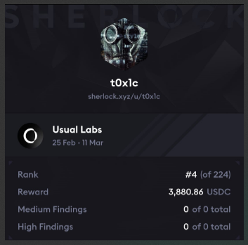

# Leaderboard
Usual Labs Results<br>


`Rank 4 / 224` <br>
No H/M found in the contest.

# Audited Code Repo
### [Sherlock: Usual Labs](https://audits.sherlock.xyz/contests/832)
### [Github: Usual Labs](https://github.com/sherlock-audit/2025-02-usual-labs-t0x1cC0de/)

<br>

# <a id="summaryTable"></a>Bugs Filed & Their Status

The contest had specific severity matrix rules with certain percentage loss of funds as a requirement.

| #      | Bug ID          | Name | URL    | Adjudged Status  |
|--------|-----------------|------|:------:|-----------------:|
| 1      | [M-01](#m-01)   | Blacklisted user's tokens can't be safely burned or transferred by the protocol | [49](https://audits.sherlock.xyz/contests/832/voting/49) | Rejected |
| 2      | [M-02](#m-02)   | Protocol loses redeemFee due to excessive decimal truncation inside `_calculateFee()` | [30](https://audits.sherlock.xyz/contests/832/voting/30) | Rejected |
| 3      | [M-03](#m-03)   | swapRWAtoStbc() and swapUsd0() have no slippage or deadline protection | [39](https://audits.sherlock.xyz/contests/832/voting/39) | Rejected |
| 4      | [M-04](#m-04)   | Users calling swapRWAtoStbc() and swapUsd0() can be DoSed via frontrunning | [40](https://audits.sherlock.xyz/contests/832/voting/40) | Rejected |
| 5      | [M-05](#m-05)   | Blacklisted Usd0 user can withdraw their USDC from SwapperEngine | [42](https://audits.sherlock.xyz/contests/832/voting/42) | Rejected |
| 6      | [M-06](#m-06)   | UsualX and Usual contracts maintain separate blacklists resulting in possible regulatory non-compliance | [46](https://audits.sherlock.xyz/contests/832/voting/46) | Rejected |
| 7      | [M-07](#m-07)   | setPenaltyPercentages() can be frontrun by claim() | [55](https://audits.sherlock.xyz/contests/832/voting/55) | Rejected |
| 8      | [M-08](#m-08)   | UsualOracle does not check for stale price inside `_latestRoundData()` | [60](https://audits.sherlock.xyz/contests/832/voting/60) | Rejected |

<br>
<br>

## **MEDIUM-SEVERITY BUGS**
---

### <a id="m-01"></a>[M-01]
## **Blacklisted user's tokens can't be safely burned or transferred by the protocol**
#### https://github.com/sherlock-audit/2025-02-usual-labs-t0x1cC0de/blob/main/pegasus/packages/solidity/src/token/Usd0.sol#L167-L169
<br>

## Summary
Since overridden [_update() function reverts](https://github.com/sherlock-audit/2025-02-usual-labs-t0x1cC0de/blob/main/pegasus/packages/solidity/src/token/Usd0.sol#L167-L169) when user is blacklisted by the `BLACKLIST_ROLE`, their tokens can't be transferred or burned by the `USD0_BURN` role. Any attempt to do so gives user the opportunity to transfer it themselves to another non-blacklisted address and hence escape sanctions.

Further impact this has: Tokens held by blacklisted addresses are counted in supply calculations but are effectively removed from circulation. This creates inconsistencies in protocol calculations that rely on an accurate `totalSupply()` figure.

This report highlights the vulnerability for Usd0 and Usd0PP, but it exists in others Usual tokens & vaults (like `UsualX`) too which support blacklist functionality.

## Description
Assumption: Roles `USD0_BURN` and `BLACKLIST_ROLE` are different account addresses, which looks quite likely as per the current role segregation.

Consider the following flow:
1. Alice gets some `USD0` tokens minted.
2. After some time, protocol wants to blacklist Alice so that she can't access funds anymore, [also consequently blocking](https://github.com/sherlock-audit/2025-02-usual-labs-t0x1cC0de/blob/main/pegasus/packages/solidity/src/token/Usd0PP.sol#L933-L935) usage of any `USD0PP` bond tokens by her.
3. Protocol would also want to either burn the allocated tokens or transfer them to a protocol controlled address so that accounting via `totalSupply()` is consistent and accounts only for accessible tokens and not those which are "frozen". The protocol could decide to do this in one of the following two ways (either choosing Step 4 or Step 5).
4. Option1:
    - **Action1**: `BLACKLIST_ROLE` blacklists Alice by calling `blacklist(alice)`
    - **Action2**: `USD0_BURN` attempts to call `burnFrom(alice, amount)`. 
        - This reverts because `burnFrom()` --> `_burn()` --> overridden `_update()` --> [reverts](https://github.com/sherlock-audit/2025-02-usual-labs-t0x1cC0de/blob/main/pegasus/packages/solidity/src/token/Usd0.sol#L167-L169) due to the `$.isBlacklisted[from]` check.
    - **Action3**: Protocol decides to quickly unblacklist first and then burn and then blacklist again. 
        - However since roles `USD0_BURN` and `BLACKLIST_ROLE` are different account addresses, this can't be done in a single tx. 
        - Alice monitors the mempool on Ethereum and backruns `unBlacklist()` to transfer her tokens to a mixing service and escapes sanctions.

5. Option2: Maybe the protocol would rather perform the actions in the reverse order i.e. burn first and blacklist later? That's just not safe because Alice can front-run `burnFrom()` and transfer her tokens to some other address owned by her.

The only options left for the protocol are to choose between:
- making use of a private mempool & tx bundling service (like Flashbots) so that Alice can't spy on the mempool. ( _The documentation does not suggest that Usual Labs has any plans or setup to do so_ ).
- giving `BLACKLIST_ROLE` to the account holding the `USD0_BURN` role so that they can create a single tx which does `unBlacklist(alice)` --> `burnFrom(alice, amount)` --> `blacklist(alice)`.

From what I understand of Sherlock rules, neither of the above 2 solutions are considered strong enough mitigations for such an issue since they do not constitute a protocol's intended/normal flow of operations. 

In fact, this raises an inherent question about the design choice of how the function `blacklist()` is going to be called by the admin in general? Any such call on Ethereum can be frontrun by the user to transfer their funds to a mixing service & then rerouted to another address of theirs, enabling them to continue operations as usual. However please note that this report chooses not to pursue this line of enquiry as its primary goal and just highlights this concern as an additional consideration because the contest rules state that - "Design choices related to the protocol are out of scope".

## Impact
The impact can be visualized in four ways: 

1. The first impact arises when protocol successfully blacklists the user thus "freezing" the Usd0 tokens, but now can't call burn without risking user frontrunning them. In this situation the tokens allocated to the blacklisted user won't be able to "leave" the system via burn or transfer and hence would always give an incorrect picture to the protocol when **Usd0's** `totalSupply()` is called. This could cause:
    - [a revert](https://github.com/sherlock-audit/2025-02-usual-labs-t0x1cC0de/blob/main/pegasus/packages/solidity/src/token/Usd0.sol#L134-L136) with error `AmountExceedBacking()` when `mint()` is called since `totalSupply()` has not been reduced by the amount of frozen tokens.

2. Second impact arises when protocol successfully blacklists the user and this consequently also freezes their **Usd0PP** tokens. Here we have a scenario where the user had already purchased Usd0PP before being blacklisted, but now can't call unwrap or transfer/burn on them (as expected). These Usd0PP tokens are effectively out of circulation, but still always accounted for when **Usd0PP's** `totalSupply()` is called. This results in:
    - an [incorrect value being returned](https://github.com/sherlock-audit/2025-02-usual-labs-t0x1cC0de/blob/main/pegasus/packages/solidity/src/token/Usd0PP.sol#L908) whenever call is made to `unlockUSD0ppWithUsual()` --> `calculateRequiredUsual()` --> calculates `adjustmentFactor` as a lower figure than `SCALAR_ONE` due to the [check here](https://github.com/sherlock-audit/2025-02-usual-labs-t0x1cC0de/blob/main/pegasus/packages/solidity/src/token/Usd0PP.sol#L875) since an erroneous higher `weeklyTarget` was used for calculations due to inflated `totalSupply()` passed as a param to `calculateWeeklyTargetRedemptions()` ( higher `tvl` passed to `calculateWeeklyTargetRedemptions()` ). The caller ends up paying **less that required** USUAL tokens for unlocking Usd0PP. If the blacklisted user is a whale this "rebate" in USUAL tokens while unlocking Usd0PP becomes high. The protocol essentially subsidizes redemptions in proportion to the percentage of blacklisted tokens in the total supply.
        - Note that there is no way to burn/transfer these tokens as the tx will revert due to the `_update()` check. If the blacklisted user was holding `x` amount of Usd0PP, the protocol needs to burn `x` amount of Usd0PP and Usd0 tokens each so that correct peg is maintained. Currently there's no way to "dispose" of these Usd0PP tokens.

    - This impact can also be seen in `UsualX.sol`. If shares had been issued to the user before being blacklisted, they continue to contribute to `totalSupply()` and effectively act as dead shares. Hence a call to `_convertToAssets()` ( [made internally whenever `redeem()`](https://github.com/sherlock-audit/2025-02-usual-labs-t0x1cC0de/blob/main/pegasus/packages/solidity/src/vaults/UsualX.sol#L439) or `mint()` or `withdraw() --> maxWithdraw() --> previewRedeem()` is called ) returns a lower than fair figure since it still erroneously considers that the blacklisted share holder has a claim to their assets. 
        - This is even more problematic in `UsualX` vault because the blacklist for `UsualX` and `Usual` tokens are maintained separately. Even if the admin blacklists a user in both the lists via two separate calls, an honest user's redeem/withdraw call can inadvertently get sandwiched and get processed when `totalSupply()` and `totalAssets()` are not in sync.

3. The third impact is when protocol risks calling burn after blacklisting. The blacklisted user is able to transfer their tokens to a non-blacklisted address via frontrunning/backrunning and escape sanctions altogether.

4. The fourth & final impact is on `DistributionModule.sol`. The protocol calls [_calculateUsualDistribution()](https://github.com/sherlock-audit/2025-02-usual-labs-t0x1cC0de/blob/main/pegasus/packages/solidity/src/distribution/DistributionModule.sol#L968) and uses `uint256 currentSupplyUsd0PP = $.usd0PP.totalSupply()` to determine the amount of USUAL tokens to be distributed as part of the DAO's token emission mechanism while internally calling `_calculateSt()` and `_calculateDistribution()`. Once again due to `totalSupply()` not discounting the frozen Usd0PP tokens, an incorrect (lower than fair) USUAL emission is calculated.

## Mitigation 
- Inside `_update()`, add the check that if a burn action is being performed ( i.e. `to == address(0)` ) by a trusted role like `USD0_BURN` AND user is blacklisted, then it should be allowed (maybe after a timelock, to prevent admin abuse). This should be treated as a "rescue / seize" operation. The protocol could choose to also do the same when `to` address is a special `seizeAddress`.
- Another option could be to introduce additional accounting for blacklisted tokens. While calculating total supply, this non-circulating amount can then be deducted before returning the figure from `totalSupply()`.

[Back to Top](#summaryTable)
---

### <a id="m-02"></a>[M-02]
## **Protocol loses redeemFee due to excessive decimal truncation inside `_calculateFee()`**
#### https://github.com/sherlock-audit/2025-02-usual-labs-t0x1cC0de/blob/main/pegasus/packages/solidity/src/daoCollateral/DaoCollateral.sol#L509-L515
<br>

## Description
Whenever `tokenDecimals` is less than 18, `_calculateFee()` first down-scales the `stableFee` to tokenDecimals precision and then again up-scales to 18 decimals [here](https://github.com/sherlock-audit/2025-02-usual-labs-t0x1cC0de/blob/main/pegasus/packages/solidity/src/daoCollateral/DaoCollateral.sol#L509-L515):
```js
    function _calculateFee(uint256 usd0Amount, address rwaToken)
        internal
        view
        returns (uint256 stableFee)
    {
        DaoCollateralStorageV0 storage $ = _daoCollateralStorageV0();
        stableFee = Math.mulDiv(usd0Amount, $.redeemFee, SCALAR_TEN_KWEI, Math.Rounding.Floor);
        uint8 tokenDecimals = IERC20Metadata(rwaToken).decimals();
@--->   // if the token has less decimals than USD0 we need to normalize the fee
        if (tokenDecimals < 18) {
            // we scale down the fee to the token decimals
            // and we scale it up to 18 decimals
@--->       stableFee = Normalize.tokenAmountToWad(
@--->           Normalize.wadAmountToDecimals(stableFee, tokenDecimals), tokenDecimals
            );
        }
    }
```

This is done even though the `stableFee` is charged in `Usd0`, not in RWAToken and hence is unneccessary. In fact, it results in the protocol receiving less fee every time. Here's an example:
1. Current `$.redeemFee` is configured as `10 bips` or `0.1%`
2. User calls `redeem()` with `amount` as `0.001e18 - 1` or `999999999999999`
3. We first have `stableFee = Math.mulDiv(usd0Amount, $.redeemFee, SCALAR_TEN_KWEI, Math.Rounding.Floor)` which results in `stableFee = Math.mulDiv(999999999999999, 10, 10000, Math.Rounding.Floor)` or `999999999999`. **_This should have been the correct amount charged by the protocol_**.
4. But then `tokenDecimals` which is `6`, is less than `18` and scaling down & up is done unneccessarily. 
5. Down scaling results in `999999999999999 / ( 10 ^ (18 - 6) ) = 999999999999 / 1e12 = 0`.
6. Hence the final `stableFee` returned by `_calculateFee()` is zero.
7. As a result the user receives a higher `returnedCollateral = _getTokenAmountForAmountInUSD(burnedStable, rwaToken)` from inside of `_burnStableTokenAndTransferCollateral()` since `uint256 burnedStable = stableAmount - stableFee` is a higher figure [here](https://github.com/sherlock-audit/2025-02-usual-labs-t0x1cC0de/blob/main/pegasus/packages/solidity/src/daoCollateral/DaoCollateral.sol#L531).

## Impact
Given that the current deployed RWA token is `USYC` with 6 decimals, this causes fee loss to the protocol **every time** `usd0Amount * redeemFee` is not fully divisible by `SCALAR_TEN_KWEI`. User may even act maliciously and split txs into such smaller ones to reduce or escape their fees. Depending on how much gas fee they are having to pay, they may be able to extract a profit here. 
Since fee bips can be set as high as `MAX_REDEEM_FEE = 2500` i.e. `25%`, this loss for the protocol can go higher.

## Proof of Concept
Add the following inside `pegasus/packages/solidity/test/DaoCollateral.t.sol` to see it pass when run with `forge test --mt test_redeemFee_bug -vv`:
```js
    function test_redeemFee_bug() public {
        // Arrange
        uint256 rwaAmount = 1000e6;
        (RwaMock rwa1, Usd0 stbc) = setupCreationRwa1(6);

        // Setup initial RWA token state
        rwa1.mint(alice, rwaAmount);
        uint256 amount = ERC20(address(rwa1)).balanceOf(alice);

        // Setup oracle price ($1)
        _setOraclePrice(address(rwa1), 1e6);
        assertEq(classicalOracle.getPrice(address(rwa1)), 1e18);

        // Setup Bob's initial state
        uint256 amountInRWA = (amount * 1e18) / classicalOracle.getPrice(address(rwa1));
        _whitelistRWA(address(rwa1), bob);
        rwa1.mint(bob, amountInRWA);

        // Act - Part 1: Swap RWA for stablecoins
        vm.startPrank(bob);
        ERC20(address(rwa1)).approve(address(daoCollateral), amountInRWA);
        daoCollateral.swap(address(rwa1), amountInRWA, 0);

        // Get stable balance after swap
        uint256 stbcBalance = ERC20(address(stbc)).balanceOf(bob);


        // Observe bug 🔽

        emit log_named_uint("current redeemFee in bips =", daoCollateral.redeemFee()); 
        // get treasury balance before redeem
        uint256 treasuryUsd0BalanceBefore = ERC20(address(stbc)).balanceOf(treasuryYield);
        // redeem
        stbc.approve(address(daoCollateral), stbcBalance);
        for (uint loop; loop < 10; loop++)
            daoCollateral.redeem(address(rwa1), 0.001e18 - 1, 0); // let's perform 10 txs
        vm.stopPrank();

        // no stableFee is transferred ❌
        assertEq(
            ERC20(address(stbc)).balanceOf(treasuryYield), treasuryUsd0BalanceBefore, "fee transfer > 0"
        );
    }
```

## Mitigation 
The additional logic of comparing with rwaToken's decimals is not really required.
```diff
    function _calculateFee(uint256 usd0Amount, address rwaToken)
        internal
        view
        returns (uint256 stableFee)
    {
        DaoCollateralStorageV0 storage $ = _daoCollateralStorageV0();
        stableFee = Math.mulDiv(usd0Amount, $.redeemFee, SCALAR_TEN_KWEI, Math.Rounding.Floor);
-       uint8 tokenDecimals = IERC20Metadata(rwaToken).decimals();
-       // if the token has less decimals than USD0 we need to normalize the fee
-       if (tokenDecimals < 18) {
-           // we scale down the fee to the token decimals
-           // and we scale it up to 18 decimals
-           stableFee = Normalize.tokenAmountToWad(
-               Normalize.wadAmountToDecimals(stableFee, tokenDecimals), tokenDecimals
-           );
-       }
    }
```

[Back to Top](#summaryTable)
---

### <a id="m-03"></a>[M-03]
## **swapRWAtoStbc() and swapUsd0() have no slippage or deadline protection**
#### https://github.com/sherlock-audit/2025-02-usual-labs-t0x1cC0de/blob/main/pegasus/packages/solidity/src/daoCollateral/DaoCollateral.sol#L565
<br>

## Description
[_swapRWAtoStbc()](https://github.com/sherlock-audit/2025-02-usual-labs-t0x1cC0de/blob/main/pegasus/packages/solidity/src/daoCollateral/DaoCollateral.sol#L565) which is called internally by `swapRWAtoStbc()` and `swapRWAtoStbcIntent()` has no slippage or deadline control even though calls to oracles are involved for fetching prices. The affected flows are:

1. `_swapRWAtoStbc()` --> [ _getQuoteInUsd()](https://github.com/sherlock-audit/2025-02-usual-labs-t0x1cC0de/blob/main/pegasus/packages/solidity/src/daoCollateral/DaoCollateral.sol#L604) to get RWA token price for minting Usd0. These Usd0 are then swapped for USDC through SwapperEngine.

2. `_swapRWAtoStbc()` --> [swapUsd0()](https://github.com/sherlock-audit/2025-02-usual-labs-t0x1cC0de/blob/main/pegasus/packages/solidity/src/daoCollateral/DaoCollateral.sol#L611-L612) --> `_getUsdcWadPrice()` which uses oracle to fetch USDC prices.

Similar issue exists if direct calls to [provideUsd0ReceiveUSDC()](https://github.com/sherlock-audit/2025-02-usual-labs-t0x1cC0de/blob/main/pegasus/packages/solidity/src/swapperEngine/SwapperEngine.sol#L368) or [provideUsd0ReceiveUSDCWithPermit()](https://github.com/sherlock-audit/2025-02-usual-labs-t0x1cC0de/blob/main/pegasus/packages/solidity/src/swapperEngine/SwapperEngine.sol#L397) are made which internally calls `_getUsdcWadPrice()` to fetch oracle price.

## Impact
1. User can get a bad price due to no provision of specifying a minimum USDC amount they would like in return for their RWA. Note that even if partial match is specified by the user, they should be able to pass a "min acceptable rate" since a total absolute number for minUSDC won't make sense. This would ensure they would at least get `Y` USDC for `X` RWA successfully swapped. This also protects their supplied RWA because if complete swap doesn't happen, the `rwaTokensToReturn` amount of RWA is returned to them. However this is calculated from `wadRwaNotTakenInUSD` after applying oracle prices via `_getQuoteInToken(wadRwaNotTakenInUSD, rwaToken)` [here](https://github.com/sherlock-audit/2025-02-usual-labs-t0x1cC0de/blob/main/pegasus/packages/solidity/src/daoCollateral/DaoCollateral.sol#L621-L622). This can result in user not getting a complete swap AND being returned a substantial less amount of RWA than they supplied.
Note that this could happen not necessarily due to market volatility but also because there's no deadline param and the tx could be in the mempool for quite some time. When the tx eventually executes, rates could have considerably changed and user could get a bad deal.

2. Absence of deadline also means user can do nothing if the tx is stuck in the mempool for a long duration and prices have changed considerably. They can't cancel their swap tx as no such function exists.

## Mitigation 
Allow user to pass a "minRate" in `swapRWAtoStbc()` and `swapUsd0()` along with a `deadline` param. Similar params need to be introduced in `provideUsd0ReceiveUSDC()` and `provideUsd0ReceiveUSDCWithPermit()`.

[Back to Top](#summaryTable)
---

### <a id="m-04"></a>[M-04]
## **Users calling swapRWAtoStbc() and swapUsd0() can be DoSed via frontrunning**
#### https://github.com/sherlock-audit/2025-02-usual-labs-t0x1cC0de/blob/main/pegasus/packages/solidity/src/daoCollateral/DaoCollateral.sol#L570
<br>

## Summary
`swapRWAtoStbc()` or `swapRWAtoStbcIntent()` --> `_swapRWAtoStbc()` --> `swapUsd0()` --> `_provideUsd0ReceiveUSDC()` --> [reverts if the following condition is not satisfied](https://github.com/sherlock-audit/2025-02-usual-labs-t0x1cC0de/blob/main/pegasus/packages/solidity/src/swapperEngine/SwapperEngine.sol#L349-L355):
```solidity
        // Revert if partial matching is not allowed and we haven't taken all of the USD0
        if (
            !partialMatchingAllowed && totalUsdcTaken != amountUsdcToTakeInNativeDecimals
                || totalUsdcTaken == 0
        ) {
            revert AmountTooLow();
        }
```

When the `orderIdsToTake` [array provided by the user](https://github.com/sherlock-audit/2025-02-usual-labs-t0x1cC0de/blob/main/pegasus/packages/solidity/src/daoCollateral/DaoCollateral.sol#L570) is not huge and the `order` themselves aren't too big, a malicious attacker can front-run any user's call to `swapRWAtoStbc()` & `swapUsd0()` and cause a revert. The front-run call could be done through either the `swapUsd0()` or `swapRWAtoStbc()` function, depending on which asset the attacker holds currently - Usd0 or rwaToken respectively.

## Description
The vulnerability stems from the requirement for users to specify exact order IDs they wish to match against. A malicious actor can observe pending transactions in the mempool and front-run them by submitting their own transactions that target the same order IDs. Two scenarios are possible:

1. If `partialMatchingAllowed = false`, then attacker has to just make sure that enough USDC is swapped out from the `orderIdsToTake` such that what remains is less than `amountUsdcToTakeInNativeDecimals`, thus causing a revert due to `totalUsdcTaken != amountUsdcToTakeInNativeDecimals`.

2. If `partialMatchingAllowed = true`, then the attacker needs to swap out the entire USDC from the `orderIdsToTake` such that user is faced with `totalUsdcTaken == 0` and their tx reverts.

While a griefer can do this again & again to cause user's tx to revert, these kind of reverts can happen inadvertently too during the normal course of operations.

## Impact
User's swapRWAtoStbc() and swapUsd0() calls can be DoSed repeatedly. They keep on losing gas fee. 

## Proof of Concept
Add this inside `pegasus/packages/solidity/test/DaoCollateral.t.sol` to see it pass:
```js
    function testFrontRunningAttackOnSwapRWAtoStbc() public {
        (, Usd0 usd0Token) = setupCreationRwa1(6);
        uint256 amountInUsd0 = 42_000 * 1e18;
        uint256 amountToDeposit =
            _getUsdcAmountFromUsd0WadEquivalent(amountInUsd0, _getUsdcWadPrice());
        (
            RwaMock rwaToken,
            uint256 rwaAmount,
            uint256[] memory orderIdsToTake,
            Approval memory approval
        ) = setupSwapRWAToStbc_withDeposit(amountToDeposit);

        // Create an attacker
        address attacker = makeAddr("attacker");
        deal(address(usd0Token), attacker, amountInUsd0);
        
        // Approve SwapperEngine to spend USD0
        vm.startPrank(attacker);
        usd0Token.approve(address(swapperEngine), amountInUsd0);
        
        // Attacker front-runs Alice's transaction
        // calling swapUsd0() with the same orderIdsToTake but with a very small Usd0 amount
        uint256 smallUsd0Amount = 0.01e18;
        swapperEngine.swapUsd0(attacker, smallUsd0Amount, orderIdsToTake, true);
        vm.stopPrank();

        // Verify attacker received 0.01 USDC = 0.01e6 (6 decimals)
        assertEq(IUSDC(address(USDC)).balanceOf(attacker), smallUsd0Amount / 1e12);
        
        // Alice's transaction will now revert because orderIdsToTake have been consumed
        vm.startPrank(alice);
        // partialMatch = false -> transaction should revert
        vm.expectRevert(AmountTooLow.selector); 
        daoCollateral.swapRWAtoStbc(address(rwaToken), rwaAmount, false, orderIdsToTake, approval);
        vm.stopPrank();
        
        // Verify Alice didn't get any USDC
        assertEq(IUSDC(address(USDC)).balanceOf(alice), 0);
    }
```

## Mitigation 
Instead of requiring users to specify exact order IDs, automatically match against the best available orders. Attacker won't be able to target specific orders this way.

[Back to Top](#summaryTable)
---

### <a id="m-05"></a>[M-05]
## **Blacklisted Usd0 user can withdraw their USDC from SwapperEngine**
#### https://github.com/sherlock-audit/2025-02-usual-labs-t0x1cC0de/blob/main/pegasus/packages/solidity/src/swapperEngine/SwapperEngine.sol#L258
<br>

## Description
If a user is Usd0 blacklisted, they are [not allowed](https://github.com/sherlock-audit/2025-02-usual-labs-t0x1cC0de/blob/main/pegasus/packages/solidity/src/swapperEngine/SwapperEngine.sol#L218-L220) to deposit USDC into `SwapperEngine.sol`, rightly so.
```solidity
        if (IUsd0(address($.usd0)).isBlacklisted(msg.sender)) {
            revert NotAuthorized();
        }
```

However, the same check is missing inside [withdrawUSDC()](https://github.com/sherlock-audit/2025-02-usual-labs-t0x1cC0de/blob/main/pegasus/packages/solidity/src/swapperEngine/SwapperEngine.sol#L258).

## Impact
Assuming that there are legal obligations around this and a blacklisted Usd0 user shouldn't be allowed to interact, this breaks that rule. If the user has been blacklisted **after** they deposited, then they can get away with withdrawing their USDC.

## Mitigation 
Add the same check inside `withdrawUSDC()` too:
```solidity
        if (IUsd0(address($.usd0)).isBlacklisted(msg.sender)) {
            revert NotAuthorized();
        }
```

[Back to Top](#summaryTable)
---

### <a id="m-06"></a>[M-06]
## **UsualX and Usual contracts maintain separate blacklists resulting in possible regulatory non-compliance**
#### https://github.com/sherlock-audit/2025-02-usual-labs-t0x1cC0de/blob/main/pegasus/packages/solidity/src/token/Usual.sol#L50-L51
#### https://github.com/sherlock-audit/2025-02-usual-labs-t0x1cC0de/blob/main/pegasus/packages/solidity/src/vaults/UsualX.sol#L106-L107
<br>

## Description
Unlike `Usd0` and `Usd0PP` which [refer a single storage location](https://github.com/sherlock-audit/2025-02-usual-labs-t0x1cC0de/blob/main/pegasus/packages/solidity/src/token/Usd0PP.sol#L931-L935) to blacklist a `Usd0` user, `Usual` and `UsualX` maintain separate lists, using [_usualStorageV0()](https://github.com/sherlock-audit/2025-02-usual-labs-t0x1cC0de/blob/main/pegasus/packages/solidity/src/token/Usual.sol#L152) and [_usualXStorageV0()](https://github.com/sherlock-audit/2025-02-usual-labs-t0x1cC0de/blob/main/pegasus/packages/solidity/src/vaults/UsualX.sol#L241) respectively. This causes the following issue:
1. User deposits Usual and gets UsualX shares in exchange.
2. `Usual.sol` blacklists the user.
3. Blacklisted user can still transfer their UsualX shares to a different address and later use that to redeem their Usual tokens. Note that an alert user could monitor the mempool and backrun the `Usual.sol` blacklisting in Step2 too.

## Impact
Since there are legal obligations around this and a blacklisted `Usual` token user shouldn't be allowed to interact with the UsualX vault too, this could lead to regulatory non-compliance.

## Mitigation 
Change the [_update()](https://github.com/sherlock-audit/2025-02-usual-labs-t0x1cC0de/blob/main/pegasus/packages/solidity/src/vaults/UsualX.sol#L237) function inside `UsualX.sol` to something along these lines:
```diff
    function _update(address from, address to, uint256 amount)
        internal
        override(ERC20Upgradeable)
    {
        UsualXStorageV0 storage $ = _usualXStorageV0();
        if ($.isBlacklisted[from] || $.isBlacklisted[to]) {
            revert Blacklisted();
        }
+       IUsual usualToken = IUsual(asset());
+       if (usualToken.isBlacklisted[from] || usualToken.isBlacklisted[to]) {
+           revert Blacklisted();
+       }
        super._update(from, to, amount);
    }
```
The protocol could choose to do a similar modification inside `Usual.sol` where it checks if user is additionally blacklisted by `UsualX.sol`.

[Back to Top](#summaryTable)
---

### <a id="m-07"></a>[M-07]
## **setPenaltyPercentages() can be frontrun by claim()**
#### https://github.com/sherlock-audit/2025-02-usual-labs-t0x1cC0de/blob/main/pegasus/packages/solidity/src/airdrop/AirdropDistribution.sol#L371
<br>

## Summary
The `AirdropDistribution.sol` contract contains a front-running vulnerability where users (those in the top 80%) can monitor pending `setPenaltyPercentages()` transaction which intends to increase the penalty rate and front-run it with `claim()`. This vulnerability allows users to claim tokens with lower penalties than intended.

## Description
The vulnerability exists in how penalty percentages are set and applied within the contract:

1. In `setPenaltyPercentages()`, admins (with `AIRDROP_PENALTY_OPERATOR_ROLE`) can set penalties for [both the current month and future months](https://github.com/sherlock-audit/2025-02-usual-labs-t0x1cC0de/blob/main/pegasus/packages/solidity/src/airdrop/AirdropDistribution.sol#L371):
```solidity
function setPenaltyPercentages(
    uint256[] memory penaltyPercentages,
    address[] memory accounts,
    uint256 month
) external {
    uint256 monthsPassed = _calculateMonthsPassed();

    // Validate the month is within the 6-month vesting period
    if (month < monthsPassed || month > AIRDROP_VESTING_DURATION_IN_MONTHS) {
        revert OutOfBounds();
    }
    // ...
}
```

2. When users claim their tokens, [penalties are applied](https://github.com/sherlock-audit/2025-02-usual-labs-t0x1cC0de/blob/main/pegasus/packages/solidity/src/airdrop/AirdropDistribution.sol#L246-L251) based on the current month (and also next month for tax-paying users):

```solidity
function _available(
    AirdropDistributionStorageV0 storage $,
    address account,
    uint256 totalAmount,
    bool isTop80
) internal returns (uint256, uint256) {
    // ...
    penaltyAmount = _computePenalty(
        $, totalAmount, account, hasPaidTax ? monthsPassed + 1 : monthsPassed
    );
    // ...
}
```

The issue is more severe for top 80% users who have paid tax, as their penalty calculation includes an additional month (`monthsPassed + 1`), giving them the opportunity to avoid any higher penalties set for both the current and next month by front-running penalty adjustment transactions.

## Impact
Users who are actively monitoring the blockchain have an unfair advantage over those who aren't, creating inequality in the airdrop distribution system.

## Mitigation 
The solution depends on how the protocol wants to approach this. One way could be:
- If currentMonth's penalty percentage has already been set, then the protocol could choose to allow modifications only to `months >= currentMonth + 2`.

[Back to Top](#summaryTable)
---

### <a id="m-08"></a>[M-08]
## **UsualOracle does not check for stale price inside `_latestRoundData()`**
#### https://github.com/sherlock-audit/2025-02-usual-labs-t0x1cC0de/blob/main/pegasus/packages/solidity/src/oracles/UsualOracle.sol#L90
<br>

## Description
One can see inside `ClassicalOracle.sol` that [checks are in place](https://github.com/sherlock-audit/2025-02-usual-labs-t0x1cC0de/blob/main/pegasus/packages/solidity/src/oracles/ClassicalOracle.sol#L84-L90) for stale prices:
```solidity
    function _latestRoundData(address token) internal view override returns (uint256, uint256) {
        AbstractOracleStorageV0 storage $ = _abstractOracleStorageV0();
        IAggregator priceAggregatorProxy = IAggregator($.tokenToOracleInfo[token].dataSource);

        if (address(priceAggregatorProxy) == address(0)) revert OracleNotInitialized();

        uint256 decimals = priceAggregatorProxy.decimals();

        // slither-disable-next-line unused-return
        (, int256 answer,, uint256 updatedAt,) = priceAggregatorProxy.latestRoundData();
        if (answer <= 0) revert OracleNotWorkingNotCurrent();
@-->    if (updatedAt > block.timestamp) revert OracleNotWorkingNotCurrent();
        // track the updatedAt value from  latestRoundData()
        // to make sure that the latest answer is recent enough for your application to use it
        // detects that the reported answer is not updated within the heartbeat timeout
@-->    if (block.timestamp > $.tokenToOracleInfo[token].timeout + updatedAt) {
            revert OracleNotWorkingNotCurrent();
        }
        return (uint256(answer), decimals);
    }
```

However, the same is [missing](https://github.com/sherlock-audit/2025-02-usual-labs-t0x1cC0de/blob/main/pegasus/packages/solidity/src/oracles/UsualOracle.sol#L90) inside `UsualOracle.sol`:
```solidity
    function _latestRoundData(address token) internal view override returns (uint256, uint256) {
        AbstractOracle.AbstractOracleStorageV0 storage $ = _abstractOracleStorageV0();
        IDataPublisher dataPublisher = IDataPublisher($.tokenToOracleInfo[token].dataSource);

        if (address(dataPublisher) == address(0)) revert OracleNotInitialized();

        // slither-disable-next-line unused-return
        (, int256 answer,, uint256 decimals) = dataPublisher.latestRoundData(token);

        if (answer <= 0) revert OracleNotWorkingNotCurrent();
    ❌ ❌ ❌ // missing checks
        return (uint256(answer), decimals);
    }
```

In fact, we see inside `initializeTokenOracle()` that even though `timeout` is accepted as a param, it's never stored for future purposes (like it is done inside `ClassicalOracle.sol`):
```solidity
    function initializeTokenOracle(address token, uint64 timeout, bool isStablecoin) external {
        if (token == address(0)) revert NullAddress();
        // The timeout can't be zero and must be at most one week
        if (timeout == 0 || timeout > ONE_WEEK) revert InvalidTimeout();

        AbstractOracle.AbstractOracleStorageV0 storage $ = _abstractOracleStorageV0();
        $.registryAccess.onlyMatchingRole(DEFAULT_ADMIN_ROLE);

        UsualOracleStorageV0 storage u = _usualOracleStorageV0();

        // slither-disable-next-line unused-return
        (, int256 answer, uint256 timestamp,) = u.dataPublisher.latestRoundData(token);
        if (answer <= 0 || block.timestamp - timestamp > timeout) {
            revert OracleNotWorkingNotCurrent();
        }
❌ ❌ // this is never done --->  $.tokenToOracleInfo[token].timeout = timeout;
        $.tokenToOracleInfo[token].dataSource = address(u.dataPublisher);
        $.tokenToOracleInfo[token].isStablecoin = isStablecoin;
    }
```

## Impact
Stale prices could be consumed by the oracle resulting in multiple vulnerable scenarios. A couple of them are:
1. Extraction of excess value by swapping at advantageous rates:
    - The `swap()` function inside `DaoCollateral.sol` calls `_swapCheckAndGetUSDQuote() --> _getQuoteInUsd()` which fetches oracle prices. Thus, this can result in:
        - A user deposits the now-cheaper RWA token --> the protocol values it at an outdated, higher price --> User receives more USD0 stablecoins than the current market value of their RWA.

2. Mint more tokens than properly collateralized:
    - In `Usd0.sol`, the `mint()` function performs a collateral check by calling `uint256 rwaPriceInUSD = uint256(oracle.getPrice(rwa))` for all RWAs and prevents minting more USD0 than the calculated backing. This can result in:
        - The system calculates an inflated total collateral value (`wadRwaBackingInUSD`) --> This allows minting more USD0 tokens than properly backed by the actual current value of collateral --> The protocol becomes undercollateralized.

## Mitigation 
Add staleness check in `UsualOracle.sol` identical to how it has been done inside `ClassicalOracle.sol`.

[Back to Top](#summaryTable)
