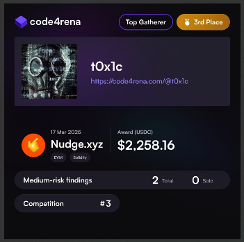

# Leaderboard
[Nudge.xyz Results](https://x.com/code4rena/status/1912575773606834350)<br>

`Rank 3 / 1078`<br>


# Audited Code Repo
### [Code4rena: Nudge.xyz](https://code4rena.com/audits/2025-03-nudgexyz)
### [Github: Nudge.xyz](https://github.com/code-423n4/2025-03-nudgexyz)

<br>

# <a id="summaryTable"></a>Bugs Filed & Their Status

| #      | Bug ID          | Name | URL    | Adjudged Status  |
|--------|-----------------|------|:------:|-----------------:|
| 1      | [H-01](#h-01)   | Accumulated fee is ignored during claim calculation thus breaking `Solvency Invariants` | [41](https://code4rena.com/evaluate/2025-03-nudgexyz/submissions/S-41) | Rejected |
| 2      | [H-02](#h-02)   | Griefer gets deliberately invalidated repeatedly to cause fund loss to campaign admin | [205](https://code4rena.com/evaluate/2025-03-nudgexyz/submissions/S-205) | Med; 48 |
| 3      | [H-03](#h-03)   | All participants can be DoSed by frontrunning | [700](https://code4rena.com/evaluate/2025-03-nudgexyz/submissions/S-700) | Med; 2 |
| 4      | [M-01](#m-01)   | Significant fee loss for protocol when tokens with low decimals are used | [261](https://code4rena.com/evaluate/2025-03-nudgexyz/submissions/S-261) | Rejected |
| 5      | [M-02](#m-02)   | Campaign APR is not honored | [278](https://code4rena.com/evaluate/2025-03-nudgexyz/submissions/S-278) | Rejected |

<br>
<br>

## **HIGH-SEVERITY BUGS**
---

### <a id="h-01"></a>[H-01]
## **Accumulated fee is ignored during claim calculation thus breaking `Solvency Invariants`**
#### https://github.com/code-423n4/2025-03-nudgexyz/blob/main/src/campaign/NudgeCampaign.sol#L281-L285
<br>

## Description
Inside `claimRewards()` the [calculation ought to be](https://github.com/code-423n4/2025-03-nudgexyz/blob/main/src/campaign/NudgeCampaign.sol#L282-L285):
```diff
  File: src/campaign/NudgeCampaign.sol

   256:              function claimRewards(uint256[] calldata pIDs) external whenNotPaused {
   257:                  if (pIDs.length == 0) {
   258:                      revert EmptyParticipationsArray();
   259:                  }
   260:          
   261:                  uint256 availableBalance = getBalanceOfSelf(rewardToken);
   262:          
   263:                  for (uint256 i = 0; i < pIDs.length; i++) {
   264:                      Participation storage participation = participations[pIDs[i]];
   265:          
   266:                      // Check if participation exists and is valid
   267:                      if (participation.status != ParticipationStatus.PARTICIPATING) {
   268:                          revert InvalidParticipationStatus(pIDs[i]);
   269:                      }
   270:          
   271:                      // Verify that caller is the participation address
   272:                      if (participation.userAddress != msg.sender) {
   273:                          revert UnauthorizedCaller(pIDs[i]);
   274:                      }
   275:          
   276:                      // Verify holding period has elapsed
   277:                      if (block.timestamp < participation.startTimestamp + holdingPeriodInSeconds) {
   278:                          revert HoldingPeriodNotElapsed(pIDs[i]);
   279:                      }
   280:          
   281:                      uint256 userRewards = participation.rewardAmount;
   282:                      // Break if insufficient balance for this claim
-  283:                      if (userRewards > availableBalance) {
+  283:                      if (userRewards > availableBalance - accumulatedFees) {
   284:                          break;
   285:                      }
   286:          
   287:                      // Update contract state
   288:                      pendingRewards -= userRewards;
   289:                      distributedRewards += userRewards;
   290:          
   291:                      // Update participation status and transfer rewards
   292:                      participation.status = ParticipationStatus.CLAIMED;
   293:                      availableBalance -= userRewards;
   294:          
   295:                      _transfer(rewardToken, participation.userAddress, userRewards);
   296:          
   297:                      emit NudgeRewardClaimed(pIDs[i], participation.userAddress, userRewards);
   298:                  }
   299:              }
```

Current code logic allows withdrawal of rewards while leaving behind no funds for the protocol's claim on fees. This breaks the `Solvency Invariants` mentioned on the contest page:
```text
Token Balance Integrity

- `rewardToken.balanceOf(campaign) >= pendingRewards + accumulatedFees`
- Ensures the contract always maintains sufficient reward tokens to cover all pending rewards and accumulated fees.

Protocol Solvency

- For any active participation p: `p.rewardAmount <= rewardToken.balanceOf(campaign) - (pendingRewards - p.rewardAmount) - accumulatedFees`
- Guarantees that any individual user's reward can be fully covered by the contract's current token balance, after accounting for fees
```

## Impact
Protocol can be left with no funds for claiming fees.

## Proof of Concept
Apply the following patch inside `src/test/NudgeCampaign.t.sol` to modify the [existing test](https://github.com/code-423n4/2025-03-nudgexyz/blob/main/src/test/NudgeCampaign.t.sol#L678) `test_ClaimRewards_NotEnoughRewardsAvailable()` and run to see it pass:
```diff
diff --git a/2025-03-nudgexyz/src/test/NudgeCampaign.t.sol b/2025-03-nudgexyz/src/test/NudgeCampaign.t.sol
index 608c66d..c85f44b 100644
--- a/2025-03-nudgexyz/src/test/NudgeCampaign.t.sol
+++ b/2025-03-nudgexyz/src/test/NudgeCampaign.t.sol
@@ -676,17 +676,17 @@ contract NudgeCampaignTest is Test {
     // This should not happen because withdrawRewards does not allow to withdraw
     // already earmarked rewards and fees
     function test_ClaimRewards_NotEnoughRewardsAvailable() public {
         uint256 toAmount = 100e18;
         simulateReallocationAndFastForward(alice, toAmount);
 
-        // Sets the rewardToken balance of the campaign contract to be less than
-        // the reward amount the user is claiming
-        (uint256 userRewards, ) = getUserRewardsAndFeesFromToAmount(campaign, toAmount);
-        deal(address(rewardToken), campaignAddress, userRewards - 10);
-        assertEq(campaign.getBalanceOfSelf(address(rewardToken)), userRewards - 10);
+        // Sets the rewardToken balance of the campaign contract to be equal to
+        // the reward amount the user is claiming (while not providing the fees)
+        (uint256 userRewards, uint256 accumulatedfees) = getUserRewardsAndFeesFromToAmount(campaign, toAmount);
+        deal(address(rewardToken), campaignAddress, userRewards);
+        assertEq(campaign.getBalanceOfSelf(address(rewardToken)), userRewards);
 
         uint256 balanceBefore = rewardToken.balanceOf(alice);
         uint256 pendingRewardsBefore = campaign.pendingRewards();
         uint256 distributedRewardsBefore = campaign.distributedRewards();
 
         // Attempt to claim
@@ -695,16 +695,20 @@ contract NudgeCampaignTest is Test {
 
         uint256 balanceAfter = rewardToken.balanceOf(alice);
         uint256 pendingRewardsAfter = campaign.pendingRewards();
         uint256 distributedRewardsAfter = campaign.distributedRewards();
         (IBaseNudgeCampaign.ParticipationStatus status, , , , , ) = campaign.participations(1);
 
-        assertEq(balanceAfter, balanceBefore);
-        assertEq(pendingRewardsAfter, pendingRewardsBefore);
-        assertEq(distributedRewardsAfter, distributedRewardsBefore);
-        assertEq(uint256(status), 0); // PARTICIPATING
+        assertGt(balanceAfter, balanceBefore);
+        assertLt(pendingRewardsAfter, pendingRewardsBefore);
+        assertGt(distributedRewardsAfter, distributedRewardsBefore);
+        assertEq(uint256(status), 2); // CLAIMED
+
+        // ❌❌
+        assertGt(accumulatedfees, 0); 
+        assertEq(campaign.getBalanceOfSelf(address(rewardToken)), 0); // @audit-issue : no balance left for fee
     }
 
     function test_ClaimRewards_MultipleSuccessfulClaimsUpdatesBalances() public {
         uint256 toAmountOne = 100e18;
         uint256 toAmountTwo = 200e18;
         uint256 toAmountThree = 300e18;

```

## Mitigation
Either use the fix suggested above in the `Description` section or use this one for more robustness:
```diff
   282:                      // Break if insufficient balance for this claim
-  283:                      if (userRewards > availableBalance) {
+  283:                      if (userRewards > userRewards + availableBalance - pendingRewards - accumulatedFees) {
   284:                          break;
   285:                      }
```

[Back to Top](#summaryTable)
---

### <a id="h-02"></a>[H-02]
## **Griefer gets deliberately invalidated repeatedly to cause fund loss to campaign admin**
#### https://github.com/code-423n4/2025-03-nudgexyz/blob/main/src/campaign/NudgeCampaign.sol#L317
<br>

## Root Cause
1. Campaign admin is supposed to fund the campaign before participants can use it. This is checked via `if (rewardAmountIncludingFees > rewardsAvailable) { revert NotEnoughRewardsAvailable(); }` [inside](https://github.com/code-423n4/2025-03-nudgexyz/blob/main/src/campaign/NudgeCampaign.sol#L210-L215) `handleReallocation()`.
1. Fee [is added](https://github.com/code-423n4/2025-03-nudgexyz/blob/main/src/campaign/NudgeCampaign.sol#L219) via internal accounting to `accumulatedFees` the moment `handleReallocation()` gets called, along with increase in `pendingRewards`. This fee is claimable by Nudge protocol. Effectively, campaign admin is the one paying the fee, not the participants.
2. Fee is [never reduced](https://github.com/code-423n4/2025-03-nudgexyz/blob/main/src/campaign/NudgeCampaign.sol#L317) from `accumulatedFees` when `invalidateParticipations()` is called. Only `pendingRewards` is reduced.
3. This continually keeps on decreasing the `claimableRewardAmount()`.

## Attack Path
1. Griefer participates in the campaign.
2. Nudge protocol checks that the contract has enough funds provided by the Campaign admin and [increments](https://github.com/code-423n4/2025-03-nudgexyz/blob/main/src/campaign/NudgeCampaign.sol#L218-L219) `pendingRewards` and `accumulatedFees` immediately inside `handleReallocation()`.
3. Griefer deliberately does not maintain sufficient balance in their wallet so that Nudge invalidates them.
4. Nudge operator calls `invalidateParticipations()` which [reduces pending rewards](https://github.com/code-423n4/2025-03-nudgexyz/blob/main/src/campaign/NudgeCampaign.sol#L317): `pendingRewards -= participation.rewardAmount`. The fee however is retained by Nudge and no more contributes to the `claimableRewardAmount()` figure.
5. Griefer repeats this again & again (with progressively smaller target amounts) until `claimableRewardAmount()` becomes zero or extremely low.
6. Note that flash loan can be used for each attack tx.

The attack cost is just the gas fee borne by the Griefer and would be very low on chains like Base or Arbitrum, while the impact is high on the campaign. (Even if high gas cost of Ethereum chain is considered, the final DoS impact on the campaign is high since it can be done again & again).

## Impacts
1. All campaignAdmin's funds are now lost to the Nudge protocol as fees. 

2. No new participants can join the campaign since `handleReallocation()` will revert [here](https://github.com/code-423n4/2025-03-nudgexyz/blob/main/src/campaign/NudgeCampaign.sol#L210-L215): `if (rewardAmountIncludingFees > rewardsAvailable) { revert NotEnoughRewardsAvailable(); }`. Campaign admin needs to add more funds if they want to keep the campaign operational.

## Proof of Concept
Add this inside `src/test/NudgeCampaign.t.sol` to see it pass. Put simply, this test shows that upon invalidation, Nudge protocol retains the fee and that this fee amount is reduced from the `claimableRewardAmount()` figure:
```js
    function test_InvalidateParticipationsReducesClaimableRewardsByFeeAmount() public {
        // Check claimable rewards before participation
        uint256 claimableRewardsBefore = campaign.claimableRewardAmount();

        uint256 toAmount = 100e18;
        simulateReallocation(alice, toAmount);
        
        // Calculate the expected fee for this participation
        uint256 rewardAmountIncludingFees = campaign.getRewardAmountIncludingFees(toAmount);
        (, uint256 fees) = campaign.calculateUserRewardsAndFees(rewardAmountIncludingFees);
        
        
        // Invalidate the participation
        uint256[] memory pIDs = new uint256[](1);
        pIDs[0] = 1; // First participation
        
        vm.prank(operator);
        campaign.invalidateParticipations(pIDs);
        
        // Check claimable rewards after invalidation
        uint256 claimableRewardsAfter = campaign.claimableRewardAmount();
        
        // The difference is the fee amount since that is retained by Nudge
        assertEq(claimableRewardsBefore - claimableRewardsAfter, fees);
    }
```

## Recommendations
Charge the fee immediately from participant inside `handleReallocation()` by calculating it as a portion of `amountReceived` and deduct this fee [while calling `_transfer()`](https://github.com/code-423n4/2025-03-nudgexyz/blob/main/src/campaign/NudgeCampaign.sol#L206) so that the attack cost makes griefing unprofitable.

[Back to Top](#summaryTable)
---

### <a id="h-03"></a>[H-03]
## **All participants can be DoSed by frontrunning**
#### https://github.com/code-423n4/2025-03-nudgexyz/blob/main/src/campaign/NudgeCampaign.sol#L213-L215
<br>

## Description
The current participation flow is:
- The participant (Alice) initiates a swap from front-end
- LiFi Executor performs the swap to `targetToken`
- LiFi Executor (which has the role `SWAP_CALLER_ROLE`) calls `handleReallocation()` and transfers the `targetToken` to participant if [`rewardAmountIncludingFees` is not more than `claimableRewardAmount()`](https://github.com/code-423n4/2025-03-nudgexyz/blob/main/src/campaign/NudgeCampaign.sol#L213-L215) in the contract.
```solidity
        uint256 rewardsAvailable = claimableRewardAmount();
        if (rewardAmountIncludingFees > rewardsAvailable) {
            revert NotEnoughRewardsAvailable();
        }
```
- Participation is confirmed.

All this happens in a single tx.

So an attacker can sandwich this tx with -
1. Front-run: with an amount that results in enough rewards allocation to bring the contract's `rewardsAvailable` or `claimableRewardAmount()` below `rewardAmountIncludingFees` when Alice's tx goes through and result in a revert.
2. Back-run: Simply transfer the `targetTokens` out of their wallet so that Nudge bot (operator) detects insufficient wallet balance and automatically invalidates the participation. 

Note that the attacker does not need to use their own funds. They can do this via a flash-loan which can be returned after the back-run by swapping the `targetToken` back into the flash-loaned token.

Attack cost: Gas fee borne by the attacker and would be very low on chains like Base or Arbitrum, while the impact is high on the campaign. (Even if high gas cost of Ethereum chain is considered, the final DoS impact on the campaign is high since it can be done again & again).

## Impact
Participation DoS. Campaign becomes unusable.

## Recommendations
Charge the fee immediately from participant inside `handleReallocation()` by calculating it as a portion of `amountReceived` and deduct this fee [while calling `_transfer()`](https://github.com/code-423n4/2025-03-nudgexyz/blob/main/src/campaign/NudgeCampaign.sol#L206) so that the attack cost makes griefing unprofitable.

[Back to Top](#summaryTable)

<br>

## **MEDIUM-SEVERITY BUGS**
---

### <a id="m-01"></a>[M-01]
## **Significant fee loss for protocol when tokens with low decimals are used**
#### https://github.com/code-423n4/2025-03-nudgexyz/blob/main/src/campaign/NudgeCampaign.sol#L424
<br>

## Description
The [contest README mentions](https://github.com/code-423n4/2025-03-nudgexyz/blob/main/README.md#erc20-token-behaviors-in-scope) that `Low decimals ( < 6)` tokens are in scope too. Let's consider the stablecoin [GUSD](https://etherscan.io/token/0x056Fd409E1d7A124BD7017459dFEa2F387b6d5Cd?a=0x5f65f7b609678448494De4C87521CdF6cEf1e932#readContract) which has `decimals = 2` and has price as `$1`.

[calculateUserRewardsAndFees()](https://github.com/code-423n4/2025-03-nudgexyz/blob/main/src/campaign/NudgeCampaign.sol#L424) rounds `fees` down in favour of the user, instead of rounding it up in favour of the protocol:
```solidity
    function calculateUserRewardsAndFees(
        uint256 rewardAmountIncludingFees
    ) public view returns (uint256 userRewards, uint256 fees) {
@-->    fees = (rewardAmountIncludingFees * feeBps) / BPS_DENOMINATOR;  // ❌ rounded down in user's favour
        userRewards = rewardAmountIncludingFees - fees;
    }
```

So if we assume targetToken as something like DAI (pegged at `$1` too) and also that participating with 100 DAI gives 1 GUSD (1e2 wei) as rewards within 7 days (i.e. 1%) which is further split into `fees = 0.01 GUSD = 1 wei` (i.e. 1% fees) and `userRewards = 0.99 GUSD = 99 wei`, then all a user has to do (either maliciously or inadvertently) is participate with 99 DAI (or 2 txs of 50 DAI each). This results in:
- rewardWithFee = `1% of 99 = 0.99 GUSD = 99 wei`
- fees = `1% of 99 wei = 0 (0.99 rounded down)`
- userReward = `99 - 0 = 99 wei = 0.99 GUSD` which is worth `$0.99`

The user is saving `$0.01` of fee by splitting txs. Of course, this may not be enough with high gas costs on Ethereum chain. However the issue becomes more siginificant in following circumstances:
1. If rewardToken has a higher price (for e.g. if priced at `$100` instead of pegged at `$1`), the fee loss becomes `$1` instead of 1 cent in the above example.
2. If rewardToken has even lower precision, say `0`. 
3. If protocol is deployed on chains like Base, Arbitrum etc with low gas fee.

## Impact
User can avoid or reduce fees by splitting txs into smaller parts, causing loss of fees for Nudge.

## Mitigation 
Round the fees up in favour of the protocol. Then check if userRewards is zero as a result of this. If yes, then protcol can choose to revert inside `handleReallocation()`.

[Back to Top](#summaryTable)
---

### <a id="m-02"></a>[M-02]
## **Campaign APR is not honored**
#### https://github.com/code-423n4/2025-03-nudgexyz/blob/main/src/campaign/NudgeCampaign.sol#L141
<br>

## Impact
Incorrect APR since `rewardPPQ` is locked at contract deployment time instead of campaign start time. Does not honor the APR the CampaignAdmin had in mind while setting up the campaign.

## Description
The [documentation outlines](https://docs.nudge.xyz/technical-documentation/for-protocols/campaign-creation-and-funding) how a campaign admin could get an idea about setting the APR or `rewardPPQ` which would determine the yield or `userRewards`. The issue lies in the following sequence of events:
1. CampaignAdmin decides to set `startTimestamp` sometime in future say, 10 days from now.

2. When the CampaignAdmin visits the Nudge UI today, it does the following:
> This corresponds to the amount of reward token, in dollars, distributed for `$1` of target token bought and held. Under the hood the campaign builder fetches the current token prices so that picking this value is more intuitive. APR is derived from this ROI value by multiplying it by 52.

3. Either through UI or via calling the smart contract functions, the CampaignAdmin creates the campaign. Suppose he wants to give some DAI as reward for every 1 ETH of participation & holding duration of 1 month (Here ETH is the targetToken and DAI is the rewardToken). Based on prevailing rates, the APR is shown by Nudge UI as some value which results in the CampaignAdmin setting `rewardPPQ` as say `1e13` (or alternatively, the CampaignAdmin did their own calculations off-chain by fetching prices from Chainlink). This means `1%` of ETH holding quantity will be given out as rewards in form of DAI tokens. Note that this is not `1%` of ETH holding price. This is simply `1%` of **quantity** of ETH tokens held given out in form of DAI tokens. This can be seen inside [getRewardAmountIncludingFees()](https://github.com/code-423n4/2025-03-nudgexyz/blob/main/src/campaign/NudgeCampaign.sol#L141). No oracle price conversion is involved.

4. The campaign contract is **_immediately_** deployed and `rewardPPQ` is locked as an **immutable** variable.

5. For the next 10 days no one can participate since the campaign is still marked as inactive. 

6. 10 days later when users participate, `rewardPPQ` is of course still `1e13` or `1%`. If however the price has fluctuated in this duration say, ETH has halved in price, it means a higher APR for users and thus CampaignAdmin loses additional DAI in rewards. 

7. Note that even if we consider that the rewardTokens percentage being offered are supposed to be "locked" at the campaign start date as per Nudge protocol's design decision, the above issue exists because the APR with which the CampaignAdmin set up the campaign is not the same as what would be offered on campaign start date when it becomes active ( OR the returns given after maturity when user calls `claimRewards()`, but the latter could be considered a design decision ).

## Mitigation 
Allow the CampaignAdmin to specify the APR at campaign creation time instead of `rewardPPQ`. Then, when the contract is actually made active at `timestamp = startTimestamp` query oracle prices to lock the correct `rewardPPQ` value based on this APR.

[Back to Top](#summaryTable)


PoC response to 700:
Please add the test inside `src/test/NudgeCampaignReallocation.t.sol` to see it pass:
```js
    function test_SandwichAttack_DoS() public {
        // Create attacker and victim addresses
        address attacker = makeAddr("attacker");
        address victim = makeAddr("victim");
        
        uint256 attackerAmount = 5_000_000e18; // will use up all rewards
        uint256 victimAmount = 100e18;
        
        // Fund accounts
        deal(address(targetToken), attacker, attackerAmount);
        deal(address(targetToken), victim, victimAmount);
        deal(address(targetToken), swapCaller, 0); // Reset swapCaller balance

        // approvals to swapCaller
        vm.prank(attacker);
        targetToken.approve(swapCaller, attackerAmount);
        vm.prank(victim);
        targetToken.approve(swapCaller, victimAmount);
        
        // 1. FRONT-RUN: Attacker performs a large allocation
        vm.startPrank(swapCaller);
        targetToken.transferFrom(attacker, swapCaller, attackerAmount);
        targetToken.approve(address(campaign), attackerAmount);
        campaign.handleReallocation(1, attacker, address(targetToken), attackerAmount, "");
        vm.stopPrank();
        
        // Check remaining rewards
        uint256 remainingRewards = campaign.claimableRewardAmount();
        console.log("Remaining rewards after attacker:", remainingRewards);
        assertEq(remainingRewards, 0); // all reward exhausted
        
        // 2. VICTIM TX
        vm.startPrank(swapCaller);
        targetToken.transferFrom(victim, swapCaller, victimAmount);
        targetToken.approve(address(campaign), victimAmount);
        // Should revert because not enough rewards available
        vm.expectRevert(INudgeCampaign.NotEnoughRewardsAvailable.selector);
        campaign.handleReallocation(1, victim, address(targetToken), victimAmount, "");
        vm.stopPrank();
        
        // 3. BACK-RUN: Operator invalidates attacker's participation (simulating insufficient wallet balance)
        vm.startPrank(operator);
        uint256[] memory pIDs = new uint256[](1);
        pIDs[0] = 1; // The attacker's participation ID
        campaign.invalidateParticipations(pIDs);
        vm.stopPrank();
        
        // 4. Verify rewards are available again
        uint256 newRemainingRewards = campaign.claimableRewardAmount();
        console.log("Rewards after invalidation:", newRemainingRewards);
        assertGt(newRemainingRewards, remainingRewards);
    }
```


