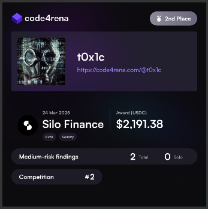

# Leaderboard

`Rank 2 / 1136`<br>


# Audited Code Repo
### [Code4rena: SiloFinance](https://code4rena.com/audits/2025-03-silo-finance)
### [Github: SiloFinance](https://github.com/code-423n4/2025-03-silo-finance)

<br>

# <a id="summaryTable"></a>Bugs Filed & Their Status

| #      | Bug ID          | Name | URL    | Adjudged Status  |
|--------|-----------------|------|:------:|-----------------:|
| 1      | [M-01](#m-01)   | Incorrect reward distribution due to feeShares minting order | [78](https://code4rena.com/evaluate/2025-03-silo-finance/submissions/S-78) | Med, 1 dup |
| 2      | [M-02](#m-02)   | Lack of slippage and deadline protection in deposit(), withdraw() and redeem() | [103](https://code4rena.com/evaluate/2025-03-silo-finance/submissions/S-103) | Med, 7 dups |
| 3      | [M-03](#m-03)   | Attacker can bypass frontrunning protection and cause reallocate() call to revert | [133](https://code4rena.com/evaluate/2025-03-silo-finance/submissions/S-133) | Low |
| 4      | [M-04](#m-04)   | Asset loss risk in market removal logic of updateWithdrawQueue() | [201](https://code4rena.com/evaluate/2025-03-silo-finance/submissions/S-201) | Low |
| 5      | [M-05](#m-05)   | updateWithdrawQueue() does not reset market allowance upon removal from queue | [202](https://code4rena.com/evaluate/2025-03-silo-finance/submissions/S-202) | Rejected |

<br>
<br>

## **MEDIUM-SEVERITY BUGS**
---

### <a id="m-01"></a>[M-01]
## **Incorrect reward distribution due to feeShares minting order**
#### https://github.com/code-423n4/2025-03-silo-finance/blob/main/silo-vaults/contracts/SiloVault.sol#L976-L992
<br>

## Summary
The current implementation distributes rewards _before_ minting fee shares, resulting in the fee recipient receiving shares but no rewards for the corresponding interest accrual period. This creates an inconsistency where the exisiting share owners receive higher than deserved portion of rewards.

## Description
Let's assume Bob is the sole shareholder. What's happening right now is:
- Bob deposits at `t` and receives `100%` shares (for simplicity let's ignore for now the `DECIMALS_OFFSET` strategy deployed by the protocol to thwart the first-depositor attack).

- At some time `t2` we see that yield & reward has accrued.

- Someone calls [claimRewards()](https://github.com/code-423n4/2025-03-silo-finance/blob/main/silo-vaults/contracts/SiloVault.sol#L495) which first internally calls `_updateLastTotalAssets(_accrueFee())` and then `_claimRewards()`:
```solidity
  File: silo-vaults/contracts/SiloVault.sol

   495:              function claimRewards() public virtual {
   496:                  _nonReentrantOn();
   497:          
   498:@--->             _updateLastTotalAssets(_accrueFee());
   499:@--->             _claimRewards();
   500:          
   501:                  _nonReentrantOff();
   502:              }
```

- [_accrueFee() internally calls _mint()](https://github.com/code-423n4/2025-03-silo-finance/blob/main/silo-vaults/contracts/SiloVault.sol#L946) if `feeShares != 0`.
```solidity
   942:              function _accrueFee() internal virtual returns (uint256 newTotalAssets) {
   943:                  uint256 feeShares;
   944:                  (feeShares, newTotalAssets) = _accruedFeeShares();
   945:          
   946:@--->             if (feeShares != 0) _mint(feeRecipient, feeShares);
   947:          
   948:                  emit EventsLib.AccrueInterest(newTotalAssets, feeShares);
   949:              }
```

- Note that `_accruedFeeShares()` on L944 is a **_retrospective way_** to calculate the `feeShares` which should correspond to the `feeAssets` amount applied on the accumulated interest. This is done because the total assets have already grown between `t` and `t2`. This is evident from the `newTotalAssets - feeAssets` term inside [_accruedFeeShares()](https://github.com/code-423n4/2025-03-silo-finance/blob/main/silo-vaults/contracts/SiloVault.sol#L951-L969) and also the comments on L960-961:
```solidity
   951:              /// @dev Computes and returns the fee shares (`feeShares`) to mint and the new vault's total assets
   952:              /// (`newTotalAssets`).
   953:              function _accruedFeeShares() internal view virtual returns (uint256 feeShares, uint256 newTotalAssets) {
   954:                  newTotalAssets = totalAssets();
   955:          
   956:                  uint256 totalInterest = UtilsLib.zeroFloorSub(newTotalAssets, lastTotalAssets);
   957:                  if (totalInterest != 0 && fee != 0) {
   958:                      // It is acknowledged that `feeAssets` may be rounded down to 0 if `totalInterest * fee < WAD`.
   959:                      uint256 feeAssets = totalInterest.mulDiv(fee, WAD);
   960:@--->                 // The fee assets is subtracted from the total assets in this calculation to compensate for the fact
   961:@--->                 // that total assets is already increased by the total interest (including the fee assets).
   962:                      feeShares = _convertToSharesWithTotals(
   963:                          feeAssets,
   964:                          totalSupply(),
   965:@--->                     newTotalAssets - feeAssets,
   966:                          Math.Rounding.Floor
   967:                      );
   968:                  }
   969:              }
```

What this means is that the fee recipient is going to be minted the `feeShares` currently because they have a rightful claim to the `feeAssets` which started to accrue right from timestamp `t`.

With that in mind, let's see the remaining steps -
- On L946 `_accrueFee() --> _mint()` internally calls the [overridden _update()](https://github.com/code-423n4/2025-03-silo-finance/blob/main/silo-vaults/contracts/SiloVault.sol#L985) function which in turn calls `_claimRewards()` before `super._update()` actually mints these `feeShares` and increases `totalSupply()`. As the inline code comments explain, this is meant to be a safeguard and it is required so that rewards can be claimed before a new deposit/withdraw/transfer:
```solidity
   976:              function _update(address _from, address _to, uint256 _value) internal virtual override {
   977:                  // on deposit, claim must be first action, new user should not get reward
   978:          
   979:                  // on withdraw, claim must be first action, user that is leaving should get rewards
   980:                  // immediate deposit-withdraw operation will not abused it, because before deposit all rewards will be
   981:                  // claimed, so on withdraw on the same block no additional rewards will be generated.
   982:          
   983:                  // transfer shares is basically withdraw->deposit, so claiming rewards should be done before any state changes
   984:          
   985:@--->             _claimRewards();
   986:          
   987:                  super._update(_from, _to, _value);
   988:          
   989:                  if (_value == 0) return;
   990:          
   991:                  _afterTokenTransfer(_from, _to, _value);
   992:              }
```

In this case however, what it means is that the **entire** reward is doled out to Bob since he possesses `100%` of shares because the `feeShares` are yet to be minted. By the time the control reaches the second call to `_claimRewards()` on [L499](https://github.com/code-423n4/2025-03-silo-finance/blob/main/silo-vaults/contracts/SiloVault.sol#L499) after minting of these shares, there are no more rewards left to be distributed to the fee recipient.

## Impact
- The shares of the fee recipient will now only receive any future rewards and miss out on the current one even though the shares have been rightly minted to them retrospectively. Conversely put, Bob receives more than his fair share of rewards.

- Note that this is not just a one-time loss of rewards for the fee recipient. Each time `claimRewards()` is called and there is a pending yield to be collected, `feeShares` minted in that cycle lose out on the rewards being distributed. They only get to see a portion of the rewards from the next cycle onwards.

## Recommendation
The current logic of calling `_claimRewards()` from inside `_update()` is correct and works well for all the other cases, so no issues there. However for cases where `feeShares` are being minted, we may need to introduce additional logic inside `_claimRewards()` which checks for this via a new flag and calculates the reward portion after accounting for these retrospectively minted `feeShares`.

[Back to Top](#summaryTable)
---

### <a id="m-02"></a>[M-02]
## **Lack of slippage and deadline protection in deposit(), withdraw() and redeem()**
#### https://github.com/code-423n4/2025-03-silo-finance/blob/main/silo-vaults/contracts/SiloVault.sol#L569
#### https://github.com/code-423n4/2025-03-silo-finance/blob/main/silo-vaults/contracts/SiloVault.sol#L942
<br>

## Description
1. When users [deposit](https://github.com/code-423n4/2025-03-silo-finance/blob/main/silo-vaults/contracts/SiloVault.sol#L569) funds, those assets are allocated to one or more underlying ERC4626 markets according to the supply queue.
2. When withdrawing or redeeming, assets are pulled from the underlying markets according to the withdraw queue and shares burned.

None of these actions allow the user to specify any acceptable slippage or deadline.

- The vault interacts with multiple ERC4626 vaults. Share price in these underlying vaults can change between transaction submission and execution.
- During deposit, the protocol might need to distribute assets across multiple markets based on their caps. This multi-step process could expose users to price changes.
- During withdrawals or redeems, the protocol attempts to pull assets from markets in a specific order. If a market has insufficient liquidity, the next market is tried, which might have different share pricing.
- The [_accrueFee()](https://github.com/code-423n4/2025-03-silo-finance/blob/main/silo-vaults/contracts/SiloVault.sol#L942) function is called during both deposit and withdraw, which can change the conversion rate between shares and assets.

Additionally, there's a risk of transactions getting stuck in the mempool during periods of network congestion and hence deadline protection is needed.

## Impact
User may recieve less than expected shares or assets due to unfavourable price movement or execution delays.

## Recommendation
Allow user to specify paramaters like `minShares`, `minAssets` while calling these functions.

[Back to Top](#summaryTable)
---

### <a id="m-03"></a>[M-03]
## **Attacker can bypass frontrunning protection and cause reallocate() call to revert**
#### https://github.com/code-423n4/2025-03-silo-finance/blob/main/silo-vaults/contracts/SiloVault.sol#L370
<br>

## Context
The [protocol guarantees](https://github.com/code-423n4/2025-03-silo-finance/blob/main/silo-vaults/contracts/SiloVault.sol#L370) that despite a frontrunning donation, the `reallocate()` call should be able to zero-out or reduce a market's allocation:
```solidity
  File: silo-vaults/contracts/SiloVault.sol

   352:              function reallocate(MarketAllocation[] calldata _allocations) external virtual onlyAllocatorRole {
   353:                  _nonReentrantOn();
   354:          
   355:                  uint256 totalSupplied;
   356:                  uint256 totalWithdrawn;
   357:                  for (uint256 i; i < _allocations.length; ++i) {
   358:                      MarketAllocation memory allocation = _allocations[i];
   359:          
   360:                      // Update internal balance for market to include interest if any.
   361:                      _updateInternalBalanceForMarket(allocation.market);
   362:          
   363:                      // in original SiloVault, we are not checking liquidity, so this reallocation will fail if not enough assets
   364:                      (uint256 supplyAssets, uint256 supplyShares) = _supplyBalance(allocation.market);
   365:                      uint256 withdrawn = UtilsLib.zeroFloorSub(supplyAssets, allocation.assets);
   366:          
   367:                      if (withdrawn > 0) {
   368:                          if (!config[allocation.market].enabled) revert ErrorsLib.MarketNotEnabled(allocation.market);
   369:          
   370:@--->                     // Guarantees that unknown frontrunning donations can be withdrawn, in order to disable a market.
   371:                          uint256 shares;
   372:                          if (allocation.assets == 0) {
   373:                              shares = supplyShares;
   374:                              withdrawn = 0;
   375:                          }
                                 // ... Rest of the code
```

So suppose the admin (allocator role) wants to remove all allocation of market1 and move that to market2. They would pass the `_allocations[]` array so that index0 has market1 allocation of zero and index1 has market2 allocation of `type(uint256).max`. This is necessary because passing a concrete figure instead of `type(uint256).max` can cause a revert on [L427](https://github.com/code-423n4/2025-03-silo-finance/blob/main/silo-vaults/contracts/SiloVault.sol#L427) due to this check:
```solidity
   427:     if (totalWithdrawn != totalSupplied) revert ErrorsLib.InconsistentReallocation();
```

Passing `type(uint256).max` ensures that market2 "absorbs" all withdrawn assets from market1.

## Attack Path 1
This however is still not enough to thwart a targeted frontrunning donation attack due to another check present on [L410](https://github.com/code-423n4/2025-03-silo-finance/blob/main/silo-vaults/contracts/SiloVault.sol#L410) which can be forced to revert:
```solidity
   400:                      } else {
   401:                          uint256 suppliedAssets = allocation.assets == type(uint256).max
   402:                              ? UtilsLib.zeroFloorSub(totalWithdrawn, totalSupplied)
   403:                              : UtilsLib.zeroFloorSub(allocation.assets, supplyAssets);
   404:          
   405:                          if (suppliedAssets == 0) continue;
   406:          
   407:                          uint256 supplyCap = config[allocation.market].cap;
   408:                          if (supplyCap == 0) revert ErrorsLib.UnauthorizedMarket(allocation.market);
   409:          
   410:@--->                     if (supplyAssets + suppliedAssets > supplyCap) revert ErrorsLib.SupplyCapExceeded(allocation.market);
   411:                          // ... Rest of the code
```

1. Suppose `supplyAssets` of market2 is 10 ether below `supplyCap`.
2. Admin has called `reallocate()` to remove 6 ether from market1 (zeroing it out) and move it to market2. This is fine because this would still be 4 ether below the `supplyCap`.
3. Attacker front-runs and donates 4 ether to market1.
4. In the first loop iteration `reallocate()` processes market1 and withdraws entire assets [via a redeem call](https://github.com/code-423n4/2025-03-silo-finance/blob/main/silo-vaults/contracts/SiloVault.sol#L381) and increments `totalWithdrawn` by 10 ether on [L399](https://github.com/code-423n4/2025-03-silo-finance/blob/main/silo-vaults/contracts/SiloVault.sol#L399): `totalWithdrawn += withdrawnAssets`.
5. In the second loop iteration market2 is processed. `suppliedAssets` evaluates to 10 ether on [L401](https://github.com/code-423n4/2025-03-silo-finance/blob/main/silo-vaults/contracts/SiloVault.sol#L401) and hence reverts on [L410](https://github.com/code-423n4/2025-03-silo-finance/blob/main/silo-vaults/contracts/SiloVault.sol#L410) as it exceeds market2's `supplyCap`.

Cost of the attack: 4 ether (could be lower or higher depending on how far away from the supplyCap market2 is).

## Attack Path 2
1. Attacker can front-run and do a direct deposit of 4 ether to market2 instead of making donations to market1.
2. This would result in the same outcome. Check on L410 reverts due to exceeding `supplyCap`.

## Attack Path 3
1. Attacker can front-run and call the public function [reallocateTo()](https://github.com/code-423n4/2025-03-silo-finance/blob/main/silo-vaults/contracts/PublicAllocator.sol#L94) by paying a fee and move assets into market2 such that it increases sufficiently to result in the revert on L410 due to exceeding `supplyCap`.

## Impact
1. Protocol's guarantee does not uphold.

2. Reallocation to `0` is necessary before removal of market from withdrawal queue (or disable a market), if there are assets present. Protocol's reallocation attempt could be **time-sensitive in nature** in the following cases and hence could lead to losses for users/protocol:
   - If the market being removed offers particularly favorable interest rates to the attacker, delaying reallocation would allow those rates to continue accruing in that market.
   - If a market becomes compromised, delaying reallocation could lead to loss of funds.
These could benefit the attacker in spite of the cost borne for the attack.

## Recommendation
One approach would be to: 
- allow specifying additional markets inside the `_allocations[]` array with value set to `type(uint256).max`. 
- allow allocation increase to "spill over" to the next index.

For example:
- admin specifices `_allocations[]` array with `market1, market2, market3` and values `0, type(uint256).max, type(uint256).max`.
- Now if market2's supplyCap is reached while "absorbing" market1's withdrawn amount, do not revert. Instead absorb the max possible amount and then move on to market3 which can absorb the remaining assets.

[Back to Top](#summaryTable)
---

### <a id="m-04"></a>[M-04]
## **Asset loss risk in market removal logic of updateWithdrawQueue()**
#### https://github.com/code-423n4/2025-03-silo-finance/blob/main/silo-vaults/contracts/SiloVault.sol#L305-L341
<br>

## Summary
`updateWithdrawQueue()` function removes markets even if their share balance is non-zero. Removed markets with assets become "orphaned" and their value is no longer accounted for in the vault's total assets calculation, effectively causing value loss for all depositors.

## Description
[updateWithdrawQueue()](https://github.com/code-423n4/2025-03-silo-finance/blob/main/silo-vaults/contracts/SiloVault.sol#L305-L341) has the following logic:
```solidity
  File: silo-vaults/contracts/SiloVault.sol

   305:              function updateWithdrawQueue(uint256[] calldata _indexes) external virtual onlyAllocatorRole {
   306:                  _nonReentrantOn();
   307:          
                        // some code...
   324:          
   325:                  for (uint256 i; i < currLength; ++i) {
   326:                      if (!seen[i]) {
   327:                          IERC4626 market = withdrawQueue[i];
   328:          
   329:                          if (config[market].cap != 0) revert ErrorsLib.InvalidMarketRemovalNonZeroCap(market);
   330:                          if (pendingCap[market].validAt != 0) revert ErrorsLib.PendingCap(market);
   331:          
   332:@--->                     if (_ERC20BalanceOf(address(market), address(this)) != 0) {
   333:                              if (config[market].removableAt == 0) revert ErrorsLib.InvalidMarketRemovalNonZeroSupply(market);
   334:          
   335:                              if (block.timestamp < config[market].removableAt) {
   336:                                  revert ErrorsLib.InvalidMarketRemovalTimelockNotElapsed(market);
   337:                              }
   338:                          }
   339:          
   340:@--->                     delete config[market];
   341:                      }
                              // Rest of the code...
```

After L337, neither does it revert nor does it first attempt to transfer out the remaining balance of the market, before deleting the `config`. After removal, the [totalAssets()](https://github.com/code-423n4/2025-03-silo-finance/blob/main/silo-vaults/contracts/SiloVault.sol#L647) function will no longer count the assets in the removed market:
```solidity
    function totalAssets() public view virtual override returns (uint256 assets) {
        for (uint256 i; i < withdrawQueue.length; ++i) {
            IERC4626 market = withdrawQueue[i];
            assets += _expectedSupplyAssets(market, address(this));
        }
    }
```

## Impact
1. **Loss of accounting for assets**: Assets in removed markets become "orphaned" and are no longer reflected in the vault's `totalAssets()`.

2. **Share price manipulation**: The share price ($\frac {assets} {shares}$) becomes artificially lower as total assets are underreported, causing:
   - Existing depositors to receive fewer assets on withdrawal than they're entitled to
   - New depositors to receive more shares than they should, diluting existing depositors

Recovery is possible but requires re-adding the market (same address) and manually setting a new cap (all `config` params) through the timelock process.

## Recommendation
Either revert or transfer out the remaining balance to SiloVault so that they are not orphaned.

[Back to Top](#summaryTable)
---

### <a id="m-05"></a>[M-05]
## **updateWithdrawQueue() does not reset market allowance upon removal from queue**
#### https://github.com/code-423n4/2025-03-silo-finance/blob/main/silo-vaults/contracts/libraries/SiloVaultActionsLib.sol#L55-L60
<br>

## Description
Unlimited allowance is given [inside setCap()](https://github.com/code-423n4/2025-03-silo-finance/blob/main/silo-vaults/contracts/libraries/SiloVaultActionsLib.sol#L55-L60) when market gets added to the withdraw queue:
```solidity
  File: silo-vaults/contracts/libraries/SiloVaultActionsLib.sol

            // one time approval, so market can pull any amount of tokens from SiloVault in a future
            approveValue = type(uint256).max;
        }

        marketConfig.cap = _supplyCap;
        IERC20(_asset).forceApprove(address(_market), approveValue);
```

However, when the market is removed via `updateWithdrawQueue()`, the allowance is never reset to 0.

## Impact
Breaks trust assumptions as the market which is no more a part of the withdraw queue can still be used to withdraw funds from SiloVault.

## Recommendation
```diff
  File: silo-vaults/contracts/SiloVault.sol

   305:              function updateWithdrawQueue(uint256[] calldata _indexes) external virtual onlyAllocatorRole {
   306:                  _nonReentrantOn();
   307:          
   308:                  uint256 newLength = _indexes.length;
   309:                  uint256 currLength = withdrawQueue.length;
   310:          
   311:                  bool[] memory seen = new bool[](currLength);
   312:                  IERC4626[] memory newWithdrawQueue = new IERC4626[](newLength);
   313:          
   314:                  for (uint256 i; i < newLength; ++i) {
   315:                      uint256 prevIndex = _indexes[i];
   316:          
   317:                      // If prevIndex >= currLength, it will revert with native "Index out of bounds".
   318:                      IERC4626 market = withdrawQueue[prevIndex];
   319:                      if (seen[prevIndex]) revert ErrorsLib.DuplicateMarket(market);
   320:                      seen[prevIndex] = true;
   321:          
   322:                      newWithdrawQueue[i] = market;
   323:                  }
   324:          
   325:                  for (uint256 i; i < currLength; ++i) {
   326:                      if (!seen[i]) {
   327:                          IERC4626 market = withdrawQueue[i];
   328:          
   329:                          if (config[market].cap != 0) revert ErrorsLib.InvalidMarketRemovalNonZeroCap(market);
   330:                          if (pendingCap[market].validAt != 0) revert ErrorsLib.PendingCap(market);
   331:          
   332:                          if (_ERC20BalanceOf(address(market), address(this)) != 0) {
   333:                              if (config[market].removableAt == 0) revert ErrorsLib.InvalidMarketRemovalNonZeroSupply(market);
   334:          
   335:                              if (block.timestamp < config[market].removableAt) {
   336:                                  revert ErrorsLib.InvalidMarketRemovalTimelockNotElapsed(market);
   337:                              }
   338:                          }
-  339:                          
+  339:                          IERC20(asset()).forceApprove(address(market), 0);
   340:                          delete config[market];
   341:                      }
   342:                  }
   343:          
   344:                  withdrawQueue = newWithdrawQueue;
   345:          
   346:                  emit EventsLib.SetWithdrawQueue(_msgSender(), newWithdrawQueue);
   347:          
   348:                  _nonReentrantOff();
   349:              }
```

[Back to Top](#summaryTable)

