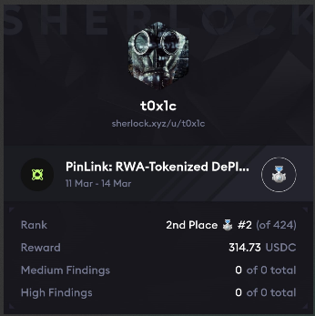

# Leaderboard
[Pinlink Results](https://audits.sherlock.xyz/contests/852)<br>

`Rank 2 / 424` <br>

<br>No H/M found in the contest.

# Audited Code Repo
### [Sherlock: Pinlink](https://audits.sherlock.xyz/contests/852)
### [Github: Pinlink](https://github.com/sherlock-audit/2025-03-pinlink-rwa-tokenized-depin-marketplace/)

<br>

# <a id="summaryTable"></a>Bugs Filed & Their Status

| #      | Bug ID          | Name | URL    | Adjudged Status  |
|--------|-----------------|------|:------:|-----------------:|
| 1      | [M-01](#m-01)   | Zero fee causes all purchases to revert | [93](https://audits.sherlock.xyz/contests/852/voting/93) | Rejected |
| 2      | [M-02](#m-02)   | Seller can selectively deny specific buyers and choose to sell to someone particular | [97](https://audits.sherlock.xyz/contests/852/voting/97) | Rejected |

<br>
<br>

## **MEDIUM-SEVERITY BUGS**
---

### <a id="m-01"></a>[M-01]
## **Zero fee causes all purchases to revert**
#### https://github.com/sherlock-audit/2025-03-pinlink-rwa-tokenized-depin-marketplace/blob/main/marketplace-contracts/src/marketplaces/pinlinkShop.sol#L534-L545
<br>

## Description
The protocol admin is allowed to [setFee()](https://github.com/sherlock-audit/2025-03-pinlink-rwa-tokenized-depin-marketplace/blob/main/marketplace-contracts/src/marketplaces/pinlinkShop.sol#L174) to a zero value to make purchases more attractive for users. If this is done then all purchases will revert. This happens because:
- `purchase()` --> [_handlePayments()](https://github.com/sherlock-audit/2025-03-pinlink-rwa-tokenized-depin-marketplace/blob/main/marketplace-contracts/src/marketplaces/pinlinkShop.sol#L534-L545) will attempt to transfer zero `fees`.
- PIN token [reverts on zero amount transfers](https://etherscan.io/address/0x2e44f3f609ff5aA4819B323FD74690f07C3607c4#code) (see L291 inside `_transfer()`).

## Impact
Protocol can't operate with zero fees, a value which is allowed as per config params.

## Proof of Concept
Add this as a new file inside `test/pinlinkShop/` and run to see it pass:
```js
// SPDX-License-Identifier: UNLICENSED
pragma solidity 0.8.27;

import {BaseStakingShopTests} from "test/pinlinkShop/base.t.sol";
import {PinlinkShop} from "src/marketplaces/pinlinkShop.sol";
import {DummyOracle} from "src/oracles/DummyOracle.sol";

contract StakingShop_ZeroFee_Tests is BaseStakingShopTests {
    DummyOracle customOracle;

    function setUp() public override {
        super.setUp();
        
        customOracle = new DummyOracle(address(PIN), 0.95 ether); 
        
        vm.startPrank(admin);
        pshop.setOracle(address(customOracle));
        
        // Enable an asset
        pshop.enableAsset(address(fractions), asset1, admin);
        
        // Set zero fee percentage
        pshop.setFee(0); 
        vm.stopPrank();
        
        // Fund buyer
        deal(address(PIN), bob, 1000e18);
        vm.prank(bob);
        PIN.approve(address(pshop), type(uint256).max);
    }

    function test_zeroFeeReverts() public {
        // Create a listing 
        vm.prank(admin);
        bytes32 listingId = pshop.list(address(fractions), asset1, 10, 1e12, block.timestamp + 5 days);

        // Get the quote in PIN tokens
        uint256 pinPayment = pshop.getQuoteInTokens(listingId, 1);
        
        // Attempt purchase - should revert because PIN token doesn't allow zero transfers, and fee is zero currently
        vm.expectRevert("Transfer amount must be greater than zero");
        vm.prank(bob);
        pshop.purchase(listingId, 1, pinPayment);
    }
}
```

## Mitigation 
There are two options, either of which can be chosen but Option1 is preferable because it allows the protocol to operate with a zero fee config:

### Option 1:
Do not call `safeTransfer()` inside `_handlePayments()` if fees is zero:
```diff
    function _handlePayments(address buyer, address seller, uint256 totalPinPayment)
        internal
        returns (uint256 paymentForSeller, uint256 fees)
    {
        // fees are rounded in favor of the protocol
        paymentForSeller = totalPinPayment * (FEE_DENOMINATOR - purchaseFeePerc) / FEE_DENOMINATOR;
        fees = totalPinPayment - paymentForSeller;

        // no need to verfy that msg.value==0, because purchases with tokens are done with purchaseWithToken() which is non-payable
        IERC20(PIN).safeTransferFrom(buyer, seller, paymentForSeller);
-       IERC20(PIN).safeTransferFrom(buyer, feeReceiver, fees);
+       if (fees > 0) IERC20(PIN).safeTransferFrom(buyer, feeReceiver, fees);
    }
```

### Option 2:
Add a check inside `setFee()`:
```diff
    function setFee(uint256 newFee) external onlyRole(DEFAULT_ADMIN_ROLE) {
+       if (newFee == 0) revert InvalidParameter();
        if (newFee > MAX_FEE_PERC) revert InvalidParameter();
        purchaseFeePerc = newFee;
        emit FeePercentageSet(newFee);
    }
```

[Back to Top](#summaryTable)
---

### <a id="m-02"></a>[M-02]
## **Seller can selectively deny specific buyers and choose to sell to someone particular**
#### https://github.com/sherlock-audit/2025-03-pinlink-rwa-tokenized-depin-marketplace/blob/main/marketplace-contracts/src/marketplaces/pinlinkShop.sol#L269
<br>

## Description
A seller could:
1. List an asset at a certain price or `usdPricePerFraction`.
2. When they see a buyer's purchase transaction in the mempool front-run with [modifyListing()](https://github.com/sherlock-audit/2025-03-pinlink-rwa-tokenized-depin-marketplace/blob/main/marketplace-contracts/src/marketplaces/pinlinkShop.sol#L269) to increase the price so the buyer's `maxTotalPinAmount` parameter inside [purchase](https://github.com/sherlock-audit/2025-03-pinlink-rwa-tokenized-depin-marketplace/blob/main/marketplace-contracts/src/marketplaces/pinlinkShop.sol#L288) is exceeded.
3. The buyer's transaction fails with `SlippageExceeded`.
4. The seller back-runs with another `modifyListing()` to restore the original price.

This allows sellers to selectively deny specific buyers while maintaining the listing for others they prefer to sell to. This allows them to choose the specific buyer to sell to.

## Impact
1. **Selective selling**: The seller could discriminate against specific addresses, perhaps to sell only to approved buyers from off-chain agreements.
2. **MEV extraction**: If the PIN token price is volatile, a seller could monitor price movements and block purchases when the price is disadvantageous to them.
3. **Regulatory circumvention**: In some jurisdictions, refusing to sell based on certain characteristics is illegal. This provides a technical method to do so with plausible deniability.

## Proof of Concept
Add this as a new file inside `test/pinlinkShop/` and run to see it pass:
```js
// SPDX-License-Identifier: UNLICENSED
pragma solidity 0.8.27;

import {BaseStakingShopTests} from "test/pinlinkShop/base.t.sol";
import {PinlinkShop, Listing} from "src/marketplaces/pinlinkShop.sol";

contract SandwichAttackTest is BaseStakingShopTests {
    bytes32 listingId;
    uint256 initialPrice = 1000e18; // 1000 USD per fraction
    uint256 sandwichedPrice = 5000e18; // 5000 USD per fraction

    function setUp() public override {
        super.setUp();
        
        // Setup: Admin enables asset
        vm.startPrank(admin);
        pshop.enableAsset(address(fractions), asset1, admin);
        vm.stopPrank();
        
        // Alice buys fractions from admin and creates her own listing
        vm.startPrank(admin);
        bytes32 adminListingId = pshop.list(address(fractions), asset1, 50, 800e18, block.timestamp + 5 days);
        vm.stopPrank();
        
        _doPurchase(adminListingId, 20, alice);
        
        // Alice lists some fractions
        vm.startPrank(alice);
        listingId = pshop.list(address(fractions), asset1, 10, initialPrice, block.timestamp + 7 days);
        vm.stopPrank();
    }

    function test_sandwichAttack() public {
        uint256 amount = 5;
        uint256 initialQuote = pshop.getQuoteInTokens(listingId, amount);
        
        // Take a snapshot to show purchase would succeed without sandwiching
        uint256 snapshotId = vm.snapshot();
        
        // Without sandwich attack - purchase succeeds
        vm.prank(bob);
        pshop.purchase(listingId, amount, initialQuote);
        
        // Verify purchase succeeded
        Listing memory listingAfterPurchase = pshop.getListing(listingId);
        assertEq(listingAfterPurchase.amount, 5, "5 fractions should remain after purchase");
        
        // Revert to state before purchase
        vm.revertTo(snapshotId);
        
        // Now demonstrate the sandwich attack
        // 1. Alice front-runs Bob's transaction and increases the price
        vm.prank(alice);
        pshop.modifyListing(listingId, sandwichedPrice, 0);
        
        // 2. Bob's transaction will now fail with SlippageExceeded
        vm.expectRevert(PinlinkShop.SlippageExceeded.selector);
        vm.prank(bob);
        pshop.purchase(listingId, amount, initialQuote);
        
        // 3. Alice back-runs and restores the original price
        vm.prank(alice);
        pshop.modifyListing(listingId, initialPrice, 0);
    }
}
```

## Mitigation 
A potential mitigation would be implementing a time delay between price modifications before allowing them to take effect, at least a block or two.

[Back to Top](#summaryTable)
