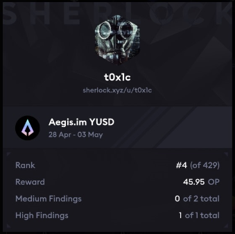

# Leaderboard
`Rank 4 / 429`<br>


# Audited Code Repo
### [Sherlock: Aegis](https://audits.sherlock.xyz/contests/799)
### [Github: Aegis](https://github.com/sherlock-audit/2025-04-aegis-op-grant/)

<br>

# <a id="summaryTable"></a>Bugs Filed & Their Status

| #      | Bug ID          | Name | URL    | Adjudged Status  |
|--------|-----------------|------|:------:|-----------------:|
| 1      | [H-01](#h-01)   | Incorrect Accounting of Frozen Funds in `_untrackedAvailableAssetBalance()` and `_custodyAvailableAssetBalance()` | [90](https://audits.sherlock.xyz/contests/799/voting/90) | Rejected |
| 2      | [H-02](#h-02)   | Excessive collateral pulled from user during mint() | [41](https://audits.sherlock.xyz/contests/799/voting/41) | Rejected |
| 3      | [H-03](#h-03)   | User pays no fee while redeeming due to order of operations | [52](https://audits.sherlock.xyz/contests/799/voting/) | High |
| 4      | [H-04](#h-04)   | Excess YUSD never returned to user after redemption | [54](https://audits.sherlock.xyz/contests/799/voting/54) | Rejected |
| 5      | [H-05](#h-05)   | Incorrect decimal precision in `_getAssetYUSDPriceOracle()` | [63](https://audits.sherlock.xyz/contests/799/voting/63) | Rejected |
| 6      | [M-01](#m-01)   | Off by one error in `_checkMintRedeemLimit()` allows bypassing limit | [13](https://audits.sherlock.xyz/contests/799/voting/13) | Rejected |
| 7      | [M-02](#m-02)   | Redeem request may get incorrectly approved before user's withdrawRedeemRequest() due to use of `<` instead of `<=` | [51](https://audits.sherlock.xyz/contests/799/voting/51) | Rejected |
| 8      | [M-03](#m-03)   | withdrawExpiredRewards() can be called on unexpired rewards | [98](https://audits.sherlock.xyz/contests/799/voting/98) | Rejected |
| 9      | [M-04](#m-04)   | withdrawExpiredRewards() can not be called on rewards finalized with zero claimDuration | [100](https://audits.sherlock.xyz/contests/799/voting/100) | Rejected |

<br>
<br>

## **HIGH-SEVERITY BUGS**
---

### <a id="h-01"></a>[H-01]
## **Incorrect Accounting of Frozen Funds in `_untrackedAvailableAssetBalance()` and `_custodyAvailableAssetBalance()`**
#### https://github.com/sherlock-audit/2025-04-aegis-op-grant/blob/main/aegis-contracts/contracts/AegisMinting.sol#L706-L723
<br>

## Summary
The calculation related to frozen funds in functions like `_untrackedAvailableAssetBalance()` and `_custodyAvailableAssetBalance()` fail to account for various scenarios. This error can lead to an under-reporting of available assets, potentially causing valid redemption requests to be rejected, inability to `depositIncome()` and overall wrong accounting.

## Description
There majorly are 3 states that the protocol balance can be in. Please refer the [gist here](https://gist.github.com/t0x1cC0de/9ef3bf349106aa014df7f6d2cb20baab) for the pictorial representation ( _ignore Case 4 of the diagram_ ). Let's examine each state keeping in mind these [two functions](https://github.com/sherlock-audit/2025-04-aegis-op-grant/blob/main/aegis-contracts/contracts/AegisMinting.sol#L706-L723):
```solidity
  function _custodyAvailableAssetBalance(address _asset) internal view returns (uint256) {
    uint256 custodyTransferrableFunds = _custodyTransferrableAssetFunds[_asset];
    uint256 balance = IERC20(_asset).balanceOf(address(this));
    if (balance < custodyTransferrableFunds || custodyTransferrableFunds < assetFrozenFunds[_asset]) {
      return 0;
    }

    return custodyTransferrableFunds - assetFrozenFunds[_asset];
  }

  function _untrackedAvailableAssetBalance(address _asset) internal view returns (uint256) {
    uint256 balance = IERC20(_asset).balanceOf(address(this));
    if (balance < _custodyTransferrableAssetFunds[_asset] + assetFrozenFunds[_asset]) {
      return 0;
    }

    return balance - _custodyTransferrableAssetFunds[_asset] - assetFrozenFunds[_asset];
  }
```

Acronyms:
- CTAF : `_custodyTransferrableAssetFunds[_asset]`
- FF   : `assetFrozenFunds[_asset]`
- TB   : `IERC20(_asset).balanceOf(address(this))`

### **State 1: FF entirely a subset of CTAF**
- **Figure assumptions**:
    - TB   = 100
    - CTAF = 90
    - FF   = 20

- **Steps to reach this state**:
    - Multiple users call `mint()` thus incrementing CTAF each time. We see that CTAF = TB.
    - Admin freezes some funds.
    - **Optional**: Some collateral asset income accrues in the contract, `depositIncome()` is yet to be called. Now we have TB > CTAF.

- **Values returned by functions**:
    - `_untrackedAvailableAssetBalance()` : incorrectly returns `0` because `100 < 90 + 20`. Expected correct return value: `100 - 90 = 10`.
        - Additionally, if we consider TB = 200; CTAF = 90; FF = 20, then the function incorrectly returns `200 - 90 - 20 = 90`. Expected correct return value: `200 - 90 = 110`.
        - Additionally, if we consider TB = 100; CTAF = 80; FF = 80, then the function reverts due to underflow when trying to return `100 - 80 - 80`.
    - `_custodyAvailableAssetBalance()`   : correctly returns `90 - 20 = 70`.

- **Impacts**:
    - `depositIncome()` may revert due to `NotEnoughFunds()` OR reverts due to underflow in `_untrackedAvailableAssetBalance()`. This disrupts reward distribution too (`depositRewards()`).
    - `approveRedeemRequest` may revert due to `NotEnoughFunds()` OR reverts due to underflow in `_untrackedAvailableAssetBalance()`

### **State 2: FF and CTAF do not overlap**
- **Figure assumptions**:
    - TB   = 100
    - CTAF = 70
    - FF   = 20

- **Steps to reach this state**:
    - After various mints, redeems, transfer to custody, we are left with only the accrued collateral. This in entirety is the TB currently say, 20.
    - Admin freezes 20.
    - Some more collateral asset income accrues in the contract say, 10. 
    - Admin calls `depositIncome()` with amount 10. CTAF equals 10 now. Now we have TB > CTAF i.e. 30 > 10.
    - Some more collateral asset income accrues in the contract say, 15. Now we have TB = 45 and CTAF remains at 10 since `depositIncome()` is yet to be called. FF = 20.

- **Values returned by functions**:
    - `_untrackedAvailableAssetBalance()` : correctly returns : `45 - 10 - 20 = 15`.
    - `_custodyAvailableAssetBalance()`   : incorrectly returns `0` since `custodyTransferrableFunds < assetFrozenFunds[_asset]` i.e. `10 < 20`. Expected correct value: `10`.

- **Impacts**:
    - `transferToCustody()` may revert due to `NotEnoughFunds()`
    - `forceTransferToCustody()` may revert due to `NotEnoughFunds()` OR works with a diminished `availableBalance` resulting in incorrect accounting at `_custodyTransferrableAssetFunds[asset] -= availableBalance;`

### **State 3: FF and CTAF overlap partially**
- **Figure assumptions**:
    - TB   = 100
    - CTAF = 70
    - FF   = 40
    - Overlap of = 20

- **Steps to reach this state**:
    - After various mints, redeems, transfer to custody, we are left with only the accrued collateral. This in entirety is the TB currently say, 20.
    - Admin freezes 20.
    - Some more collateral asset income accrues in the contract say, 20. 
    - Admin calls `depositIncome()` with amount 20. CTAF equals 20 now. Now we have TB = 40 and CTAF = 20.
    - Admin freezes 20 again. We now have TB = 40, FF = 40 and CTAF = 20. Overlap = 20.
    - Some user mints 50. So TB = 90, FF = 40 and CTAF = 70. Overlap stays at 20.
    - Some more collateral asset income accrues in the contract say, 10. So TB increases to 100 with remaining values being the same as `depositIncome()` hasn't been called.

- **Values returned by functions**:
    - `_untrackedAvailableAssetBalance()` : incorrectly underflows and reverts : `100 - 70 - 40`. Expected correct value: `100 + overlap - 70 - 40 = 100 + 20 - 70 - 40 = 10`.
    - `_custodyAvailableAssetBalance()`   : incorrectly returns `70 - 40 = 30`. Expected correct value: `70 - overlap = 70 - 20 = 50`.

- **Impacts**:
    - `transferToCustody()` may revert due to `NotEnoughFunds()`
    - `forceTransferToCustody()` may revert due to `NotEnoughFunds()` OR works with a diminished `availableBalance` resulting in incorrect accounting at `_custodyTransferrableAssetFunds[asset] -= availableBalance;`
    - `depositIncome()` may revert due to `NotEnoughFunds()` OR reverts due to underflow in `_untrackedAvailableAssetBalance()`
    - `approveRedeemRequest` may revert due to `NotEnoughFunds()` OR reverts due to underflow in `_untrackedAvailableAssetBalance()`

Note that due to the aforementioned calculation errors, calling `unfreezeFunds()` during such cases will mess up the accounting even further.

## Mitigation
Honestly, this would require a significant rework of the calculation and involves tracking all three variables TB, CTAF and FF correctly in the aforementioned states and its variations. The examples given in this report should work as guidelines to implement the fix.

[Back to Top](#summaryTable)
---

### <a id="h-02"></a>[H-02]
## **Excessive collateral pulled from user during mint()**
#### https://github.com/sherlock-audit/2025-04-aegis-op-grant/blob/main/aegis-contracts/contracts/AegisMinting.sol#L265
<br>

## Summary
The [mint()](https://github.com/sherlock-audit/2025-04-aegis-op-grant/blob/main/aegis-contracts/contracts/AegisMinting.sol#L265) function always collects the full collateral amount specified in the order, even when the calculated YUSD amount would require less collateral, resulting in loss of collateral funds for the user.

This would happen whenever `order.yusdAmount` specified by the user is less than `chainlinkYUSDAmount` calculated inside `_calculateMinYUSDAmount()`.

## Description
When minting YUSD, users submit an order with both a collateral amount and expected YUSD output (`order.yusdAmount`). The protocol calculates the minimum YUSD amount based on price feeds inside [_calculateMinYUSDAmount()](https://github.com/sherlock-audit/2025-04-aegis-op-grant/blob/main/aegis-contracts/contracts/AegisMinting.sol#L748), but always pulls the entire collateral amount specified in the order regardless of how much YUSD is actually minted.

```solidity
// In AegisMinting.sol, mint() function:
uint256 yusdAmount = _calculateMinYUSDAmount(order.collateralAsset, order.collateralAmount, order.yusdAmount);  ⬅️ // yusdAmount here could be equal to `order.yusdAmount` and less than market quantity of `chainlinkYUSDAmount`
if (yusdAmount < order.slippageAdjustedAmount) {
    revert PriceSlippage();
}

// Take a fee, if it's applicable
(uint256 mintAmount, uint256 fee) = _calculateInsuranceFundFeeFromAmount(yusdAmount, mintFeeBP);
if (fee > 0) {
    yusd.mint(insuranceFundAddress, fee);
}

IERC20(order.collateralAsset).safeTransferFrom(order.userWallet, address(this), order.collateralAmount);  ⬅️ // always the entire collateral is transferred from user
yusd.mint(order.userWallet, mintAmount);
```

The protocol should recalculate based on `yusdAmount` value returned by `_calculateMinYUSDAmount()` and reduce the required collateral proportionally, but instead still pulls the full amount.

## Example Flow
User wants to deposit 100 USDC as collateral and expects to receive 95 YUSD.

1. User creates an order with:

collateralAmount = 100 USDC
yusdAmount = 95 YUSD
slippageAdjustedAmount = 92 YUSD (some slippage tolerance)

2. The contract checks Chainlink price feed and calculates:

USDC price = `$1`
Calculated value of 100 USDC = 100 × 1 = `$100`
This would entitle the user to 100 YUSD (1:1 ratio)
But the function takes minimum of user's requested amount and calculated amount
Therefore yusdAmount = min(95, 100) = 95 YUSD

3. The contract will use the user's specified amount (95 YUSD) but the contract still pulls the full 100 USDC even though only 95 USDC would be needed to back 95 YUSD (assuming zero fees)

4. User receives 95 YUSD but has provided 5 USDC more collateral than necessary, which is never returned.

Note that the aforementioned values have been picked to clearly show the issue. Practically speaking, it could well happen that the user specifies `order.yusdAmount = 100 YUSD` while the `chainlinkYUSDAmount` gets evaluated to `100.5 YUSD` due to a favourable price fluctuation. Here too the entire collateral which is sufficient to mint `100.5 YUSD` is pulled but only `100 YUSD` is minted for the user.

It should also be highlighted that the same issue exists in `depositIncome()` but may be considered less severe since it is only called by the `FUNDS_MANAGER_ROLE` who can choose to pass `order.yusdAmount` as a very high value or `type(uint256).max` which would result in always the `chainlinkYUSDAmount` to be picked, thus avoiding a loss. If however the `FUNDS_MANAGER_ROLE` is not aware of this bug and behaves naively, then higher-than-fair `order.collateralAmount` is transferred to `_custodyTransferrableAssetFunds` [here](https://github.com/sherlock-audit/2025-04-aegis-op-grant/blob/main/aegis-contracts/contracts/AegisMinting.sol#L414).

## Impact
Users provide more collateral than necessary for the YUSD they receive; loss of funds.

If user has specified a reasonable high amount like `$2000`, a price fluctuation of `~1%+` would result in them losing more than `1%` and `$10` of their collateral, thus making this a `High` severity issue.

## Mitigation
1. Calculate the minimum YUSD amount first (already being done)
2. Based on that amount, calculate the exact collateral needed using the same price sources
3. Only transfer the adjusted collateral amount from the user

[Back to Top](#summaryTable)
---

### <a id="h-03"></a>[H-03]
## **User pays no fee while redeeming due to order of operations**
#### https://github.com/sherlock-audit/2025-04-aegis-op-grant/blob/main/aegis-contracts/contracts/AegisMinting.sol#L324
<br>

## Description
The redeemable `collateralAmount` is calculated _first_ [inside approveRedeemRequest()](https://github.com/sherlock-audit/2025-04-aegis-op-grant/blob/main/aegis-contracts/contracts/AegisMinting.sol#L324) and fee is deducted in YUSD _later_:
```solidity
  File: aegis-contracts/contracts/AegisMinting.sol

   324:@--->         uint256 collateralAmount = _calculateRedeemMinCollateralAmount(request.order.collateralAsset, amount, request.order.yusdAmount);
   325:              /*
   326:               * Reject if:
   327:               * - asset is no longer supported
   328:               * - smallest amount is less than order minAmount
   329:               * - order expired
   330:               */
   331:              if (
   332:                !_supportedAssets.contains(request.order.collateralAsset) ||
   333:                collateralAmount < request.order.slippageAdjustedAmount ||
   334:                request.order.expiry < block.timestamp
   335:              ) {
   336:                _rejectRedeemRequest(requestId, request);
   337:                return;
   338:              }
   339:          
   340:              uint256 availableAssetFunds = _untrackedAvailableAssetBalance(request.order.collateralAsset);
   341:              if (availableAssetFunds < collateralAmount) {
   342:                revert NotEnoughFunds();
   343:              }
   344:          
   345:              // Take a fee, if it's applicable
   346:@--->         (uint256 burnAmount, uint256 fee) = _calculateInsuranceFundFeeFromAmount(request.order.yusdAmount, redeemFeeBP);
   347:              if (fee > 0) {
   348:                yusd.safeTransfer(insuranceFundAddress, fee);
   349:              }
```

The user is basically getting the entire collateral amount in lieu of their redeemed YUSD. The order of operations ought to be to first deduct the fee and then call `_calculateRedeemMinCollateralAmount()` with the `burnAmount` YUSD as the last param to calculate the new `collateralAmount`.
Furthermore, the slippage check should be done on this new reduced `collateralAmount`. Similarly the check against `_untrackedAvailableAssetBalance()` on L341 should be done against this new `collateralAmount`.

## Impact
1. User paying no redemption fee.
2. User getting more than fair collateral.
3. The fee mechanism is supposed to facilitate the [peg stabilization](https://docs.aegis.im/overview/peg-stabilization-mechanism). In it's current form, it's not efficiently doing its job and essentially "leaking value". It's supposed to burn more YUSD supply than the collateral. It's not doing that currently.

## Mitigation 
Move the call to `_calculateInsuranceFundFeeFromAmount()` made currently on L346 to before L324. Then on L324 use this `burnAmount` as the last param:
```solidity
    uint256 collateralAmount = _calculateRedeemMinCollateralAmount(request.order.collateralAsset, amount, burnAmount);
```

[Back to Top](#summaryTable)
---

### <a id="h-04"></a>[H-04]
## **Excess YUSD never returned to user after redemption**
#### https://github.com/sherlock-audit/2025-04-aegis-op-grant/blob/main/aegis-contracts/contracts/AegisMinting.sol#L303
<br>

## Summary
[requestRedeem()](https://github.com/sherlock-audit/2025-04-aegis-op-grant/blob/main/aegis-contracts/contracts/AegisMinting.sol#L303) function always collects the full YUSD amount specified in the order, even when the calculated collateral amount would require redeeming less YUSD, resulting in loss of YUSD for the user.

This would happen whenever `order.collateralAmount` specified by the user is less than `chainlinkCollateralAmount` calculated inside `_calculateRedeemMinCollateralAmount()`.

## Description
When redeeming YUSD, users submit an order with an expected collateralAmount. The protocol calculates the minimum collateral amount based on price feeds inside [_calculateRedeemMinCollateralAmount()](https://github.com/sherlock-audit/2025-04-aegis-op-grant/blob/main/aegis-contracts/contracts/AegisMinting.sol#L765-L779), but always pulls the entire YUSD amount (locks it) specified in the order regardless of how much YUSD is actually required to be redeemed for transferring back this `collateralAmount`. The balance YUSD needs to be returned (unlocked) to the user inside `approveRedeemRequest()` but is never done so.

```solidity
// In AegisMinting.sol, requestRedeem() function:

    // Lock YUSD
    yusd.safeTransferFrom(order.userWallet, address(this), order.yusdAmount);
    totalRedeemLockedYUSD += order.yusdAmount;
```

## Example Flow
User wants to redeem 105 YUSD and expects to receive 99 USDC collateral.

1. User creates an order with:

collateralAmount = 99 USDC
yusdAmount = 105 YUSD
slippageAdjustedAmount = 98 USDC (some slippage tolerance)

2. The contract checks Chainlink price feed and calculates:

USDC price = `$1`
Calculated value of 105 YUSD = 105 × 1 = `$105`
This would entitle the user to 105 USDC
But the function takes minimum of user's requested collateral amount and calculated amount
Therefore yusdAmount = min(99, 105) = 99 USDC

3. The contract will use the user's specified collateral amount (99 USDC) but the contract still pulls the full 105 YUSD even though only 99 YUSD would be needed to back 99 USDC (assuming zero fees)

4. User receives 99 USDC but has provided 6 YUSD more collateral than necessary, which is never returned.

Note that the aforementioned values have been picked to clearly show the issue. Practically speaking, it could well happen that the user specifies `order.yusdAmount = 100 YUSD` and `collateralAmount = 100 USDC` while the `chainlinkCollateralAmount` (as well as the `oracleCollateralAmount`) gets evaluated to `100.5 USDC` due to a favourable price fluctuation. Here too the entire YUSD which should allow redemption of `100.5 USDC` is pulled but only `100 USDC` is returned to the user.

## Impact
Users provide more YUSD than necessary for the USDC they redeem; loss of funds.

If user has specified a reasonable high amount like `$5000`, a price fluctuation of `~1%+` would result in them losing more than `1%` and `$10` of their collateral, thus making this a `High` severity issue.

Additionally this interferes with the [peg stabilization](https://docs.aegis.im/overview/peg-stabilization-mechanism) mechanism. Since it burns more than required YUSD, it pushes YUSD price up more than necessary, potentially contributing to destabilization.

## Mitigation
Refund the excess YUSD pulled earlier from the user, no need to burn it. Also any fee calculation needs to be done on the actual utilized amount of YUSD (i.e. the leftover after refunding YUSD to the user).

[Back to Top](#summaryTable)
---

### <a id="h-05"></a>[H-05]
## **Incorrect decimal precision in `_getAssetYUSDPriceOracle()`**
#### https://github.com/sherlock-audit/2025-04-aegis-op-grant/blob/main/aegis-contracts/contracts/AegisMinting.sol#L817
<br>

## Description
[_getAssetYUSDPriceOracle()](https://github.com/sherlock-audit/2025-04-aegis-op-grant/blob/main/aegis-contracts/contracts/AegisMinting.sol#L817) does not calculate the decimals correctly, and ought to be:
```diff
  function _getAssetYUSDPriceOracle(address asset) internal view returns (uint256, uint8) {
    if (address(aegisOracle) == address(0)) {
      return (0, 0);
    }

    int256 yusdUSDPrice = aegisOracle.yusdUSDPrice();
    if (yusdUSDPrice == 0) {
      return (0, 0);
    }
    uint8 yusdUSDPriceDecimals = aegisOracle.decimals();
-   (uint256 assetUSDPrice, ) = _getAssetUSDPriceChainlink(asset);
+   (uint256 assetUSDPrice, uint256 priceDecimals) = _getAssetUSDPriceChainlink(asset);

-   return ((assetUSDPrice * 10 ** yusdUSDPriceDecimals) / uint256(yusdUSDPrice), yusdUSDPriceDecimals);
+   if (priceDecimals > yusdUSDPriceDecimals) return ((assetUSDPrice * 10 ** yusdUSDPriceDecimals) / (uint256(yusdUSDPrice) * 10 ** (priceDecimals - yusdUSDPriceDecimals)), yusdUSDPriceDecimals);
+   else return ((assetUSDPrice * 10 ** yusdUSDPriceDecimals * 10 ** (yusdUSDPriceDecimals - priceDecimals)) / uint256(yusdUSDPrice), yusdUSDPriceDecimals);
  }
```

Example:
1. Assume `_getAssetUSDPriceChainlink()` returns `assetUSDPrice` with decimal precision `10`. Price is `200e10`.
2. Assume `aegisOracle.yusdUSDPrice()()` returns `yusdUSDPrice` with decimal precision `8` i.e. `yusdUSDPriceDecimals = 8`. Price is `50e8`.
3. What we want is the function to return `200 / 50 = 4` with decimal precision of `8` i.e. `4e8` so that calling functions like `approveRedeemRequest() --> _calculateRedeemMinCollateralAmount()` can process it correctly.
4. So the calculation ought to be `( 200e10 * 10 ^ (8 + 8 - 10) ) / 50e8 = 4e8`. The aforementioned fix in the diff is just an optimized version of this to prevent underflows. 
5. Currently it evaluates incorrectly to: `( 200e10 * 10 ^ 8 ) / 50e8 = 4e10` i.e. greater by a factor of `100`. Once can imagine the reverse case and it would be evaluate to be lower by a factor of `100`.

The current logic works only when `aegisOracle.decimals()` and chainlink decimals are identical.

## Impact
1. `collateralAmount` may be erroneously [evaluated inside approveRedeemRequest() or requestRedeem()](https://github.com/sherlock-audit/2025-04-aegis-op-grant/blob/main/aegis-contracts/contracts/AegisMinting.sol#L324-L333) as a much higher value and lead to a revert based on slippage threshold or available funds.

2. `collateralAmount` may be calculated as too low and the user gets far less than expected collateral on redemption. The probability of this is higher since `min` of all values is used in `_calculateRedeemMinCollateralAmount()`.

[Back to Top](#summaryTable)

<br>

## **MEDIUM-SEVERITY BUGS**
---

### <a id="m-01"></a>[M-01]
## **Off by one error in `_checkMintRedeemLimit()` allows bypassing limit**
#### https://github.com/sherlock-audit/2025-04-aegis-op-grant/blob/main/aegis-contracts/contracts/AegisMinting.sol#L785
<br>

## Summary
The [_checkMintRedeemLimit()](https://github.com/sherlock-audit/2025-04-aegis-op-grant/blob/main/aegis-contracts/contracts/AegisMinting.sol#L785) function allows users to bypass rate limiting at period boundaries by exploiting different comparison operators (`>=` vs `<=`).

## Description
In `AegisMinting.sol`, the `_checkMintRedeemLimit()` function contains inconsistent timestamp comparison logic:
```solidity
  File: aegis-contracts/contracts/AegisMinting.sol

   785:            function _checkMintRedeemLimit(MintRedeemLimit storage limits, uint256 yusdAmount) internal {
   786:              if (limits.periodDuration == 0 || limits.maxPeriodAmount == 0) {
   787:                return;
   788:              }
   789:              uint256 currentPeriodEndTime = limits.currentPeriodStartTime + limits.periodDuration;
   790:              if (
   791:@--->           (currentPeriodEndTime >= block.timestamp && limits.currentPeriodTotalAmount + yusdAmount > limits.maxPeriodAmount) ||
   792:                (currentPeriodEndTime < block.timestamp && yusdAmount > limits.maxPeriodAmount)
   793:              ) {
   794:                revert LimitReached();
   795:              }
   796:              // Start new mint period
   797:@--->         if (currentPeriodEndTime <= block.timestamp) {
   798:                limits.currentPeriodStartTime = uint32(block.timestamp);
   799:                limits.currentPeriodTotalAmount = 0;
   800:              }
   801:          
   802:              limits.currentPeriodTotalAmount += yusdAmount;
   803:            }
```

The issue occurs when `currentPeriodEndTime == block.timestamp` (exactly at the period boundary):
1. In the limit check on L791, it uses `>=` to consider this timestamp as part of the current period
2. In the period reset check on L797, it uses `<=` to also consider this as the start of a new period

## Attack Path
An attacker can exploit this inconsistency through the following steps:
1. Monitor the current period's end time
2. Time a transaction to execute exactly at the period boundary time
3. Mint/redeem an amount that, when combined with previously minted tokens in the period, reaches but doesn't exceed the period limit
4. This transaction will:
   - Pass the rate limit check (since `currentPeriodEndTime >= block.timestamp`)
   - Reset the period and counters (since `currentPeriodEndTime <= block.timestamp`)
5. Back-run & submit a second transaction for the same block for some mint amount not greater than max limit
6. This second transaction will be counted toward the new period despite occurring at the same timestamp, effectively bypassing the limit allowed between a specific time period.

Example:
- Period limit: 10 YUSD per minute
- Current period: 6 YUSD already minted
- Attacker mints 4 YUSD at exact period end (reaching 10 YUSD limit, which is fine)
- Period resets immediately in the same transaction
- Attacker mints another 4 YUSD in the same tx (this figure can go as high as a period's max limit i.e. 10 YUSD in this case)
- Result: Attacker minted 14 YUSD in a single period's time frame, exceeding the 10 YUSD limit

## Impact
Attackers can mint/redeem more tokens than intended by strategically timing transactions at period boundaries. This undermines the protocol's rate limiting, potentially affecting the protocol's stability.
In worst case, it could cause a temporary de-pegging of YUSD.

## Mitigation
```diff
   785:            function _checkMintRedeemLimit(MintRedeemLimit storage limits, uint256 yusdAmount) internal {
   786:              if (limits.periodDuration == 0 || limits.maxPeriodAmount == 0) {
   787:                return;
   788:              }
   789:              uint256 currentPeriodEndTime = limits.currentPeriodStartTime + limits.periodDuration;
   790:              if (
   791:                (currentPeriodEndTime >= block.timestamp && limits.currentPeriodTotalAmount + yusdAmount > limits.maxPeriodAmount) ||
   792:                (currentPeriodEndTime < block.timestamp && yusdAmount > limits.maxPeriodAmount)
   793:              ) {
   794:                revert LimitReached();
   795:              }
   796:              // Start new mint period
-  797:              if (currentPeriodEndTime <= block.timestamp) {
+  797:              if (currentPeriodEndTime < block.timestamp) {
   798:                limits.currentPeriodStartTime = uint32(block.timestamp);
   799:                limits.currentPeriodTotalAmount = 0;
   800:              }
   801:          
   802:              limits.currentPeriodTotalAmount += yusdAmount;
   803:            }
```

[Back to Top](#summaryTable)
---

### <a id="m-02"></a>[M-02]
## **Redeem request may get incorrectly approved before user's withdrawRedeemRequest() due to use of `<` instead of `<=`**
#### https://github.com/sherlock-audit/2025-04-aegis-op-grant/blob/main/aegis-contracts/contracts/AegisMinting.sol#L334
<br>

## Summary
Inside [approveRedeemRequest()](https://github.com/sherlock-audit/2025-04-aegis-op-grant/blob/main/aegis-contracts/contracts/AegisMinting.sol#L334), when `block.timestamp = request.order.expiry` request can be approved. But inside [withdrawRedeemRequest()](https://github.com/sherlock-audit/2025-04-aegis-op-grant/blob/main/aegis-contracts/contracts/AegisMinting.sol#L379) when `block.timestamp = request.order.expiry` request can be raised. This leads to a situation where a user can raise a `withdrawRedeemRequest()` but gets inadvertently front-run by `approveRedeemRequest()` and their withdraw redeem request gets denied.

## Description
[approveRedeemRequest()](https://github.com/sherlock-audit/2025-04-aegis-op-grant/blob/main/aegis-contracts/contracts/AegisMinting.sol#L334) has the logic:
```solidity
  File: aegis-contracts/contracts/AegisMinting.sol

   325:              /*
   326:               * Reject if:
   327:               * - asset is no longer supported
   328:               * - smallest amount is less than order minAmount
   329:               * - order expired
   330:               */
   331:              if (
   332:                !_supportedAssets.contains(request.order.collateralAsset) ||
   333:                collateralAmount < request.order.slippageAdjustedAmount ||
   334:@--->           request.order.expiry < block.timestamp
   335:              ) {
   336:                _rejectRedeemRequest(requestId, request);
   337:                return;
   338:              }
```

On the other hand [withdrawRedeemRequest()](https://github.com/sherlock-audit/2025-04-aegis-op-grant/blob/main/aegis-contracts/contracts/AegisMinting.sol#L379) has:
```solidity
   377:            function withdrawRedeemRequest(string calldata requestId) public nonReentrant whenRedeemUnpaused {
   378:              RedeemRequest storage request = _redeemRequests[keccak256(abi.encode(requestId))];
   379:@--->         if (request.timestamp == 0 || request.status != RedeemRequestStatus.PENDING || request.order.expiry > block.timestamp) {
   380:                revert InvalidRedeemRequest();
   381:              }
```

### Vulnerable Flow
This can lead to the following situation:
1. Alice calls `requestRedeem()` and suppose her `request.order.expiry` is at timestamp `t`.
2. At `t` she decides to withdraw the request which is allowed since `request.order.expiry > block.timestamp` is not true.
3. She inadvertently gets front-run by `approveRedeemRequest()`. This is allowed too because `request.order.expiry < block.timestamp` is not true either.

She has to undergo a forced redemption even though market conditions may have dictated her to rescind her request, thus possibly resulting in a loss.

## Impact
User's `withdrawRedeemRequest()` not honoured and may lead to losses.

## Mitigation 
The solution depends on what the protocol considers as "expired" and can be either of these two fixes:
1. Fix `approveRedeemRequest()`:
```diff
   325:              /*
   326:               * Reject if:
   327:               * - asset is no longer supported
   328:               * - smallest amount is less than order minAmount
   329:               * - order expired
   330:               */
   331:              if (
   332:                !_supportedAssets.contains(request.order.collateralAsset) ||
   333:                collateralAmount < request.order.slippageAdjustedAmount ||
-  334:                request.order.expiry < block.timestamp
+  334:                request.order.expiry <= block.timestamp
   335:              ) {
   336:                _rejectRedeemRequest(requestId, request);
   337:                return;
   338:              }
```

2. Or fix `withdrawRedeemRequest()`:
```diff
   377:            function withdrawRedeemRequest(string calldata requestId) public nonReentrant whenRedeemUnpaused {
   378:              RedeemRequest storage request = _redeemRequests[keccak256(abi.encode(requestId))];
-  379:              if (request.timestamp == 0 || request.status != RedeemRequestStatus.PENDING || request.order.expiry > block.timestamp) {
+  379:              if (request.timestamp == 0 || request.status != RedeemRequestStatus.PENDING || request.order.expiry >= block.timestamp) {
   380:                revert InvalidRedeemRequest();
   381:              }
```

[Back to Top](#summaryTable)
---

### <a id="m-03"></a>[M-03]
## **withdrawExpiredRewards() can be called on unexpired rewards**
#### https://github.com/sherlock-audit/2025-04-aegis-op-grant/blob/main/aegis-contracts/contracts/AegisRewards.sol#L146
<br>

## Description
[withdrawExpiredRewards()](https://github.com/sherlock-audit/2025-04-aegis-op-grant/blob/main/aegis-contracts/contracts/AegisRewards.sol#L146) ought to be:
```diff
  File: aegis-contracts/contracts/AegisRewards.sol

   145:            function withdrawExpiredRewards(bytes32 id, address to) external onlyRole(REWARDS_MANAGER_ROLE) {
-  146:              if (!_rewards[id].finalized || _rewards[id].amount == 0 || _rewards[id].expiry == 0 || _rewards[id].expiry > block.timestamp) {
+  146:              if (!_rewards[id].finalized || _rewards[id].amount == 0 || _rewards[id].expiry == 0 || _rewards[id].expiry >= block.timestamp) {
   147:                revert UnknownRewards();
   148:              }
   149:          
   150:              uint256 amount = _rewards[id].amount;
   151:              _rewards[id].amount = 0;
   152:              yusd.safeTransfer(to, amount);
   153:          
   154:              emit WithdrawExpiredRewards(id, to, amount);
   155:            }
```

This is because rewards are considered expired only when `block.timestamp > _rewards[id].expiry` as seen in [claimRewards() here](https://github.com/sherlock-audit/2025-04-aegis-op-grant/blob/main/aegis-contracts/contracts/AegisRewards.sol#L102). The current logic can lead to:
1. User calling `claimRewards()` at `block.timestamp == _rewards[id].expiry`. 
2. They inadvertently (or maliciously) get front-runned by the RewardManager calling `withdrawExpiredRewards()`.
3. User's claim to reward reverts (or does not get processed and `continue` gets executed) due to [these checks](https://github.com/sherlock-audit/2025-04-aegis-op-grant/blob/main/aegis-contracts/contracts/AegisRewards.sol#L101-L117). This is because now the reward amount has been set to `0` by `withdrawExpiredRewards()` on L151.

## Impact
User can't claim their rightful reward, as promised by the protocol. Also, gives the reward manager unintended powers.

[Back to Top](#summaryTable)
---

### <a id="m-04"></a>[M-04]
## **withdrawExpiredRewards() can not be called on rewards finalized with zero claimDuration**
#### https://github.com/sherlock-audit/2025-04-aegis-op-grant/blob/main/aegis-contracts/contracts/AegisRewards.sol#L146
<br>

## Description
[withdrawExpiredRewards()](https://github.com/sherlock-audit/2025-04-aegis-op-grant/blob/main/aegis-contracts/contracts/AegisRewards.sol#L146) ought to be:
```diff
  File: aegis-contracts/contracts/AegisRewards.sol

   145:            function withdrawExpiredRewards(bytes32 id, address to) external onlyRole(REWARDS_MANAGER_ROLE) {
-  146:              if (!_rewards[id].finalized || _rewards[id].amount == 0 || _rewards[id].expiry == 0 || _rewards[id].expiry > block.timestamp) {
+  146:              if (!_rewards[id].finalized || _rewards[id].amount == 0 || _rewards[id].expiry > block.timestamp) { // Note: Additionally, it should also be `_rewards[id].expiry >= block.timestamp` but that's part of a different bug report
   147:                revert UnknownRewards();
   148:              }
   149:          
   150:              uint256 amount = _rewards[id].amount;
   151:              _rewards[id].amount = 0;
   152:              yusd.safeTransfer(to, amount);
   153:          
   154:              emit WithdrawExpiredRewards(id, to, amount);
   155:            }
```

This is because currently, this is allowed by the protocol:
1. RewardManager calls [finalizeRewards()](https://github.com/sherlock-audit/2025-04-aegis-op-grant/blob/main/aegis-contracts/contracts/AegisRewards.sol#L131) with `claimDuration = 0`
2. This finalizes the reward and the `_rewards[id].expiry` remains at 0.
3. User can now immediately call [claimRewards()](https://github.com/sherlock-audit/2025-04-aegis-op-grant/blob/main/aegis-contracts/contracts/AegisRewards.sol#L102) and is allowed to receive the funds successfully.

With that in mind, we see that now if RewardManager wishes to call `withdrawExpiredRewards()` at a later point of time, they can't and it would cause `revert UnknownRewards()` because `_rewards[id].expiry == 0` is satisfied on L146.

## Impact
The impact can be looked at in two different ways:
1. EITHER the immediate claim of rewards was never intended for `claimDuration = 0`, which means `claimRewards()` should not be allowed if `_rewards[id].expiry == 0`. Thus impact is user able to claim rewards the protocol didn't want them to ( _seems less likely given the code structure_ ).
2. OR protocol has mistakenly over-constrained `withdrawExpiredRewards()` and hence withdraw is blocked when it shouldn't have been ( _seems more likely given the code structure_ ).

The mitigation would depend on the protocol's choice between the above two points.

[Back to Top](#summaryTable)
